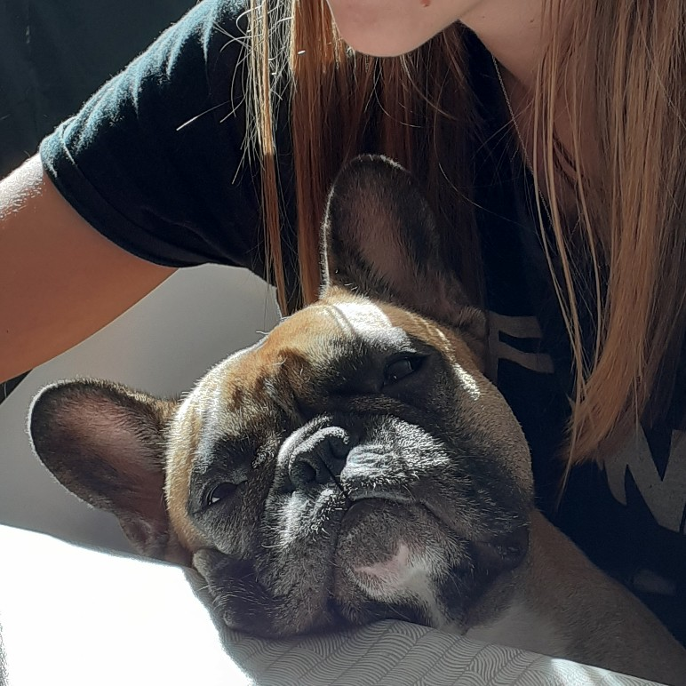

Azi m-am trezit la 4.30. Oricum am avut impresia toată noaptea că doar am stat într-o stare de veghe.

Am coborât la parter, hotărâtă să nu mai reacționez la lipsa de jos. Nicio Maya nu mă mai întâmpină, grăbită să îi pun mâncarea în bol... Ok, asta e, la drept vorbind, era un haos locativ, într-adevăr lătra și trezea toată casa, era greu pentru toți, dar cel mai mult pentru tine. Și îmi tot spun astea ca să îmi adorm monstrul de durere din mine care își arată colții din când în când. Ce haos locativ, ce lătrat, erau FIINȚE dragi ție, erau suflete, erau iubire!

Oricum plâng, nici nu mă mai chinui să suprim. E devreme, mama nu se trezește în curând, îmi permit să mă descarc. Pregătesc ce e de pregătit și pentru că e timp, înghesui și o salată de “ton” vegană: năut, nori rupt în bucățele mici, ardei gras, ceapă, castravete murat, porumb, maioneză vegană făcută în casă, muștar, lămâie și sare. În momentul în care am pornit robotul, am avut senzația puternică că de după ușă s-a auzit Maya! Doamne, cât de real mi s-a părut. Sper să nu o iau razna!

Hai cu plânsul, să spălăm și asta. Nici acum nu am putut să strâng locul unde ieșeam cu ea, să stăm la soare pe trepte sau să își facă nevoile. Nu am putut. Nu încă.

\*\*\*

Mă simt înfrântă. De mine. De neputință. De nepăsarea celor din jur. De singurătate. De viața asta care merge înainte. Și sunt furioasă că planeta nu s-a oprit din cauza suferinței mele. Soarele tot răsare. Sunt egoistă. Și plângăcioasă. Și vulnerabilă. Și om care încă nu reușește să proceseze prin ce trece. Jelesc după copilul meu de zici că s-a mutat în altă galaxie, nu e bine mersi, la casa ei, cu iubitul ei. Plâng după Maya pentru că EU sunt atașată de ea, nu pentru că ei nu i-ar fi bine acolo unde e. Am așteptări ca prietenele mele să mă caute, să mă susțină și le judec că nu o fac. Sau judec lipsa de delicatețe când sunt întrebată, după 2 săptămâni de tăcere: “totul bine?” cum naiba să fie totul bine, în 2 săptămâni?!

\*\*\*

A trecut timpul ăsta liber ca o clipă. Văd pe cameră că mama a aprins lumina așa că mă scutur și mă duc sus, la ea, pentru tot tacâmul. A dormit bine, totul e bine. O anunț ce va avea la mic dejun și e încântată. Termin de strâns și de spălat și cobor să îmi beau și eu cafeaua. Am rămas cu proasta deprindere de a face tot timpul ceva. Așa că azi m-am apucat de spălat cuptorul, de frecat aragazul și grilajele lui, de curățat scaunele, de frecat sertarele. Orice și cât mai mult.

Nici nu știu când s-a făcut timpul de mic dejun și apoi de prânz. Între care am strecurat și o plimbare afară, la aer și la soare, ocazie cu care am observat că mama are probleme mari cu echilibrul. Dacă nu se ține de ceva, se duce dramatic într-o parte. Și astăzi parcă mi-a atins sufletul dureros când, mergând înaintea mea pe lângă casă, mergea clătinându-se. Doamne, când s-a deteriorat starea ei așa de mult! În noiembrie își făcea singură cumpărăturile în Moreni și cobora și urca 4 etaje! Mi se strânge sufletul să văd cum se scurge viața din ea.

\*\*\*

După prânz, am stat în livingul gol. În care acum este Spiky. Dar tot e un gol. Am simțit puțin confort la auzul vocii unei tipe care dubla un documentar în engleză. Umanul din mine este în stare de alertă. Pentru că nu primește mângâiere mai de nicăieri își găsește supape subtile auditive, olfactive, vizuale și le soarbe cu disperarea înecatului.

\*\*\*

Această perioadă probabil va scoate toate puroaiele la suprafață. Sper să fie așa. Să se spargă, să curgă ce e de curs și să mă vindec. Mi-e din ce în ce mai clar că ce cer nu e exagerat, ci doar că strig către oameni nepotriviți. Și nici măcar nu e vina lor. Doar nu e timpul lor să mă audă. Sau să mă ajute. Dacă așa sunt “aproape” de mine oamenii mei “apropiați”, păi mai bine mă lipsesc. Trebe să gândesc o viață și o bătrânețe în care să nu depind de nimeni... nu știu cum aș putea să fac asta, văzând la mama neputința, dar o să mă gândesc profund. Prima idee venită, să nu ajung la bătrânețe, parcă nu e cea mai strălucită.

\*\*\*

Nici azi nu am găsit pentru ce să fiu recunoscătoare. Încă.
