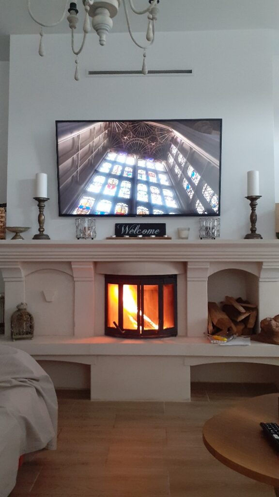

M-am trezit la 5.30 și pentru că nu puteam ține ochii deschiși, mi-am zis că mai stau câteva minute. “Câteva minute mai târziu” era deja 6.20. M-am trezit speriată. Zici că pierd avionul așa de alarmată sunt! Pentru că în realitate, nu mă aleargă nimeni. Dar nu vreau ca mama să iasă și să o pornească pe scări în bezna dimineții că îi e foame.

***

Toate acțiunile mele sunt rapide și precise, chirurgicale. Nu e loc de eroare în a face smoothieurile, ceaiul, cafeaua, semn că am bătătorit deja o cale neuronală. Așa că am terminat repede, am respirat adânc și am pornit către camera unde coana mare și pisica ei mă așteptau. Toate bune pentru ele, am găsit pijamalele cu care am pus-o la somn pe calorifer, era ok în cameră, a fost o surpriză de zile mari pentru mine! Le-am hrănit, am strâns ce era de strâns și fuga jos, să mă bucur și eu de un timp pentru și cu mine.

***

Azi domnul meu a plecat la birou.

Nu știu de ce dar de câte ori rămân singură cu mama, parcă intru în panică. Asta pentru că am o credință limitativă, hrănită muuulți ani de mine și de cei care mi-erau parteneri de drum și viață, că nu mă descurc. Deși acum știu că nu e așa, a trebuit să construiesc o casă ca să-mi demonstrez ce deja era acolo: pot să fac orice, dacă vreau. Cu toate că știu că pot, uite că ideea asta s-a băgat sub piele și suge din puterea mea ca o sugativă, nevăzută și necercetată de nimeni. Perfide și ascunse adânc credințele astea...

Apropo de credințe limitative, aseară, în pat, mi-am prins în fundul creierașului o altă credință suspendată, o așteptare: am avut senzația, intensă, că fiică-mea trebe să vină acasă în orice moment. De parcă acasă al nostru ar mai coincide acum cu acasă al ei. Parcă aștept să revină, așa cum o făcea când era plecată la iubitul ei sau din vreo excursie. Și gândul ăsta, că se întoarce, mi-a dat așa un confort fain. Mi-a plăcut. Pentru că părea că mă întorc la normalul pe care îl știu și care mi-e familiar. Chiar dacă un alt gând, ăla realist, ia la bătaie așteptarea asta, punându-mă să văd care e realitatea, eu, ca Scarlett O’Hara, refuz să îl iau în calcul. Așa am adormit aseară: legănată de speranța că copila mea și Maya se întorc. Egoism at its best!

***

Micul dejun a început la 9 fără ceva și a ținut până la 10.30. Fiind doar noi, mama s-a relaxat și am stat de trăncăneala. Am auzit aceleași povești, unele chiar de mai multe ori în doar câteva minute, but who’s counting?!

***

După care m-am chinuit cu setarea blogului că deși cică e simplu, eu mi-am prins urechile. Am pus, am șters din greșeală, le-am făcut praf, am luat-o de la capăt până s-a făcut de prânz și iar ne-am lălăit o oră.

***

Dar azi mi-am făcut iar focul în șemineu și așa de bine a fost!!

Nu știu la alții cum e dar la mine, cum prind puțin timp, nu știu ce să fac mai repede: o baie în cadă, un spălat pe păr, un epilat, să scriu, să citesc, să beau un ceai, să mă uit pe instagram și pinterest, orice să mă ridice puțin. Exact așa pățesc și cu banii: cum strâng o sumă, indiferent cât, mă gândesc ce să fac mai întâi cu ea, că am atâtea pe listă că nu știu cum să-i fac elastic. De cele mai multe ori, îi fac praf dar asta e o altă poveste.

***

Fuga la mama, care mă aștepta cu tablele deja aranjate. Pentru că se enervează când pierde, de cele mai multe ori o las să câștige, ca să se bucure. Azi însă dădeam cu zarul numai duble, oricât de prost aș fi vrut să joc, chiar nu puteam. Mă gândeam că universul vrea să fiu corectă și nu mă mai lasă să mă prefac că joc. Însă, când să trec linia câștigată de mine în dreptul meu pe caiețelul nostru special de table, am trecut linia în dreptul ei. Ooops, ia uite cum îmi folosește Universul mânuța să rezolv partea cu câștigatul, că eu nu mă gândisem să îi trec “din burtă” linii. Așa îmi aduc aminte, pentru că știu și uit, cum inteligența asta iubitoare ce ne-a dat suflu îți dă semne tot timpul dar ești prea plecat în trecut sau prea visător în viitor, numa’ în prezent nu ești să le vezi.

A câștigat la table și, fericită, nu a comentat la făcutul dușului. Doamne, ce bine s-a simțit după! A și vorbit cu o vecină la telefon (iar la prânz cu o fostă colegă de muncă) și e încântată peste măsură.

Mă bucur pentru ea și cobor să-mi trag sufletul. Îmi iau aroganța de a-mi face floricele la microunde. De a-mi pune un pahar mic de vin alb cât mă chinui să văd cum naiba dau drumul o dată la site. Obosită, m-a luat vinul ăsta pe sus că aproape mi se închid ochii pe tastatură! Între timp a venit și domnul meu de la birou, mi-a promis că mă ajută el cu site-ul dar eu sunt franjuri de oboseală așa că nu mai am puterea să îi povestesc ce vreau ci doar să mă spăl pe dinți și să mă arunc în pat.

out of service!
