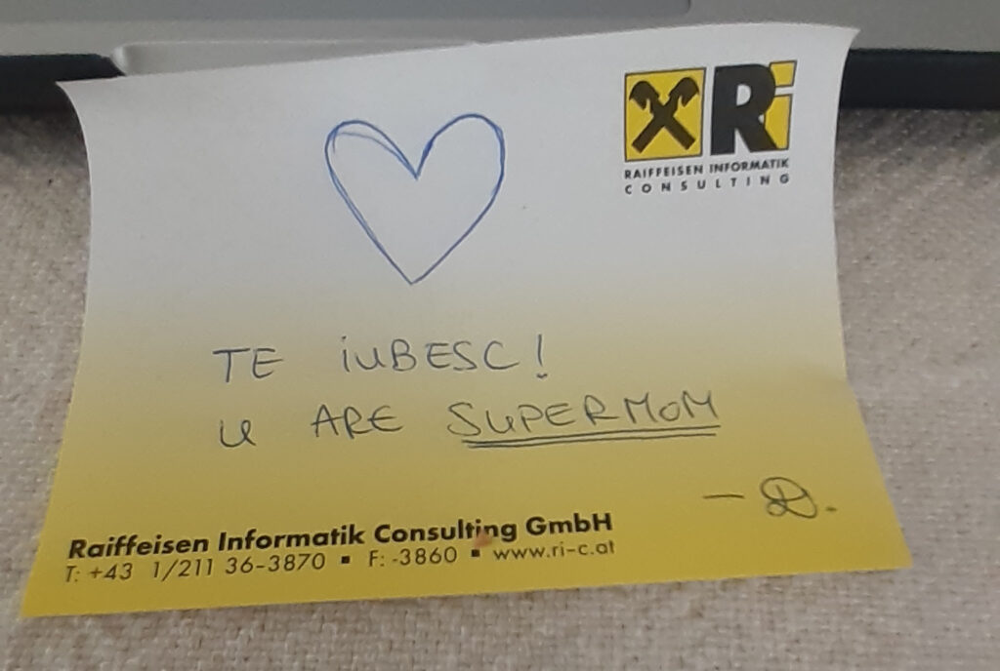

Trezirea clasică de 5.30. Au alunecat ușor întrebările de putere spre negura Universului, ajutate poate și de gândul de “va fi bine” care-mi luminează mintea, în devremele zilei.

***

La 6 se trezește și ea, o primenesc, le omenesc pe amândouă și cobor să o hrănesc și pe Spiky a mea și să-i curăț și ei litiera. În pauza dintre smoothie și mic dejunul de azi am descoperit-o pe Kristina pe youtube (de fapt am descoperit-o ieri, azi doar mi-a dat-o din nou in feed youtube-ul).

[https://www.youtube.com/user/FullyRawKristina](https://www.youtube.com/user/FullyRawKristina)

Fătuca asta, pe lângă că e raw vegană, are niște filmulețe tare mișto despre grădinărit, cât mai organic și mai bio. O altă îndeletnicire care-mi crește suflet și-mi place la nebunie este grădinăritul. Visez să am straturi înălțate bio, să rodească toți pomișorii fructiferi pe care i-am pus acum 3 ani, să am fructe și legume cât mai multe din propria-mi curte. Baby steps.

***

Până în micul dejun, am avut parte de o surpriză care mi-a încălzit inima și umezit ochii. Domnul meu m-a luat în brațe și m-a pupăcit de nu m-am văzut. Și, fără să vreau, m-au bușit lacrimile. Doamne, câtă nevoie am avut de o îmbrățișare, de o atingere, de o căldură, de o ceva, orice, ca să nu mă simt atât de singură în nebunia care s-a întins ca o plagă în viața mea! Și, pentru că toată viața mi-am antrenat mușchiul judecății, nu puteam să fac taman acum altfel. Taman acum, când sunt atât de îndreptățită să îl judec! Da, l-am certat cu asprime în minte pentru absența lui din viața mea când eram țăndări pe jos! Da, primul gând pe care a pus mâna mintea mea de pe raftul obișnuinței a fost al răzbunării. Lasă că o să vadă el, când i-o fi mai greu, o sa fac și eu la fel. Toate astea în câteva fracțiuni de secundă, în care eram în brațele lui și mă topeam de bine ce-mi era. Și apoi, din nu știu ce cotlon al minții, a ieșit și claritatea pe care o tot invoc zilnic: măi, dacă atâția amar de ani ai făcut mereu la fel și ai avut rezultate proaste, de ce nu schimbi și tu ceva?! Și, tot în fracțiuni de secundă, am șters toată judecata din mintea și inima mea și am pus în locul ei grija și iubirea mea pentru acest om. Pentru că l-am iubit din prima zi, de fapt de la prima auzire și nu am încetat în cei 12 ani să o fac. Și cu omul ăsta eu vreau să-mi trăiesc toată viața. Am văzut că viața asta se poate schimba într-o clipire de gene și nu vreau să pierd timp cu răzbunări aiurea… așa să-mi ajute Universul!

***

Schimbarea asta de situație mi-a dat aripi. Am înțeles azi, în toată plinătatea, ce înseamnă să nu fii singur. Ai senzația că poți muta munții! Ce putere are suportul, comunitatea, umanitatea! Dacă trebuia să fim singuri, ar fi trebuit să existe 7 miliarde de planete și câte-un fraier pe fiecare, cum spune un suflet drag mie, "profa" mea de la curs.

***

Cu inima o țâră mai sus, m-am apucat să fac mâncare pentru mama: ciorbă de varză cu lapte bătut și ostropel de pui. Pentru că știu că îi plac. Și după mâncare, hai să mai dau și cu aspiratorul puțin, că parcă mi-am intrat în mână.

Cum dădeam eu cu aspiratorul, brusc, din neant, mi s-a făcut un dor de puiuțele mele, de m-a săgetat în inimă. Se rostogoleau lacrimile pe obrajii mei cu viteza cu care mișcam eu aspiratorul. Nici acum nu am strâns locul unde stăteam cu Maya. E adevărat că materia imprimă amintiri. Și când nu ești prezentă în prezentul tău, amintirile astea se agață ca scamele de sufletul tău și te hârșâie. Cum nimic nu e întâmplător, am găsit și bilețelul pe care mi l-a scris copila mea: “Te iubesc. U are supermom”. Parcă a știut ea când a scris că trebe să-mi creeze niște buzunare cu îmbărbătare pentru viitor…

***

La prânz mama de abia a mâncat, că ea nu se prea omoară cu ciorba și cu ostropelul!! Câteodată, mă disperă. Cred că trebe să ignor ce spune, să văd cât mănâncă și pe asta să mă bazez. Că deși nu se omoară, a mâncat tot ce era în farfurie. Și tot la prânz, mi-a zis că ea nu își aduce aminte de nimic, de momentele în care a căzut și ce a urmat, de cum a ajuns la spital… i-am zis că da, că trebe să recunoaștem amândouă și să nu ne facem că nu vedem elefantul din cameră, că a început să uite. Știe și ea. Am răsuflat ușurată. E bine că se prinde și singură. Dar ce naivă sunt! Din nou! În doar 10 minute, până să termine de mâncat, când i-am zis că ei plăcea ciorba de varză și ostropelul dar că a uitat între timp, mi-a zis scurt și tăios “nu-mi mai zice astea!!” Am revenit de unde am plecat. Nu îi voi mai zice niciodată că uită. O să mă comport cu ea ca și cum nu e așa. Nu vreau, nici măcar pentru o clipă, până se așterne uitarea peste, să îi fac rău.

***

În pauza dintre prânz și table, m-am ocupat de administrative: plăți, convorbiri cu furnizorii de utilitați (îmi zicea domnul meu, Mr H, că a citit undeva un comentariu de genul: numai dacă mori, poți închide un contract cu furnizorii de utilitați. Nu e departe de adevăr. Pe lângă că acum până ajungi la un consilier te “mănâncă” Andreea sau alți roboți iar ca să ajungi să vorbești cu un consilier, stai zeci de minute în așteptare), discuții cu psihiatrul mamei pentru pașii următori, nici nu știu când s-a făcut de table.

Cât am jucat, am dat drumul să ascultam muzica din Dirty Dancing. Era atât de încântată, a avut un zâmbet pe față de la început până la sfârșit, a dansat din umeri, a cântat, am cântat și eu cu ea, am râs și s-a născut un gând plăpând de speranță în mintea mea: dacă jucăm table în fiecare zi, dacă îi fac o rutină zilnică, dacă mă duc eu în timpul ei în loc să o forțez pe ea să vină în timpul meu, dacă e cu bucurie, cu muzică, cu cântec, e posibil oare să nu ajungă să nu mă recunoască? Văd că nu uită să joace table… nu uită muzica pe care o asculta altădată cu boxele la maxim la ea acasă, cu toată atrofia asta cerebrală severă. Poate avem noroc!

M-a bătut (din nou) la table așa că am profitat de “supărarea” mea și m-am răzbunat cu un suc. La început, i s-a schimbat mina, nu i-a plăcut ideea dar când i l-am dat și era dulce și bun, n-a mai comentat. E un copiluț răsfățat!

***

Recunoștința mea se îndreaptă către Univers pentru:

1. Existența domnului meu în viața mea și pentru faptul că alege să rămână în viața mea!
2. Muzica bună!
3. Imaginație! Fără ea și visarea ce vine la pachet, viața e “pustiu”!
