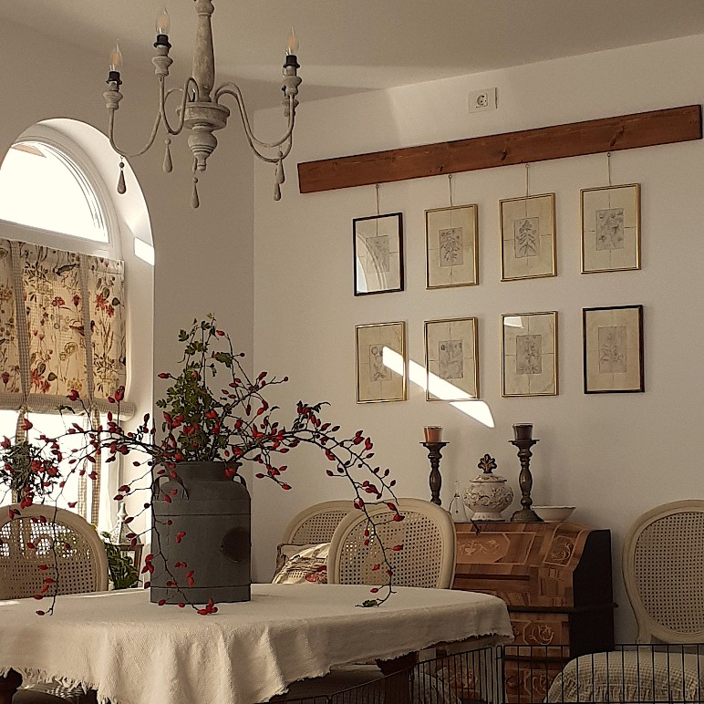

Am deschis ochii timid, cercetându-mi corpul. Junghiul e tot acolo, poate o țâră mai domol. Parcă mi-e mai ușor să mă pornesc. E 5.36 și la mama e deja lumină.

Cred că mi-era amorțit corpul de la somn de nu am simțit durerile. M-au prins din urmă, în drumul meu spre bucătărie. Le ignor, îmi sorb apa caldă și o rog pe ea să mă aline blând pe dinăuntru.

\*\*\*

Nici nu intru bine la mama, că mă ia vehement din ușă. Nu știe pe ce naiba să apese la telecomandă să dea drumul la televizor. E nervoasă. Nu m-a nimerit bine în dimineața asta! Așa-mi vine să zic și eu vreo două, și mai nervoasă decât ea, dar programul ăla instalat de când eram mică și care-mi impune respect pentru părinți încă intra automat. Dau drumul la televizor și îi explic, din nou, cum se deschide. Ea nu mai știe să folosească telecomanda. Nici telefonul mobil. Deși am pus-o să scrie pe carnețel pașii pe care trebe să-i facă și pe ce să apese, uită unde să se uite. O să îi fac afișe mici să i le pun pe pereți. 

Când nu reușește, se enervează cumplit. Cred că de fapt este neputința care urlă în ea și această conștientizare mă calmează brusc. Vorbesc blând, fac o glumă, termin de curățat și plec.

Pe scări, respir adânc, vreau parcă să scot din toate adâncurile mele starea asta de judecată, de nervi, de iritare și să o imping în mașina de spălat a Universului. 

\*\*\*

Urmează timpul meu liber și vreau să-l savurez clipă cu clipă.

Îmi iau smoothieul și mă așez în living. Spiky e lângă mine, a pornit motorașul și toarce.

E o liniște mișto în rest. Cuprind cu privirea întreaga cameră și mă umplu de frumos. Îmi plimb gândul pe la fiecare obiect din încăpere și-mi aduc aminte de unde l-am luat și cum l-am transformat. Există o vorbă pe care o folosesc oamenii pasionali: să pui suflet în ce faci. În dimineața asta, fizicalitatea acestei vorbe mă îmbracă. Am pus suflet în fiecare proiect de-al meu de diy, am cumpărat de pe olx chilipiruri dar mi-am pus răbdarea, atenția și grija să le transform din broaște în prinți. Și mi-a ieșit. Iar acum, aceste obiecte, îmi dau înapoi fix când am mai mare nevoie. 

\*\*\*

Și la micul dejun și la prânz, a mâncat bine. Și a stat la povești.

Observ, din nou, cum se plasează ea, pe axa timpului, față de ceilalți. Toți din jurul ei, de care povestește, sunt morți de mult. Așa crede ea. Sunt persoane mult mai tinere decât ea, care sunt bine mersi în viață însă în mintea ei, o lună echivalează cu ani întregi.

Dacă vede la televizor femei în vârstă, imediat le cataloghează drept “babe”.

Repetă obsesiv și zilnic că face 74 de ani dar eu cred că în mintea ei, în ceea ce o privește, timpul stă pe loc. Are o atemporalitate impregnată, ea rămâne pe loc în timp ce ceilalți trec în viteză pe lângă ea. Nu comentez pentru că nu știu ce să zic dar nu pot să nu văd că și în demență se manifestă egoul. Nu cred că trece o zi în care să nu mă întrebe: zi tu, nu-i așa că nu arăt de 74 de ani? Zâmbesc mereu și dau afirmativ din cap. Dacă aș putea să îi zic toată ziulica cât e de mișto ea, că nu e ridată, că are mâinile frumoase, că nu s-a sclerozat, dacă aș putea să îi gâdil egoul, ar fi tare mulțumită. 

\*\*\*

Evenimentul zilei ei a fost că nu i se mai încarcă tableta. Cred și eu, la cât a frecat mufa aia de la încărcător, evident că s-a lărgit și nu mai face contact. Degeaba îi spun să țină firul relaxat, să fie atentă când pune la încărcat, fie nu reține, fie nu îi pasă. Am luat tableta jos, să văd ce are, iar ea, simțindu-se certată, a zis că face rebus. Foarte bine! 

\*\*\*

Mă uit pe cameră. De când am adus-o la noi, nu a mai pus mâna pe rebus. Nu mai știe să completeze pentru că nu mai știe cuvinte. Așa că azi, nevoită, fără tabletă, voiam să văd dacă face ceva.

A luat un rebus, a luat pixul, a stat câteva minute cu ochii pe pagină și l-a pus pe masă. S-a apucat să-și facă unghiile. A luat din nou rebusul, am văzut-o cum i se strânge gura a iritare, l-a pus din nou pe masă. Apoi s-a ridicat brusc, l-a luat cu o zmucitură și l-a aruncat într-un sertar.

În aceste momente, aș vrea să nu am cameră de supraveghere, aș vrea să nu văd neputința asta uriașă care o sufocă. Rebusul a fost pasiunea vieții ei. Cu el s-a întâlnit în fiecare zi, timp de peste 50 de ani! Gradul ei de demență, deși e severă, nu se manifestă tot timpul. Știu că știe că nu mai înțelege. Și știu că e o dramă interioară a ei dar pe care se ferește să o articuleze. 

\*\*\*

Am urcat pentru jocul zilnic de table. O întreb cum este. E bine, a desfăcut rebus, s-a uitat la televizor, totul e foarte bine! Din delicatețe, nu zic nimic. Dar îmi pare tare rău pentru ea…

\*\*\*

Îmi pare rău și pentru mine. Nu știu cum miroase trauma asta prin care trec dar se pare că pute de i-a alungat pe toți. De fapt, nu chiar pe toți. Doar câteva persoane care mi-erau tare dragi. Nici eu nu fac nimic dar parcă nu-mi vine să sun și să îi pun să mă întrebe cum mi-e sufletul… Noroc că mă mai sună ăștia de pe la utilități sau diverși care vor să vândă diverse.

\*\*\*

M-am bălăcit în plângerea asta de milă cam jumătate de zi. Când înțeleg și nu acuz pe nimeni că a dispărut din peisaj, când mă întristez și judec și plâng de dor și de frustrare.

Pesemne că am înmuiat inima Universului că mi-a servit azi 2 telefoane și două lecții tare faine.

\*\*\*

Primul telefon = prima surpriză. În cursul pe care l-am făcut în 2020, am (re)întâlnit niște femei tare frumoase cu care am avut chimie instant. Pentru că parcursul cursului presupunea să faci pereche cu cineva, care să-ți fie oglindă, Baby a mea m-a curtat, eu am acceptat cererea de prietenie și aia a fost. Am crescut amândouă o relație așa de faină și așa de plină că, deși nu ne-am văzut face to face niciodată, zici că ne cunoaștem de la grădiniță. Putem să nu vorbim cu lunile, când o facem parcă nu ne-am auzit de ieri. 

Primul telefon a fost de la Baby! Și prima lecție a Universului.

Fără nicio altă introducere, fără niciun mesaj în preambul, Baby a mea a pus mâna pe telefon și m-a sunat! A vrut să știe ce fac, să mă audă și nu s-a mai ascuns nici după, nici sub scuza că E POSIBIL să mă deranjeze. Dacă nu pot, nu răspund. As simple as that… La asta nu m-am gândit. Știu că este posibil ca persoanele care nu mă caută să creadă că mă deranjează, că nu am timp, că aia sau ailaltă. Sau așa vreau eu să cred. Măi dar niciuna nu mi-a dat măcar acel mesaj de preambul să mă întrebe dacă mă deranjează! Asta e…

Tare bine mi-a făcut telefonul ăsta! A spart rutina pâcloasă din viața mea, am simțit suflu nou, proaspăt, am simțit drag, grijă, am simțit căldură.

\*\*\*

Al doilea telefon = a doua surpriză. De dimineață mă anunța Facebook-ul a cui e ziua de naștere azi. Am văzut, am notat în creieraș și am parcat urările pentru când am timp. Eu dacă fac o urare cuiva, mă conectez întâi la câmpul de energie al acelei persoane, nu urez ca să bifez. Eu vreau să trimit energetic un mesaj de bine, că vorbele sunt doar purtătoare. Pot fi pline sau goale.

Ei bine, nu am găsit timp. Și seara, mă sună sărbătorita! Adică mă suna ea să îi spun eu la mulți ani, cum ar veni! Cu telefonul ăsta, a spart Universul toate zăgazurile normalului meu, care oricum e zdruncinat bine de tot în ultima perioadă. Am plâns amândouă la telefon, ne-am validat din nou cât suntem de interconectați toți, toate ființele umane, dar cum lăsăm viața să ne treacă sau petreacă.

Să fie telefoanele astea rezultatul cursului de abundență pe care l-am reluat? Sau bățul pe care inteligența asta creatoare și iubitoare mi-l bagă în ochi să mă forțeze să văd că oamenii care vor să fie în viața ta, de care ai nevoie să crești sau să înveți, vor găsi un mod să fie, se vor așeza acolo cu tine, lângă tine, pentru tine. Ceilalți vor găsi o scuză. Iar asta nu e nici rău, nici bine. E doar așa cum trebe să fie.

\*\*\*

Recunoștința mea azi merge din plin către:

1. Baby și sărbătorita zilei, care mi-au umplut de bine desaga sufletului pentru azi!
2. Inteligența asta incomensurabilă!
3. Programul de abundență!
