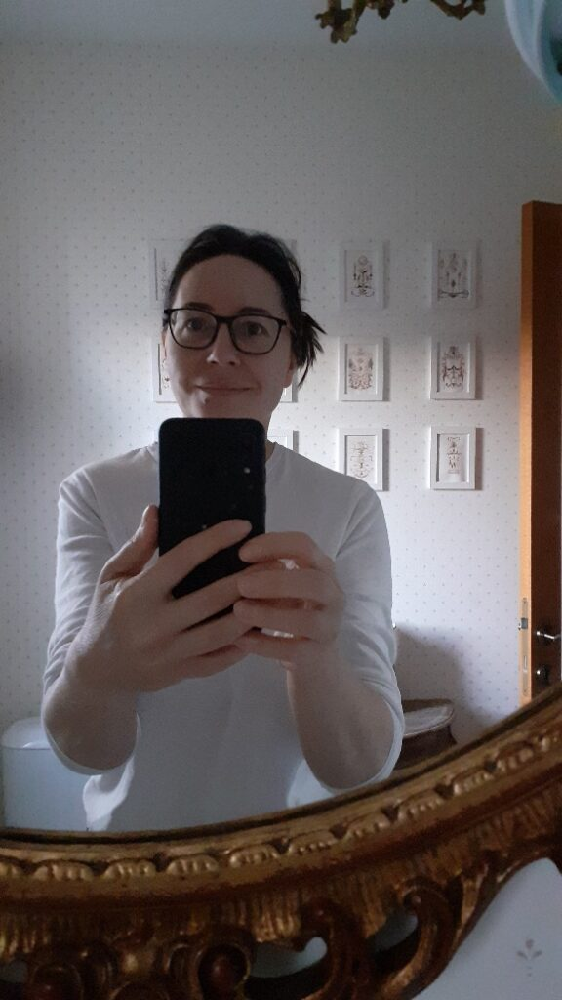
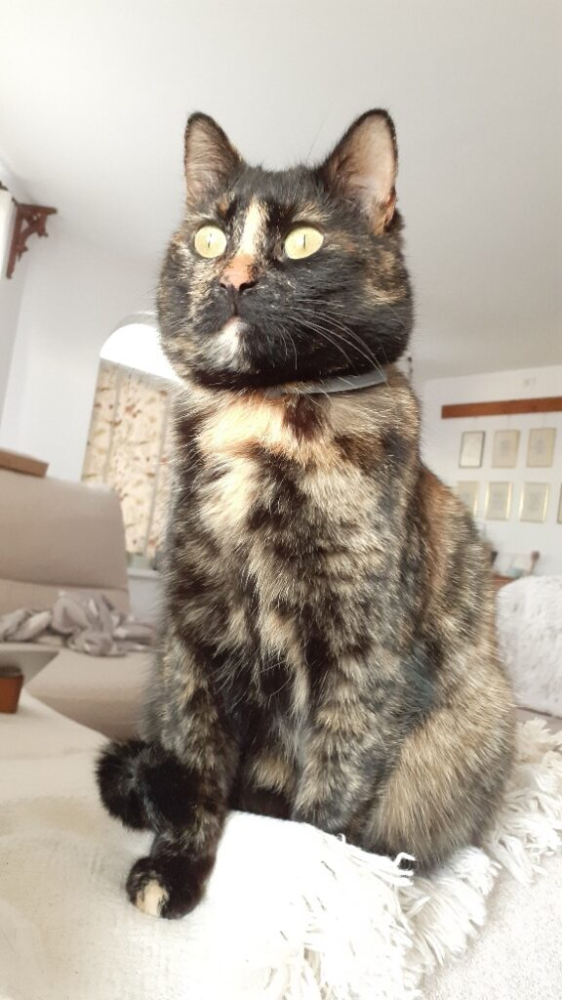

M-am trezit la 5:12 și m-am dat jos din pat la 6:17, câteva “clipe” mai târziu. Aseară m-am tot chinuit să adorm mai devreme dar nu am reușit. Cu doar vreo 3 treziri, a fost o noapte ok. Scurtă dar așa-s toate în ultima vreme. Bine măcar că se luminează mult mai devreme acum și măcar nu mă mai apasă și întunericul.

Mama deja e pe tabletă, semn că s-a trezit de mult. Asta e, mă grăbesc dar cât pot și eu în împleticeala din această dimineață. Nu înainte de a mă saluta în oglinda de la baie. Devine simpatic gestul ăsta! N-a mai avut impactul de ieri dar e drept că nici n-am stat să-l savurez. M-am privit în ochi, mi-am zâmbit, mi-am tras o poză și hai să iau ziua în piept!

***

Nu aș schimba nimic din ritualul meu de dimineața, până ajung la mama în cameră.

Îmi place să-mi fac smoothie, îmi place la nebunie culoarea afinelor dezghețate, sunt atentă cum învârte blenderul banana și para și le învelește în culoarea afinelor și a vișinelor, mi-e atât de familiar sunetul apei de ceai care fierbe și așteaptă nerăbdătoare florile de mușețel dar prima care mă încântă și, sper eu, mă îngrijește pe dinăuntru, este apa caldă. Când sunt bine cu mine și bine cu ce mă înconjoară, apa asta blândă e un balsam minunat pentru organismul meu. O fac de mai bine de juma’ de an în fiecare dimineață și culeg deja rezultatele. Pe mai multe planuri.

***

La mama, totul e cum e normal să fie! Strâng doar litiera lui Sassy, le dau să pape la amândouă și plec să am grijă jos de mine și de Spiky.

***

Pisicuța asta e topită după mine și încep să mă topesc și eu după ea. Mereu m-am considerat mai iubitoare de câini decât de pisici dar uite că ochioasa asta mică m-a vrăjit. Cât timp fac curat la mama, ea mă așteaptă la ușă. Fac duș, ea mă așteaptă lângă duș, pe preșuleț. Sunt în dormitor, ea doarme pe scaunul de lângă patul în care stau. E îngerul meu păzitor dar blănos.

@media screen and (min-width:768px){.stk-ded594c{flex:1 1 66.7% !important}}

Pentru prima dată în istoria noastră împreună, Spikylina mi-a dormit în poală. Data trebe consemnată! Puiuca asta, care a răzbit ea mic copil pe străzi, iarnă sau vară, fără glas probabil de la vreo răceală puternică, încă are în ea însemnele neîncrederii. Chiar dacă mă urmează peste tot, cea mai mare reușită a fost să o țin în brațe. Dar iată că azi, s-a făcut colac peste burtica mea și am respirat amândouă la unison. Poate că nu e mare lucru pentru altcineva, dar mie mi-a umplut inima de bine și de pufoșenie. O jumătate de oră mai târziu, amorțită de la stat într-o singură poziție, am mai fost mai bine decât am fost ultimele zile la un loc.

@media screen and (min-width:768px){.stk-c02fec4{flex:1 1 33.3% !important}}

***

Un documentar despre Taiwan mi-a făcut iar poftă de călătorii. Deocamdată mi-o astâmpăr cu privitul însă o remarcă a celui care a filmat documentarul m-a pus pe gânduri. Cum că tot ce-ar trebui să facem în viața asta este să ne pregătim pentru viața de după. Mie perspectiva asta mi-a scârțâit strident și fals în urechi. Mie mi se pare stupid să “alergi” către o altă dimensiune. Acum cred că trebe să consumăm flămânzi tot ce e aici, vom consuma altceva când vom fi altundeva, dar acum ăsta e momentul de viață plină cu tot și toate. Viața asta nu e o întrecere, nu e despre cine ajunge primul… primul unde?! La groapă? Dacă am lua clipă de clipă, cu foame, cu prezență și cu claritate, ăsta ar fi raiul pe pământ.

Zic eu, care dacă aș putea să șterg perioada asta din viața mea, aș face-o fără ezitare. Teoria asta! Toți suntem ași la ea!

***

Am adus-o pe mama la mic dejun, unde din nou am senzația că nu are gust. Orice îi dau, n-are nicio reacție. De altfel, îmi și spune că ei, nu știe de ce, nu îi mai e foame și nici poftă de nimic. Văd și eu că mănâncă extrem de puțin. Noroc că acceptă smoothieul și sucurile, de unde să-și mai ia ceva bunătăți.

Când nu e atentă, o privesc. Observ la ea că recunoaște unele melodii de la radio și îi face plăcere să le asculte, sau cântă și ea. În rest, dacă eu nu vorbesc întruna, e placidă. Iar privirea îi este întotdeauna la masă, în jos, de parcă e ceva interesant care se derulează acolo.

***

Mama a urcat la ea iar domnul meu s-a dus la cumpărături. Totul e bine, liniștit așa că mă arunc cu mare dor într-un site de lucruri vechi. Doamne, ce-mi place să mă uit! Știu că nu-mi cumpăr nimic acum dar așa mă bucur să privesc la aceste lucruri, de la mobilă veche până la obiecte de uz casnic sau de prin gospodărie, toate vechi, cu povești și la care imediat le găsesc fie întrebuințări noi, fie haine noi. Am avut o oră minunată, cu visări și visuri, cu idei mișto! O oră care nu m-a costat decât o oră din viața mea, dar la cât am primit în schimb, eu zic că-s câștigată.

***

Nu pot și nu știu dacă o să pot vreodată să-mi privesc puiul altfel decât ca puiul meu. Dar ea, puiuca asta faină, e femeie la casa ei, are viața ei, deja salariul ei, drumul ei în toată regula. Uit mereu asta sau ochii mei nu pot să privească astfel.

Ei bine, copila mea, face gesturi mici cu ecou mare în inima mea. Sau gesturi mari cu impact de mă dă pe spate. De la bilețele de încurajare și declarații de dragoste pe ghivece de flori aduse în cadou, la mărțișor de prins la mână, la plăcintă de mere! Făcută special pentru noi de mânuțele ei! Am mâncat jumate fără să respir…

***

Afară e frig, bate un vânticel cam rece, cea mai bună scuză pentru un foc de șemineu.

O cobor pe mama la prânz, mă supăr pe ea că nu mănâncă, fuge repede la ea dar nu înainte de a-mi spune că mă așteaptă la table.

Timpul meu la șemineu se scurge într-o clipită, s-a făcut de table, nu vreau să mă smulg din căldurica asta moale, numa' bună de adormit. Nu reușesc să mă bucur de ce nu vreau să fac și cu fiecare chestie pe care o fac împotriva voinței mele din acel moment, mă simt câte un pic înfrântă. Încă nu sunt la înțelepciunea aia în care să mă bucur că în loc să fac ceva ce să-mi facă inima să freamăte de entuziasm, eu joc table. Sau fac mâncare. Sau spăl. Sau fac curat. Sau cumpărături. Am puțin timp al meu și ăla de obicei e de reverie pentru că nu-mi ajunge fizic să fac câte-un proiect de care aș face eu.

***

Am avut azi și o ciocnire de realități.

Nu reușesc să-mi dau seama dacă ce fac eu se numește că mă plâng sau că comunic. Este posibil să fie amândouă, câte una de persoană. Eu să cred că comunic stări iar altcineva să interpreteze că mă plâng. Sau poate eu mă ascund sub umbrela comunicării și de fapt mă plâng?! Și dacă mă plâng, de ce trebe să mă simt vinovată? Că trebe să las într-un fel să iasă în afara mea tot ce trăiesc și mă otrăvește pe interior. Că și-așa nu vorbesc mult. Că și-așa de abia am cu cine să mai schimb două vorbe. Că nu e ușor să treci nici fizic prin ce trec eu și nici emoțional.

Am măcinat aspectele astea juma’ de zi și tot nu știu care e cea corectă. Cred că ele nici nu sunt atât de importante decât pentru ego. Până la urmă, că mă plâng, că comunic, ladies and gentlemen, this is me, cum ar veni.

***

După tablele și discuțiile care acompaniază tablele, cu mici fracturi de logică din partea mamei, am reușit să o bag la baie. Argumentul meu forte a fost că o știu femeie cochetă și îngrijită, nu e normal să stea 3 zile fără să facă duș. Umblatul la ego funcționează fără greș, atât la un om “normal” cât și la unul cu demență. A ajuns prima în baie!

Ca de fiecare dată, îmbăiată și pe păr, uscată cu foenul, bibilită și la unghiile de la picioare cu ulei de arbore de ceai, îmbrăcată în  pijamale proaspăt spălate mirosind a balsam, îi e tare bine. N-am nevoie să-mi mulțumească pentru că văd și asta e răsplata mea.

***

Am simțit astăzi o ușurință la mine. Nu știu dacă s-a mai înmuiat rezistența mea dar am tratat boala mamei ca și cum nu ar fi încă în stadiul ăla dramatic. Că, din ce citesc, nici nu e acolo. Se poate mai rău, mult mai rău.

Da, nu am libertate de mișcare cum aș vrea dar nici nu stau lipită de ea în cameră. Da, nu am mult timp pentru mine și nici cel pe care-l am nu e doar pentru mine, tot sunt cu un ochi pe cameră sau tot urc din când în când la ea, dar încă pot să fac chestii în timpul ăla mic. Da, vorbește prostii câteodată dar câteodată nu e egal cu mereu. Da, joc table dar mai am timp cu ea, cât încă mai e cu mintea și aici.

Ce mi se întâmplă e de fapt că încep să văd mai mult partea plină decât p-aia goală. Sau poate e doar azi, poate mă simt mai bine fizic. Să vedem cum o să fie când mi-o fi iar rău.

***

Recunoștință plină pentru:

1. Puiul meu și tot ce este ea!
2. Încrederea lui Spiky!
3. Iubire!
