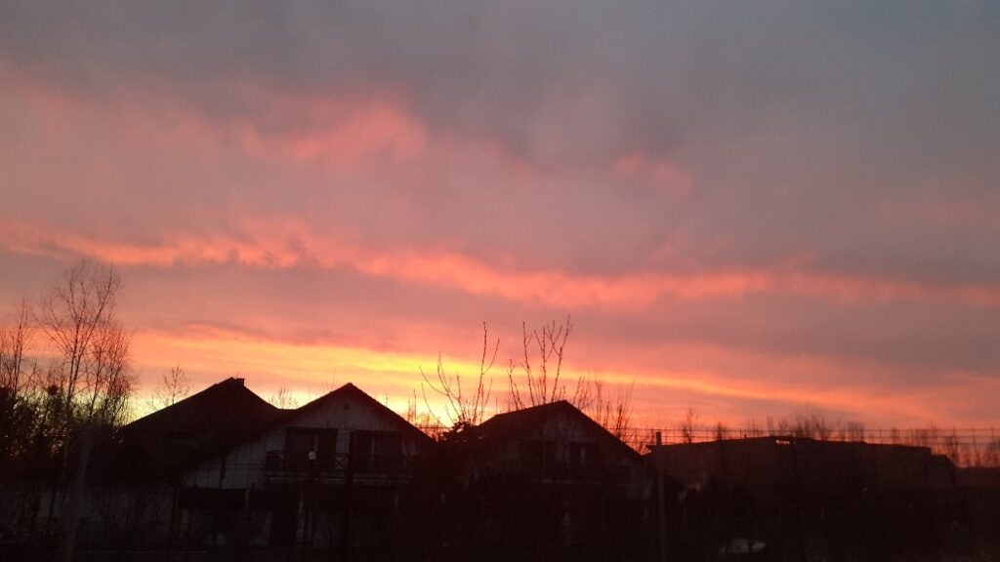

O noapte dureroasă și cu frisoane. Când simțeam că-mi ies flăcări prin piele, când mă lua un frig de-mi clănțăneau dinții. Dar m-am trezit și azi să fiu martoră Creației când naște ziua.

E absolut să privești cum din bezna nopții își fac loc spre ziuă culorile superbe ale unui răsărit. E dătător de viață și de bine și de uimire și de exaltare să privești cum se manifestă în fizic un răsărit viu, ca cel de azi. Zici că Creația, în pântecul nopții, așează cu atenție minuțioasă doar culorile care să dea buzna în zi. Apoi le lasă să se joace ca niște copii năzdrăvani pe cerul planetei, să se arunce în valuri de roz, galben, purpuriu, lila sau portocaliu, să se îmbrățișeze și să se alerge cât vor ei de mult.

Și după ce copiii aranjează fundalul, vine din spate "cavaleria": mărețul galben își face intrarea, cum altfel decât grandios.

E un întreg spectacol, cu suspans și feerie, răsăritul ăsta. Partea cea mai mișto, în ochii și inima mea, este cea în care culorile ajung la apogeul lor de potențial iar în spate, se vede inițial o mică lumină, apoi devine din ce în ce mai puternică ca apoi să apară soarele în toată splendoarea lui.

E unul din cele mai fascinante spectacole, alături de un apus, de o furtună sau de un curcubeu și e gratis. Trebe doar să-ți cureți ochii de "n-am timp" pentru asta.

\*\*\*

Apa caldă parcă mi-a mai alinat durerea din spatele arcadei stângi dar trebe să mă mișc încet să nu deranjez echilibrul ăsta precar. Noroc că m-am umplut de culoare, pe care o arunc peste deja alb-negrul relației mele cu durerea de cap. 

\*\*\*

La mama e curat, peste tot, a făcut ea ordine și la Sassy. Total imprevizibilă boala asta! Asta e, o iau așa cum vine că oricum n-am altă cale, o felicit, le dau să pape și mamei tratamentul, mă mai uit puțin pe cerul minunat cât aerisesc și plec. Am mișcări automate, parcă am devenit robot la acțiunile astea.

\*\*\*

Deja îmi zvâcnește tropăitor durerea în cap, parcă nu am chef nici de smoothie, oricum m-aș așeza pe colțar, nu mă lasă strânsoarea. Iar încep dansul cald-fierbinte, rece-gheață, când sunt cu halatul de baie pufos și gros și două pături peste, când îmi vine să le smulg de pe mine. 

Cu chiu cu vai, am înghițit smoothieul, cafea nici nu vreau să văd, aș sta cu ochii închiși dar parcă simt mai acut zbaterea în tâmple a durerii. Dau drumul la tv, mă uit la un documentar, să mă distragă de la viața mea și să mă transporte în alte lumi. Îmi iese pentru o jumătate de oră după care, viața mea se întoarce la mine, mă apucă de o aripă și-mi mai dă un frison.

\*\*\*

Îmi pun clasicul prosopel cu apă fierbinte pe frunte și încep un dialog interior: ce anume din ce fac îmi deranjează atât de tare corpul încât se manifestă în durere? Ce vrea să iasă din mine și se manifestă în durere? Ce ar lua să nu mai pun lanterna pe fiecare zvâc de durere și să caut în spatele durerii?

Pentru că mie mi-e cert: orice "boală", de fapt orice stare de disconfort fizic vine dintr-o stare de disconfort psihic. Traumă, reprimare, ascundere sub preș, negare, toate sunt pumni puși în gura mesagerilor veniți să îți lumineze și ușureze viața.

Nu am scăpat dar m-am ridicat o țâră deasupra stării.

\*\*\*

Bine că am totuși mâncare pentru prânzul mamei și nu trebe să mă apuc de gătit. 

O aduc la micul dejun, dar pentru că eu sunt tăcută, ea mănâncă fără nici o tragere de inimă și se refugiază rapid în oaza ei de bine și de siguranță de la etaj.

Nu sunt într-o mare formă și nici nu vreau să mă grăbesc să fiu, așa că îmi permit să stau. Voiam să dau cu aspiratorul în toată casa dar am decis să amân. 

\*\*\*

Scârbit de ce se întâmplă, mărețul galben și-a luat ochii din partea asta de pământ, și pe cât de spectaculos a început ziua, pe atât de mohorâtă a devenit. Timp de introspecție, cred.

Mi-a intrat în feed-ul de la youtube o piesă care mă unge la suflet. Cuprinde extraordinar de mișto toate trăirile unei zile sau unei vieți. Când jucăușă, când gravă, când singură, când în comunitate, îmi place la nebunie. 

https://www.youtube.com/watch?v=Obqs3cyOeUc

Cât ar fi de ciudat, în starea asta de rău, mie mi-e și bine. M-a bucurat piesa asta, m-a încântat răsăritul, Spiky e strajă lângă mine, îl aud pe domnul meu în birou, mama e sus cu tableta și cu Sassy, de ce să-mi cobor spiritul pentru o stare fizică? O să treacă. Toate trec. Și toți ne trecem.

\*\*\*

Pentru că vremea mă trage la analize adânci, după ce am inventariat rapid motivele de a mă simți bine, observ că toate-mi sunt exterioare. Ce tare! Ce te faci când nu mai găsești nicio piesă faină, când nu răsare soarele, când domnul tău nu e în casă cu tine, când mama și Sassy nu sunt sus?! Când îți legi starea de bine cu un șiret de ceva din afară, devine periculos. Pentru că ce e "acolo", în afara ta, se schimbă într-o clipită (că doar am văzut clar asta în decembrie), ți-a tras covorul de sub picioare și-ai căzut în nas. 

Așa că, cu prosopelul pe cap, mi-am întors atenția în mine. Mi-am cercetat corpul, mi-am plimbat "ochii" prin interiorul meu, mi-am simțit mușchii, mi i-am relaxat, mi-am simțit oasele, mi-am imaginat sângele și limfa, am vorbit cu organele mele, am zâmbit cu ele, le-am mulțumit, mi-am cercetat starea și am văzut o Biannca curioasă. Nu una tristă. Doar curioasă. Bun! Acum hai să întoarcem înăuntrul în afară! Hahaha, asta e partea cea mai grea. Că dacă nu te scanezi să te vezi acolo unde nu te vede nimeni, uiți cum ești și te iei după exterior. 

\*\*\*

S-a făcut de prânz, m-am smuls din reveria-meditația minunată s-o aduc pe mama jos. 

Încep să observ tiparul: când decid în mine să fiu bine, vine și testarea din exterior. De obicei, mama e cea care-mi apasă butoanele. A venit la masă dar după două linguri de ciorbă, o dă scârbită într-o parte, că nu-i place. Mai ia și carnea din felul doi și la fel, dă la o parte. Practic arunc mai mult de jumătate din mâncare. Risipă maximă. 

Mă apucasem să spăl vasele și ea nu se ridica de pe scaun. Știam ce vrea dar mă făceam că nu văd că așteaptă foietajul. Mâncare nu vrea dar dulce, întotdeauna. Și preț de câteva secunde, am fost încrâncenată dar apoi efectiv mi s-a topit toată starea aiurea: de ce să mă supăr pe ea? Nu vrea mâncare, pot eu s-o oblig să vrea?! Nu și nici nu vreau. Îi dau foietajul și pleacă liniștită sus iar pe mine mă lasă împăcată jos. Am trecut testul!!

\*\*\*

Am lenevit până la table, o stare molcomă mi-a cuprins tot corpul și parcă și mintea, nu au mai alergat gândurile ca nebunele, nu am mai croșetat griji sau probleme sau lucruri de făcut sau lipsuri ci, cum tocmai spunea profa mea de la curs azi într-un video scurt au fost vânt prin plasa minții, nu smoală. Au venit și au trecut dar nu le-am mai luat la puricat, în analiza aia consumatoare de timp și energie.

\*\*\*

La table am validat din nou insuficiența cu care s-a învelit mama toată viața, fără să-și dea seama și fără să schimbe ceva.

Dorința ei de a câștiga și, în genere, dorința de a domina, vine dintr-o nevoie de validare din afară care să acopere o mare lipsă dinăuntru. O lipsă imaginară de fapt, pentru că ciuntirea, care s-a făcut subtil și în timp, s-a făcut în egoul uman nu în spiritul divin. Avem nevoie să demonstrăm celorlalți că suntem mai mișto, mai buni, mai deștepti, mai bogați, mai cool pentru că e un ego flămând la mijloc. Așezarea asta pe trepte e o mare gogomănie și o s-o repet întruna până mi-o intra și mie definitiv în matcă. 

Mama vrea mereu să mă bată și, oricum și când o face, e o voce în ea care-i șoptește mereu că pierde.

E un mecanism fantastic egoul ăsta, are frumusețea lui, iar în demență, ai ocazia unică să îl vezi cum întortochează lucrurile și experiențele, e o construcție ciudată dar, trebe să recunosc, interesantă tocmai prin lipsa de noimă. 

\*\*\*

Pentru că mama se uită la știri, de fapt le ascultă, am aflat azi că de Paști anul trecut s-au tăiat 3 milioane de miei. 3 milioane de vieți!! Nu vreau să fiu ipocrită pentru că nu sunt dar de când nu mai mănânc carne, mi s-a schimbat optica dramatic și mi se pare incredibil cum de nu am văzut atâția ani ce văd acum și, mai ales, cum de cei din jurul meu nu văd la fel ca mine. Mi s-a strâns pielea pe mine numai la gândul măcelului de anul acesta. Cuvântul în sine - măcelărie - e extrem de reprezentativ pentru ce se întâmplă acolo iar oamenii refuză să oprească această supremație imaginară asupra altor specii.

\*\*\*

Am rugat-o să terminăm mai devreme tablele pentru că efectiv nu mai puteam să stau pe scaun. Durerea de cap nu se epuizează, deja mi-e clar că am bufeuri, transpir brusc, e un cumul care îmi dă, la propriu, mâncărime pe piele. Nu e încântată dar înțelege fermitatea mea și renunță.

\*\*\*

Închei ziua mai devreme, sau cel puțin așa-mi propun, și recapitulez recunoștința zilei pentru:

1. Orice miracol, mic sau mare, al Creației!
2. La valse d'Amelie!
3. Frumusețea renașterii naturii primăvara!
