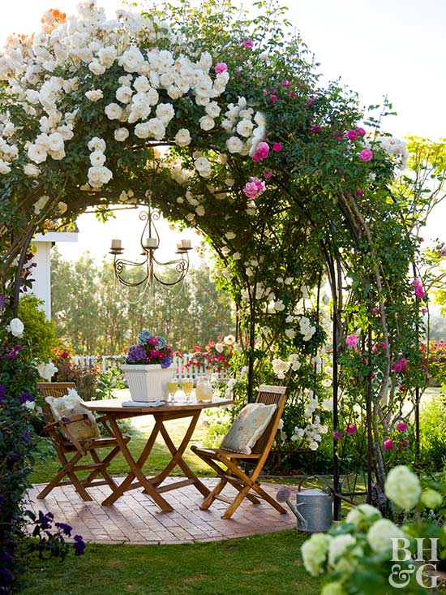

Ca să nu mai comentez pe marginea faptului că noaptea mi se pare scurtă, Universul, deghizat în chip de Spiky, a decis să-mi arate ce înseamnă cu adevărat scurtă. Plimbări dese pe catwalkul reprezentat de dormitorul nostru, unde, în liniștea plină din ceas de noapte, gheruțele răsună cu aplomb, aburcări bruște de la sol la etaj, peste noi în pat, în special, peste domnul meu, râcâieli cu lăbuțele ba la ușile dulapurilor, ba să dea pilotele la o parte, ba la storurile de la geam. O feerie, ce să mai! Și de câte ori mă trezeam și o atenționam, domnul meu îmi zicea să o las în pace. Până pe la 2 noaptea, când am realizat cu disperare că mai am doar extrem de puține ore de somn și bateriile blănoasei nu dădeau semne de descărcare. Am înșfăcat-o la subraț și via camera tehnică, unde și-a petrecut, îmbufnată, restul nopții și am putut și noi să punem geană pe geană. Să mai zic cât de scurtă mi s-a părut noaptea? Nu mai zic.

\*\*\*

Așa buimacă de somn, nu m-am abătut totuși de la ritualul matinal. Ajunsă în bucătărie, m-am dus să-i dau drumul lui Spiky și, pentru prima oară, nu a sărit să vină la înaintare. E încă supărată că am dus-o acolo să doarmă. Foarte bine, să fie, că și eu sunt cam chioară de somn. Suntem chit.

\*\*\*

Am bifat rapid toate operațiunile, la mama e deja geamul deschis, curat și totul la locul lui. Mulțumesc, Doamne! Așa-mi plac diminețile! Să fie, fără număr!

Schimb două vorbe cu mama, o mângâi un strop pe Sassy, le dau să pape la amândouă și plec cu aripile în spate că azi e sâmbătă, am timp magic mai mult și ziua, deși după o noapte scurtă, a început bine.

\*\*\*

Cu smoothieul meu drag în brațe, cu Spiky la picioare, pe jumătate iertată și iertătoare, mă afund în visare.

Azi am o poftă, aproape fizică, să îmi imaginez cum voi redecora anumite părți din casă așa cum mi le-am dorit mereu dar nu am reușit.

Camera în care stă mama acum a fost inițial a copilei mele. La momentul la care am pornit casa, planurile erau ca ea să plece să studieze în afara țării așa că eu am gândit camera, ce a devenit a ei, drept cameră de oaspeți. Ea nu a mai plecat afară, a lovit pandemia, apoi demența iar din visul pe care îl aveam pentru cameră au mai rămas doar fâșii. Dar am imaginea, în cele mai mici detalii, în creieraș și știu că, la momentul potrivit, se va manifesta și în realitate.

Apoi mai am zone din alte camere pe care vreau să le schimb. Când o să mă scutur puțin de starea asta de suspendare, când mai crește puțin ziua, o să mă apuc din nou de proiectele mele de bricolaj, de casă și o să mi le pun în practică. Tare mult bine mi-a făcut mie frumosul pe care mi l-am creat în casă. Din chilipiruri, din nimicuri, cu multă trudă, cu degete fără burice de la atâta șlefuit de lemn, mi-am creat un univers care-mi încântă mereu privirea.

\*\*\*

Am mai studiat puțin stiluri de design interior și mi-am surprins starea de bine. Imediat după aia, mi-am dat seama și de ce mă simt bine.

Când îți dai voie tu ție să fii cum ești cu adevărat, simți cum se rup lanțurile în care i-ai închis și pe ceilalți în (pre)judecățile tale. Când ești tu, fără să faci rău cuiva prin asta, permiți. Și din căușul ăsta mic de permitere se naște cu adevărat iubirea. Pentru că, am învățat eu hard way, iubirea înseamnă a permite. La mine cel puțin, asta înseamnă.

Mi-aduc aminte, din viața mea aia netrăită, cum mă apretam și mă strângeau toate hainele dar "arătam bine", cum mă abțineam de la a spune, a face și a fi și mă poleiam ca "să dau bine", cum mă duceam după cum bătea vântul acceptării de mi se julise sufletul neștiind în care zări să mai alerge, cum judecam și invidiam și cleveteam fiecare acțiune sau faptă sau om care nu făcea ca mine, care nu-mi făcea pe plac sau care avea curajul să iasă din tiparele mele sau ale societății limitate și limitative. Încă mai fac câteodată dar acum sunt capabilă să mă prind repede că și de ce o fac. Cu cât ești mai tu, cu atât ți se deschide mai mult o lume nouă, cu atât atragi și ești atrasă de oameni care s-au deschis deja sau sunt în proces.

Dintr-odată, armura aia nepotrivită pe care o forțam pe piele și pe suflet în fiecare dimineață, se relaxează și se dizolvă și se naște libertatea. E un cuvânt mare dar starea e imensă. Îl văd adesea prost folosit și și mai adesea prost înțeles.

Liber ești când nu mai ai credințe limitative, nu când ai terminat jobul de la 9 la 5. Liber ești când nu ai atașamente care să-ți atârne ca pietrele de suflet și care să te dărâme când subiectul sau obiectul atașamentului dispare. Liber ești când simți potențialul Dumnezeului care ești și te încăpățânezi să-l transformi în realitatea ta, nu a altora. Liber ești când gândurile nu-ți mai sunt cușcă și not even the sky is the limit. Liber începi să fii când înțelegi că plătești prea scump cu timpul tău și-așa scurt aici, fiecare dată când ai tăcut și ai înghițit ceva ce te-a zgâriat pe inimă, când te-ai chinuit să intri într-o limitare "pusă la dispoziție" de omul iubit sau de părinți sau de societate, de frică să nu-i pierzi și te-ai risipit pe tine în schimb. Ești liber abia atunci când îți dai voie să zici nu la oameni, situații și trăiri.

Eu obosisem să car atâta balast în suflet. Viața e simplă și curată, e un parcurs de bucurie. Adică așa ar trebui să fie. Uite că noi, în haina umană, am adunat zoaie peste zoaie de griji, programe, credințe, frici, stres și dintr-o bucurie a devenit o povară murdară iar, în cazurile fericite, o spălare continuă. Eu tot spăl la mine de când trăiesc și rămân surprinsă cum, când credeam că am rezolvat o traumă sau un program sau o credință, obișnuița aia pe care am consolidat-o când nu trăiam, se așează așa de natural și de "ca la ea acasă" peste gândurile mele că mi le face praf, din nou.

\*\*\*

Deja nu-mi mai fac griji pentru micul dejun. Și în dimineața asta, mama mănâncă tot, stă și la un pahar de vorbă în timp ce eu deja mă apuc de bucătăreală. I-am zis de ieri că fac o mâncărică de cartofi cu salată de varză acră pentru ea. Azi dimineață mă întreabă dacă îi fac mâncarea de cartofi. M-a lăsat mască. Are o lejeritate în a zice și balauri și chestii normale care pe mine mereu mă dă pe spate.

Cred că demența are ceva din spectrul autismului. Habar n-am dacă e așa, însă pentru mine e o constantă uimire această boală. Niciodată nu știu dacă mama știe și se face că nu știe sau nu știe, înțelege sau se face că nu înțelege sau chiar nu înțelege. Pentru că noi, ființele umane, ne bazam foarte mult și pe limbajul corporal. Ei bine, când el lipsește, e al naibii de greu să îți dai seama care cum e. În liniaritatea ei expresivă, mama îmi mai aruncă câte-o bombă d-asta, își aduce aminte azi ce am discutat ieri încât nu pot să nu mă gândesc că poate face pe prostul câteodată. Oare care o fi tiparul după care reține că fac mâncare de cartofi dar uită că trebe să mănânce? Sau că nu mai are foietaje dar îi iese din minte și din suflet, cu desăvârșire, că mie mi-e rău? 

\*\*\*

Am combinat bucătăreala și cu grădinăritul și mi-am pus semințele de roșii la germinat. E pentru prima oară când fac asta și am fost mai ceva ca un chirurg în delicatețe. Să mă fi văzut cum am extras cu penseta dezinfectată fix câte 5 semințe din fiecare soi, cum le-am pus pe șervețele umede, tot cu penseta, la distanță unele de altele și le-am mai pufăit cu apă o dată, delicat, să nu le zvârl de colo-colo. Am fost ca elefantul între bibelouri, pentru că delicatețea nu este punctul meu forte. Dar mi-a ieșit și abia aștept pasul următor.

\*\*\*

Mâncarea proaspătă merge mult mai bine cu o pâine proaspătă așa că am dat o fugă până la Lidl să iau. Eu visez să devin frugivoră dar hopul în care mă opresc acum este pâinea. Îmi place la nebunie pâinea proaspătă sau lipiile sau focaccia. La nebunie! Azi mă răsfăț și asta e!

\*\*\*

Nu știu pe unde s-au rostogolit orele care au urmat că doar ce am pus masa de prânz, am ieșit să toaletez nițel copăceii noștri din curte (mai mult intuitiv că habar n-am să fac asta…), am mai stat un pic la soare pe terasă cu Spiky la picioare și gata, trebe să mă duc la table. Și tot tacâmul de după. 

Așa aflu că se dă și ceasul cu o oră înainte, deci dormim cu o oră mai puțin. NU, eu nu sunt pregătită! Pot să fac o petiție, ceva, nu să scoatem o oră din noapte ci din contră, să mai punem vreo câteva în plus?!

\*\*\*

Cu toate astea, azi, în timpul tablelor, m-a cuprins din nou duioșia pentru mama.

Mi-am adus aminte cum, atunci când am adus-o la noi, o vedeam pe camere și tot timpul îi spuneam, deși evident nu mă auzea, "iubita mea dragă!". Cât de plină de înțelegere și de răbdare și de speranță că o să duc totul eram atunci și cât de stoarsă sunt după numai trei luni. Dar chiar și așa, vreau să mă întorc la starea aia de drag pentru ea, pentru că simt la mine că mă poziționez antagonic față de ea în ultima vreme. Uit ce mi-am promis atunci la început și nu vreau asta. Este clar că e greu de digerat dar vreau să mă aduc pe mine de atunci să locuiască în mine de acum. Vreau să simt din nou căldura aia care mă înmuia și-mi spăla fața de lacrimi, dar fără lacrimi acum, vreau să o privesc ca pe cineva în nevoie și atât, fără să atașez "Da, DAR…", vreau să pot să fac de toate pentru ea din drag și nu din mentalitatea de sacrificiu. Pentru că aici este de fapt sămânța experienței prin care trec acum, ăsta este subiectul ăla greu la teza pe care o dau acum și aș vrea să nu mai ratez din nou. Am dreptul doar la o restanță. Prima sesiune am avut-o când a avut cancerele și am ratat-o cu brio.

\*\*\*

Gata, închid obloanele pentru ziua de azi, nu înainte de a constata, cu stupoare, că în organizatorul de medicamente al mamei mai sunt doar trei zile! Frate, parcă ieri le-am aranjat pentru întreaga săptămână. Oare la toată lumea se simte la fel?

\*\*\*

La recapitularea zilei, mi-a ieșit în față recunoștința pentru:

1. Curățenia de la mama din cameră!
2. Grădinărit!
3. Duioșia ce mi-a căptușit inima la ceas de seară!

Iar pe podiumul clipei de frumos s-a așezat:

