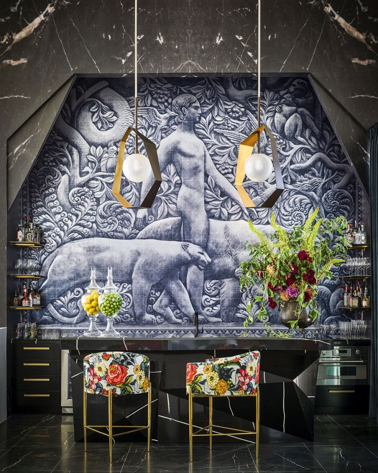

Vise alambicate, intense, cu persoane cunoscute sau necunoscute, cu un singur fir epic care le unea: în toate visele trebuia să ajung undeva, dar nu reușeam, parcă eram într-o așteptare. Cam cum sunt acum în viața mea.

M-am trezit destul de neodihnită, nu nimeresc din prima papucii, afară e beznă, la noi la fel iar domnul meu doarme atât de lin că îmi face poftă nebună de-un somn la fel. Asta e. Încă o zi.

\*\*\*

Aseară, Spikylina avea frichinei pe sub piele: când în pat, când jos din pat, când pe pervaz, când pe scări, acompaniate de chi-chi-ul ei de ziceai că vine apocalipsa. Ca să preîntâmpinăm o noapte ratată, am dus-o în camera tehnică, să dormim cu toții liniștiți. 

Cum am intrat în bucătărie, cum am auzit-o că râcăie pe partea cealaltă a ușii și i-am dat drumul. Ce mai era la gura ei! Ori ceartă, ori iubire, habar n-am ce zice în limba ei chichiricească. Oricum ar fi, mi-a făcut plăcere să o văd. Mi-i drag de boțul ăsta mic!

Furată de celelalte activitați, aproape mi-am fiert apa de-o beau dimineața așa că a trebuit să stau mai mult decât preconizat în bucătărie. De obicei, eu sorb apa cât timp fac smoothieurile și ceaiul pentru că vreau să las o jumătate de oră între apa băută pe stomacul gol și smoothie. Fix cât îmi ia să fac tot ce trebe la mama și să curăț și jos, la Spiky. Nebuna asta mică nu face ceva în litieră dar aruncă tot nisipul afară din ea și e ca o cursă cu obstacole în preajmă.

\*\*\*

Am ajuns și la coana mare, e toată numai zâmbet, mă bucură priveliștea asta când deschid ușa și mă bucur că e din nou curat, peste tot. Doar aerisesc, le dau să mănânce, mamei îi dau pastilele și, dacă tot e bine, mai stau cu ea la o vorbă. Îmi spune că azi-noapte a nins (!), eu nu zic nimic dar nu știu dacă să mai stau și să continuăm sau să plec ca să nu mă scămoșez. Aleg să stau, pentru că petrec totuși destul de puțin timp cu ea. Nu că mi-ar duce ea dorul dar s-au putea să-l duc eu, mai târziu. Mama a luat însă tableta în brațe, semn că întrevederea noastră a luat sfârșit.

\*\*\*

Începe să se ițească lumina, sunt lipită de ușa de la bucătărie să văd ce mai e pe afară. Văd agitație în cuibul coțofanilor, sunt matinali, îi văd cum caută prin iarbă paie, probabil că nu au terminat căsuța. Privindu-i, la un moment dat realizez că văd niște fulgi albi zburând. After all, mama nu halucina. Draga de ea văzuse, ceea ce văd și eu acum, petale de flori de zarzăr zburătăcite de vântul ăsta nebun care a alergat cu viteză toată noaptea și nu dă semne că s-ar opri. Cât de repede judec!

\*\*\*

Mi-a plăcut tare mult bucățica asta de conștientizare: abilitatea de a-ți crea realitatea pe care ți-o dorești este direct determinată de consimțirea sau deschiderea pe care o ai de a experimenta opusul a ce îți dorești. Dacă îți dorești să fii bogat trebe să fii dispus să accepți sărăcia PÂNĂ ajungi să fii bogat. Dar să nu-ți pierzi focusul. Dacă îți dorești să ai relații mișto trebe să fii dispus să setezi limite și să fii singur PÂNĂ găsești oamenii ăia cu care să construiești relații sănătoase, care să-ți respecte limitele impuse. Dar să nu disperi. Dacă vrei să vindeci trecutul, trebe să fii dispus să sapi în traumele tale și să te răscolească PÂNĂ ești capabil să cureți conștient ce e de curățat. Dar să nu te lași dărâmat. Dacă vrei să înveți, trebe să accepți sentimentul că nu știi PÂNĂ ajungi să asimilezi cu adevărat informația. Dar să nu crezi că nu ești de ajuns. Pentru că nu vreau să vorbesc în numele altora, deși cred că mulți am fost sau suntem p-acolo, de multe ori și mult timp m-am oprit la primul pas. Pentru că inconfortabilul nu ne place. Egoul și mintea cu asta se ocupă: să respingă ce nu ne place, să ne țină în zona călduță de confort. Uitându-mă retrospectiv la viața mea, inconștiența a fost cea care m-a dus în afara zonei de confort, rar am ales conștient asta.

Așa că dacă vreau să fiu liberă trebe să fiu dispusă să accept să nu fiu. Fix aici sunt acum. Bună tare conștientizarea asta!

\*\*\*

Am scrollat puțin pe siteuri de antichitați, plăcerea mea maximă în bucata asta de viață, am mai văzut câte ceva pe Facebook dar mi-a atras atenția o postare pe un grup în care sunt.

Era o postare de mulțumire a unei ucrainence care elogia un medic veterinar. Stop cadru și back in time, acum 2 ani. Căutam pe cineva care să ne ajute cu turnarea unei platforme de beton pentru parcare. Primii veniții au fost doi domni, din care unul părea șefuț iar celălalt executant. Au venit, au văzut, au măsurat și nimeni nu a mai auzit de ei. Șeful nu a mai răspuns nici la telefon, nici la mesaje, iar eu i-am pus eticheta de neserios în frunte. Anul trecut s-a deschis la noi în zonă un nou cabinet veterinar și nu mică mi-a fost consternarea să văd că șeful este medicul veterinar al noului cabinet! În mintea mea, unde rămăsese neserios, am pus ștampila de "niciodată nu o să mă duc la cabinetul lui!" Azi, citind mesajul de mulțumire, mi-au dat lacrimi mici în ochi și am simțit cum se topește catalogarea. Câte prostii d-astea cărăm după noi, zi după zi, sigilate acolo în mințișoara noastră, care se adună de nu înțelegi ce naiba te apasă așa de greu. Atât de repede ridicăm piatra să aruncăm și nu stăm un strop să ne punem în papucii celuilalt. 

Cam așa se întâmplă și cu Will Smith acum, că tot e peste tot în social media zilele astea: e o mazilire globală, toți aruncă cu pietre, că ei, ăștia toți, sunt niște sfinți. De câte ori nu am avut și eu porniri d-astea violente în mine și, fără cohones, le-am consumat în mine. Nu zic că e bine să lovești, nu zic că e bine să accepți umilirea. Zic că suntem oameni, și TOȚI, fără excepție, greșim. Punct.

\*\*\*

Micul dejun vine și cu surpriza dimineții: mama, printre picături de chefir, îmi spune că ea nu-și mai amintește figura decedatului ei soț. Am simțit ezitarea din vorbe, pentru că ar fi vrut să-i spună numele dar nu și-l mai amintea. M-am surprins când i l-am livrat eu: Locatelli. De cele mai multe ori, mama așa l-a numit în fața mea. Rar îi zicea Giovanni. Pentru ea, Locatelli era în zeflemea, se simțea puțin răzbunată când îl numea așa. Vorbesc la trecut, pentru că acum nu mai face această diferență de nuanță. 

Zic stai că ți-l arăt eu. Giiiiz, eu nu am nicio poză cu tatăl meu! Nu am ce să-i arăt. Caut pe net, mi-aduceam aminte că a scris o gazetă ceva despre el la moartea lui și am găsit două poze, nu foarte lizibile. I le-am arătat și l-a recunoscut imediat. Mi-a fost tare milă de ea: l-a privit, a scuturat din cap ca și cum voia să scape de ceva apoi i s-a așezat o tristețe pe față. Nu știu dacă mama l-a iubit cu adevărat pe tata, dar știu că a fost extrem de marcată de existența lui în viața ei. 

Am schimbat subiectul, să-l lase în negura uitării și am reușit.

\*\*\*

În viața asta ai două alegeri mari și late: să fii puternic și să fii slab.

Dacă ești slab și nu alegi să te faci puternic, este nebenefic de două ori: o dată pentru că te vei simți strivit de viață, ceea ce nu e bine pentru tine, și a doua oară pentru că devii frustrat și vei căuta să te răzbuni pe oricine și pe orice, și asta nu e bine pentru cei din jur. Deci practic, dacă înțelegi astea, nu ai decât o singură opțiune. Evident, că tocmai ce am înțeles și eu, trebe să accepți că până ce te faci tu puternic, ești slab, dar nu învins.

\*\*\*

Domnul meu e cam molcom azi, îl doare în gât și e moleșit. Fac ultimul șemineu pe anul ăsta, el pune pe fundal o muzică de violină, e un moment de biniște cu totul, că adoarme rapid. Îmi place să-l privesc, mereu am crezut că este o priveliște mișto, și, în genere, oamenii când dorm au o figură angelică. L-am lăsat acolo, în toată atmosfera aia faină, pentru că trebe să pregătesc prânzul.

Astea sunt momente din alea în care aș vrea să nu fiu forțată să fac lucruri când nu vreau. Aș fi vrut să stau acolo, cu el, chiar dacă doarme, să mă imbib de bine și de bun. Să-mi încălzesc corpul de la șemineu și inima de la omul iubit. Dar asta e. Sunt în acel progres de a fi liberă așa că iau pasul ăsta ca o treaptă necesară.

\*\*\*

În timp ce bucătăresc, mă lovește a doua conștientizare a zilei: am ajuns să mă plac și să mă simt așa de bine cu mine că nu mai consider că domnul meu mă completează. Nu aș vrea să-mi petrec restul vieții decât cu el dar nu îi mai pun pe umeri, invizibil, povara de a mă completa. Suntem împreună pentru că ne place asta, ne împărțim unul celuilalt dar ne iubim și prețuim fiecare pe sine. Celălat e doar un bonus, e cireașa de pe tort. 

\*\*\*

O aduc pe mama la prânz și iar e într-o zi de mofturi. Dar nu mă mai agit, mănâncă ce și cât poate. Termină ea, vine Mr. H, sunt numai într-un pus și strâns de mese dar mi-e bine. Nici măcar vântul ăsta nebun care bate cu o viteză de răsună toată casa nu mă mai sperie așa de mult. 

\*\*\*

În timpul tablelor cu mama, am avut un moment pur de neutralitate.

La televizor, emisiunea Romania, te iubesc! în care se vorbește despre militarizarea țării noastre în contextul războiului. Apare și Putin, într-o imagine, iar mama zice, cu năduf, "de ce nu-i face nimeni felul nenorocitului ăsta!" Am întors capul, m-am uitat la tv, la Putin și a fost un moment sublim de privit și atât. Nu am simțit nici înverșunare, nici iubire, am fost exact la mijloc, nu am înclinat balanța în nicio parte. Nu pot să exprim în cuvinte dar vreau să păstrez în inimă senzația asta plăcută pe care am trăit-o. Alături de cea de acum câteva seri, când mă simțeam protejată. Cred că atenția asta pe care o am asupra vieții mele, asupra mea, a experiențelor, emoțiilor și reacțiilor mele începe să dea roade în niște trăiri tare faine. Nu trebe să facă sens pentru nimeni altcineva, dacă mie îmi încălzesc inima și ridică spiritul, să fie, fără număr.

Văd că devin din ce în ce mai relaxată la situația cu mama, nu la mama neapărat. În continuare tot ce face sau nu face mă atinge, dar nu mai iau totul dramatic. E poate pentru că am obosit să stau în acea încordare și corpul și mintea au dat drumul la hățuri că nu mai pot să țină ritmul. E poate pentru că, acolo dedesubt, în spiritul care mă animă, deja știu finalul. E poate pentru că oricât de mult încerc să creez tipare după care să jalonez în zi, demența rade totul și schimbă totul. Sau puțin din fiecare. Încerc să mă așez cât mai cuprinzător în această nouă ordine a vieții mele, acompaniată de aceste noi trăiri. Și să-mi fie bine. Că-s singura răspunzătoare pentru asta.

\*\*\*

O zi antitetică pentru mine, furtunoasă afară dar atât de calmă înauntrul meu. Cu recunoștință pentru:

1. Mama, fără de care, poate, nu m-aș fi pus atât sub lupă și nu mi-aș fi activat atâta potențial!
2. Conștientizările zilei!
3. Acceptarea a ce este, cum este, când este!

Frumosul care mi-a hrănit sufletul azi este acest cocktail bar, cu alăturări din cele mai neașteptate:

_Paul Montgomery worked with Nussbaumer to create this incredible mural which nods to Mowgli from Rudyard Kipling’s 1894 The Jungle Book_
