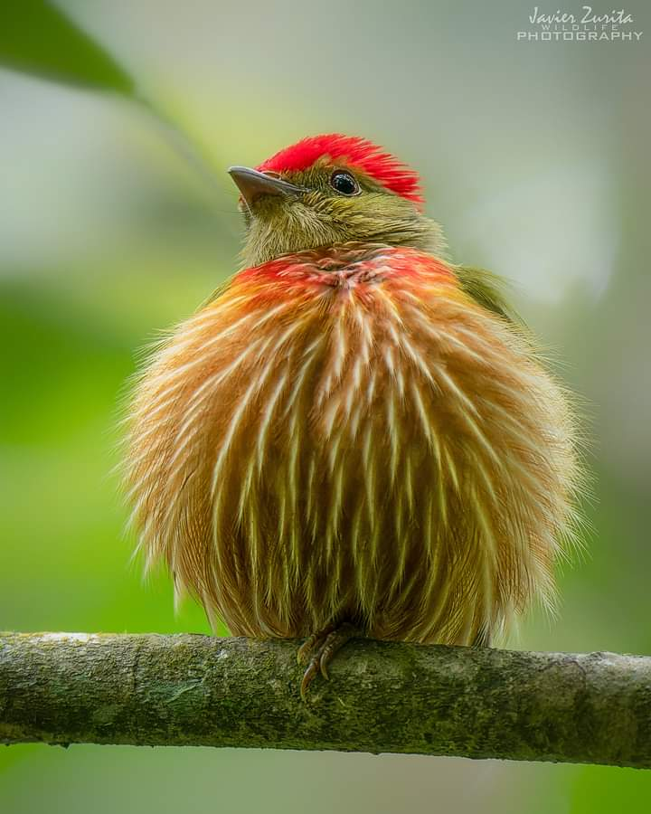

Încep să bifez iar la nopțile on-off. De regulă, diminețile care vin după aceste nopți sunt necioplite, dure, nu reușesc să mă adun decât târzior. Azi mă bucur că materia are memorie iar corpul meu preia automatismele zilelor trecute pentru că zău dacă pot să dau vreo comandă de la panoul central. Încă nu intră curentul acolo și nu s-a luminat zona.

***

Cu ajutorul apei calde, se mai limpezește puțin în mine iar afară începe să se risipească noaptea. Am ieșit un strop pe terasă, înainte de a începe smoothieurile, tocmai să mă trezească de tot aerul mai rece. Dar nu mă așteptam să fie atât de rece! Brrr! M-am băgat repede la căldurică dar mișcarea asta mi-a făcut bine. Și fizic, și emoțional.

Și Spiky e adormită, că am săltat-o de la picioarele domnului meu de care dormea lipită, așa că picotește cu boticul pe gresia caldă până se lățește de-a binelea pe jos. Nu vrea nici mâncare, vrea doar somn. Sora mea de suferință!

***

Mama e ok dar se plânge că e frig. O să fac și mai frig că trebe să aerisesc, să curăț și să spăl dar nu zice nimic, parcă a și uitat că îi era frig sau că mi-a spus asta. Își bea liniștită smoothieul, sub plăpumioară, cu Sassy lângă ea. Ăsta e un tablou care o să-mi rămână pe retina sufletului pentru că e tare cuprinzător: ele două sunt nedespărțite de mult timp deja, mama e liniștită în puținele gânduri care-i mai traversează mintea în ultima vreme, e curat și totul bine.

Plec și eu liniștită, mă bucur că nu am parte de șocuri emoționale de la prima oră, cobor să dau centrala mai tare, să nu îi mai fie frig.

***

Am fost tare absentă din mine în timpul meu magic. Nici nu știu pe ce l-am consumat dar știu că mi-am dat seama cu groază că deja s-a făcut 9 fără ceva. Dacă e să-mi pară rău cu adevărat după ceva, este când mi se strecoară printre degete acest timp doar al meu, de dimineața. Pentru că este singurul în care nu mă deranjează nimeni, în care sunt cât de cât relaxată și nu trebe să fac ceva. Dar azi l-am fușterit aiurea..

***

Pentru că s-a autorecenzat, domnul meu e liber azi și doarme mai mult. Numai bine că o strecor pe mama la micul dejun până coboară el. El tușește de 2 zile și n-aș vrea să îi pun la masă în același timp.

Coana mare parcă vrea, parcă nu vrea, dar coboară "să nu mă supere". Nu știu de unde a luat-o p-asta, dar nu comentez nimic și o întreb ce vrea să pape.

În ceea ce privește mâncarea, în mintea mamei, în "biblioteca" culinară, nu mai există decât trei feluri: cartofi prăjiți, omletă și foietaje. Mai apare sporadic și al patrulea, sarmalele, dar la zi de sărbătoare.

În decembrie, a doua zi după ce am adus-o la noi, am dat o fugă înapoi la ea în apartament să aduc lucruri utile de care aveam nevoie. Știam că nu se va întoarce acasă așa că am golit și frigiderul. Golit e mult spus pentru că în el, în afară de borcane de dulceață sau murături, am găsit două omlete, mucegăite. Acela a fost momentul în care am înțeles, cu groază, că mama nu mai gătea. Ea, care era o gospodină desăvârșită. Nu știu când a încetat să fie ea, pentru că noi două vorbeam zilnic la telefon și părea ok. Repeta mereu aceleași lucruri dar părea că încă poate să-și poarte de grijă. De fapt, draga de ea, nu mai putea și nici nu spunea sau nu voia să recunoască asta.

Mic dejun, fără omletă evident, dar și fără prea multe discuții pentru că nu-i convine când nu primește ce vrea. Mai fac concesii dar trebe să am grijă cu sănătatea ei pentru că tot eu trag.

***

S-a dus la ea iar eu m-am apucat de pregătit prânzul, în două variante, vegan și nevegan. Am o stare de spirit bună, priveliștea pe care o văd prin geam, trei zarzări imenși plini de flori albe, contribuie și ea din plin. Mă opresc din tocat zarzavaturi și mă pierd cu privirea în zare. Respir adânc și îmi scanez și corpul și sufletul. Nicio durere, pe nicăieri. Trimit în Univers recunoștința mea curată pentru momentul meu frumos, pentru prezentul ăsta fără grijă.

Mă reîntorc la bucătăreală și văd că-mi este din ce în ce mai greu să gătesc cu carne. Deși declarativ nu vrea carne, din mâncare, fie că e tocăniță sau ciorbă, mama alege și mănâncă în primul rând carnea. Pe lângă că mi-e greu, habar n-am cum iese, dacă dozez bine condimentele pentru că nu vreau să gust și gătesc "în orb".

***

Ziua de azi e hotărâtă să fugă la sprint pentru că nu știu când s-a făcut ora 13. Am gătit mai multe feluri de mâncare, să nu mai gătesc și mâine, am preparat și sucul de fructe și s-a dus juma' de zi.

***

Vreau să dau o fugă până la Lidl, din nou, pe jos, așa că mă echipez superficial și plec. Afară friguț, eu ca o floricică doar cu o vestuță pe mine, mă avânt ca Agripina să bifez și cumpărăturile. Lasă că mă încălzesc de la mersul sprinten. Pe naiba! Am înghețat! Dar mi-a plăcut ieșirea asta.

Am trecut printr-un cartier de vile și m-am inspirat din peisagistica pe care și-au creat-o oamenii gospodari în fața caselor. Am văzut o băncuță, 2 scăunele și o măsuță și mi-a plăcut la nebunie atât ideea cât și senzația aia de comuniune, de stat la o șuetă cu cineva drag. **E adevărat că prin viață treci singur dar nu înseamnă că trebe să o trăiești singur.** Eu vreau să stau pe băncuță cu oameni dragi, la o cafea, la mine în curte. Vreau să împart cu oameni dragi frumusețea casei și a curții mele dar nu dintr-o mândrie ci din bucurie. Am reușit să fac trecerea de la a mă făli la a împărți. Sper să vină și momentul meu de "băncuță" și să aducă cu el și oamenii dragi. Mi-au venit niște lăcrămioare în ochi, de dor, dar nu vreau să stric bucuria plăcută pe care o trăiesc în prezent pentru o lipsă pe care o resimt de ceva timp. Toate vin la mine la momentul potrivit. Se zice că nu poți conduce o mașină cu ochii în oglinda retrovizoare, trebe să lași trecutul acolo unde este.

***

Încep să mă obișnuiesc, nu mă mai iau amețelile de la susurile și josurile zilnice. Asta nu înseamnă că mi-am setat mintea să creadă că după un sus, vine un jos doar că, DACĂ vine, să-l las să fie.

Așa că refuzul mamei să mănânce supa pe care m-a pus ieri s-o fac azi nu mă mai enervează. Nici faptul că de abia mănâncă un pic de mămăligă cu tocăniță. Nici faptul că, deși nu mănâncă, nu se ridică de la masă până nu îi dau foietajul. Nici că se ridică de la masă și pleacă fără un simplu mulțumesc. Le iau pe toate și le împachetez într-un moment și le dau un șut în fund să se ducă în trecut, unde sunt deja.

***

Deși nu am motive reale, am agățat din aer, probabil din memoria colectivă, o stare de nebine.

O fi alimentată și de gândurile la starea de sănătate a Mayei, care azi trece prin pasul doi de determinare diagnostic și face dozarea acizilor biliari. O fi și pentru că văd la copila mea același tipar nenorocit de stres la fiecare pas și fiecare respirație și aș da orice să-i pot face o perfuzie în minte cu înțelepciunea mea de acum, să-i intre în inimă și creier că și eu am fost fix pe aceeași stradă, m-am dat cu capul de aceiași copaci și mi-am fript zilele și sufletul, nerezolvând nimic. Dar trebe să o las să aibă experiențele ei, să o formeze ele pentru că probabil că nici eu nu aș fi ascultat sfaturile de la alții. Asta e tinerețea.

O mai fi și la războiul ăsta care burdușește, prin ororile lui, un nivel de energie la care, fie și doar parțial, mă conectez din când în când și e teribil de simțit.

Nu pot pune degetul pe rană dar sigur e ceva acolo care sângerează azi. Și așa n-am niciun chef de table, așa aș vrea să mă infuzez cu ceva fain și bun și liniștitor și cu multă odihnă. Dar mama mă așteaptă și eu nu pot să zic nu nici ei, dar nici în mine, fără să mă simt vinovată. Nu știu cum naiba reușesc să mă mufez la țeava vinovăției de câte ori vine vorba de mama dar cred că deja e o cale bătătorită. Trebe să prind capătul și să suprim alimentarea asta că nu-i sănătoasă pentru niciuna.

***

Ca de cele mai multe ori, tablele sunt cele care-mi dau indicii despre mama. Faptul că încă știe să joace, și încă bine, e un semn bun. Azi a fost o situație, aproape la indigo cu una de acum câteva zile când am luat o linie în urma dublei 4-4, iar mama a răbufnit: "'tu-i mama măsii de treaba, iar ai dat 4-4!" În mintea mea s-a aprins un beculeț: cum adică IAR? Deci ține minte! Din nou, sunt în corzi pentru că nu pot să trag o linie și să fac o departajare între ce reține sau ce nu sau ce se face că uită… eu cred că presupun mai mult decât e real și asta e frustrant. Cel mai mult mă obosește mental să fiu în gardă tot timpul cu o persoană, să am de a face cu oameni care una spun și alta gândesc.

***

Dacă trag linia peste ziua de azi, am sentimentul de zi opacă. Nu am fost în viața mea iar când am fost prin zonă, mi-am pus niște pietre de moară pe suflet. Mai sunt și zile d-astea.

A făcut odată click în mine răspunsul lui Michael B. Beckwith la întrebarea "de ce a existat Hitler?": ca planeta să învețe ce să NU facă (deși nu toți ne prindem de asta, se pare). Așa și cu zilele mele. Sunt și zile opace ca să le miros, simt și să trec prin ele ca data viitoare, când o să simt același miros, să mă opresc la timp și să nu bag cărbuni în cuptorul zilei.

***

Da, și-n zile opace, sunt recunoscătoare:

1. Pentru amintirile vizuale cu mama și Sassy pe care le colecționez pentru viitor!
2. Pentru băncuța clipelor mele de bine, când va fi și pentru senzația băncuței de azi!
3. Pentru zarzări!

Iar frumos n-ai cum să nu vezi:

