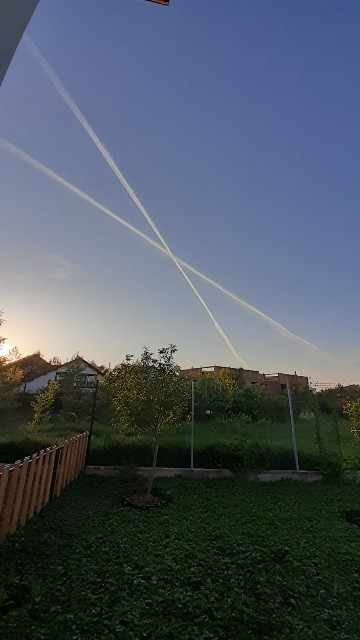
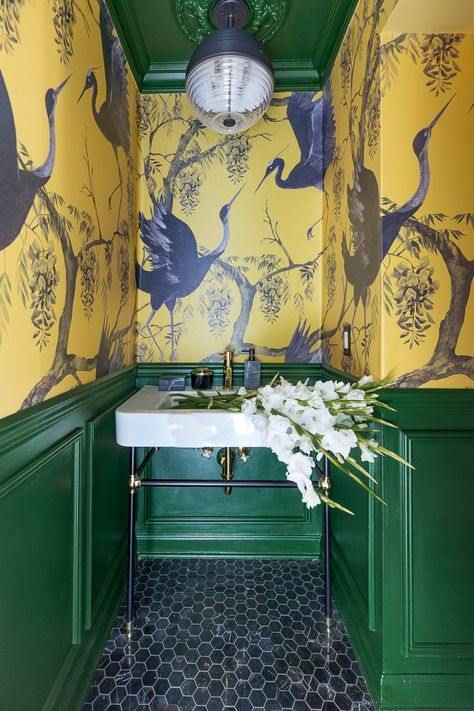

Mă așteptam să fie o noapte grea dar să nu dorm aproape deloc, nu m-am pregătit. Emoțional măcar că fizic, ce să-i mai cer corpului ăstuia deja tracasat?! Așa că dimineața aia care de obicei mă prindea în pat azi m-a prins deja în bucătărie.

Am luat pastile. Multe. Simt o mare nevoie de cocktail de fructe, de papa bun, dacă s-ar putea livrate direct în sânge, să-mi spăl chimicul ăla înghițit în disperare de cauză. Și multă apă. 

Eu am un prag ridicat de toleranță la durere, probabil că migrenele pe care le-am îndurat, pe picioare, ani întregi, mi-au creat o oarecare anduranță. Nu mă dărâmă o durerică, deja p-astea mai mici nici nu le mai numesc dureri, ci stânjeneli. Frate, dar ce-am experimentat azi-noapte a fost horror. Una, că a fost un cumul și două, că noaptea întotdeauna totul pare exacerbat.

\*\*\*

Nicicând nu m-am bucurat mai tare că mama s-a dat jos din pat și s-a dus la baie. Nici nu stau să văd dacă se întoarce să se culce la loc, nici nu contează asta acum, vreau să livrez snoothieul, pastilele și papa pentru Sassy înainte să mă scufund eu. Rapid, liniștit, fără întrebări, că nu pot să-mi car nici cuvintele mele d-apăi să mă mai încarc în spațiul ăsta, în care de abia pot să respir, și de ale altuia.

\*\*\*

Am bifat și gata, sunt în living unde nu-mi doresc decât să scap de dureri. Târziu, aseară, am înțeles de ce mă durea capul infernal, mijlocul și burta mă înjunghiau din toate părțile și de ce aveam starea aia de irascibilitate nebună. Pentru că corpul meu a decis el, din varii motive, să tragă chiulul două luni, acum trăiesc durerea aia lunară la puterea a treia. Să fie!

Am adormit, ghemuită, singura poziție care-mi permitea un strop de liniște și cu gândul în minte că pot să duc durerea asta, la stadiul la care e acum. Sunt într-o continuă uimire și respect față de ființa umană și de cât de repede se adaptează la ea la orice. Pe la miezul nopții respiram atât de încetișor să simt mai puțin acut durerea aia înnebunitoare, iar acum, când s-a mai diluat doar o nuanță, îmi zic că hai că p-asta o pot respira. Păi când mi-o trece de tot, că toate trec, ar trebui să dau petrecere!

\*\*\*

M-am trezit la 10, un strop mai ușurată de dureri și un strop mai mult limpede la minte. Normal că nu merge condensarea unei nopți în doar trei ore dar au fost minunate și astea…Omul fericit e ăla care se bucură de ce are și nu se plânge de ce nu are. Dă-le încolo pe celelalte ore, bine că le-am pus în coș si p-astea.

Mulțam omului ăsta bun ca pâinea caldă care este Mr. H, ce a coborât-o el pe coana mare la micul dejun și a și stat cu ea la masă. Încă nu-s capabilă să fiu bipedă așa că stau cuminte, beau ceai și sper să mă ridic din pat cât mai repede.

\*\*\*

Speranța moare ultima și de mai multe ori, cam tot de atâtea ori de câte am încercat eu să mă ridic. Îmi trece prin minte că nu s-a făcut corect împărțirea aia acolo, sus, pe unde s-o fi făcut, când s-a decis ce să ia bărbatul și ce să ducă femeia. Dar mi-aduc aminte și că femeia are parte de ceva atât de mișto ce nu va avea ever bărbatul, pântec creator, și mă simt banal răzbunată. Poate viața viitoare, trag la sorți una de bărbat, că-s tare curioasă.

\*\*\*

Dacă tot sunt la orizontală, hai să mă pun la punct cu organizatoricele, am o grămadă de emailuri necitite, mă bucur tare că greul cel mai greu zic eu c-a trecut, mai bag o fisă și ies pe terasă.

Aerul mișto, verdele și soarele și-au dat mâna și m-au luat și pe mine pe brațele lor. Stau cumincioară pe scaun, tot ghemuită dar e o diferență de la cerul albastru până la verdele smarald față de ce a fost. Mulțam, nu știu cui, că trece!

Pentru că trece, mă gândesc eu că n-ar strica să ud curticica de flori. Nu presupune un efort prea mare și eu, în genere, nu prea bolesc. Nu am nici stare și nici timp. De fapt, nu-mi dau voie. Încă mai sap să dau de rădăcina acestor nepermiteri pe care mi le agăț de gât cu o așa nonșalanță. Am mai scăpat eu din constrângerile ce le purtam salbă și mă consideram "un om bun" dar sunt încă multe, unele pe care nici nu le-am bănuit, așa de spoite în "obicei bun" sunt. 

\*\*\*

Mama a simțit ea că e o zi atipică. Nu, n-a coborât singură la prânz, a trebuit să mă duc să o iau, ocazie cu care am aruncat și cutia goală de bomboane pe care a primit-o și pe care a mâncat-o, ca de obicei, doar ea, dar m-a întrebat dacă mi-e bine. Acum îmi este mult mai bine, mersi de întrebare. 

\*\*\*

Spikylina nu m-a părăsit azi mai deloc. Când am dormit, a dormit lângă mine, cât am stat în pat, a stat lipită de piciorul meu, când am ieșit afară, pe terasă, a stat sub scaun. Îmi face bine blănoasa asta, nesperat de bine. Ne întoarcem una alteia favorile pe care ni le facem. Când i-a fost ei greu, am fost acolo, când mi-e mie, e aici. 

\*\*\*

Să fi fost semnul X de pe cerul dimineții mele semnul că azi îmi e interzisă facerea?

O fi fost, că restul zilei am fost molcuță și bleagă. Dar nu mi-am cerut prea multe, mi-am îngăduit un ritm lent și o mai mare atenție la mine. Până la urmă, nu e nimeni în papucii mei, nu trebe să fac pe brava în fața nimănui și nu trebe să mă rușinez de nimeni când mi-e greu. Nu mă plâng dar nici nu mă mai ascund.

\*\*\*

Am stat pe terasă, în soare, urmărindu-l cu privirea pe domnul meu cum tunde trifoiul, avioanele ce țin în burta lor oameni cu vise și călătorii, pe Spiky care e tot lângă mine, acut atentă și alertă la prezent. Sunt și eu deși parcă n-aș fi la tot prezentul. Aș vrea să dau delete la durere și să fiu într-o burtă de avion.

În prezența asta a mea, am observat o mare reușită personală. Nu știu dacă e temporară, generată de dureri sau s-o fi instalat ea, pe nesimțitelea, în mine. 

De când mă știu, dacă cineva muncește lângă mine, eu nu pot să stau fără să ajut. Sau dacă stau, mă simt prost, mă simt vinovată că stau. E un praf de prostie care vine din mentalitatea de doer, aia în care ai face orice numa' să nu fii nevoită să stai cu tine și să vezi ce balauri îți ies din adâncuri. Well, azi n-am făcut nici una, nici alta. Doar am privit cum dispare trifoiul sub mașina de tuns, cum în urmă rămâne proaspăt de verde și mici roiuri de insecte se prind în vals și plutesc superb în razele unui soare și el molcuț, aproape de plecare, cum mierlele profită și n-au ele compasiune pentru valsuri și boemie ci vor doar să se hrănească, că natura aia bazică, fără poezia pe care o aduce umanul, nu are emoții d-astea și mănâncă, se înmulțește și moare, cu prezență maximă în fiecare clipă, am urmărit reacțiile domnului meu, am privit totul ca pe un tablou viu care mă invita doar să văd, nu să fac. Pentru mine, e o mare cucerire a mea, a unui spațiu din mine care ocupa mult și mă consuma steril. 

\*\*\*

Nu m-a învățat nimeni, copil fiind, cum să mă protejez de energia negativă, de stările altora de dramă, de atacurile la liniștea mea generate de un telefon sau o știre sau o vorbă sau o stare a unei persoane dragi.

Învăț eu acum și, pentru că încă invoc claritatea în aproape fiecare pântec de noapte, începe să mi se lumineze și partea asta. Deși știu de câțiva ani, abia azi am realizat că nu există atacuri din exterior la interiorul meu. Există însă credința asta, culeasă sau prost înțeleasă de prin noua spiritualitate pe care am înghițit-o nemestecată și nefiltrată de propriul meu discernământ. În realitate, nimeni și nimic nu-ți poate face ceva dacă în tine crezi asta, fără pic de îndoială. Dacă în sistemul tău de credințe nu există aia prin care tu poți fi atacată, apăi nu poți fi. Pentru că totul în lumea asta materială e, culmea, energie, inclusiv sistemul meu, cu tot ce sunt eu, e energie, orice bucățică, fie materială, fie imaterială gen credință, e energie cu un nivel de vibrație. Pentru că sunt vizuală și așa am înțeles mereu lucrurile în viața mea, m-am prins că sunt o bibliotecă imensă cu multe rafturi, fiecare cu nivelul de vibrație la care m-am priceput să ajung. Dacă eu am un sertar cu frică, de câte ori îl deschid, în el va fi și se va așeza tot frică, care are aceeași vibrație. Dacă însă în sistemul meu nu există sertar pentru frică, frica va trece pe lângă mine, fără să mă atingă. Pentru că nu are potrivire vibrațională, nu are de ce să se lipească, sunt ca uleiul cu apa. 

Așa că am înțeles acum cum pot "să mă protejez" de atacuri la propria energie din exterior: să elimin breșele din sistemul meu de credințe, să arunc sertarul cu totul, ca să nu mai fiu ca o invitație cu ușa larg deschisă pentru nimeni și nimic. Din nou, îmi confirm, că uit des, cât de puternică și fascinantă e ființa umană. 

\*\*\*

Fără table, duș și masaj, seara e tare faină. Chiar și așa dureroasă. Pentru că sunt stăpână pe timpul meu și mi-l împart cum vreau, nu cum sunt forțată. Deși sunt darnică cu multe, uite că încep să-mi prețuiesc cu adevărat singura resursă importantă și rapid epuizabilă: timpul. O fi și asta una din marile lecții pe care mi le predă demența…

\*\*\*

Închid o zi liniștită, faină în felul ei, cu recunoștință în felul meu pentru:

1. Aducerea aminte că totul e trecător, că nimic nu durează o veșnicie, și promisiunea că, poate, data viitoare încerc să fiu mai stăpână pe mine, chiar și în dureri cumplite.
2. Prezența lui Mr. H în viața mea! Nu cred că trece o zi fără să mă bucur de asta!
3. Realizarea că nu trebe să iau nimic personal. Dacă domnul meu are o stare pentru că e obosit sau îl doare ceva, nu înseamnă că are ceva cu mine, că am eu gumă-n păr. Nu totul este despre mine, oricât de natural înclinată sunt să cred asta!

Clipa mea de frumos:

