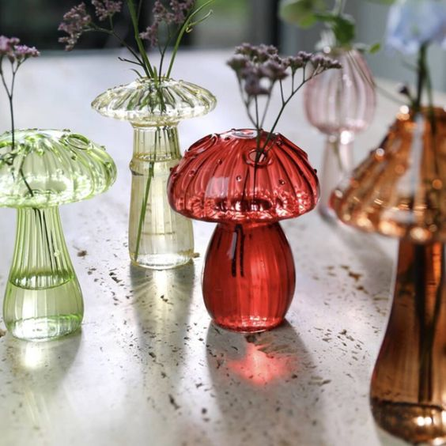

Am dormit doar 5 ore și puțin, sper să fac recuperare la recuperare în curând, ca să nu mă întâlnesc din nou cu prietena mea, durerea de cap sau, și mai rău, colica biliară. 

Surprinzător, nu (re)simt lipsa somnului, încă, și nici nu mi-e greu să mă pun în mișcare, zici că-n orele astea puține dormite, am avut niște spiriduși care au umblat ei pe la încheieturi și le-au uns cu ceva magic. Sunt sprintenă, cât se poate la ora asta cruzișoară, așa că nu stau prea mult pe gânduri, doar lansez un gând de bine și-o intenție și plec în călătoria spre parter. Chichirica vine repede după mine, mică, moale și caldă, o ridic cu o mână și o cobor în brațe, să vadă și ea cum se vede de la înălțime. E toată încordată, îi simt în palme mușchii, e alertă, clar se vede diferit de sus iar ea, spre deosebire de mine, chiar absoarbe tot ce vede. Că, probabil, mufată doar la acum, nici nu are ce altceva să ronțăie. Umanii mai au însă două ventuze cu care se lipesc fie de trecut, fie de viitor, fie țopăie dintr-unul în altul că amețesc și ei și sensul iar energia pentru conectarea la acumul ce li se petrece sub nas scade considerabil. Și cică umanii sunt specia superioară.

\*\*\*

E devreme, e timp pentru toate, așa că-mi încălzesc apa dimineții și o iau cu mine pe terasă, împreună cu mica coconet. E super plăcut afară la ora asta, e în aer un miros de salcâm mângâietor, la un metru și ceva deasupra pământului e o ceață alburie, de vreo juma' de metru în înălțime ce parcă stă în expectativă și nu știe în ce direcție să o apuce: în sus parcă n-are putere, în jos pare că-i respinsă. M-am dus în fundul grădinii să-mi iau bilet pe primul rând la spectacol și a fost genial: de la picioare până pe la piept am simțit un aer călduț iar de unde începea ceața, am avut o senzație de saună umedă dar rece. Mici minuni ale zilei și ale vieții. Spikylina nu-mi înțelege zâmbetul larg pentru că ea nu ajunge la nivelul saunei și oricum e prea preocupată cu câteva mierle ce cutreieră prin trifoi, cred că fetele sunt la schimbul unu, ăla de dimineața. 

Evident că nu puteam să nu-mi arunc ochii, în primul rând, pe bujorașii mei. Sunt acolo, deschiși, le trimit bezele și promit că le acord atenția mea nepartajată după ce termin cu fetele de la etaj.

\*\*\*

Astfel de momente, mici și cotidiene, dar perle pe șiragul vieții, mă umplu de o stare pe care azi am simțit că nu o pot defini. Da, e o stare de bine, una de bucurie, una de trăire dar, mai presus de toate, e o stare de prezență pe care parcă nu-mi vine s-o denumesc sau definesc printr-o trăire. E o stare simplă și curată, fără etichete, fără așteptări, doar cu toate celulele mele mufate la celulele prezentului meu, un schimb intens în dublu sens de energie la fel de simplă și curată. Ce păcat că mă smulg atât de repede din această prezență și-o murdăresc rapid cu gânduri de judecată, de grabă, de bifă, de nemulțumire…

\*\*\*

Primul gând, odată ajunsă în casă, a fost că aș fi vrut să stau mult și bine acolo **dar nu am timpul** de partea mea. Trebe să fac smoothieurile că acuș se trezește mama și pe ea nu cred că o impresionează ceața asta alburie, absolut deloc. 

\*\*\*

Am avut dreptate, mama a început foiala și e doar o chestiune de minute până se va da jos. Sau nu.

Azi nu se dă jos, a deschis ochii și stă și se uită pe pereți. Momentele astea sunt puțin stranii pentru mine. Pesemne sunt așa pentru că eu am, în adânc de suflet, o frică de oamenii cu boala asta. Nu știu de ce, privirile astea pierdute în niște locuri sau lucruri la care eu nu am acces, mă fac să-mi imaginez bălării care mă sperie. Pentru că altfel, aș putea să iau uitatul ăsta al mamei pe pereți doar ca un uitat pe pereți, pe care îl face oricine, din când în când, pierdut în gânduri sau visare cu ochii deschiși. Nu știu de ce, la mama tind să pun eticheta de ciudat. Pe de altă parte, câteodată mi-e atât de greu să privesc pe camera de supraveghere pentru că mi se pare că intru, fără să vreau și fără să știe, într-o intimitate a ființei ei care nu mi-e permisă. Nu mă refer la intimități fizice, astea-s bagatele, ci la astfel de momente când e ea cu ea și doar cu ea, fără televizor, pisică, rebus sau tabletă. În astfel de clipe, aș vrea ca mintea ei, afectată de boală, să aibă afișaj electronic și să ruleze acolo, minimal, ca la aparatele de monitorizare puls, gradul în care ea mai e aici, în realitatea mea sau a plecat departe, în una din multe ei realități.

\*\*\*

Cu o mică strângere de inimă, mă duc la ele cu intenția vădită să mă extrag de acolo cât pot eu de repede. Nu am norocul ăsta, pentru că trebe să fac curat, să aerisesc, să fac conversație cât să văd pe unde e cu spiritul. E bine, cel puțin așa pare, își bea cuminte smoothieul proaspăt, ia pastilele și reușesc să termin și să plec, mai greu decât am sperat. **Ăsta e un timp pe care nu-l controlez și nu-mi aparține.**

\*\*\*

Gata, s-a dus în trecut, îmi iau și eu smoothieul și țuști, afară, în curticica mea de flori.

Coralina se dezvăluie în toată splendoarea lui, Bucky chiar are miros super tare de ciocolată iar Șifonel, pe numele lui științific Chiffon Lemon, și-a deschis sufletul lui de-un galben pe cât de diafan în culoare, pe atât de intens în parfum. Me happy! Cam atât de puțin îmi trebe, nu-s deloc pretențioasă, hahaha!

Șifonel

Dau semne clare și ceilalți dar, deocamdată, ăștia trei sunt vedetele show-ului.

Când vom face și noi aleile în curtea de flori, o să pot să-mi pun peste tot, unde e spațiu liber, trandafirași pitici, roz și galben, salvie rusească mov, mai am niște semincioare date de oameni buni în vremuri trecute, pe care le voi presăra la toamnă ca să am o explozie în primăvara viitoare. Într-adevăr, o grădină crește în timp dar, dacă-ți permiți, crești și tu o dată cu ea.

\*\*\*

Bătrânul meu prieten, vecinul, m-a pândit în curte și, înarmat cu o banană, mă cheamă la gard. Insistența și perseverența lui m-au convins că nu voi reuși vreodată să-l fac să vorbească cu mine fără să-mi dea ceva. Cei din generația lui nu pot concepe să nu răsplătească un serviciu cu ceva palpabil, iar el consideră că eu îi fac un serviciu când îl ascult sau când vorbesc cu el. Azi, pe lângă astea, are nevoie și de trei cuișoare mai mari, așa că îl chem în curte și în garaj, să-și aleagă ce dimensiune are nevoie, că eu le am puse pe căprării. Asta vine din OCD-ul meu cu ordinea. Și din ADHD-ul meu cu dezordinea. Că eu am cel puțin două personalități, una obsedată de curățenie, alta care face dezordine când e pe grabă.

Omul ăsta e o nestemată plină de cunoștințe. Așa că am aflat și secretul păstrării fructelor peste iarnă: ținute în beci, neapărat să aibă umiditate și să nu fie mai puțin de -3 grade. Bun! Am beciul construit peste puțul propriu, nici foarte mare, nici tare mic, numa' bun, are și umiditate de la puț, trebe doar să-l amenajez un strop și sper eu să pot depozita acolo când pomii noștri vor da roade multe. În câțiva ani.

\*\*\*

Domnul meu e liber azi dar are drumuri administrative de făcut, așa că împărțim micul lui dejun cu o stare relaxată, în tihnă, cu împărtășiri și cu conversație liniștită. Poate nu vorbesc cu păcat, parcă așa se zice, dar am un început de zi tare fain.

Urmează micul dejun al mamei, ok în linii mari, pierdută pe alocuri, dar cu zâmbetul la purtător. Din nou, îmi spune cât e de fericită că și-a revenit din "leguma care era", că-i vine chiar să bâzâie pe subiectul ăsta iar eu mă impresionez rapid și mai să bâzâi eu înaintea ei. Ca atunci când nu știu ce să zic, o dau pe glumă, trivializez momentul că nu știu cum să împart bucăți de suflet cu ea. Noi două nu prea am făcut asta și suntem amândouă stângace la împărtășit. Chiar dacă eu mi-am dat multe rânduri de zoaie de pe mine și am aruncat multe spoieli de ochii lumii, mama nu m-a cunoscut cu adevărat nici înainte, nici după iar acum nu mai poate pricepe. Ce ironic…

\*\*\*

Azi e zi de gătit și pentru că nu știu cât mă mai ține butelia de energie, mă apuc chiar după ce terminăm micul ei dejun. Supa cremă de conopidă cu usturoi copt și crutoane, mâncarea scăzută de ardei și vinete coapte, o țâră picantă și chifteluțele de dovlecel cu cartofi, tofu afumat, porumb și mărar, asezonată cu fulgi de drojdie inactivă, usturoi și puțin coriandru, plus deja clasicul suc mi-au consumat o grămadă de timp. **Din timpul ăla pe care l-aș folosi în cu totul alte direcții, dacă aș putea.**

\*\*\*

Ca să nu "pierd" timpul chiar de tot, ascult un filmuleț scurt cu Neale Donald, autorul seriei Convorbiri cu Dumnezeu, și mă lovesc și claritatea și inspirația și revelația. 

Subiectul filmulețului este despre percepția umană și despre gândul primordial care se află în spatele oricărui gând.

În acest Univers în care ne învârtim, tot ce își poate dori cineva există deja creat. Cea mai nebunească fantezie sau dorință pe care o poate avea o ființă umană deja există ca potențial, în momentul prezent, singurul timp care de fapt există, numai că încă nu s-a manifestat. Iar manifestarea sau colapsarea în fizic nu se face pentru că, în mintea umană, există acest gând primordial, sau, cum îl numește Neale, gândul care sponsorizează. Da fapt, frica că nu o să-mi iasă, că nu e pentru mine, că nu pot, și tot așa.

Dacă eu îmi doresc libertate și cer Universului să-mi dea libertatea mult visată, ruga asta a mea vine dintr-o mentalitatea de lipsă, eu recunosc Universului că nu am, că d-aia cer. Dar Universul este doar o oglindă, el doar reflectă înapoi, omul este creatorul. Așa că la orice cerință aș avea către un Dumnezeu care să mă ajute, aș primi doar un "Da, așa e, ai nevoie de libertate". Bine, bine, știu și eu că am nevoie, că d-aia mă dau aici de ceasul morții, dar cum fac să o și am?! Răspunsul e fucking easy: o accesezi. As simple as that. Când în tot sistemul tău, în toată ființa ta, în toate ungherele alea cele mai ascunse și negre, nu mai există fărâmă de îndoială și când poți să simți, la propriu, cum se simte libertatea ca și când ai avea-o deja, atunci ai adus-o din zona de potențial, unde zace posibilitatea în așteptare, în material, în creare. Ca o bibliotecă cu viniluri. Dacă vrei să asculți o piesă de pe un vinil, nu te apuci să trimiți ca disperata rugi către un bărbos acolo sus, ci te duci frumușel la raftul unde e pus vinilul cu piesa pe care o vrei, care așteaptă cuminte să pui mâna pe el și să-i dai play. Că tu știi că vinilul e acolo și pe el e piesa pe care o vrei, nu bâjbâi și nu dai în bobi. Știi. 

Mda, cam asta fac eu și cu timpul, care nu-mi ajunge, și cu libertatea, pe care nu o am. Le-am pus etichete de lipsă-n frunte, strig în patru zări și patru mări că nu le am, ecoul mi se întoarce și-n loc să lucrez acolo, în interior, eu mă lupt cu ecoul. Tipic uman. Mulțam Baby pentru filmuleț și mulțam mie pentru claritate mentală!

\*\*\*

Cu tot cu curățenia de după bucătăreală, și cu Mr. H reîntors de pe drumuri, s-a făcut de prânz și primul care-l revendică e domnul meu. Nu o aduc acum și pe mama, înțeleg că are și el nevoie câteodată să mănânce liniștit, fără conversații goale și fals interesante. Stau cu el, abia îmi trag și eu sufletul și mă pregătesc pentru al doilea prânz, al mamei. Care nu e încântată de nimic, ia 2 guri de ciorbă, 2 de mâncărică, înșfacă 2 covrigi din cei aduși de domnul meu și pleacă înapoi, grăbită de zici că pierde trenul. Ok, asta e, nu toți avem aceleași gusturi, poate ajungem, fără să vrea sau măcar să știe ce e aia, la postul intermitent.

\*\*\*

Apropo de asta, azi am simțit din plin, din multe părți, umanitatea aia mișto și caldă care face din oamenii ce-mi vin mai nou în viață, oameni ce-mi contribuie în viață. 

M-a impresionat teribil, și am întors gând plin de recunoștință, dorința simplă de a împărtăși, de a da mai departe informații să se bucure și să afle și alții, intenția bună de dăruire care e formată din gând, timp și acțiune. Se știu ei cine sunt, mulțam cu inima deschisă!

Până acum ceva ani, urările de ziua mea sau de sărbători, nu mă atingeau decât ca număr. Aveam eu prosteasca impresie că dacă mă urează mulți, sunt importantă. Anii au trecut, eu am plecat din poziția aia unde "eram importantă" și apoi brusc, n-am mai fost, dar între timp mi-a intrat sub piele bunul obicei de a aprecia. Abia atunci am înțeles că o urare de "La mulți ani" sau de "Fie ca…" presupune, în primul rând, să apar ca gând în mintea cuiva, ca omul să-și facă timp și apoi să-mi și trimită 3 vorbe. Iar asta cu timpul le bate la fund pe toate, pentru că, nu-i așa, niciodată nu avem timp.

\*\*\*

Bibilitul în curte, un strop de bricolat, făcutul de nouă licoare magică pentru stropit curtea cu căzut păr din nas, strânsul de rufe și pusul la loc, mi-au umplut toată după-amiaza și mi-au lichidat toată energia pe care o mai aveam.

Mama deja doarme, când i-am dus sucul abia de s-a trezit, și-a luat pastilele și s-a culcat la loc. Trebe să reintroduc tablele pentru că altfel, cu tot rebusul reîntors în mintea ei, de pe la 18 începe o picoteală continuă. Cred și eu că nu doarme bine noaptea, dacă se pune la somn de la ora aia.

\*\*\*

Cu un greieraș drăgălaș ce-mi cântă aproape de terasă, cu Spiky colac lângă mine, am un zâmbet a bucurie cuminte în suflet și sunt recunoscătoare pentru:

1. Telefonul pe care mi l-a dat mama (!) să mă roage să-i duc ceva. Mă uit la ecranul telefonului, văd "mama" și mintea mea nu face conexiunea. Mă uit pe cameră, mama, cu foaia scrisă de mine plină de instrucțiunile pentru telefon în mână, mă sună! WOW! 
2. Jumătatea de oră bună în care Spiky mi-a dormit pe piept de dimineață, atât de aproape de inimă, încât am avut impresia că împărțim amândouă una singură! Stă atât de rar pe mine încât azi aproape că nu am respirat să nu-i vină să plece și eu să nu mă mai bucur de bătutul inimii la unison.
3. Oameni! Cu toții avem povestea noastră, cea mai și cea mai, cu toții avem dureri, cele mai și cele mai, dar mă bucură imens când ne întoarcem la esența noastră, aia neîntinată de povești, dureri, tristeți, și dăruim. Timp, informație, gest.

Frumosul clipei azi:

