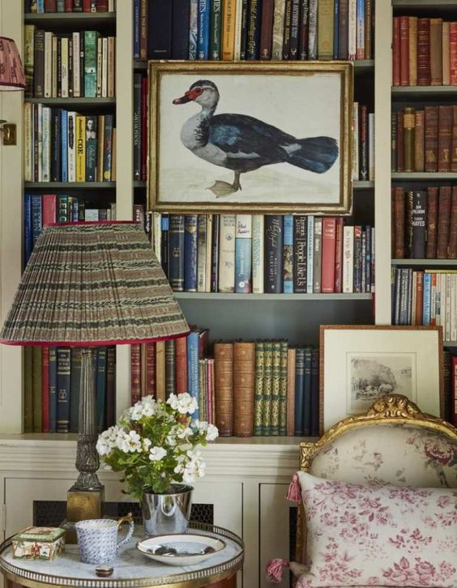

Pe ploaia asta, e momentul de ideal de somn lung și odihnitor. Am adormit instant în cădere către pernă aseară și până la 4 și ceva, nu s-a întrerupt firul deloc. Nu știu care dintre noi a închis ușa dormitorului matrimonial în nasul pisicii, că m-a trezit scărmănatul ei în lemn, voia să vină să facă prezența și să ne dea niște iubire dar ușa aia nu se clintea. M-am urnit mai mult ca să nu-l trezească și pe Mr. H și am introdus-o, într-un "chi" scurt al ei de ceartă, în camera noastră. Da, a venit încărcată în toți porii cu iubire, prin vârful firelor din blăniță iese torcăceala ei și, până ajung din nou la pat, se freacă un strop de picioare, în speranța descărcării din iubirea care o frământă la ceas mic de noapte. O alint un pic, aproape că mi s-a dus somnul dar pentru că se așează liniștită la picioarele mele și vibrăm amândouă în torsul ei mic și constant, ne leagănă și ploaia asta încetișor, am reușit performanța să mai prind o oră de somn bun.

***

Probabil că deja mi s-a setat și bătătorit în carne trezirea de foarte de dimineață, că nici azi n-am ratat-o, deși, în zgomotul îmbietor al picăturilor de ploaie, poate mai mergea. N-a mai fost să fie, racolez un pui mic de amfibie, cum o alintă domnul meu pe Spiky, și plecăm împăcate spre bucătărie.

Îmi simt palmele ca două lopeți, sunt umflate și mi-e greu să îndoi degetele. Așa pățesc de la efort mult și constant făcut cu mâinile. Dar știu, că după câteva minute fie de exerciții, fie de altă muncă, încep să le simt întâi greble și apoi revin la statutul lor normal de palme. Așa că-mi beau apa cu lopețile, curăț fructele cu greblele și termin de spălat și făcut curat cu palmele.

***

Mama nu mai vrea smoothie că zice că transpiră foarte rău noaptea. Eu știu că așa era și la ea, de ceva ani mi se tot plângea că transpiră abundent noaptea, dar ea nu mai știe și caută vinovați. Este și transpirația asta unul din efectele adverse ale chimio și radio terapiilor prin care a trecut. O să văd diseară dacă-și menține părerea sau dacă și-o mai amintește.

Deschid larg să aerisesc, le dau la amândouă să mănânce, fac curat la baie și acolo mă surprind cât sunt de robotică în tot ce fac. Mi-aduc aminte că cheia succesului în viață este să tragi tot ce vine-n clipă și-mi dau seama că n-am integrat asta total în mine. Da, absorb cu nesaț clipa bună iar p-aia mai puțin bună, o fușteresc și o alerg și-o-mping în trecut cât mai repede posibil, că nu am ce să trag din ea. Oricât de mult aș pune lupa pe clipele astea de făcut curat în baie, singurul lucru bun este că mama e în viață. Atât. În rest, e de rahat. Și la propriu, și la figurat.

***

Plec în timpul meu magic, o țâră amărâtă. O fi de la vremea asta ploioasă, mi s-a lipit pe suflet vreun nor și scutură el acolo lacrimi mărunte.

Și din magic cum ar fi trebuit să fie, a fost banal, am fost plată, fără picătură de chef sau dorință să văd ceva, să aud ceva, să învăț ceva. Pur și simplu, băltesc și, pentru că nu-i de ajuns, mă mai dau târcoale și gândurile alea că pierd timpul aiurea, că ia uite că nu mă bucur, că o să-mi pară rău, tot tacâmul ăla apetisant de negru.

Am mai scrollat pe social media, m-am mai frichinit să o adun pe Spikylina de afară, unde toarnă cu găleata, parcă voiam să se termine o dată timpul ăsta, pentru că nu vreau să fiu singură cu mine. Mă tot dau de după vișin dar adevărul este că nu vreau să mă privesc, să mă pătrund cu privirea și cu analiza, să văd mizeria aia ce se adună spre sus și mă irită pe la margini, așa că prefer să fiu nevoită să fac ceva decât să mă apuc de spălat în interior. N-am chef.

***

Întâi domnul meu, la micul lui dejun și apoi mama, la micul ei dejun, niciunul nu a reușit fie să mă scoată din abis, fie să mă bage mai adânc. Am din nou aceeași senzație de netrăire a vieții mele, de neparticipare în ea. Dar mă prefac că sunt acolo, pe principiul "fake 'til you make it".

***

Nici măcar bujorii mei nu mă ancorează în prezentul ăsta la care aș da skip. Ploaia asta mă oprește să ies în curte, să mă ajut puțin de natură, așa că rămân cu ochii pe geam, jinduind nici eu nu știu la ce. Am doruri și nu știu ce doruri am.

Aș avea treabă de făcut dar nu vreau să fac. Spiky doarme sus, la noi, în mijlocul patului și gândul că aș putea să-i țin companie pornește mic dar mă îmbracă total destul de repede așa că, fie ce-o fi, tai legătura cu exteriorul și mă pun la somn, lângă ea. Prin lăbuță ei în mâna mea, mi-a transferat torcăceala ei mică și monotonă și am adormit acolo, ghemuită și mică și eu, să plec în alte lumi, unde poate mi-oi găsi mai bine locul, că asta în care mă mișc azi nu mă cuprinde fără să-mi taie din aripi.

***

Nu știu ce m-a trezit o oră mai târziu. Știu doar că la apelul de simțire, s-a înființat același sentiment straniu de neaparținere. Ok, mă culc la loc, mai încercăm o dată, poate e cu noroc la numere cu soț. Oricât m-am căznit, oricât m-am sucit, nu s-a mai lipit niciun somn, cred că l-a luat Chichirica pe tot, că doarme pe spate, cu labele în sus, e o bucurie să o vezi așa. Ei, poate asta mică e solul Universului, poate a "plantat-o" aici și acum, să mă ajute cu o mică-mică bucurie vizuală. Da, percep că mă bucur, o mângâi pe burtică și rămân în pat, să mă lălăi. Dau drumul la televizor, nu mă atrage nimic, de fapt nu mă pot concentra la nimic, dau drumul la net pe telefon, mai caut ceva mood design, care știu că mă încântă mereu, vreau cu disperare să mă scutur de starea asta uleioasă dar nici măcar privitul la stările altor oameni, transpuse în designul interior, nu mă ajută azi. Ce naiba am?!

***

Cobor fix când domnul meu se pregătea de prânz. Hai că mă lipesc și eu și poate momentele mele cu el o să fie antidotul pentru bălteala asta de azi. Îi povestesc că am dormit o oră, se bucură pentru mine și, în timp ce vorbesc, realizez că azi nu scap de table și că mai am doar vreo două ore la dispoziție. Din senin, sau poate din preaplinul strâns peste zi în lacrimalele saturate, au început să curgă. Lacrimi și mici și mari, mi s-au bulucit atât de mult în ochi, că pentru o miime de secundă am avut senzația că mă înec, ăsta e hubloul corabiei care se umple rapid de apă și ne ducem amândouă la fund.

Știu și eu cum e când cineva drag ție se plânge sau suferă. Ai în mânecă două variante: fie te irită și încerci să-l aduci cu picioarele pe pământ la o realitate care "nu e chiar așa", fie nu știi cum să-l consolezi și, din nou, îi pui în ochi și-n vedere că viața nu e cum o vede acum și că va trece. Ar mai fi și a treia, dar aia trebe să vină dintr-o delicatețe sufletească și, fie că vrem sau nu, fie că ne place sau nu, nu o avem la îndemână mulți dintre noi.

Mr. H îmi spune să nu fiu așa, că totuși am apucat să dorm o oră.

Wtf, așa, și?! Și ora asta, firimiturile astea pe care le elogiez atâta ar trebui să-mi oprească elanul inimii de a dori mai mult? Sunt tânără, la naiba, și-mi trăiesc viața în îmbucături de timp între smoothie, mic dejun, prânz și table sau duș, plus cireșele de pe tort curățenie, făcut mâncare sau treabă în curte. Cum pot astea să potolească setea mea?! Păi nu pot! Simt asta cu tot ce sunt! De ce să mă limitez la a trăi mic când am la dispoziție întreg universul?! Cum să-mi înfrânez eu nebunia asta avidă a mea de a experimenta?!

Am plecat din bucătărie pentru că mi-era că s-apucă nebunele astea de lacrimi să urle ele câte gânduri vin în capul meu. Și câte emoții amestecate în inima mea.

Azi nu mai vreau. Nu mai vreau să am responsabilitatea asta. Nu mai vreau să trăiesc franjurat și franjurată. Nu mai vreau să stau lipită de o casă, oricât de mult mi-ar fi dragă casa asta. Îmi iubesc mama, în felul meu, atât cât mi-a permis și cât m-a ajutat ea să o iubesc, dar azi nu mai vreau să am grija ei. Nu-mi pasă de gura lumii, absolut deloc, ci doar de vocea aia din mine care mă scuipă cu vină din cap până-n picioare și nu pot să nu văd, clar ca lumina zilei, că singura cu care mă lupt sunt eu.

E o luptă acerbă între mine, aia ce vrea să aibă dreptul să vrea și să și facă, și mine, aia care nu o poate lăsa de izbeliște pe mama. Iar în lupta asta, pare că e cu un pas înainte ultima "mine", și are drept trofeu bucăți zdrelite de suflet al primei "mine". Credeam că mi s-a tocit revolta… Cum să fac eu pace între astea două?!

***

Că poate nu era îndeajuns, mama nu vrea prânz pentru că nu-i place nimic din ce am eu gătit. O întreb ce vrea să mănânce, că mă apuc repede să-i fac, dar ea deja a decis că nu-i e foame și că nu vrea să mănânce. Și când îl ia pe nu în brațe, e stop joc. Oricum n-am nici chef și nici voință să o deturnez de la decizia ei, așa că fac stânga-mprejur și plec rapid. Urc totuși în câteva minute înapoi, să-i duc o banană și o pară, să aibă ceva dacă totuși se decide să mănânce. N-am putut să nu vreau să am grija ei.

***

Afară a ieșit soarele între timp și ies și eu, poate-poate mă ia în brațe natura și mă alintă și mă așează blând în matca vieții mele în care mă zbat ca peștele pe uscat. Da, e bine afară. Dar îmi dau seama că mă forțez, ca vreau cu tot dinadinsul să mă plantez în ziua asta când de fapt nu mă potrivesc cu ea. Totul e o potrivire vibrațională iar eu azi nu mă aliniez deloc cu ce mi se pune pe șine. Am crăcănat atât de mult ecartamentul dintre ele, cu tot felul de lucruri îndesate dar neintegrate, că acum s-a căscat un abis și mă înghite acolo.

***

Urmează tablele, apoi dușul și dacă tot am început ziua mecanic, măcar să nu fac notă discordantă taman la final. N-am reușit să pun bucurie în multe clipe azi, iar în ceasurile după-amiezii am strâns mai multă frustrare decât preconizasem. Chiar dacă mama e fericită că jucăm table, eu nu, nici măcar că-i fac ei bucuria asta nu mă încântă, pentru că prețul pe care-l plătesc mă seacă la buzunarul sufletului. Dar, până m-oi dumiri cum să fac, îl iau pe "asta e" în brațe și defilez insensibilă peste sensibilitatea mea intrinsecă.

***

Mi-am stors creierii să găsesc recunoștința zilei. Deși știu că mâine e o nouă zi, și că o dată cu închisul pleoapelor peste ziua asta, se duce și starea asta lipită de mine, uite că nu vreau sau nu știu cum să mă scutur de ea și-n răbojul vieții mele azi s-a marcat ca o zi tristă. Aș putea să găsesc motive pentru care să mulțumesc Creației dar sunt doar mentale, nu tâșnește din mine șuvoiul ăla mișto și curat ce vine din inimă.

Pot doar să pun un frumos, o stare faină care mi-a mângâiat retina când scrollam prin mood design azi:

