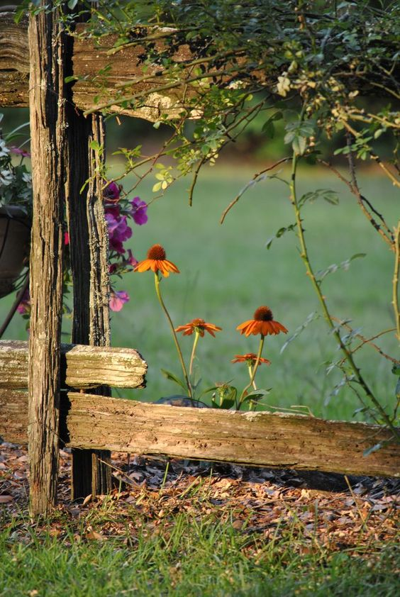

Trezirea de la 5:13 a fost naturală, lină și neașteptat de blândă. Întunericul care încă stăruia m-a învăluit într-o acceptare curată, ce mi-a trecut rapid prin piele și s-a prins în dansul sângelui, astfel că și corpul a preluat blândețea momentului și nu mi s-a împotrivit deloc. E timpul pentru o nouă zi. Atât de simplu mi s-a părut acest gând și atât de normal, că parcă toate trezirile greoaie și butucănoase de până acum au fost doar mofturi. Bun așa!

Nu mă dezic de micul meu ritual intim pe care-l am cu Universul, îi dau tihnă și spațiu, el îmi dă înapoi pace și încredere și plec către bucătărie, senină. Și însoțită de o blănoasă la fel de cuminte ca umana ei.

\*\*\*

Pe drum, realizez că toate simțurile-mi sunt alerte, fără ca eu să fi apăsat vreun buton de activare. Simt duritatea lemnului scărilor sub tălpi, mă întâmpină mirosul suav de salcâm din sufragerie, unde am întins florile să se usuce și e un delir de parfum, deschid larg geamuri în drumul meu să intre aer curat și lipsă de trăiri, de afară, din natura pură, ca să primenească spațiul în care ne vom duce ziua și aud concertele ce se desfășoară în aer liber, dincolo de ziduri. Îmi place această trezire a tot ce sunt și mintea intră în scenă să afle ea de ce sunt acut prezentă. Clipa-i dă una peste nas, sunt prezentă pentru că sunt vie și ăsta e singurul moment în care trăiesc, ăsta e singurul în care pot să fac ceva, să schimb ceva făcut deja, să deznod ce-am pecetluit într-un alt timp, trecut, să simt. Un mulțumesc mic se clădește în inima mea. Am nevoie de guri d-astea de zile bune. Sau poate tocmai d-aia le primesc, să mă prind o dată, că le pot avea just like that. 

\*\*\*

Ritualul din bucătărie se desfășoară ca de obicei, cu diferența că azi nu le fac a bifare, ci imprim prezență și bucăți din mine în ce fac. Un banal smoothie poate fi o poveste mișto, dacă îți deschizi larg ochii a atenție. Iar terasa, îmi oferă, ca de fiecare dată, mici momente de sublim. Lumina începe să cucerească dimineața și nu poți rămâne nemișcat și neatins la magia vieții. N-ai cum, mai ales când ai simțurile pornite, ca niște tentacule ancorate în tot și toate. Mulțam!

\*\*\*

Și mama s-a trezit așa că plec trăgând după mine, în suflet, toată viața asta molcomă să-i duc și ei un strop. La ea e curat, nu are o stare de spirit nici bună dar nici rea, drăgălesc pisica, ce pare a fi singurul nostru numitor comun azi, și o las liniștită, să stea în pat, până când va coborî la micul dejun. Sau până când voi veni să o iau la micul dejun. Nu știu dacă prinde nuanța glumiței mele.

\*\*\*

Timpul meu magic parcă s-a calibrat după trăirea mea de când m-am trezit. Dacă-mi ridic puțin nasul din mișuneala zilnică și privesc așa, de sus, cum mi-e viața, pot să spun că azi a părut orchestrată clipă cu clipă. Parcă un regizor/scenarist bine intenționat a creat cadru cu cadru, a dat coeziune între ele, n-a permis modernismul ăla care fracturează logici și momente să facă parte din scenariu, a înlănțuit totul și a lăsat să curgă natural. Doar așa pot să-mi explic cum am citit fix acum, deși e de aseară, un mesaj de la o doamnă dragă sufletului meu, cu un link către un podcast. Are o oră jumate, e drept, dar sunt acolo niște nume care te fac să apeși play: Liz Gilbert, autoarea "Eat, Pray, Love", Brene Brown, pe care o iubesc pentru mesajele ei despre vulnerabilitate și Glennon Doyle, autoarea "Untamed". Una și una, așa că mă așez confortabil și dau play. Mintea mea și-a tras un scaun și s-a așezat cuminte pe canalul ăsta de comunicație, ascultătoare dar și ascultând cu atenție cuvintele și, mai ales, aroma din spatele lor. O, și a fost aromă! Atât de frumos și atât de cursiv și atât de interesant a povestit Liz Gilbert experiența ultimilor trei ani din viața ei, că mă picura cu aur în urechi vocea ei și cu nestemate în suflet vorbele ei. Are har, că nu degeaba e scriitoare, dar mai are și altceva. Iar pe mine acel altceva m-a ținut lipită o oră jumate și cred că m-ar fi ținut acolo mult și bine dacă nu se termina podcastul. A fost o bucurie. Acum că am descoperit această serie "We can do hard things" a lui Glennon, o să încerc să ascult cât mai mult, când voi avea ferestre de timp. Merită. 

\*\*\*

Plină de bun, amân un strop intenția de introspecție care s-a născut firesc după acest podcast și o aduc pe mama la micul dejun. E ok, mănâncă bine, povestește din nou despre tinerețea ei iar eu mă prind că încep să nu mai știu care era povestea adevărată. Sunt atâtea variante, fiecare din ele conținând elemente reale, că a reușit să mă confuzeze și pe mine. Poate asta o fi și ideea, la nivel subtil, demența asta mă învăluie, mă amețește, mă zăpăcește ca să nu mai vreau eu neapărat să înțeleg, să bag mintea la înaintare și să judec variantele. Că și a le sorta în reale sau broderii, tot o formă de judecată este. Demența mă obligă doar s-o ascult pe mama, doar să fiu acolo, în timpul ei, cu ea sau doar martoră la ce vede ea, fără să aduc vreun bagaj de clarificare cu mintea asta ce vrea să le știe ea pe toate. Din nou, am o senzație puternică că viața e de fapt extrem de simplă. Eu mi-o complic cu gânditul ăsta excesiv.

\*\*\*

Pleacă mama, vine domnul meu și, o dată cu el, vine și căldura aia mișto pe care o am în suflet, în cămăruța aia mare pe care o locuiește el la mine în inimă.

Azi e sărbătoare cică, sunt sfinții Constantin și Elena iar el are 2 sărbătoriți importanți: tatăl și bunica. Și în fiecare an, toată familia, se reunește undeva la țară, la o bârfă și-o bucată. Și noi mergeam, an de an și-mi plac astfel de întâlniri la nebunie. Uite că acum nu pot să merg dar insist să se ducă el. Nu mi se pare corect să nu o facă, nici pentru el, nici pentru ai lui, nici pentru timpul ăsta necruțător cu nimeni. Și cum stăteam eu așa și găseam motive și puneam greutate în ele ca să înțeleagă că eu accept cu toată inima situația, mi-am dat seama că mă năvălesc lacrimi. Că eu nu accept situația, nu aia în care s-ar duce fără mine, ci aia în care eu nu pot să merg. Că mă doare al dracu de tare, că mă taie pe dinăuntru și că mă sufocă revolta interioară. Și-n toată zbaterea asta a mea internă, plus abținerea mea exterioară să nu cadă bulgării de lacrimi și să-i stric omului momentul dimineții, a avut loc din nou o spargere în mine: dar de ce nu poți să mergi? Până acum mama nu a căzut niciodată pe scări. Încă are mintea acasă, nu dă foc la nimic, tot statistic, stă cuminte la ea în cameră, nu sare pe geam, poți să încui ușa la casă, o vezi pe cameră, hai, du-te! Oricâte scuze și contre și nu-uri încercam să găsesc, vocea aia din mine nu s-a lăsat înduplecată. Și bine a făcut!

\*\*\*

Am udat curticica de flori, am pregătit-o pe mama, nu înainte de a întreba dacă vrea să vină și ea cu noi, varianta ideală pentru toată lumea, mai puțin pentru ea, care nu are chef, nu vrea oameni pe care nu-i cunoaște în jurul ei, nu poate sta atâtea ore pe-un scaun. Dar ne împinge să ne ducem noi, că ea stă cumincioară la ea și desface rebus.

Cred că dacă aveam aripi la propriu, n-aș fi zburat să termin treburile mai repede, ca să pot pleca liniștită, știind că i-am lăsat să mănânce și totul e regulamentar. Un elan îmi străbătea tot corpul de parcă nici nu mai simțeam pământul. Doamne, cum ajungi să apreciezi fiecare plecare când nu le mai ai în agendă! 

\*\*\*

Cu sclipiciul în sânge, am savurat fiecare clipă a drumului, deși pe la jumătatea drumului, m-a îmbrățișat prietena mea, durerea de cap. Nici măcar ea, cu toate intensitățile ei, nu a reușit să-mi umbrească ieșirea și bucuria. Spuneam de curând că mi-e dor de căldura umană, azi am bifat și dorul ăsta, l-am mai alinat o țâră, dorința asta a tuturor de a se aduna și a povesti, mi s-a dus direct la inimă și s-a gogoșit acolo. I-am învăluit pe toți și pe fiecare în parte într-o mantie de suflet și l-am pus cu drag în inima mea, într-o fotografie a momentului. Că știu cât suntem de trecători și știu că acum este singurul timp în care trebe să fim. 

\*\*\*

În toată ieșirea asta, singura constantă a fost camera de supraveghere a mamei, care chiar a fost cuminte. Singura deraiere de la "normal" a fost scurta ei ceartă pe care mi-a administrat-o la telefon, că nu mai venim o dată, că am stat plecați atât de mult. Habar n-am ce e la ea mult acum, dar oricum eram pe drumul de întoarcere așa că în juma' de oră eram la ea în cameră, care mă întreba candidă unde am fost și de ce. I-am povestit, am râs, am împrăștiat din sclipiul meu și la ele în cameră, am adus sucul și medicamentele plus mâncarea pentru Sassy și toate au reintrat în normalul pe care-l știa ea și s-a calmat.

Am inchis ușa la ea și am lăsat în spatele ușii un zâmbet calm. E liniștită.

\*\*\*

Ce zi mișto! Mai zic o dată: ce zi mișto! Deci se poate. Încă se poate. Din nou, mi se pare nedrept să aleg doar trei recunoștințe așa că iau ziua cu totul și o pun ofrandă caldă și bună pe canalul ăla prin care comunic eu cu my higher power. Ziua asta a fost un dar. Cum de altfel, ar trebui să văd că-s toate zilele.

Iar clipa mea de frumos este:

