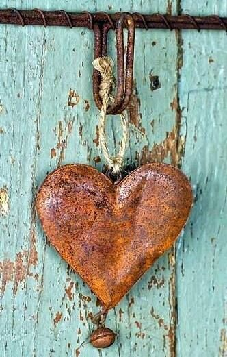

Am sărit ca arsă din pat la zgomotul ușii de la camera mamei. Wow, e lumină deja afară! Din două mișcări sunt la usă la ea, să văd ce vrea. Știe ea că-s pliculețe-n dressing și se duce să ia unul. Sunt buimacă, nu înțeleg de ce e grabă dar îi dau mecanic un pliculeț și închid ușa după ea.

Azi noapte au lătrat cățelele vecinului cu obidă, cu mici pauze, de apă probabil. Din nou, una dintre ele e în călduri și cu asta s-a terminat tot feng shuiul meu. I-am tot scris vecinului că e deranjant și parcă mi-e mie rușine să-i tot scriu. Zău dacă înțeleg de ce nu face ceva cu căldurile astea, fie o duce la montă, fie o sterilizează, altfel e un chin pentru noi toți, dar mai ales pentru cățea. Și mai nașpa e că-s amândouă femele, și o lasă pe una căldurile, o apucă pe ailaltă, e o feerie nocturnă, ce să mai. D-aia m-am și trezit așa târziu, că abia am încropit de-un somn mic de pe la 4 și ceva. 

Spiky e și ea alertă, deși e mult mai liniștită decât mine, știe că-s prin preajmă și o apăr eu, dacă e cazul. Și-a pus cândva încrederea în mine și în genere doarme de rupe patul, o dată ce mi-a înmânat siguranța ei personală. O drăgălesc puțin, mai mult ca să mă adun și eu, să mă mulez pe torsul ei liniștitor și să o iau de la început cu trezirea, că prima dată a fost din categoria smuls. 

N-am prea mult timp că mama iar iese pe ușă, de data asta să mă strige, să știe când vin cu pastilele. Of, doamne, ai milă un pic, lasă-mă un strop să mă limpezesc și vin cu de toate.

\*\*\*

Las liniștea în pat, în dormitor și plec cu agitația deja-n vene. Aproape că i-am dat vânt prințesei pe ușa terasei și m-am apucat de smoothieuri. Am băut apa cu mult aer pe lângă, cu o mână pe robot și în cealaltă cu cana de apă, dacă aș fi putut, aș fi pus de ceai cu piciorul. 

Alo, ce-i cu graba asta?! Ce faci?! Cine te hingherește așa?! Băi, stai, că nu mă aleargă nimeni! Dacă vrea să coboare că nu mai are răbdare, sunt aici jos și le fac, cum pot. O dată ce aproape că am rostit cu vocea tare "trage frâna, că nu moare nimeni!", am simțit la propriu cum mă dezumflu și ies de sub presiunea tâmpită sub care m-am pus, ajutată de graba mamei, care are probleme și cu timpul și cu dorințele. Dar eu n-am, așa că, din nou, încerc să dau un reset și să o iau de la început. 

Mi-am băut restul de apă cât mai conștient posibil, am terminat rutina dimineții și am pornit către mama, ca și în celelalte zile, ignorând complet dezorganizarea și agitația de la primele clipe. 

\*\*\*

Mama e senină, n-are nicio problemă, doar eu mă dădeam de ceasul morții jos să le fac cât mai repede. Foarte bine, mai fă-mi din astea, că poate mă prind și eu o dată cum stă treaba și învăț că dorința ei nu e comandă arzătoare și instantă pentru mine. Știu de unde-mi vine asta, de la people pleaser, din dorința mea de a fi pe placul tuturor și a-i servi pe toți, no matter what. Mda, dezbrăcatul ăsta de zoaie se face zilnic, nu merge cu bifat o dată și gata. Am bătătorit calea asta ani de zile, zoaiele alea sunt cruste vechi, nu se înmoaie cu una, cu două.

Mi-aduc aminte ca și cum a fost ieri, prima dată când am îndrăznit să spun "nu!", la o cerință din exterior. Nu numai că am șocat audiența, dar m-am șocat și pe mine. Momentul când a ieșit nu-ul din gura mea, a fost dublat de clipit des din ochi, de ziceai că am strigat, în gura mare, cel mai rușinos secret pe care îl poate avea un om în viața lui. N-am știut ce să fac cu corpul meu și n-am știut nici cum să gestionez șocul dublu. Dar știu că pe măsură ce interlocutorul insista, cu vorbe meșteșugite și cu manipulare emoțională, m-am înfipt bine pe picioare și am transmis hotărârea nestrămutată, inclusiv prin body language. Niciodată, până la momentul ăla, nu mă simțisem puternică. Niciodată! Dar ăla a fost momentul meu de glorie, în care mi-am luat puterea înapoi. De fapt, am început să o iau înapoi, pentru că, deși momentul a fost îmbătător, nu mereu mi-a ieșit după aia. Și acum mai am rateuri dar mult mai puține. Și nu numai că spun nu, dar am învățat să-mi ofer ajutorul, doar dacă mi se cere. Tot oamenii m-au învățat asta, pentru că eu, natural, nu sunt așa. Dar dacă nu-ți setezi limite sănătoase, te faci praf și te risipești în patru colțuri.

\*\*\*

Mult mai molcomită, m-am întors în timpul meu, doar al meu, să-mi sorb cu multă plăcere porția mea de smoothie. Vreau să gogoșesc clipele astea bine-bine, că mi-am pus în listuța zilei multe to do-uri și nu știu când mă mai întâlnesc cu timp al meu doar al meu.

Am tras de smoothie cât am putut ș-apoi m-am apucat de backup-ul scrierilor mele de aici de pe blog, că de ceva timp am mici probleme și n-aș vrea să mă trezesc că nu mai e nimic pe nicăieri. Mi-ar plăcea, peste ani, când se va decanta tumultul, să le recitesc, așa că din când în când nu strică un plan de rezervă. 

Doamne, dar mult am mai scris! Mă mai prinde câte-un pasaj și-l citesc și mă minunez și eu de mine, nu-mi vine să cred că eu sunt aia care a scris. Într-un milion de ani, nu mi-ar fi trecut prin cap că eu, EU, o să scriu vreodată. Și nu doar ici, colo, ci zilnic. Mă felicit pentru perseverență, mă bat pe spate cu încântare pentru scrieri și realizez că mi se termină pauza dimineții. Câteodată mi se pare atât de scurt timpușorul ăsta…

\*\*\*

Ca de obicei, mama stă și mă așteaptă să vin să-i spun să coboare. Mi-e clar că mă așteaptă pentru că văd pe cameră cum începe să se plimbe prin cameră, lasă rebusul sau tableta deoparte, stă pe margine de pat și atât. Mintea ei nu mai are încă un rând pentru "coboară la masă dacă ți-e foame". Nu, mintea ei și cu ea mă așteaptă, iar eu nu pot să nu mă duc.

Aceleași convorbiri, parcă și aceleași cuvinte, iar noutățile mele, oricare ar fi ele, trec pe lângă urechile ei fără să atingă vreo înțelegere. Ori e prea absorbită de ce vrea ea să spună, ori doar ce vrea ea să spună e cel mai important. Așa că mă prind destul de repede că n-are sens și suprim energia investită în efortul inutil. Dar în același timp, îmi dau seama că EU am nevoie de spun noutăți, că EU am nevoie să văd lucruri noi, în mine sau în afara mea, EU am nevoie de suflu proaspăt pentru că altfel risc o semi-tâmpire la propriu. Și așa nu vorbesc mult, cu multă lume, dacă mai vorbesc și aceleași lucruri over and over, nu-i sănătos pentru creierul meu. 

\*\*\*

S-a dus sus cu toate vorbele după ea, eu rămân uitându-mă lung după ea, cu uimirea nouă că nu o cunosc pe femeia asta. E drept, că nici pe mama nu prea am cunoscut-o, s-a închis destul de etanș și n-a lăsat să transpire mai nimic în afară, dar pe femeia asta care stă în casă cu mine, nu pot s-o culeg de nicăieri. Ne-am apropiat târziu în viață, probabil prea târziu pentru un copil ce-a înnodat trăiri aiurea și le-a descărcat grămadă o dată, că au doborât o mamă și-așa dărâmată. 

Când eram mică, am citit într-un oracol, o chestie care mi-a rămas pe veci în cap: pedeapsa celui care iartă mult, cade o singură dată, cu greutatea tuturor iertărilor. În acel oracol, erau scrise tot felul de copilării, mici strofe cu drame din dragoste, inimioare cu litere înăuntru, însă zicerea asta de sus m-a marcat pentru că, instinctiv, am simțit că mi se potrivește. Ce nu știam atunci, și mi-a mai luat vreo 30 de ani să aflu, este că nu trebe să pedepsesc pe nimeni și că trebe să iert totul, că totul ăsta a fost făcut dintr-o roată de destin nefericit oricum. Acum îmi dau seama că decizia copilului care a pedepsit cu toată greutatea e destul de greu de desfăcut, pentru că a avut inocența cumplită a vârstei și durerea pură a abandonului. Dar never say never.

\*\*\*

Ies să termin povestea cu trimmerul, dar socoteala din casă nu se potrivește cu aia de afară. Trimmerul a sucombat total, trebe să-l declar nul și neavenit, clar l-am ars ieri. Îmi pare și nu-mi pare rău, pentru că ieri am îmbătrânit subit în timpul pierdut să tot schimb la fir. Poate că decesul brutal al trimmerului cu fir este un semn că ne trebe unul pe benzină. Oricum ar fi, eu am rămas cu treaba pe jumătate făcută, sau pe jumătate neterminată, depinde în care parte a paharului privesc. Nu-i bai, treabă am să înlocuiesc tunsul așa că mă aventurez să fac curățenia pentru colecția de primăvară în garajul/atelierul meu, locul unde-mi dau frâu liber imaginației și pasiunii pentru lemn și pentru bricolat. Câte trențe se adună, dacă nu ești atent. 

Nu ascult niciun podcast și niciun video nu rulez pentru că stau ciulită și atentă la telefon: Maya noastră face azi vestitul CT abdominal cu angiografie și este un hop mare și pentru ea, și pentru noi. Toate rasele de câini brahicefalici, cum este și French Bulldogul, sunt tare sensibile la anestezie. Evident că semnezi o mie de hârtii că ești de acord, că știi că se poate întâmpla orice, dar cu fiecare semnătură parcă ți se pune și câte-o piatră pe inimă. Până semnezi toate cele, deja ești copleșit. Iar copila mea, care se ocupă acum de astea, e oricum copleșită deja de viața plină cu care s-a trezit dintr-odată. Iar eu sunt neputiincioasă de la distanță dar știu, în mine, că va fi bine. A mai trecut printr-o anestezie, când am sterilizat-o, și totul a decurs normal. Maya e robustă și e mult prea iubită ca să nu fie ok. 

\*\*\*

Ca mai tot timpul, când mă apuc de curățenie, intru în modulul de introspecție și analiză, sau cum zice domnul meu despre Scorpioni, mă scufund în adâncuri. 

De când exersez prezența în viața mea, după cursul mișto care mi-a dat startul pentru asta, mi-am dezvoltat un simț ce miroase de la o poștă văicăreala și postura de victimă. Și la mine dar și la alții. Sau mai ales la alții, hahaha. La mine încă e o linie blurată între "spun ce trăiesc, pun pe tavă ca cei din jurul meu să știe că trec prin asta și că nu am ceva personal cu ei" și "mă plâng, sau văicăresc, sau dramatizez". Nu m-am prins care e nuanța care face diferența. Eu cred că-s în prima dar câteodată ai mei spun că-s în a doua.

La alții însă, devine foarte interesant să privești. Și pentru că tot vorbeam de putere personală, zici că e un exercițiu colectiv de cedare putere, zici că ni s-a promis punctaj maxim dacă ne cedăm zilnic, de  mai multe ori pe zi, puterea în mâna altora sau a timpului sau a circumstanțelor.

E nevoie de putere, să te întorci la tine, ăla autentic. E singurul drum și trebe să fie pavat cu curaj și cu stoicism la început. Pentru că mulți confundă autenticitatea cu egoismul și, dacă îți mai sunt și apropiați, e și mai greu. 

\*\*\*

Bubuța noastră a ieșit cu bine din procedură, următoarele 24 de ore sunt "critice", cum le place lor să spună, dar va fi bine. 

Iar eu mă opresc din dereticat și aranjat și aruncat și ordonat ca să pun prânzul mamei. Deja e pe margine de pat, așteptând. Draga de ea!

N-am deschis bine ușa și deja e în picioare, cu un zâmbet care-mi confirmă că da, mă aștepta. O întreb dacă îi e foame, un zâmbet larg îmi spune că da și coborâm amândouă la masă.

Eu sunt stângace pentru că am încă proaspătă experiența dimineții, când vorbeam singură, că pentru ea nu conta. Nu știu dacă să încep o conversație sau s-o las pe ea să înceapă ce vrea și de unde vrea. Nu mi-e clar dacă mama sau demența ei au decis să mă surprindă azi că, deși e toată numai un zâmbet, nu are chef de vorbă. Starea asta nu a mai avut-o până acum, e un debut care mă deconcertează și mai mult. Îmi surprind mintea cum caută febrilă subiecte și-mi aud și vocea mică a inimii care-mi zice să trag frâna, din nou. O las pe ea să facă primul pas și o să pornim de acolo, împreună, mai departe. Dar mama termină de mâncat și face pasul, dar nu spre dialog, ci spre camera ei. Un "săru'mana pentru masă", vesel, e cel care rezumă un prânz neobișnuit. Brrr, ce a fost asta?!

E demența asta sau bătrânețea, nu știu dacă e corect să arunc totul în cârca bietei demențe, mereu surprinzătoare. Zici că e un magician care tot scoate iepuri din pălărie și nu se limitează la asta, îi scoate care mai de care mai colorat, să spargă toate tiparele și toate datele pe care le are lumea despre iepuri. Azi mi s-a părut că am fost tare inspirată când am început să scriu. Nu doar că prin scriere, rememorez situația despre care scriu, dar mă duc și în scorbura ei și o cuprind acolo într-o înțelegere nouă. Deși sună ca naiba, mulțam cu recunoștință! Nu pentru demență, dar dacă n-ar fi fost ea în ecuație, nu aș fi fost parte din acest spectacol genial.

\*\*\*

Am puricat toate cotloanele garajului, am aruncat sau reciclat o roabă de lucruri nefolositoare mie și mi-am risipit cam toată energia. Doar două mașini de spălat am reușit să bag azi, că simt că mă scurg. A fost și foarte cald, sunt prăfuită și transpirată, dușul e singurul pe care-l mai bifez pentru ziua asta. Plus sucul și medicamentele mamei, de pliculeț pentru Sassy s-a îngrijit ea deja.

\*\*\*

Nu mă hazardez dacă-mi descriu ziua ca faină și interesantă, e un melanj mișto ăsta, și mă bucur că am putut să-l articulez, dar mai cu seamă, să-l simt așa. Sunt recunoscătoare pentru:

1. Partea din mine care nu mai înghite, pentru că nu mai poate, nicio viteză și nicio agitație, pentru nimeni și pentru nimic! Poate reușesc să o expandez să mă cuprindă cu totul.
2. Viața Bubuței noastre Maya, de care mi-e un dor imens, imens, imens!
3. Spectacolul vieții în care sunt sau viața spectacol care mă trăiește!

Inima mea de frumos:

