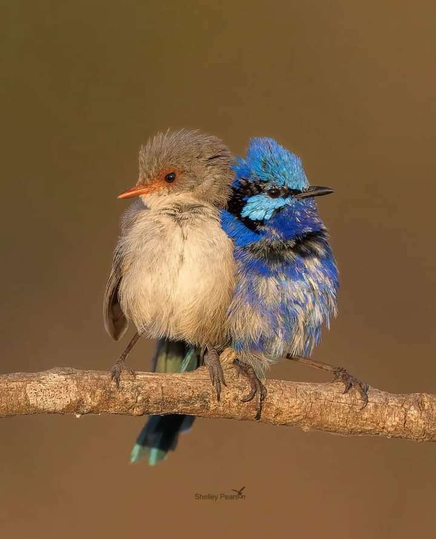

În prea dimineața asta, nici nu știu cum mi-e trezirea. Luate pe repede-nainte, corpul, ca un animal docil, și-a urmat stăpâna iar în minte s-a creat un vid, îi dădea cu virgulă și rula o întrebare în buclă: ce ne aleargă? Hahaha, nu ne aleargă nimeni însă azi trebe să termin ritualul prea-dimineții rapid ca să-mi duc domnul la o stație de autobuz.

Cu resturi de liniște în mine, deja în mișcare, realizez că am dormit bine, din nou. Și tot în mișcare, parcă mi se pune de-un ghiont în inimă când îmi dau seama că iar am pornit ca Agripina și nu m-am învrednicit de câteva clipe de mine cu mine și minele mai mare, Universul, să-mi cânt sau spun sau doar suflu intenția pentru o nouă zi de viață.

De câte ori fac asta, mă ia în brațe gândul inimii din fața cerții minții și-mi spun că e bine că mă prind de asta, în primul rând. Tot e un pas în afara inconștienței cu care mi-am clădit miile de zile până la 40 și un strop de ani. E un mare pas în afara închisorii pe care mi-o construiam singură cu gratii de tristețe, victimizare, manipulare, țigări și mâncare proastă, oboseală multă și stres cronic. Dar, că întotdeauna mintea bagă și-un "dar", la un moment dat, ar fi fain să mai fac încă un pas și să trag mai multă frână, să-mi dau mai mult timp mie, să fiu co-creator lângă inteligența asta imensă care ne circulă de dimineața până seara și de seara până dimineața, neobosită, care nu caută scuze ci doar clipe în care să îndese cât mai multe experiențe și cât mai multă bucurie de viață. O să fac și următorul pas, la momentul potrivit.

***

Deși redus la scară și la intensitate, am inclus momentul de setare a intenției în momentul de sorbit apa caldă. Am simțit că-i o nedreptate și pentru intenție și pentru apă, că le-am făcut praf pe amândouă. Am pus câte-o țâră de atenție și la una și la alta și parcă mi-am văzut mintea cum s-a liniștit pentru bifa de 2 în 1 pe care tocmai ce-am făcut-o. Am trecut într-o altă ligă de jucat cu egoul perfid, pe lângă ăla grosier de gâdilat pe glandă la vreun compliment pe care-l simt sincer, fratele elevat e ăsta care pândește ascuns după mintea mea organizată și eficientă care clasează to do-uri în ritmul încheierii lor, nu trăiește neapărat to do-urile. Dacă e ceva ce văd cu acuratețe, este că mare parte din ziua mea e ocupată cu to do-urile, așa că uite cum bifez o viață dar n-o simt. În goana prea dimineții ăsteia, am un zâmbet a victorie în inimă, mă bucură claritatea asta ce mi-a venit și, o dată ce am articulat-o, o să încep să pun în practică mai des sorbitul de clipă în locul satisfacției lucrului făcut. Yep, is the journey who makes all the difference not the destination.

Pe sistemul de bifă, un picușor mai conștientă dar tot în viteză, am terminat și smoothieurile și ceaiul. Nu mai apuc decât să las ce am de lăsat la mama, să-i spun două vorbe și să plec. O să reiau filmul fix de la momentul ăsta unde l-am lăsat, după ce mă întorc. Ca să nu-i dau idei de coborâre, nu-i spun mamei că plec pentru că oricum mă întorc în câteva minute.

***

Debarc domnul la stație și mă întorc rapid. Atât de rapid că mama pare că nici nu a notat plecarea și revenirea mea. E cuminte, mintea mea a catalogat rapid că "prea cuminte", azi mintea ei e tot pe imașul ăla unde nu-i multă agitație și nici informație. Mai târziu o să fac curățenie peste tot așa că nu mă avânt la prima oră în baia ei, de altfel recunosc că nici nu mă trage ața, nici măcar așa, ca să tai de pe listă treaba.

Pentru că n-am partener de conversație azi, o las pe mama în compania lui Sassy și mă întorc la parter, în timpul meu liber, să văd dacă-mi iese și magic.

***

Pentru că nici în mine nu-i liniște, văd că simt nevoia de ascultat, de văzut, sau de amândouă. Mi se pare tare conștientizarea asta nouă, a doua pe ziua de azi, că interiorul dictează exteriorul și nu vice versa. Când în mine e pace și liniște, simt nevoia ca și în afară să-mi creez același mediu. Când, din contră, sunt agitată sau încântată sau un strop deraiată de la calmul ăla intens, vreau zarvă-n jurul meu.

M-am suit pe aripile unui documentar de călătorie and here I go, Vancouver!

Încep să mă rafinez în documentare și să le prefer pe cele care nu raportează sec lucruri și date ci pe cele care țes povești, care mă învăluie, care-mi dau îndeajuns să-mi ațâțe imaginația, debordantă uneori. E adevărat că o parte din farmec îl face și naratorul și muzica de fundal dar am ajuns să văd că mă atrag unghiuri atipice de filmare, accentul pe mic și "neînsemnat" în locul atracțiilor majore. Cred că am început să lărgesc micurile și să le fac mari iar asta mi se trage de la aplecarea mea, în această perioadă a vieții, asupra micilor bucurii pe care le gogoșesc să-mi cuprindă nesațul de experimentare ce-mi pulsează în vene. Partea cea mai mișto la toată deprinderea asta nouă este că nu ai nici cea mai mică șansă să te plictisești sau să nu vezi ceva fain.

***

Înainte de a o coborî pe mama la micul ei dejun, dau drumul la stropitul roșiilor, să se facă baltă, pentru că azi sunt hotărâtă să pun aracii, să copilesc roșiile, să le leg de araci și să le dau papa bun cu drojdie și pastă de tomate.

Iar mamei i-am trasat deja o sarcină: să-și facă sarmalele pe care mi le cere de ceva timp. I-am desărat varza ca să nu mai am surpriza că ies potroacă de sărate, i-am pregătit tot ce are nevoie, să îi fie la îndemână, numa' să nu mă solicite că trebe să mă mișc cu talent și pricepere, să nu-mi vină soarele puternic pe roșii, că s-a terminat treaba înainte de a începe.

Stimulată de noutatea sarmalelor, mamei nu i-a mai trebuit mic dejun, la insistența mea abia a băut juma' de sticluță de lapte bătut.

***

Cât timp ea și-a pregătit varza, eu mi-am pregătit soluțiile de drojdie cu pastă de tomate, diluate în puțină apă călduță. Fiecare bucată de roșie trebe să primească 1,5 - 2 l de soluție, ca să simtă că e ghiftuită, iar eu am 36 de roșii. 7 borcănele găzduiesc maclavaisul ăsta ce trebe să stea la fermentat vreo 15, 20 minute. Le las înșiruit pe blat și fug afară, să bag aracii. Pe viitor, nu mai iau de bun, fără să chestionez, orice. Habar n-am de ce-mi trebe mie araci de 2 m, când cea mai mare roșie a mea abia are un metru, așa cu indulgență. Frate, cu tot pământul îmbibat de apă, a fost un calvar să înfig aracii lungi. După vreo 10 araci băgați, vreo două ciocane direct în deget, transpirație cât cuprinde, s-a dus naibii tot entuziasmul meu și nu făcusem nicio o treime.

Înfierbântată, la propriu, cu treaba afară, am uitat de mama în bucătărie. Pe la jumate am făcut pauză, cât să beau niște apă și să verific ce face coana mare. Ea desfăcea rebus, ca și cum asta avea de făcut în bucătărie. Pregătise varza dar mai departe era coală albă în mintea ei și a luat rebusul, că-i era la îndemână. O întorc la treabă, delicat, și-i dau carnea în care să-și pună ce e de pus și să se apuce de împachetat sarmalele. E un executant docil, așa că o dată pornită pe șina asta, se duce din inerție. Iar eu mă întorc afară, să termin de bătut aracii ca să pot lega roșiile și să le ud cu minunăția ce s-a umflat cu spume în bolurile din bucătărie.

***

Numa' Universul m-a trimis înăuntru când mama, care mă întrebase de vreo cinci ori ce fac eu acolo, în bolurile alea, tocmai voia să toarne unul în oala cu sarmale. Reținuse ea că e cu pastă de tomate și, deși avea borcănașul cu pastă de tomate lângă restul ingredintelor necesare ei, opta mai cu sârg la unul din castronelele mele. Am oprit-o la timp, n-am mâncat niciodată sarmale cu drojdie, habar n-am dacă nu explodau alea în cuptor de la 100 grame de drojdie, cât conține un bol.

Am lăsat baltă legatul și m-am apucat să diluez fiecare maglavais în câte 10 litri de apă și să torn la roșii. Sarmalele mamei sunt pe foc mic, la fiert, iar ea a rămas în bucătărie, să le păzească și să desfacă rebus.

Am făcut atâtea drumuri între curte și bucătărie, de am amețit, la propriu dar măcar am luat din față și potențial mâinile mamei, bombele cu drojdie. Cine știe ce idei crețe îi mai vin și face praf pereții.

***

Copilitul și legatul, deși minuțioase, au mers mult mai ușor, că nu presupun efort fizic intens. Două ore mi-a luat toată operațiunea dar sunt mândră de mine, nevoie mare. Împart cu mama bucuria, mai bine zis, vreau să împart cu ea dar nu reușesc s-o aduc în emoția mea. E în lumea ei și orice efort de-al meu nu se va solda decât cu fault la mine, dacă găsește o breșă mică pe unde să se infiltreze. Azi poate nu, că sunt atentă la mine și la crăpăturile mele, dar better safe than sorry.

Acum că am terminat afară, o să mă apuc de curățenia din casă. Dar până atunci, vreau și eu un mic dejun, o salată de-a mea crunchy, cu conopidă, brocolli, apio, ardei, roșii, castraveți și ceapă, toate crude, toate suculente. Mă apuc de ea și când să-i pun și-un strop de ulei, ia-l de unde nu-i. Mi-aduc aminte că am deschis jolly-ul unde-l țin, să i-l dau mamei și am lăsat jolly-ul deschis, să-l pună la loc. Lucru pe care nu l-a mai făcut dar zău dacă mă prind unde l-a îndesat. Evident că ea nu mai știe nici că a folosit ulei, d-apăi unde l-a pus. Îl caut prin toate dulapurile, îl caut și-n gunoi, mă duc și-n cămară, nimic. Asta e, nu mai pun ulei. Pun lămâie și un strop de sare. Ia sarea de unde nu-i, plecase și asta cu uleiul, la plimbare. Iau din nou toate dulapurile la control, plus sertare, cu focus pe recipientul de sare, s-a ascuns și asta de zici că-i fata morgana. Renunț și la sare, deși aș putea să desfac o nouă cutie dar deja simt că mă irit și nu vreau.

Mă așez la masă, mama desface rebus în continuare, eu mănânc. Nu înțeleg cum mama poate să-mi perceapă prezența dar nu poate să-mi vadă acțiunile. Extraordinar cum creierul afectat de atrofieri, dezlipește, de neconceput pentru mintea mea, o persoană de acțiunile persoanei. Mama mă reduce, fără să vrea, la un corp inert deși eu numa' inertă nu-s acum. Încerc să-mi văd, cât pot de liniștită, de ronțăit și-mi forțez și eu mintea să nu mai ia în calcul ce face și ce nu face mama, lângă mine. Observ că nu e greu să te rupi, dacă faci un efort. Că la mama e fără efort, ăsta e unul din efectele demenței, sau beneficiile ei, dacă pot să spun asta. Depinde de pe ce scaun privești.

***

Nu faptul că mănânc, sau vorbesc cu ea o aduce în realitatea din bucătărie, ci taman ronțăitul meu, care cică indică cât de cu poftă mănânc. O încurajez și pe ea cu niște salată dar mă refuză vehement.

În momentul ăsta mic de prezență, mă întreabă ceva la un careu, unde nu știe. Pentru că sunt fata mamei mele, și eu știu să desfac careuri d-alea grele, de-ți pun mintea de bigudiuri așa că îi dau răspunsul corect rapid și-mi termin salata. Uimită că am știut, mă întreabă de unde știu dar nu-mi așteaptă răspunsul ci-și dă jos ochelarii, își ia capul în mâini și-mi spune, cu voce mică, de dincolo de palme: "măi Bi, uit așa de repede!" Ultima îmbucătură din salată mi s-a dus cu milioane de noduri. Propoziția asta atât de scurtă condensează în ea toată realitatea pe care o trăim împreună de 7 luni. Modul cum a zis-o a fost strigătul mamei mele dinăuntrul femeii care-o poartă în lumea fizică. Am simțit atât de profund în energie disperarea tăcută, recunoașterea unei realitați dureroase, încât m-a lovit instant în plexul solar, în zona inimii. Inima mea a rezonat puternic cu cealaltă inimă care-i spunea candid și trist, că uită.

I-am pus mâna pe mâini și, pentru o clipă, am descărcat una într-alta emoții: ea frică, eu iubire. Eu i-am simțit emoția, nu știu dacă iubirea mea din acea clipă a învăluit-o în vreun fel.

La fel de brusc cum a venit, a și plecat conștiința și conștiența mamei. Îndeajuns să mă răscolească puțin.

***

O las pe mama cu grija sarmalelor și profit de absența ei din cameră, să primenesc locul.

Ca mai tot timpul când sunt singură cu mine, iar asta se întâmplă destul de des și mult, dacă nu ascult ceva, fac intro-inspecție. Mă mai întreb ce fac, ce mai e nou sub coajă, iau la scuturat și-năuntru, nu numai în afară. Câteodată e cald dialogul ăsta, câteodată aspru dar ușor-ușor încep să-mi devin prietenă. Iar eu îmi iubesc prietenii și aș face orice pentru ei. Mintea mea are nevoie să mă încadreze și pe mine în cutia cu prieteni ca să mă pot întoarce cu drag spre mine. Dacă asta-i trebe ca să pornesc și să mă iubesc, o iau și pe cărarea asta. Am explorat poteci dar niciuna îndeajuns de consistent sau consistentă care să mă ducă la pocalul de aur al iubirii de sine, aia pură, care nu se sperie și nu dă bir cu fugiții când mi-e greu și mă plâng dar și aia rotundă care se dospește fain când mi-e bine și mă umplu de bun.

Încep să simt din ce în ce mai pregnant că identitatea mea e mai importantă pentru ceilalți. Au nevoie de ea să mă pună-ntr-o căprărie: pentru toți sunt femeie, pentru unii prietenă, pentru domnul meu iubită, pentru copila mea mamă iar pentru mama mea, fiică. Toți și fiecare în parte are nevoie de eticheta asta, ce mi-au pus-o mie-n frunte și lor în viață, că-n funcție de ea le e determinat și comportamentul. Fără eticheta asta, nu știm să funcționăm. Nu ne mai reamintim cum e să nu fii limitat de un nume, un gen, un job, un corp, un epitet.

În ultima perioadă, observ o lejeritate-mugur și încep să las deoparte, ca pe niște petale, toate hainele astea cu care m-am îmbrăcat, de bună voie și nesilită de nimeni sau cu care m-au îmbrăcat, nu neapărat de bună voie, alții, și mă întorc la miez, la esență. Ohoo, e tare greu, că o dată ce începi să te dezbraci, devii mai ușurel, și la propriu și la figurat, nu mai ai greutate iar ființa umană care încă doarme, te bagă în sertarul de abracadabriști, nu te mai ia în serios. I've been there, done that. Pe lângă egoul atins, parcă mă sugrumă câteodată și-o revoltă și-o tristețe că unii din jurul meu nu văd sau nu vor să vadă adevărurile atât de simple ale vieții. Nu să le practice, măcar să le vadă. Doar știutul că există un timp pentru fiecare mai domolește dorința mea de lume ideală. Dar, cireașa de pe tort, e singurătatea care se lasă în viața ta când pășești pe-o cărare strâmtă. Nu-i ușor dar nu-i nici dramatic, poate câteodată mă strânge pe la inimă, alteori mă bucură solitudinea că mă forțează să nu mai caut afară ce am deja înăuntru.

***

Cu toată analiza care se desfășoară în subsidiarul meu, focusul a rămas pe mama așa că-i fac camera bec, strălucește și miroase bine și mă duc să văd ce face ea jos. Și bine am făcut că mama a rămas doar în pătrățica de desfăcut rebus iar pătrățica asta e plină până la refuz doar de cuvinte și nu mai e loc și de grija pentru sarmale. Aproape că s-au lipit, am mai pus apă călduță peste ele, îi scot una s-o guste și-mi dau seama că fie că e jos, fie că e la etaj, e fix același lucru. O duc la ea în cameră și-i promit că mă ocup eu de fierberea dragilor ei sarmale. Senină și fără nicio grijă, ca un copiluț, mama acceptă și o depun, ca pe-un bibelou, în apartamentul ei, lângă Sassy, să desfacă în continuare rebusul din care nu și-a scos nasul azi decât când a împachetat sarmalele.

C-un ochi la oala de sarmale și cu mâinile-n curățenia de la etaj, reușesc să le duc pe toate la bun sfârșit și să revoluționez și parterul. Plus vreo trei mașini de rufe, că n-am scăpat de obsesia mea de a spăla totul la 90 grade, la programul cel mai lung. Nu reușesc să scap de scârba asta în ce privește curățenia și nici nu mă mai chinui. Așa simt, așa fac.

***

Feed-ul de youtube mi-a aduce o notificare interesantă: când să iei și când să nu iei ayahuasca?

Am auzit de această plantă medicinală acum câțiva ani, am cochetat cu gândul unei ceremonii, am dat înapoi când am auzit ce rău îți este fizic, am revenit când am înțeles ce bine îți poate servi dacă-i dai și dacă-ți dai voie, așa că azi am vrut doar să ascult o altă perspectivă. A fost una dintre cele mai inspirate alegeri sugerate de youtube lately! Atât de structurată informația și atât de articulate explicațiile nu am mai văzut, citit, ascultat până acum. Cum spunea o tipă de pe meleagurile noastre: "Țuțu, dacă o informația a venit în câmpul tău, pe la urechile tale, înseamnă că ești pregătit să o auzi!" Că noi ne dăm pe după vișin, că stai că mai am nevoie de o țâră de timp să rumeg, stai că parcă n-am înțeles chiar cum și ce trebuia, stai că n-am integrat și tot așa, scuze d-astea fabric și eu o grămadă, cică de fapt, informația ți s-a așezat pe cărare pentru că poți și s-o rumegi, și s-o înțelegi, și s-o integrezi. Doar că nu vrei. Punct.

Am plecat din videoul ăsta cu un gust tare plăcut: e planeta asta un canvas și un loc de joacă splendid. Atâta varietate, atâta frumusețe frumusețe sau urâțenie frumoasă, atâtea impresii, expresii, păreri, gânduri, povești, experiențe, trăiri, atâtea de simțit și de gustat. Poate d-aia ne tot întoarcem, că vrem să sugem cât mai mult din limonada asta care e Terra.

***

În euforia stării mele, generată subtil de spiritul ayahuascăi, m-am lovit de refuzul mamei de a lua prânzul. Abia când i-am adus aminte de sarmale, s-a înduplecat dar chiar și așa, abia a mâncat una. De ceva timp, poftă de prânz funcționează din doi în doi. Azi da, mâine ba. Având în vedere că și mișcarea nu-i prea multă, posibil că e de înțeles. A intrat într-un cerc vicios și voi vorbi cu psihiatrul săptămâna viitoare să văd ce mă sfătuiește. Mama nu a slăbit, parcă nici nu pot spune că s-a îngrășat, doar eu am o grijă pe colț de creier că trebe să mănânce. Eu, care vreau să devin frugivoră. Paradoxală, cum spuneam.

***

Cu satisfacția treburilor terminate dar încă cu energie în instalație, clar de la salata de bunătățuri, mai am două sarcini de finalizat și apoi pot să mă culcușesc și să mă relaxez: dușul mamei și spălatul grăsălanei de Sassy.

Mama deja doarme iar somnul ăsta nu mi-e niciodată aliat când vin să-l stric pentru un spălat. Cu toate astea, cu așternut proaspăt și curat vreau ca și mama să fie îmbăiată și curată, la fel și Sassy.

Mi-a luat 20 de minute să o înduplec și era atât de furioasă că m-ar fi dat afară din cameră dacă ar fi putut. Dar eu sunt stoică, mi-am sigilat orice antenă ar fi putut prinde vreo scamă care să mă doară și insist până o bag la duș. Apa caldă o relaxează, se bucură, mă bucur și eu de bucuria ei sinceră și alte 20 de minute mai târziu e spălată, uscată, îmbrăcată și cocoțată-n pat.

"Ce bine mi-e!" Știam asta dar mă bucur c-o articulează. Nu mai am neapărat nevoie dar e bine s-o aud din când în când. Am spălat-o și pe sor'mea blănoasă, am șters-o bine-bine în aoleli fantastice iar tabloul binecunoscut s-antregit: mama, în pat, cu zâmbet larg și pe chip și-n inimă, cu Sassy lângă ea, încă un strop supărată pe mine pentru bălăceala forțată ce i-am administrat-o cu simț de răspundere. Asta-i viața când devii grasă și neputiincioasă! i-am întors-o și eu și-am plecat cu râsul meu împletit în râsul mamei.

***

Mulțam, zi faină! Și mulțam și pentru:

1. Claritatea mentală super de azi!
2. Clipele mele, mici dar intense, de suflet, cu sufletul mamei mele!
3. Viața mea în această perioadă de timp a Terrei!

Iar clipa de frumos este:

