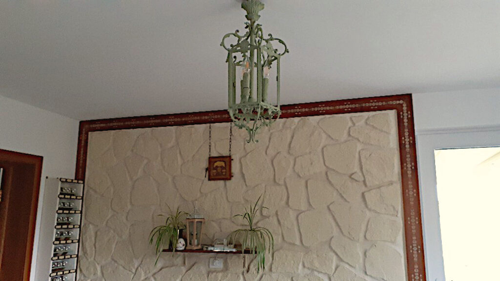

Unii au alarme care-i trezesc, alții au ceas cu cuc iar eu am cucul în carne și oase! Antrenatul ăsta de mușchi al atenției distributive pare că s-a instalat ca program în mine că astăzi cântatul cucului a pătruns prin somn și m-a deschis către noi experiențe ce mă așteaptă, să le accesez, în această nouă zi. 

În prea dimineața asta, abordarea care-mi dezmiardă și oasele și mușchii și mintea din amorțeala plecării de peste noapte, este una curioasă. Chiar sunt curioasă ce-mi oferă ziua de azi. Cum nu există nicio clipă ca alta, curiozitatea asta dă la o parte grija pentru viitor și amintirea unui trecut. Curiozitatea e sămânța născută de prezență. Ca o șopârlă la soare, mă las să curg într-o relaxare maximă a corpului, dublată de o atenție pe senzațiile care-mi umplu carnea. Atenția pe simțuri mă fac să fiu prezentă, eu încep să cred că funcția primordială pentru care ne-au fost date aceste unelte este să ne folosim de ele și să ne înfigem puternic în acum. În momentul în care îmi cercetez corpul, să văd dacă apare ceva pe vreundeva, nu sunt decât acolo, în corp, să simt. Că mă împrăștii repede și mă sui pe aripi de gânduri ce mă duc departe, înapoi sau înainte, numa' nu aici și nu acum, știu și văd, dar mă iau bucățică cu bucățică așa cum sunt și upgradez pe unde pot și pe unde se lipește.

\*\*\*

Sunt bine. Cu propoziția asta în gând și cu starea asta în corp, mă pornesc voioasă. E o percepție inocentă și simplă, fără înflorituri și fără promisiuni. ACUM sunt bine.

Atât de bine, că m-am mișcat cu talent și cu eleganță de felină de-am păcălit vigilența felinei adevărate, ce nu m-a simțit când am părăsit camera. I-am lăsat cuminciori, în visele lor și-am plecat și eu, tot cumincioară, în prea dimineața mea, plină de liniște și cântec de cuc. Dragul de el e pe vreundeva prin curte și el știe ce propovăduiește-n limba lui, traducerea în limba mea a fost clar una plăcută. Să trăiești!

\*\*\*

Am cules niște stropi de albastru, i-am pus lângă stropii de lămâie și stăpâna lor apa mi-a ceruit interiorul cu imensitate calmă. Nici azi nu-i niciun nor, e o doar o întindere vastă, cât văd cu ochii, de senin. Senzația fizică a fost să trag pe ochi seninul ăsta așa cum aș trage aer pe nas, cu putere, cu aviditate, cu viață și să mi-l împing peste tot pe unde mai există tensiune. Și chiar dacă nu-i tensiune, să-l fac strat protector, bază alcalină, să nu vină vreo situație acidă și să mă corodeze pe acolo pe unde nu mă pot apăra încă.

Hârciog as usual, strâng clipe faine pentru momente negre. N-ar fi rău dacă acțiunea n-ar avea în ea și ideea că VOR FI momente negre. Atât de fin e egoul, atât de perfid strecoară el programul ăla apocaliptic. Normal că vor fi momente negre doar că poate reușesc să stau stâncă-n mijlocul furtunii, o dată, de două ori, de nouă ori, până se instalează cu succes noul program.

\*\*\*

În drumul meu spre etaj, nu pot să nu-mi admir, din nou, casa și să mulțumesc cu toată inima pentru șansa asta ce-am avut-o și fructificat-o. Razele de soare se strecoară ca liane de lumină caldă dinspre biroul lui Mr. H către living, aerul răcoros, cu miros de trifoi ud, intră din plin prin ferestrele deschise larg de la parter, verdele plantelor mi-aduc un stropșor de natură în casă, mi-e drag tot ce văd, de la mobilierul vechi la porțelan la fel de vechi, mă umplu de zâmbet și de recunoștință pentru tot ce am. Nu trebe să ai multe dar ce mișto să ai numa' ce-ți place să privești! 

\*\*\*

Mama își face patul și-am intrat la ea la momentul întinsului de cearșaf. O ajut și o aud cum bombăne pisica, care, în mintea ei, atâta s-a fâțâit în pat că s-a strâns totul în mijloc. 

Incredibil cum agățăm imediat vini de gâtul altora, cât de ușor pasăm găina moartă-n curte la vecin, ne debarasăm de gesturi, acțiuni, lucruri și oameni cu o ușurință câștigată-n mii de ani de neconștiință. Rușinea aia că am făcut cutare gest e atât de imbecilă că ne dezicem atât de brusc de noi de nici nu ne dăm seama. Și ce dacă s-a frichinit ea peste noapte și-a adunat cearșaful mănunchi? Scrie în cartea vieții, aia (ne)predată cu virgulă și punct, că trebe să dormim împăiați, să lăsăm patul țiplă după ce ne trezim? Și ne-a învățat cineva că dacă ratăm țipla, suntem arătați cu degetul și batjocoriți în piață deschisă? Evident că-s întrebări retorice dar adevărul ăla brut, din spate, se aplică tuturor gesturilor, acțiunilor care se ascund sub ego, în dreptul sertarului pe care scrie Rușine. Să-ți asumi gesturile și cuvintele și acțiunile înseamnă curaj. Nu o dată și gata, ci de fiecare dată când ne vine, că ne vine, să ne rușinăm din te miri ce. Să stăm drepți, cu coloana spre infinit, și să ne îmbrățisăm și bucata aia "defectă", că fără ea am fi incompleți, pe bune. Doamne, câte rușini am înghițit eu, câte momente de șurub am avut, când voiam să mă răsucesc să intru în pământ de rușine, de câte ori n-am gemut cu glas, de jenă. Din tâmpenii, evident. Acu' m-am prins că nu-s nici mai proastă (decât cine?) nici mai puțină, nici mai strâmbă, sunt o ființă umană călătoare printr-o viață pentru care n-a primit instrucțiuni și-nvață din mers, experimentând. Cu ce mă ajută să mă rușinez?! Cine vrea să mă judece, e liber s-o facă, el își consumă din energie și-n karma lui se înscrie judecata. 

\*\*\*

Pentru că mama nu s-a schimbat, e încă în cămașa de noapte, mi se pare că-i din ce în ce mai puțină și mai ștearsă. Ca și cum, încă în viață fiind, începe să se risipească puțin câte puțin. C-o fi să se obișnuiască ea, c-o fi să mă obișnuiesc eu, cert este că devine din ce în ce mai mică și mai palidă.

Cât a trecut prin cancere, mama și-a dorit mult să trăiască. Îi simțeam puterea în voință, dincolo de infimele kilograme pe care le mai avea. Așa degradată, nu de una, ci de două cancere, mama n-a vrut să plece, s-a încăpățânat și a ținut cu gura știrbă de marginile vieții până a fost capabilă să urce din nou în barca cu care a navigat mai departe. Uite că 7 ani mai târziu, parcă a capitulat. Învăț din asta cât de important e să-ți ții corpul sănătos dar și mintea pe-acasă. Că funcționeaza la pachet, nu degeaba am venit cu duetul ăsta aici, faultarea unuia sau a alteia duce, invariabil, la suferință. 

\*\*\*

Mi-am împărțit timpul liber în timp pentru udat roșii și timp pentru privit povești cu oameni care și-au cumpărat castele. Roșiile mele au crescut ca Făt Frumos, aproape toate au flori iar 5 din ele au fiecare, câte 4 puiuți de roșiuțe. 

Din păcate, pentru că n-am mai avut arac să-i pun, una s-a rupt sub propria-i greutate. Dar la mine-n curte nu există reziduu. Am studiat metoda coreeană Jadam care, ca tot ce e mișto, e extrem de simplă: peste toate resturile unei culturi se pune o mână de frunze uscate din pădure, de foioase și se pune apă cât să le acopere. Într-un butoi, cu capac ușor înfiletat, să intre aer și să aibă loc putrefacția. Mi se pare genială ideea și trece de logica mea care chestionează (mai) tot ce-mi vine pe cărare: fertilizezi cultura de roșii, de exemplu, folosind lichid d-ăsta putrezit care provine fix de la roșii, întărind generațiile care urmează. Principiul este replica fidelă a mamei natură, care e expertă: frunzele căzute, crengile rupte, fructele neculese și picate cad la picioarele pomului fructifer și, dezintegrându-se, îl hrănesc. Omul însă a reinventat roata și a scos din pălărie chimicalele, care să-l ajute să producă mult, și mai mult, tot mai mult.

\*\*\*

După ce mi-am alintat puiucele de roșii și-am udat ce era nevoie, mi-au mai rămas vreo trei sferturi de oră, doar pentru mine. Le-am investit în povești cu castele și mi s-a întors cu dobândă.

Privind imaginile cu castel, cu grădină, cu resturi de piatră rămase după prăbușirea unei părți a castelului, am simțit cum cresc din mine, ca niște tulpini, bucuria și extazul, împletindu-se de jos, de la tălpi, înfășurându-mi inima și pornind rebele, fericite și libere spre cap. Mi-au țâșnit lacrimi de preaplin. Da, Sadhguru, fericirea vine din și e în mine, am simțit asta visceral azi. Am pus prea mult rahat peste și nu mai lucește dar e acolo, dacă-i dau voie, mă inundă. Superbă trăirea!

\*\*\*

Fabulațiile mamei la micul dejun n-au reușit să mă dezinunde.

Azi s-au scurtcircuitat două circumvoluțiuni și-a ieșit un amestec în care singurul numitor comun era personajul, adică genul masculin. Mama deapănă amintiri despre tatăl ei dar ce povestește este despre tatăl meu, fostul ei soț. Am devenit atentă, curiozitatea cu care mi-am început ziua împingându-mi gândul de judecată și pornirea de nerăbdare cât colo. În mintea ei acum, tatăl ei era un cartofor înrăit și juca toți bani, până-i făcea praf. Dar asta nu era nimic, mai avea și buba umblatului constant după (alte) fuste, că ei, copiii, nici nu apucau să-l vadă pe acasă. Până aici, deși nu cupla cu ce știam eu despre bunicul, nu m-am prins ca ea îi amestecă. De abia în momentul în care a zis ca a murit într-un azil, am înțeles. Tot curiozitatea m-a îndemnat s-o întreb unde, în ce azil? În momentul când am întrerupt firul de care ea se agățase în poveste, s-a oprit brusc, a scuturat din cap, încruntându-se și a zis că nu știe unde, că divorțase deja de el. Nu știu dacă-și mai aducea aminte cu cine a început povestea dar sigur la final, s-a prins că vorbea despre tatăl meu, nu despre tatăl ei. Încep să cred că-n demență nu există combinații luate de câte n, ci paleta e infinită. Nu știu ce generează fulgerele din mintea ei care schimbă poveștile sau schimbă interiorul poveștii dar atunci când o face, rezultatul e neașteptat pentru mine. Omul e o ființă fascinantă, indiferent de cât e de "normal" sau nealiniat la normalul general. 

\*\*\*

Din nou, administrativele mi-au mâncat o grămadă de timp. Nu e timp pierdut, trebe să le fac și p-astea dar e un timp nemagic pentru mine. De câte ori văd câți bani se duc spre utilități, deși eu zic că-s atentă la piață, mă întorc la gândul meu drag de off grid mai cu moț. Un off grid autentic e ăla-n munți sau zone slab populate, în sălbăticie d-aia mișto. Numai că pe mine m-au cooptat ai mei, deocamdată, la fazele cu "nu mai ești chiar ca la 20 de ani!", "dacă e ceva, durează până ajungi la un spital", numa' d-astea motivaționale. Plus că, e drept, nici eu nu m-am hotărât spre care atârnă mai mult balanța: castel, conac, ceva de genul sau căbănuță-n munte. Până una-alta, îmi fac rai din ce am, acum și aici, singurul moment care contează. 

\*\*\*

Pregătirea prânzului pentru noi și apoi pentru mama, e un alt calup de timp sănătos ca durată. Nu neapărat nemagic, că mintea-mi râșnește la foc continuu iar eu oricum nu mă plictisesc ever cu mine, dar sunt zile când fușteresc activitatea asta. E drept că azi n-a fost mare găteală, am mai scos din congelator diverse, să fac loc pentru afinele de pădure ce vor ocupa spațiu, nu glumă. Pe la mijloc de august cel târziu, dacă vom putea, poate dăm o fugă la munte să ne stocăm afine de pădure. Domnul meu zice că s-ar băga și el la afine zilnice. Când ai o demență-n casă și știi cât bine fac afinele pentru creier, parcă nu te mai codești, nu te mai sucești, le accepți și gata.

\*\*\*

S-a desfundat țeava de povești de la mama că au început să curgă potop.

Pentru că în continuare sunt detașată de ea, nu separată, dar parcă nu mai e consumul ăla emoțional intens, pot vedea cu ușurință manifestările pure de ego. În fiecare poveste pe care o aduce aburindă din adâncurile ei, mama adaugă întotdeauna un element prin care ea, parte din poveste, e mai deosebită sau a făcut ceva special. Invariabil mama închide convorbirile cu cele două prietene care o mai caută cu "Transmite tu sărutări la toată lumea care întreabă de mine!" deși nu a fost vorba despre asta în convorbire. Într-un substrat adânc, din toată roca asta ce-a devenit asezând strat după strat, întotdeauna răzbate dorința de a fi văzută și apreciată. În momente ca ăsta, îmi validez mica credință că egoul va muri o dată cu costumul meu de carne dar și încrederea că el, care nu e băiat rău, ci unealtă, poate fi dresat și domolit prin exercițiu continuu. 

\*\*\*

Aș fi vrut să plec la cumpărături dar cele 100 de grade care sunt afară mă topesc și-mi topesc orice dorință, așa că-mi reorientez antena să pescuiesc vreun to do din casă. 

Cum n-am avut timp până acum, am agățat rapid tabloul ce e declarația mea pentru domnul meu. Ideea era să-l pun și mai mult în valoare printr-un fundal închis, verde greu. Zis și făcut.

Pentru că personalitatea mea este, cel puțin, duală, după ce am vopsit un pătrat verde și-am pus tabloul peste, mi s-a părut oribil. Am lăsat așa o perioadă, să văd dacă se decantează, se limpezește și-mi place totuși dar nu, nu-mi place. M-am limpezit eu însă și m-am prins că nu-mi plac marginile alea drepte și perfecte, de-a dreptul rigide. Chiar dacă primul meu instinct e să merg pe calea safe, aia pe care o înțelege toată lumea și nu mă critică ci-mi mângâie orgoliul, cred că adevărata eu, aia care știe cât de perfectă e în imperfecțiune, a ieșit la suprafață și a câștigat.

Marginile astea neregulate sunt așa un contract cu eleganța tabloului că mi se pare genială alăturarea. Love it! Dar, cel mai important, domnului meu îi place maxim, că până la urmă el este destinatarul acestui dar.

Dacă tot m-am pornit, și sunt câteva mici pete pe peretele cu pricina, în jos, hai să dau cu var acolo, să nu strice frumusețea în completitudinea ei. Ei, dacă am dat acolo, mai sunt unele zone prin living unde sunt ceva urme de la Maya mea scumpă. 

Și uite așa am ajuns să dau cu var și-n bucătărie, în zona unde țin fructele că s-a mai scurs și p-acolo o dâră, două.

Gata, am intrat în priză. În bucătărie, am pus candelabru, că eu sunt obsedată de candelabre. Și de porțelanuri, și de lumânări, și de orice vine din adâncul meu de femeie trăită la castel cândva. Pe cel din bucătărie, acum trei ani, l-am vopsit alb, că așa a simțit personalitatea aia din mine că e safe. Mobila de bucătărie albă, tavanul alb, candelabru tot alb, evident. Numa' că azi mi-a  strigat că el nu iese în evidență, că ar merge o nuanță caldă de salvie. Așa că, o oră jumate mai târziu, i-am dat straie noi domnului candelabru și I'm in love!

E fix haina care-i trebuia și mă bucur că s-au înlănțuit lucrurile azi că am bifat o grămadă din câte aveam eu în lista aia de "când oi avea timp".

\*\*\*

În pauza în care m-am dus la mama cu sucul și pastilele, m-am învârtit și m-am lipit de o mică stare aiurea. Mama se culcă tare devreme, aproape invariabil trebe s-o trezesc pentru pastile și suc iar de duș nici nu poate fi vorba. 

Azi am intrat, ea nu m-a simțit și, înainte s-o trezesc, am stat pe fotoliu, încercând să mă conectez la ce e în cameră și la ea. Deși Sassy mă mieuna cu sârg, am reușit să simt o resemnare puternică acolo. Și o greutate în aer, pe lângă căldura asta insuportabilă în care stă mama. Ei, la 100 de grade afară, îi e frig și deși vin să deschid geamuri, să intre aer, cum plec, cum văd pe cameră că le închide. 

N-am putut să țin spațiu în mine prea mult pentru ce am simțit acolo. Melanjul ăsta de energii, dense, parcă mă zdrobeau și n-am avut cohones să stau mai mult, să văd ce e după ce se oprește zdrobirea. Am trezit-o pe mama, năucă și-a luat pastilele cu puțin suc și-am plecat.

Sunt capabilă să văd că aveam în containerul interior stare mișto, de creație, de creator, de bun și fain cu câteva minute în urmă și acum plutește pe deasupra o mâzgă de greu, de trist, de neplăcut. Dacă tot sunt capabilă să văd asta, cu un act de voință care să dubleze prezența, pot să decid: mă opresc cu scârba la suprafață, unde mă îmbibă pâclosul sau mă scufund mai adânc, să trec de el? 

\*\*\*

Am ales să-mi fie bine și mi-a fost. Cu domnul meu și o pisică, un apus și-o liniște colorată de el, m-am ales pe mine. Nu-s egoistă ci doar prezentă să-nțeleg că, dacă nu fac un bine nimănui fiind căzută emoțional, mie chiar îmi fac o gaură în energie asta prețioasă. Iar azi nu am mai fost dispusă s-o fac, inconștient. Mulțam!

\*\*\*

O zi albă, călduță, nici prea-prea, nici foarte-foarte, dar suficientă să mă bucur c-am trăit-o și să-mi trimit recunoștința pentru:

1. Vocalul cuc al prea dimineții mele!
2. Starea mea de prezență de peste zi dublată de claritate mentală înaltă!
3. Culoarea verde, fie intensă, fie salvie!

Clipa mea de frumos este:

https://www.youtube.com/watch?v=FL\_DMuhnisQ
