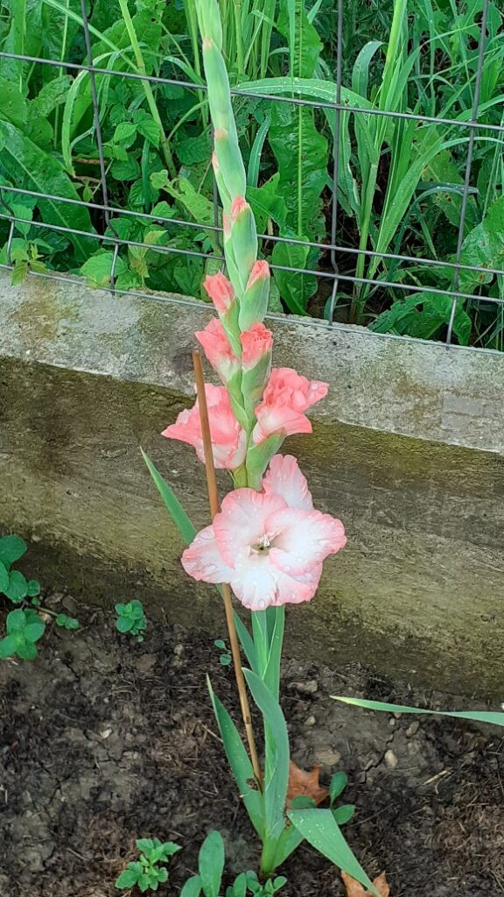

Prea dimineața asta, care a alergat să mă ia în brațe, e îmbrăcată-n straie de ceață așa că îmbrățișarea ei lasă pe mine urme lăptoase și dense. 

De la gât în sus, e totul luminat și limpede, de la gât în jos se lasă cu senzații de mișcări în reluare, că nici măcar n-am încercat să văd cum îmi sunt gesturile, doar simt că nu mi-ar ieși vioaie și sprintene, dintr-o bucată. Nu știu de ce s-a făcut segregarea asta, într-un timp în care n-am avut drept de veto, că dormeam, dar iuțimea minții nu-i capabilă să risipească abureala asta care-mi vrăjește corpul într-o stare de nemișcare.

Ok, am înțeles punctul de vedere al fratelui porc, mai are timp să se dumirească care-i drumul și care-s mișcările către parter, până mă legăn într-un dans extatic de recunoștință cu Universul.

E o antiteză uriașă între mine-emoție și mine-corp. Pleacă cuvintele șuvoi de mulțumire, unul aduce alte zece și fiecare are în spate ceva pentru care e recunoscător. Nu am realizat niciodată pentru câte pot fi umilă Universului, că mi le pune la dispoziție, așa, free of charge. Poate tocmai d-aia n-am știut, că apreciezi doar ce plătești, te doare când pierzi pentru ce ai luptat dar când îți vin, pe tavă, uneori nici nu vezi, dar de cele mai multe ori nu e valoros. Cuvintele din mine, dublate de cadourile pe care Creatorul le-a pus, subtil și delicat, în tot și toate din jurul meu, au fost ștergătoare puternice pentru ochii ăia ce caută doar evidențele și plățile. Deci d-aia de la gât în sus îs agilă-n dimineața asta. Am înțeles acum.

\*\*\*

Nu, fratele porc nu s-a luminat și el între timp, dar îl iau cu binișorul, să nu-l încrețesc de iritare pe ici, pe colo și mă-ndrept, întreagă, cu poșetă stil Spiky, către parter. Mândra asta și-acum mai are câlți prin blăniță, îi simt pe la degete și mă face să zâmbesc. Ea n-are nicio treabă, nu e absolut deloc interesată să strălucească, acum e mânată de foame și de dorința, sau nevoia, de a ieși afară. Când m-o apuca pe mine panica sau întrebarea "cum arăt?!", o să-mi aduc aminte de Spiky și lejeritatea cu care se mișcă ea prin viața ei, total prezentă în moment și cu je m'en fiche-ul genial pentru restul părerilor. 

Cu interesul în cerul cumincior, mi-am fiert apa pentru că dacă panoul de comandă n-a fost atent, corpul s-a lăsat pe tânjeală. Nu-i bai, o combin, că n-am răbdare și vreau să mă limpezesc și prin interiorul de carne, să mă scutur puțin și să mă pornesc, ca de obicei, în zi. Nu vreau lămâia azi, în schimb îmi pun 3 fire de mentă, din curtea mea, bibilită și ciupită de-a-nceput să se facă o mică tufă. Mestecatul frunzei a eliberat mentolul și mi-a dat o mini-explozie pe la papile, îndeajuns să fie un val și-n corp. Mai rumeg o frunză, un val mai mic se leagă de primul și din val, în val, hai că m-am avântat în largul dimineții deja. Bun așa!

\*\*\*

Restul s-a legat natural și m-am dus, destul de clară și precisă-n mișcări, la mama.

E ok, nu dă pe dinafară nici de entuziasm de zi nouă, nici de minte pentru aceeași zi nouă. Sau, e ca-n bancul cu inginerul: știe atât de multe dar stă prost cu exprimarea. Iar e etanșă-n simțiri și-n vorbă, că nu prea mă prind de unde s-o apuc. Deși, în modul cel mai brut(al) de sincer, n-am niciun chef să o apuc. 

În dimineața asta nu numai că nu sunt aproape emoțional de ea, dar sunt atât de departe că parcă nu mă interesează. Nu o cunosc pe femeia asta și acum nu mă pot pune nici în pielea de ființă umană care știe că nu-i separată de altă ființă umană. Pur și simplu, deși știu cum stă treaba, azi n-am chef să mă ocup de partea aia din mine care nu-mi place. Din nou, nu-mi face plăcere să stau cu și lângă ea, așa că orânduiesc ce e de orânduit și plec, fără picătură de vină în vene. E și ăsta un aspect al meu, nu mi-l neg, nu mi-l suprim, ba din contră, îmi dau voie să-l am și să-l simt. N-am chef de ea și atât.

\*\*\*

Timpul meu liber, azi nu magic, deși am avut toate ingredientele la îndemână dar mi-au lipsit dorința și voința, l-am petrecut afară, lângă florile mele.

Gladiola mea surpriză nu e neagră, e tot Purple Velvet, deși aș fi jurat că-i neagră.

A înflorit gladiola-explozie, stacojie cu miez galben, o feerie și ea, se pregătesc să mă bucure și una galben-soare și una roz-bombon.

Mai am trei care-s închise total deocamdată, așa că gladiolele astea faine, chiar au fost cireașa de pe tort din pachetele de la Hornbach. Datorită lor am priceput eu nebunia grădinarilor, care nu pot spune cu mâna pe inimă, detașat, care-i floarea cea mai floare. Eu, cândva, aveam un clasament, încă mai am favorite, dar fiecare floare nouă care mă răsfață cu culoare, formă, miros, mă pune să reevaluez. Plus că, aproape tot ce e în curtea asta, pus de mânuțele mele, mi-a devenit părticică dragă.

\*\*\*

Uite că azi eu nu mă racordez la domnul meu, eu îs lovită-n aripă și puțin pe lângă subiecte. Încerc să mă adun și aduc în bucătărie, în micul dejun al domnului meu dar nu-mi iese. Susțin totuși o părere de conversație și, în mintea mea, deja mă frisonez că trebe s-o aduc pe mama la micul ei dejun. 

Universul, care cred că mă înțelege chiar mai bine decât mă înțeleg eu, amână momentul ăsta strepezitor de stare și o pune pe mama la somn. Că doar ce s-a trezit de două ore și un pic, după vreo 12 ore de somn. Cu un amestec de bulversare și ușurare, îi pregătesc totuși micul dejun, să fie gata.

\*\*\*

Evident că statul ăsta-n așteptare toarnă gaz pe focul stării inflamatoare deja. Și, aprigă cum mi-e felul, când mă pornesc, apăi nu mă sting scurt. 

Mintea mea, aia care-mparte lucrurile în corect și incorect, sortează rapid și-mi fâlfâie, din nou, că chiar nu-i corect așa: toată viața ei, ea și-a văzut de viața ei și eu, cu doi părinți, mi-am văzut singură de viață, simțindu-mă ca o buruiană. Când, spre jumătatea aia de final de viață, mi s-au aranjat și mie cărțile, eu stau în hold bucăți din timpul vieții mele, din timpul ăla în care ziceam că-mi trag și eu un strop de suflet înapoi, și aștept să văd ce poftește doamna pentru micul dejun sau prânz, să se trezească după ce doarme la greu, să-i pilesc copite și să-i spăl mizeriile, să-i suport placiditățile și să fiu veselă ca să o molipsesc și pe ea de la mine și nu să mă molipsesc eu de la ea. Păi e corect? În mama ei de treabă, nu e. Nu e vina mea că viața ei a fost distrusă de-un neom dar am tras la ponoase de pe urma asta de mi s-a acrit și uite că, ea a scăpat de ele, dar mi le-a pasat dement mie. Ce naiba să fac cu ele?!

\*\*\*

A venit, a strâmbat din nas, a mâncat puțin și a urcat la ea. 

Eu, am strâmbat din nervi și minte, clar inima nu s-a băgat peste iureșul din mine, m-am suit în mașină și-am plecat. La poșta din sat, să iau un pachet sosit pentru Mr. H. 

Ooo, dar m-aș fi dus în lume… Am parcat mașina și-am mers pe jos, să scutur pe drum nervii aștia care mă zgârie pe dinăuntru și să încerc să mă conectez la natură sau la oamenii de pe drum sau la orice, numa' să nu mai gândesc. Că acum, sunt în găleata aia mare, mare, de oameni care gândesc, dar doar atât fac. Nu mai fac și pasul mic, suplimentar dar esențial să mă uit și la CE gândesc. Sunt superficială dar știu și de ce mă complac așa: caut o scuză să pot să izbucnesc, probabil că în subsidiarul meu, scris cu litere mici, s-a adunat ceva lavă, și-mi dă ghes să scot. 

Ok, breathe in and let go. 

\*\*\*

Primul lucru pe care l-am făcut, când am deschis ochii către ce e esențial și simplu în viața asta, acum câțiva ani, a fost să-mi fac Vision Board. O femeie diafană, profă de yoga, m-a învățat să fac asta.

Pentru că eram verde la capitolul spiritualitate dar aveam fier în voință și burete în minte, să absorb și să aplic tot ce rezonează cu mine, mi-am făcut tema pentru acasă cu conștiinciozitate: am stat liniștită să simt în mine cam ce-mi doresc eu de la viața mea nouă, mi-am făcut o listă, am lăsat-o să se decanteze, am tăiat de pe listă, am lăsat deoparte, am mai tăiat de pe ea și într-un final, distilarea distilării, creme de la creme, am creat Vision Board-ul. Vizual, cu poze mari și lizibile, pe o bucată mare de carton. Pus în dormitorul nostru, să-mi cadă ochii pe el în fiecare dimineață. Se fac trei ani de când îl am, de când îl văd în fiecare dimineață, timp în care nu mi-a mai venit să șterg nimic, dar nici să adaug.

Aducerea în faptic pentru unele dorințe este in progress, pe altele le-am bifat deja, nesperat de rapid, iar acum a venit momentul dorinței "grădina bio" să devină realitate. Domnul meu mi-a cumpărat cursul de permacultură dorit și de azi, ca să uit rahaturile în care m-am învârtit toată dimineața, m-am apucat de studiu. Că e de studiu, nu glumă. E un univers paralel ăsta cu grădinăritul, un univers spre care e mișto să sari pârleazul când universul în care ești nu te mai bucură sau te stânjenește momentan.

M-am cufundat atât de tare în studiu, cu muzică clasică-n căști, că dacă nu apărea domnul meu, nici nu mă prindeam că se face de prânz. Deja?! urlă iritata din mine. Deja, răspunde calm grădinăreasa.

\*\*\*

Fix bucata aia de prânz care-mi place, n-a fost să fie azi. Domnul meu, super ocupat cu call-uri peste call-uri, uită că viața nu e așa cum te fură valul și a mâncat în birou. Rar momentul anyway. 

Suficient ca eu să încep să "merg în gol", rezervorul și-așa pe sponci parcă nu mă susține pentru prânzul mamei. Împing în mine, ca de atât de multe ori, necheful și urc s-o aduc pe coana mare la masă, care deja așteaptă. E clar că mintea ei nu mai reține obiectul așteptării ci doar acțiunea per se, așa că ea începe frământatul de la pat, la geam, de la pat la baie și de la început. Sunt rare dățile când fie din frichineala asta, fie pe traseele pe care le tot face, găsește pierdut gândul că trebe să coboare la masă. Azi nu l-a nimerit.

Fac greșeala să-i spun, cât eram la ea în cameră ce avem la prânz că simt că mă sufocă răspunsul ei:

\- Altceva nu ai? 

\- Nu, nu am altceva gătit că azi nu am stat iar în cuptor! 

\- Păi nu vreau! 

\- Atunci, nu veni la masă! 

\- Cobor, că găsesc eu ceva p-acolo!

Oricât de întuneric ar fi în  mintea ei, ceva-ul ăla sigur e ceva dulce, creierul ăsta e atât de cerșetor după dulce, de mă înfioară.

Mănâncă până la urmă ce-i dau dar, dacă o supuneam la cazne inimaginare, nu avea sictirul ăsta pe față. Doamne, te rog eu mult, imens, sparge-n mine bula asta de iritare care tot crește și crește și nu mă lăsa să mă vărs pe ea! 

Faptul că ea nu mai e ea funcțională și nici vinovată că nu e funcțională, nu face mai puțin greu faptul în sine, faptul că nu mă pot înțelege cu ea, că nu mă pot baza pe ea, că nu mai există certitudinea că-i zic ceva și face. Cum poți să comunici cu cineva căruia îi arăți ceva negru și-l vede alb sau kaki sau nu-l vede sau uită ce-a văzut sau nu înțelege ce zici? Chiar e greu, greu rău. Mă enervez inutil, îmi gogonesc karma numa' de rahaturi, dar câteodată nu mă pot opri. Mă revărs pentru că oricâtă imaginație și oricâtă prezență și atenție la dedesubturi aș băga în clipă, greul ăsta de smoală de deasupra mi se infiltrează prin crăpături și mă înnegrește pe dinăuntru. Știu că o fac și pentru că mă sperie. Hăul în care spun și ce spun se duce departe, prea departe, nu se lipește de nimic, cade în gol fără niciun ecou în mintea ei, e al naibii de greu. Peste toate astea, mofturile ei, nimic nu-i place, nimic nu miroase bine, nimic nu e suficient de bun, de intens, când i le dau, nu-s bune nici alea, vrea altele, și tot așa, îmi pun un capac care nu îndeasă și acoperă trăirile mele, paralele cu ea iar la un moment dat, capacul începe să danseze sub presiunea de dedesubt. Am împins limitele mele, zi de zi tot mai încolo, și tot nu cuprind ce ea împinge cu demența și inconștiența și mai departe.

\*\*\*

M-am reîntors la permacultură și la muzica clasică și cu atâta disperare m-am agățat de litere și de sunete, că m-am făcut bine, atât cât am putut, să nu mă revărs și asupra lui Mr. H care-i prin zonă. Deși am stat cu un ochi, din când în când, mai răruț, să-mi las pauze de respirat fără iritare, pe camera de supraveghere. Mama, după ce a dormit că era obosită, stă în pat și se uită prin cameră.

Pun șablonul normalității peste statul ăsta în pat o zi întreagă și-mi dă cu eroare. Privitul ăsta tâmp la televizor mă cutremură în mine, că știu că e începutul privitului lung către orice și nevăzutului nimic, înseamnă o plecare atât de adâncă și de îndepărtată că nu va mai putea să găsească drumul înapoi. Degeaba sper eu că dacă-i pun firimituri din viața mea și a ei pe drum, va reveni. Nu o va face și asta, în acest moment, e o certitudine la nivel mondial. Nimeni nu scapă întreg din demență. De fapt, nimeni nu scapă și punct.

\*\*\*

În plăcerea mea de a studia s-a spart cu zgomot infernal, peste Mozart, gândul că trebe să mă duc la pilit de copite. Asta este, pentru mine, o traumă. E ceva atât de oribil că nici nu găsesc cuvinte să exprim. E ceva ce mă lasă crâncen de fără cuvinte dar mă umple de scârbă și oroare. Nu mă dau ridicată de pe scaun și amân momentul până văd că mama, care a uitat de această corvoadă a mea, se pregătește de culcarea cu găinile. Încerc să mă smulg de la layerul ăsta scârbos de vibrație la care m-am mufat și să încerc să urc câteva trepte, să-l găsesc p-ăla de indiferență, să fac ce am de făcut cu mai puțină sau chiar deloc, participare emoțională. Ooo, dar eu aș vrea, dacă se poate, să fac cu zero participare fizică! Se poate? Evident că nu, în realitatea asta la care contribuim cu toții prin gândurile noastre, nu sunt suficienți cei care cred, fără strop de dubiu, că pot face ceva la distanță, cu corpul lor, fără să fie prezenți acolo. 

Mama pare surprinsă de vizita mea, ce să zic, nu mă mai impresionează și asta, e mic copil față de următoarele 20 de minute. Deschid larg geamul, pe ea o deranjează și "frigul" și lumina dar mie nu-mi pasă ce o deranjează pe ea acum, pun apă caldă cu săpun moale în lighean și o pun cu picioarele în el. Îmi pregătesc ustensilele, mănușile, masca și încep calvarul zilelor mele din vara asta. Abia au trecut 4 zile din cele 2 luni!!!! Oh, doamne!

Nepăsarea ei, ca și cum e normal ca eu să fac asta, mă scoate din minți și din matca unde alunecasem, spre liniștire, o țâră mai devreme. Nervii ăștia îi vărs pe pilă care strunjește mai abitir în unghia asta dezgustător de oribilă și mirosul se înalță triumfător, să mă facă knock out. Cu toată masca pe față, îl simt până-n străfunduri și-mi vine rău să vomit. Fac o pauză, mă duc la baia de la noi, mă frec cu obidă pe mâini, o dată, de două, de o mie de ori dac-aș putea și-mi dau cu multă apă rece pe față, și pe creștet. Mă reîntorc, termin procesul și mă apuc de strâns. În spatele meu, o aud cum îmi dictează unde să pun lucrurile la locul lor și-mi vine s-o pun eu la locul ei. Nu știu unde-i ăla, dar acum nu i-l văd lângă mine. Nu răspund, mă fac că n-aud și plec. Nu mai vreau să deschid ușa asta azi.

\*\*\*

M-am frecat pe mâini și pe față și în nări cu săpun de scorțișoară să scoată mirosul ăla de ars din mine. Apa și condimentul ăsta chiar au făcut minuni cu mine așa că, pe făgașul ăla de "mai bine", mi-am udat roșiile că sunt toropite de căldură și m-am lăsat pradă, în pantaloni scurți și maieu, țânțarilor avizi de sânge ce apar în zonă la lăsatul serii. Noi, că așa e satul ăsta mai cu moț, nu avem țânțari normali, noi avem o subspecie de țânțari-varani, mari și sugative de am numai umflături pe tot corpul. Nu-i bai, lasă să scoată din mine sângele otrăvit, să-mi fac sânge nou, care să-mi primenească și inima și ochii, să pot duce mai departe ce mi-a fost dat să duc.

\*\*\*

Închid o zi în care am fost propria mea victimă, în care corpul-durere, ăla de se hrănește flămând din victimizare, suferință, construcții mentale tâmpite, m-a ținut atât de captivă-n elucubrațiile lui că n-am fost în stare să fac un pas în afară. Dar, chiar și în ziua asta maro, sunt recunoscătoare pentru:

1. Venirea unui prunc dorit și iubit în lumea asta!
2. Permacultură și muzica clasică!
3. Scorțișoară!

Clipa mea de let go a fost azi:

https://www.youtube.com/watch?v=IRfQI9Y6EK0&list=PLxA687tYuMWgWbfUsntXDsn5HgOz90ka-&index=8

You can let it go  
You can throw a party full of everyone you know  
And not invite your family, 'cause they never showed you love  
You don't have to be sorry for leaving and growing up!
