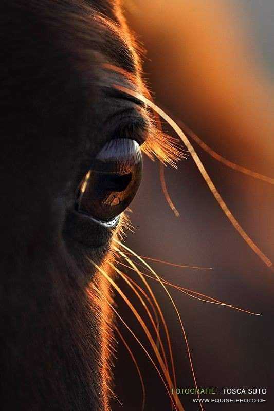

În prea dimineața asta, plumbul s-a încărcat și-n minte, și-n corp, ca să nu mai facă notă discordantă. Mi-am (re)venit în simțuri, sunt trează dar nu-mi vine încă să mă deschid către zi, nici mintea nu mi-e curioasă, dar nici corpul nu mă susține. Stau așa, suspendată-n plumb, cu ochii închiși și încerc ritualul meu nou de mulțumire. Plumbul de mă acaparează s-a întins lipicios și peste simțire și cuvinte că s-au dat toate la fund de greutate și nu mai găsesc ce-mi trebe. Rămân blocată pe la jumătatea unei recunoștințe că nu se mai leaga una de alta și-mi trebe efort de gândire ca să le aliniez. Or, taman în acest mic ritual, nu vreau gând, ci doar trăire. O iau de la început, mă mai înțânez de câteva ori, tot de atâtea ori mă încăpățânez s-o iau de la început și, într-un final glorios, dovedesc curat momentul ăsta special din zorii zilei.

Vreau să întind această mică victorie, trudită, și peste corp și să-l mobilizez și pe el la o verticală și-o deplasare. Plumbul, răzbunător, s-a mutat cu totul în corp și-mi dă cu priponeală. Hait, să vezi că și la corp e cu una, două, trei înțâneli! Pentru că am hotărât în mine pornirea în zi, subit parcă s-au dezlegat lanțurile grele de mă țintuiau în pat și mi-a ieșit plecarea. Cred că și Spiky a trecut prin aceleași examene, mai puțin cele de la mulțumiri că nu cred că le are în program, că de abia se întinde și ar mai sta, ar merge cu mine, încă n-a ales varianta câștigătoare.

Abia pe la jumătatea scărilor, aud cum se aruncă din pat ca un mic obuz și rămân pe loc, să nu continue zgomotul ăsta de duduită până jos. Chiar nu înțeleg, la 2 kile jumate cât o avea, cum de reușește să imprime atâta zgomot pe lăbuțe!

\*\*\*

Parc-am făcut o excursie, așa se simte când am ajuns, în final, în bucătărie. 

Fără privire pe cer sau în grădină, mă apuc de ritualul din bucătărie și observ că mi-am intrat rapid în mișcări și acțiuni. Le-am bifat, fără prea mare prezență, că parcă nu mai e loc și de ea în efortul meu de azi. Dar am luat notă de cerul curat, cât mi-am picurat intenția prin apa caldă și, chiar și doar pentru câteva secunde, am avut parte de liniștea cu care el mă învăluie, calm, mereu.

\*\*\*

Mama s-a trezit și așteaptă. Nici nu s-a dat jos din pat, doar a deschis ochii, și-a pus ochelarii și așteaptă. Habar n-am de unde știu că asta face dar e clar că mi-am dezvoltat un simț care s-a racordat direct la ea, că simt, fără cuvinte, destul de multe dintre așteptările ei. E drept, că și simțul ăsta nou nu îmi e valabil decât când sunt deschisă într-o acceptare, când spumeg de frustrare, nu mai văd și nu mai simt nimic.

M-am echipat cu darurile dimineții pentru ele amândouă și urc. Grăsana mea blănoasă mă întâmpină prin frecatul de picioare, că știe că a venit papa prin mine. Mama e ok dar îmi mut întreaga percepție asupra lui Sassy acum: îi caut cu privirea ochii care mă privesc albastru, gura ei ce mă ceartă scurt și mă aplec să o drăgălesc. Se oprește din certat și, într-o clipă de totală comuniune, a închis ochii și a sorbit mângâierile de la mine, s-a întins pe jos, ca o bilă mare, și s-a lăsat într-o acceptare și o trăire de zmotoceală. Ce mi-a plăcut ruperea asta de ritm! Și, dacă aș fi fost atentă, aș fi văzut că a fost întotdeauna acolo, doar că eu, încrâncenată, cu toți senzorii pe mama și pe stresul din baie, nu mai văd nimic. Bun! Mulțam sor'meo Sassy! I-am trimis prin toți porii un "Te iubesc !"și, încărcată de bun, mă conectez și la mama.

Cel puțin, asta a fost intenția mea. Dar ea s-a lovit într-un zid alb, mare și alb din care au fugit și cuvintele și simțirile mamei. E bine, zice ea, dar asta e tot ce obțin. Îi văd zâmbetul mic care vrea să valideze ce spune ea, în vorbe puține, și caut să văd în limbajul corporal dacă mai e ceva de aflat. Nu, nu mai e, mama e din nou liniară în toate pentru că în spatele minții ei e un imens liniar gol. Încă nu s-a trezit și conștiența în ea, îmi șoptesc în sine ca să nu pierd bunul câștigat de la Sassy. E prea dimineață, mă mint eu frumos.

\*\*\*

Pot să fac un sumar al gladiolelor, surpriza absolută a pachetelor de la Hornbach: am trei fire roz bombon, trei fire Purple Velvet, două fire gemene The Gladiola, un fir portocaliu și un fir galben soare.

La dalii, preferata mea este Burgundy la culoare și stacojia la dimensiune, se pare că cele cu denumire nordică, greu de pronunțat, sunt cele mai mari. 

Nu pot să nu observ măiestria naturii, încă o dată, cum compensează și echilibrează totul. Este știut faptul că o floare colorată intens și superb nu va avea un miros la fel. În schimb, o floare "ștearsă" poate avea cel mai delirant parfum ever. O floare cu tulpină scurtă poate avea inflorescența imensă, prin comparație, pe când una cu tulpină înaltă e fix invers. 

Natura conține cele mai sincere răspunsuri la problemele ființei umane, dacă știm să le vedem, să înțelegem mecanicile simple ce guvernează viața pe această planetă: nu există "x le are pe toate", oricât de mult ne place să ne victimizăm că noi nu suntem așa sau pe dincolo dar că x le-a primit pe toate. Egoul, dragul nostru șmecher, se oprește-n floarea imensă și nu mai vede tulpina scurtă, sau percepe parfumul și e orb la lipsa de culoare. Întotdeauna, natura compensează doar că ne îndreptăm antenele spre alții, în loc să ne pipăim și descoperim pe noi.

Am avut o vreme când mă doream blondă. Și-am fost. Cât să înțeleg că dacă trebuia să fiu blondă, aș fi fost natural. Am avut perioade când aș fi vrut să fiu mai scundă, din aceeași nevoie acută de protecție, mie mi se părea că fetele scunde își găsesc mai repede parteneri și sunt mai giugiulite. Nu mi-am tăiat din picioare, am trăit cu înălțimea ca un handicap, până m-am prins ce atu aveam de fapt. Am vrut ochi albaștri, mi se părea că oamenii cu culori d-astea faine în ochi sunt rupți din mare sau din cer. Până am înțeles că eu aparțin pământului și ochii mei reflectă asta, oricât de fascinată aș fi eu de senin. Iar mental, aș fi vrut să fiu orice, numa' nu cum sunt. Mi-a luat ani de inimă zdrelită, de suferință crâncenă până m-am luminat: sunt exact cum e nevoie să fiu. Toate deraierile astea dureroase au fost să mă aducă back to the basics, la cărarea mea originală, la esența mea unică și bestială. 

Am ieșit afară să simt viața și iaca cum natura m-a adâncit într-o instrospecție de conștientizare. Mulțam, mulțam, mulțam! Și pentru exterior și pentru interior.

\*\*\*

Mi se par din ce în ce mai scurte mic dejunurile cu omul drag inimii mele. Fie când ți-e bine-bine, timpul trece ca nebunul, fie eu, pentru că mă golesc tare în interacțiunile cu mama, vreau mai mult, să mă gogoșesc și să mă căptușesc de cât mai mult.

\*\*\*

Din nou, mama "renunță" la carne iar opțiunile pentru micul ei dejun se îngustează. Îi propun cerealele cu lapte vegan dar ea vrea omletă. O fac cât pot eu de dietetic și, într-o tăcere adâncă și o uitare la fel, trece greu și greoi prin noi micul ei dejun. 

Dacă prin ea trec toate ca printr-un ciur, nu reține nimic, prin mine se mai priponesc unele stări și-mi mai ciupesc din starea de bun pe care, cu sârg de albină, mă văd cum o adun din orice pot. Deși vreau insistent să-mi închid frecvențele cu ea, să nu mă mai prindă în tentacule demența asta libidinoasă, fie nu reușesc, fie nu trebe să reușesc.

Nimic în Universul ăsta, și bănui eu că-n toate Universurile care există, nu este final și închis. Încep să pricep, dar nu cu mintea, că nu există un "gata" și atât. Cred că există miliarde de nuanțe și deschideri și opțiuni în paralel, cred că este o curgere continuă în tot și în toate. E o altă mecanică a vieții care începe să-și facă culcuș în mine, începe să mă locuiască conștient și să-mi dea răspunsul: nu punând stavilă, nu făcându-mă că nu văd demența, voi reuși să depășesc stările, ci trecând prin ea, cu toate zoaiele astea care mă împroașcă, cu lovituri la inimă și frustrare și iritare, cu toate trăite și lăsate să curgă, mă voi vindeca. Dar, în același culcuș din mine, trebe să așez și voința să fac asta.

\*\*\*

Roșiile mele au crescut tare frumos dar m-au copleșit și nu am reușit să le copilesc cum trebe. E o nebunie de frunze și de copili p-acolo că-n unele zone nici nu mai trece aerul. Azi trebe să fac ceva.

Înarmată cu foarfeca și spirtul, s-o dezinfectez când trec de la o plantă la alta, cu părere de rău, am tăiat aproape toți copilii, unii chiar cu fructele deja pe ei. Ca să pot să am niște roșii crescute și gustoase, care să-și atingă întregul lor potențial, trebe să fiu crudă și să tai toți copilii de la hrana pe care o aduce planta. Activitatea, strângătoare de inimă un strop, e consumatoare de timp dar mă felicit, încă o dată, că am pus plasa de umbrire: sub ea, chiar se simte diferența. 

Deși am pornit în zi cu prietena mea de arcadă, durerea, mișcarea în aer liber mi-a mai desprins din cleștii ei prinși în tâmplele mele. Și tocmai când am conștientizat că sunt o țâră mai eliberată, am înțeles adânc un alt adevăr derivat din curgere: când corpul se simte văzut, simțit, înțeles și lăsat să se exprime, în fix acel mugure mic-mic de clipă în care bifez, atentă și prezentă, toate căsuțele astea, începe să aibă loc vindecarea. La propriu. Cu cât mai repede bifez, cu atât mai repede încep să vindec, că repararea nu se întâmplă într-o secundă, cum durerii i-a luat ceva timp să se manifeste-n fizic, așa va lua și vindecării să spele "mizeria", și din fizic. Și corpul și mintea funcționează tot în același principiu de curgere. Dacă îmi neg durerea, dacă mă fac că n-o văd, dacă mă lupt cu ea, dac-o reprim și bag sub preș, se cheamă că pun stavilă, pun barieră între mine și ea, mă opun curgerii, iar tot ce e stagnant, sooner or later, se-mpute. Cred eu că azi e ziua în care-mi servesc, eu, sub diverse nuanțe, o lege fundamentală a Universului: curgerea. Ce mă bucur că scriu! Așa, pot mereu să mă întorc, să citesc și să nu uit, că am beteșugul ăsta-n carne.

\*\*\*

Sar dintr-una în alta, de afară în casă, din făcut mâncare pentru prânz în bibilit curtea de buruieni sau roșiile sau pomișorii. Iar toate astea sunt consumatoare și de timp dar și de energie.

Așa că după prânzul cu domnul meu, mi s-au oprit motoarele și-am intrat în modulul de pauză. E drept că și liniștea lui intrinsecă invită în mine partenera egală de energie, relaxarea, și tare aș fi vrut să pun capul pe umărul lui, sau pe o pernă și să fug portocaliu acolo unde sunt liberă. Realitatea însă mi-aduce în lista de to do, prânzul mamei, care, din nou, așteaptă. Marea asta liniștită din mine începe să se agite pe la țărmuri, să facă mici spume, să mă revolte pe ici, pe colo. Noroc că-i prea proaspătă lecția despre curgere și încerc o vizualizare: cum vine starea asta de iritare, de culoare kaki, ca un val, spre mine, cum mă lovește a dezechilibru, cum mă clatin dar nu cad și cum trece, pe lângă mine. Genial! Hai că mi-a plăcut imaginea, nu mă mai simt neapărat iritată dar n-am niciun chef să mă ridic, să o aduc la masă. Pur și simplu corpul meu nu vrea să facă asta acum și, conform principiului curgerii, îl las să simtă până la ultima picătură tot necheful ăsta. Știu și de ce îl am: nu mai am, în perioada asta pe care o traversez, nicio dorință de a sta cu mama, de a petrece timp cu ea. Nu e nici judecată la mijloc, e ceva mai mult ce simt fără niciun gând atașat simțirii, n-am trimis nimic mental, nicio construcție logică n-a plecat de la minte să închidă în vreun fel emoționalul. Pur și simplu, s-a așezat o distanță între mine și ea și cu fiecare zi ce trece, se adâncește și mai mult. Câteodată mă simt vinovată sau rușinată și vreau să opresc ruperea asta dar e ceva ce se întâmplă în mine și parcă e iremediabil. Nu pot pune frâna deși sunt zile când vreau s-o fac. 

Mai mult de "gura" minții și de ceas mă hotărăsc să o aduc la masă, care se desfășoară tot în liniște. Încerc să întrețin un minim de conversație dar când o aud cu aceleași replici ca alea de dimineață, de ieri, de alaltăieri, de 7 luni every fucking day, parcă mi se închide și acest minim. Las vorbele ei să se ducă în eter, nu mai leg de niciunul vreun cuvânt de-al meu, nu-i mai povestesc nimic și "stau ca muta". Asta era replica ei când eram eu mică, când mă certa sau când ea era veselă, din diverse motive, și eu nu participam cu tot ce eram la veselia ei, stricându-i-o pesemne. Statul ca muta m-a urmărit toată viața mea iar acum mi se pare că mă și definește, pentru că eu chiar stau în muțenie și-mi place. Atunci însă credeam că-s defectă, îmi servea des felul ăsta de descriere iar eu n-aveam încă mintea analitică la purtător, înghițeam cu titlu de "așa e, și nu e cum trebe să fie" tot ce-mi venea de la cei dragi. 

\*\*\*

Încep să cred că, cel puțin parțial, demența mamei a venit "peste mine" ca eu să scot la suprafață poveștile dureroase cu care mi-am umplut cotloanele și oasele sufletului, să le văd cu ochi noi, dacă pot, să le spăl, prin lacrimi câteodată, să le accept ca fiind o parte din mine care m-a crescut, să le integrez, să le pun la loc că doar cu toate sunt eu întreagă dar să nu mai atârne greu, dureros, a handicap emoțional. Credința asta a mea se întărește cu fiecare nouă zi în care, neinvitate și spontane, vin peste mine amintiri pe care nici nu știam că le (mai) am în mine. 

Eu nu am nicio amintire în care mama să-mi fi zis că sunt frumoasă. Sau una în care tata să-mi fi zis. Dar pentru că el a fost tare absent, eu mi-am mutat toate așteptările pe ea și mi le-a demontat piece by piece. 

Sfârșitul clasei a VIII-a. Bal. Prima mea dezlipire conștientă de oameni la care țineam. O petrecere în care fiecare fată se visa cea mai cea, deși toate aveam același model de rochie și același material. Mie mama mi-a dus la croit rochia la o colegă de-a ei, de la poștă, că ieșeam mai ieftin. Am fost la probe iar la cea finală, mama a mers cu mine. Momentul în care a zis că trebuia să fie mai lungă, că n-am picioarele drepte, mi-a fost deviză până la 30 de ani, timp în care n-am putut să port fustă scurtă decât iarna cu cizme înalte, aproape de marginea fustei. Practic, din câteva vorbe, mama mi-a rașchetat dramatic încrederea, și-așa șubredă, în mine și toată tinerețea mea n-am putut să mă bucur de corpul meu și de picioarele mele lungi și zvelte. Ani întregi de aprecieri ulterioare ale altora nu mi-au mai redat "picioarele" înapoi. Acum știu că-s faine, dar nu mă mai interesează. La ce i-au folosit ei picioarele frumoase?!

\*\*\*

Sunt un strop extenuată și de muncă, și de trăiri. Mă sleiesc de puteri amintirile astea și efortul de a le alchimiza în mine ca să nu dea nici în auto-compătimire și nici în neiertare. Când te prinzi că-n toate situațiile de suferință proprie, tu ești singurul numitor comun, ochii ți se încovoaie la privit spre înăuntru, că-n afară, evidența numitorului comun ți-arată către cine să te îndrepți, chiar dacă ți-e mai la îndemână să pui tunul vinovăției pe ăla sau pe ălălalt. 

Înțeleg mental că nici auto-compătimirea și nici neiertarea nu își au sensul, că scopul pentru care poveștile din mine vin buluc în realitatea mea dementă de acum nu este să (mă) plâng ci tocmai să le pun un strat de pace, să le învelesc cu acceptare și să le pun, la loc, la somnul lor, de veci. Emoțional însă, mă zgândare nițeluș și mă doare totuși. Nu-mi neg trăirile astea dar tot amalgamul ăsta de minte, emoție, prezență, voință îmi solicită bateriile. 

\*\*\*

Mi-am terminat treburile, durerea de cap a revenit, mai intensă decât eram pregătită s-o duc, mama s-a culcat deja pentru că nu mai vrea pilit de unghii și cremă, că o "doare", iar eu încerc să mă țin pe o linie de plutire, să îi dau medicamentele și să mă scufund într-un dolce far niente liniștitor.

Le-am bifat pe toate mai puțin partea cu liniștea, că durerea mă răcâie obsedant și nu-mi mai arde chiar că de nimic. Sunt obosită și-mi numesc scurt recunoștințele unei zile bune, zic eu, dar și triste, zic amintirile mele:

1. Asimilarea, măcar ca parte de început, a marii lecții universale, curgerea!

3. Iubitul meu!

5. Ce aduc la suprafață amintirile mele!

Clipa mea de fain este:

