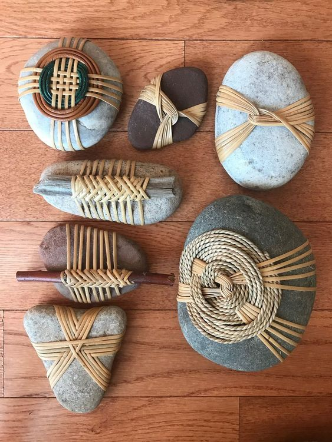

Pare că nu-i niciodată de ajuns o deschidere de zi butucănoasă, așa că vine și a doua, să pecetluiască treaba. Nici prea dimineața asta nu-i așa rotundă, dar nici eu nu-s colțuroasă-n acceptare așa că, până să mă dumiresc și să las lumina asta să-mi intre toată-n ochi, stau un strop să mă adun și aduc cu toatele acasă. Chiar dacă sunt încă adormită, chiar dacă aș dormi mai mult, am și chef de-o trezire, am și poftă de o nouă zi. E o curiozitate acolo care mă îmboldește și e-n creștere pe zi ce trece.

Cea mai mare recunoștință care mă locuiește de un timp binișor de acum, este faptul că nu mai dorm în viața mea, că mi-am deschis ochii, chiar dacă îi mai mijesc uneori, și că încep să-mi iau puterea înapoi. Atâta am franjurat-o și-am împărțit-o pe la alții sau prin situații, drame și alte acareturi, încât acum, când o readuc în matcă, mă simt la propriu mai cu hățurile în mâini. Habar n-aveam că risipesc atât de multă pe la alții prin buzunare iar ei, pe lângă că nu fac nimic cu ea, câteodată (de cele mai multe ori) nici n-o bagă-n seamă. Mi-am pus putere în așteptările de la alții și astea nu s-au împlinit niciodată, eu am plecat din fața ușii închise dar nu mi-am luat-o înapoi, am lăsat-o acolo, să prisosească. Mi-am pus puterea în greutatea dramelor în care m-am afundat până la gât și când am ieșit din ele, am fugit mâncând pământul și-am lăsat-o acolo, deși, fără ea, mă las pe mine mai puțină. Încep să văd pe unde am împrăștiat-o și mi-o fac cadou.

***

Templul meu de carne începe să-mi arate și el recunoștință că-i dau crud și sănătos și nu mă încearcă nicio umbră de durere, pe acolo pe unde știam eu că se adună. E adevărat că sănătatea e în puterea noastră, că mașinăria asta complexă și fantastică este capabilă să facă undo la toate prostiile pe care i le-am făcut, atunci când și noi facem pact cu voința și dorința și ne ținem de ele. Săptămâna asta, din șapte zile, 3 zile jumate au fost numa' de crudități, fără colț de pâine crocantă și fără zahăr procesat sau adăugat. Deși e prematur, nu pot să nu observ ce ușurință am în corp când mănânc așa, iar ușurința asta e dublată de o energie pe măsură. Muncesc de dimineața până seara și nu sunt la fel de stoarsă ca atunci când îmi trece pe sub mustăți și-o lipie pufoasă.

De fiecare dată, după conversațiile mici cu mine și cu Universul din prea dimineți, am invariabil o stare de fainoșag. E mică și e modul Universului care-mi spune clar și răspicat: "uite aici un puiuc de bine, ia-l și crește-l în zi, să se facă mare și să facă pui la noapte, să ai și pentru mâine, și tot așa". M-am observat, plec cu el dimineața, mă ține cam până pe la prânz și apoi nu știu cum, de-mi iese o zburătăceală de mare artă și-l decimez. Dar am noroc de-un Univers înțelegător care mă lasă să bag fise "fără număr". E oricum pe cheltuiala timpului meu.

***

Azi copiii vor să dea o fugă la mare așa că mă duc să stau cu puiuca mea canină, prima și cea mai mare iubire a mea patrupedă. De la noua criză e mai bine să fie cineva cu ea, just in case.

Îmi sorb apa, simplă azi, mă clătesc un pic în limpezimea albastră a cerului și trimit, cu toată puterea inimii mele, gândul să ne fie bine tuturor. Gogoșesc și eu stratul ăla de grijă curată față de ființa umană, oricare ar fi ea și oriunde s-ar afla, mi-e drag de oameni și vreau să aleagă să le fie bine.

Mulțumesc Universului că a trezit-o pe mama ca să pot lăsa mâncarea pentru Sassy și s-o și cremuiesc pe unghii. Nu voi fi acasă la micul ei dejun dar are în frigider totul pregătit, doar să mănânce. În momente de genul ăsta, tot ce pot să fac este să mă las pe aripa lui "sper să facă", pentru că am învățat, the hard way, cum e cu controlul. Cum sunt dăți cu mine acasă în care nu mănâncă, nu pot să mai am așteptări realiste că o va face când nu sunt. Dar tot ea, prin demență, m-a învățat că viața te surprinde mereu, deci îmi las pieptul deschis să primească ce vine.

Ud repede și curticica de flori, și florile din casă, strâng și las totul în ordine și mă pregătesc de plecare. Ca întotdeauna când plec la Maya, am o nerăbdare și-un dor mare, mare așa că mă arunc în mașină și run, Forest, run.

***

Afară e răcorică și plăcut, am geamurile sarcofagului meu umblător lăsate până jos, să mă vântuiască bine aerul, cânt, fără radio, doar eu, și-mi umplu și ochii și sufletul de verdele copacilor de pe marginea drumului, de marele galben care prăjește zilele astea, dar nu e cu nimic mai prejos în măreție, de dragul ăsta care devine tot mai prezent în mine, pentru oameni. Oare de ce simt așa o nevoie să împrăștii candid iubire? M-oi fi umplut eu de ea pe nesimțitelea și dă pe dinafară? S-o fi copt în mine și e vremea împărțitului pesemne. Fără analize, fără căutări de cauze, am o bucurie superbă în vene, în voce și-n inimă. Cânt cu toată mine și-mi place și cânt și mai mult așa că ajung la copiii, deja în drum spre mare, într-o mare efervescență.

***

Ce tăvăleală, ce mozoleală, ce iubăreală între mine și puiul meu scump cu bot pătrat, care nu mă uită indiferent cât de rar mă vede! Atâta arcuit de corp, atâta agitație, că nu pot s-o cuprind în brațe, țopăie ca nebunica și ne băgăm cu totul în bula spumoasă în care până s-ajung la ei, eram doar eu. Buturuga mică răstoarnă carul mare. Alegerea asta pe care am făcut-o să scot dinăuntrul meu o stare de bun și de bine și să aleg să fiu fericită chiar m-a făcut fericită și nu m-a costat nimic. Doar o secundă în care am făcut o alegere. Yep, is that simple.

Normal că ne iubim și ne drăgălim și ne prostim că suntem doar noi două, dar eu vreau să fac și un pic de ordine în casa copiilor.

Tot cu cântec și cu veselie, am răsturnat și revoluționat și casa lor, de sus până jos, inclusiv grădina. Deși a durat mult, habar n-am când a trecut timpul, că am avut bagheta magică în palme și sprinteneală-n tălpi. Știutul că fac o bucurie mă animă și-mi dă putere să mă mișc cu talent și cu eficiență, dar deasupra acestui știut este starea mea mentolată de mișto care m-a acompaniat deja juma' de zi. E drept că și libertatea asta mică pe care o am, de a nu mai sta atârnată-n așteptarea micul dejun, a pregătirilor de prânz, a prânzului în sine, libertatea tare faină de a alege să faci treabă pentru că vrei, nu că e la impuse, s-a împletit armonios cu toate. Iar pauzele de băut ceai s-au lăsat întotdeauna cu tăvălit de Maya, căreia i-au apărut fire blond-alb pe la sprâncenuțe. Parcă e și oleacă mai cumincioară, nu mai e atât de disperată și de agitată. După ce-am curățat terasa și-am spălat-o, am scos-o afară și ce i-a mai plăcut să se așeze ca broscuța, cu burtica pe gresia udă și rece. Am stat cu ea, am privit lumea de la nivelul ochilor ei, am fost cu ea și n-a mai contat nimic și nimeni.

***

Ziua asta, deși am muncit de-am rupt, a fost una ca de concediu. Ai mei copii, deși eu îmi imaginam că vor veni seara, la 16 erau deja acasă, iar pe mine m-a surprins părerea de rău că mi s-a scurtat neașteptat vacanța. Aș mai fi jughinit o grăsancă permanent supărată, aș mai fi făcut una-alta, dar nu mă întristez că s-a terminat, ci mă bucur c-a fost. Clișeic, dar adevărat. După un drum la Lidl cu copila mea să facem refill la frigider, îmi iau coaja mea roșie, mașinuța, pe picioare și plec, în același mod în care am și venit: cu geamurile deschise până la refuz, cu cântec în mine. Singura deosebire, de-a dreptul arzătoare, au fost gradele de afară, dar pe mine nu mă topește (încă). Nimic și nimeni nu-mi alterează binele pe care mi-l îmbrățișez strâns, aproape de piele și de căptușeala inimii. Me happy.

***

Am ajuns fix cât să mă ocup de copite și să aflu că mama nu prea a mâncat. Nici nu mă miră și nici nu mă supără. O fi având și căldura asta vreun efect asupra ei, caut repede o scuză în mine care să nu mă curcănească-n înfoiere inutilă.

Ce m-a uimit însă a fost bucuria sinceră, plină, a mamei când am deschis ușa camerei ei: "ooo, ai venit?". În momente ca ăsta îmi dau seama că-n demența ei eu încă mai licăr, că sunt elementul ce-i dă stabilitate și o ține pe o linie de plutire, într-un cunoscut pe care poate să-l asimileze. Are nevoie de cât mai puține schimbări în peisaj iar lipsa mea pare că e o majoră în mica ei lume.

Mi-am observat trăirile și, deși sunt într-o fază de expandare drag asupra tuturor, la mama parcă încadrez totul matematic, iau notă de evenimente, nu le mai procesez în detaliu, le clasez și merg mai departe. Chiar dacă înțeleg că nu mama mea are demență, ci un corp căruia i-a sărit o rotiță și-a luat-o pe miriște, îmi devine clară disocierea mea de ea, atât suflet cât și corp. Mi-e greu s-o disociez pe ea de corpul stricat. A ieșit tare greu conștientizarea asta din mine dar până la urmă mi-am făcut curaj și-am scos-o afară, la lumină. Deși știu, nu înțeleg, știu că avem un suflet, un spirit și-un corp, grosierul ăsta nebun al mamei îmi ocupă toată atenția și nu mai lasă loc pentru ochii mei intuitivi să vadă și altceva. Poate grija asta a mea care se îndreaptă în principal asupra fizicului ei și faptul că uneori mi-e atât de greu și de odios, mă consumă cu superficial și nu mai am putere să merg mai adânc. Indiferent ce e, nu pot să accept că adevărul ăsta universal se aplică și la ea. Acum șapte luni, vedeam împletirea celor trei în ea, acum zici că sunt la ani lumină de ideea asta simplă. Aș vrea să-mi curăț actul ăsta de interpretare dar, fix la ea, fix la mama mea, se lasă cu neputință. Giiiz, am eu așa un feeling că drumul ăsta pe care-l parcurg cu și lângă ea se va lăsa cu înțelegeri și dezînțelegeri asupra aceluiași lucru, over and over. Voi bucla și eu, cum buclează și ea, până s-o așterne-n mine claritatea și voi vedea limpede ce e de văzut. Și deși zic mereu că orice e un act de alegere și de voință și de dorință, zău dacă știu de unde să încep, ce să fac, să mă întorc la înțelegerea mea pe care acum juma' de an, o vedeam atât de natural. Cred că între timp, s-a așezat multă mizerie peste, la propriu, și-mi împiedică privirea de necarne să-și întâlnească surata.

***

Magia apei mi-a făcut din duș un cântec și-o exuberanță, la propriu. Sunt obosită, transpirată, muncită și cu atâta plăcere mi-am lăsat scurse gândurile aiurea, grijile lipitori, sudoarea, că pe la jumătatea dușului m-am trezit din nou cu voce. De ce trebe să trec atâta prin ciurul minții toate?! De ce trebe să aibă toate un sens mental când unele, sau multe sau toate, fac sens într-o zonă unde mintea nu e decât un simplu servitor?! Fuck them all! Mă las spălată și mulțumesc cu atâta tărie apei, că trăiesc un mic moment de beatitudine. Frate, mai ușurel cu roller coasterul ăsta de emoții, să mă țină balamalele!

***

S-a închis ciclul și bucla zilei și eu mă aflu în pat, cu perna pe cap pentru că sunt două petreceri în zonă și oamenii nu ascultă muzică doar pentru ei, bagă bumți-bumți în boxe imense, să se audă în tot satul. Am impresia că boxa e pe perna mea, basul îmi tremură-n stomac și organele mele dansează în ritmul ăsta frenetic. Am vrut casă de lemn, are părți bune-bune dar la partea cu sunetul, preia orice și mi-l aduce fix pe pernă, să-mi fie somnul lin.

Respir adânc, mi-aduc aminte de Tolle care zicea să accept ce este, că deja este și mă focusez pe recunoștința mea pentru:

1. MINE, care am ales azi să fiu fericită și mare bine mi-am făcut!
2. Maya mea cea mai iubită!
3. Acceptare!

Clipa mea de fain creativ este:

