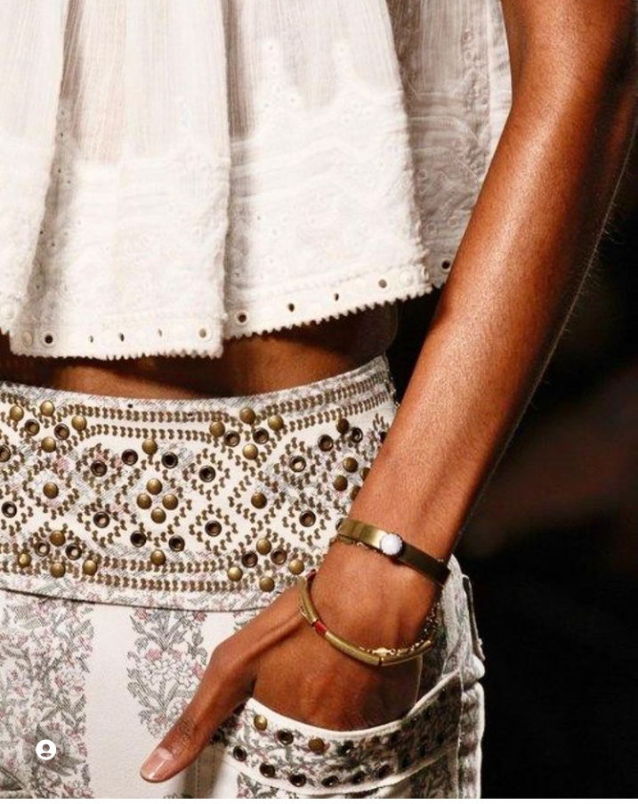

Deși aseară mi-am intenționat soarberea întregii tristeții ca să consum dintr-o bucată, într-o singură zi, ce era de consumat și am încercat s-o trimit cu putere în mașina de spălat a Universului, uite că ea nu și-a făcut plinul de mine și mai vrea să "vagabonțim" o țâră. Pe lângă ea, s-a infiltrat zi după zi, perfid, și-o oboseală și e un cocktail beton în mine pe care-l percep când încă zorii fac invitația la lumina unei noi zile și unei noi vieți.

Chiar dacă vreau să pun o lupă mare pe starea asta densă, falsă, de toate dramele lumii la mine-n ogradă, somnul care mă îmbie cu promisiuni de mai bine, nu-i dă nicio șansă minții și nici inimii să se focuseze pe nimic. Adorm și mă trezesc în picuri de minute dar, într-un mod sadic, îmi place și așa. Nu mai strig Universului că-s obosită și că vreau somn că, nu știu cum se aude acolo, în imensitate și am eu așa un feeling că-mi vine înapoi ecoul, da, ești obosită și da, ai nevoie de somn. N-am nevoie de validări, că le simt deja pe pielea mea, am nevoie de acțiuni și singura care trebe să le facă e subsemnata. Doar că m-am pierdut într-o ceață zilele astea și încă bâjbâi.

\*\*\*

Îmi încerc prima acțiune mai cu sens a prea dimineții și o împletesc cu un succes fabulos prin îmbucături lacome de somn dulce. Mișto e că nu uit totuși ce-am mulțumit la îmbucătura precedentă și, legănată și de susurul apei ce stropește pământul a viață, reușesc să mă calibrez la inimă și să susțin momente disparate, dar curate, de recunoștință.

Reușita asta se leagă fain de următoarea, n-am nicio durere sau jenă în corp, prietena mea durerea de cap a considerat că e prea aglomerat în viața mea acum și nu-i dau atenția cuvenită și-a plecat, sunt eu cu mine carne și oase, trec scanerul pe la toate colțurile și iese cu plus. Deși-s încă densă, am totuși o mică bucurie și mulțumesc aproape vocal pentru starea fizică nealterată.

Coconetul de lângă mine a adăugat și ea foială momentului, că-i tot simțeam mustățile pe piele și micile mișcări ale picului de corpușor: s-a apucat să se spele, cu mare patos, parcă-n așteptare de zi mare. Nu croșetez pe marginea acestui gând că nu vreau să nasc așteptări, vreau să mă las să curg dar mai ales, vreau să curgă de pe mine starea asta lipicioasă ce-mi aduce toată tristețea lumii, de zici că greul cel mai mare e pe umerii mei. Cred că, în dedesubturi de energie, trecem la nivel colectiv printr-o masă de tristețe caldă, cum ar zice la meteo, dacă în fiecare dimineață s-ar da un buletin de stări la nivel de mapamond. M-am prins și eu, c-așa-s eu, mai curioasă din fire, de pătura asta de melancolie nenumită, nepusă pe seama unui lucru anume și merg cu ea în virtutea inerției. Este singura explicație pe care pot s-o dau, mai din minte și nu din inimă care tace adânc, pentru starea mea de plumb emoțional.

\*\*\*

Apa mea mult lămâioasă, să-mi ciupească papilele brusc și să mă trezească la o viață acidulată, bifează rezultatul în fizic iar ochii mei întâlnesc un azur nelimpede azi. Da, suntem mai mulți în hora asta grea, cerul meu e tot albastru ăla pur și fain la bază dar peste sunt urme multe, risipite peste tot, de nori gri șobolan, sunt ca niște urme concentrate de fum de țigară. Lasă baby, că o să ne facem noi bine, o să dăm cenușiul ăsta la o parte când o fi momentul oportun și o să ne bucurăm goi de toate, dar plini de bucurie de viață, din nou. Deși nu vreau să mă îmbrac în tot felul de așteptări, mintea mea mă pune mereu la un adăpost de "o să fie bine". Atât de parșiv ascuns, egoul ăla, care se îngrașă din suferință de orice fel, îmi domolește încercările minții care crede că e nevoie de un liman pentru orice stare nașpa. Nu, nu e nevoie, EU sunt țărmul, iar stările sunt valuri care vin și pleacă, unele mai reci, altele mai calde, unele mai înspumate, altele mai limpezi. Dacă doar m-aș lăsa să fiu un țărm fără minte…

\*\*\*

E clar că traversează prin aer ceva, la mama e oribilă combinația de aer cald și închis și mirosuri de tot soiul, plus o umezeală ciudată. Răcoarea de afară e o recompensă superbă și-aș rămâne acolo, agățată de fereastră, nu mi-aș întoarce nici atenția și nici acțiunile de maestră-n domestos în cameră. Aș vrea să dau skip the intro la acest moment și să mă duc direct în ăla următor, ora mea cea mai liberă și cea mai dragă. 

Vocea seacă și spartă a mamei mă silește să revin cu totul acolo unde sunt fizic și încep aolelile. Sunt aceleași, nici nu mai caut răspunsuri pentru ele, doar o las să verse veninul ăsta mic ca să netezească cutele alea pe care încă le simte și să se liniștească. În genere, dacă doar asculți, fără intervenție, omul scuipă ce are de scuipat sau lasă să curgă ce are de ieșit și apoi, consumat, se oprește potolit și cuminte. Așa e și la mama, semn că demența nu strică mecanisme clasice ale umanului, am închis ușa după mine și-am lăsat un zâmbet mic pe chipul îmbătrânit brusc al mamei.

\*\*\*

Am plecat cu totul, clar nu-mi plăcea unde eram, în design interior. Sorb cu aviditate imagini și idei, mintea mea lucrează febril, imaginația și creativitatea altora și a mea își dau mâinile și plutesc într-o stare de concepție. M-am mufat intens la stratul de creație, acolo unde deja sunt toate create iar noi doar culegem și aducem în densitate. Sunt de abia la începutul acestei idei pe care o simt puternic adevărată-n corp și mi-ar plăcea s-o aprofundez cât mai mult. Orice am vrea să creăm noi există deja în imensul câmp al posibilităților, trebe doar să ne ascuțim percepția și să intrăm pe frecvența aia care să ne poarte-n câmpul ăsta magic. Azi mi-am clătit ochii cu ce fac alții și m-am bucurat, pe cât m-au lăsat țâțânile astea de tristețe ce mă strâng, de lumea asta fascinantă. Nu pot să nu văd asta, chiar și orbită parțial de pâclă.

\*\*\*

Domnul meu a intrat în concediu așa că se lălăie liniștit diminețile astea. Trag nădejdea că la tura viitoare de concediu a lui, să plecăm undeva două-trei zile și s-o las pe mama în grija copilei mele. Deși nu-mi place deloc să-i las așa o responsabilitate uriașă pe umeri, trebe să trec peste mine aia care vrea să dețină controlul a tot și s-o ogoiesc pe cea care are nevoie și de altceva. 

Încerc să nu lipesc din starea mea la starea lui și sunt destul de zgârcită față de mine în a sta cu el. Mă bucur că există în viața mea, nu a existat și nu există niciun dubiu la capitolul ăsta, de altfel e una din recunoștințele mele zilnice. Iar azi, mă bucur că după micul dejun a ieșit pe terasă, într-o relaxare și o bucurie a momentului, scutindu-mă pe mine să găsesc scuze de retragere din prezentul nostru.

\*\*\*

Cu chiu, cu vai și aoleala-i caracteristică, mama a coborât la micul dejun, unde începe dansul "ce vrei să mănânci?". Aia nu-i place, ailaltă are un gust, de aia nu se atinge că ea n-a mâncat niciodată așa ceva, dacă e bună la ceva tristețea asta groasă este că nu lasă nervii să treacă prin ea și să se manifeste. Dacă tot a coborât, sigur va mânca ceva și o invit să decidă singură, cu ușa frigiderului larg deschisă. 

Îmi punguiesc murele adunate de ieri, și, cu toată detașarea mea, îmi dau seama că practicarea asta de prezență până la urmă dă roade chiar și când nu ești pe fază: am simțurile alerte, dar nu în sensul ăla negativ, ci deschise la și pentru viață. O aud în spate pe mama, cum mestecă fără prea multe vorbe, simt apa rece cum mi se prelinge printre degete și spală murele mari și grase și frumoase, aud și de afară un cântec de rut, nu știu al cărei păsărici, dar e atât de intens, își caută pereche cu atâta fervoare, că se simte-n trilul ăsta mic dar superb, îl văd și pe domnul meu cum stă cumincior într-o absorbire de liniște, cuprind cu privirea și curticica de flori și curtea mare, e atâta viață și mișcare peste tot că mi se pare nepermis ca eu să băltesc atâta timp în tristețe. Dar, în acest moment lucid, ea este în mine, n-o pot nega și nici dezlipi deși vreau, iar eu experimentez, din nou, senzația aia ciudată de nefiire în viața mea, care mi dă și-un avantaj ciudat de a privi din afară ce se întâmplă înăuntrul ei.

\*\*\*

Pentru că mama de abia a mâncat, e cremuită și liniștită, plecăm amândoi la cumpărături rapide, să mă apuc apoi de pregătirea prânzului. 

Asta cu mâncarea pentru mama este o bubă careia îi tot rupe coaja zilnic și nu se mai închide. Aproape orice gătesc eu nu-i place, aproape orice cumpăr nu-i place, plaja de opțiuni pentru ea s-a restrâns extrem de mult. Laptele bătut nu e prea bun, ea nu se prea omoară cu pepenele, nici acum nu vrea smoothieul și sucul înapoi în meniu, carne nu vrea dar apoi ar vrea, nu-i plac roșiile, niciodată nu i-au plăcut, e o nebunie care de obicei, mă irită. Și mă limitează și mă sperie. Dar, cică, așa e normalul în acest anormal care este demența.

\*\*\*

Statul ăsta al meu în liniște și melancolie nu e tocmai o plăcere pentru domnul meu, pot să-mi dau seama de asta cu ușurință. Știu că invers dac-ar fi, aș fi la fel de neliniștită, aș vrea să-i rezolv eu toate colțurile, să-l fac să se simtă bine. Dar nimeni nu poate face nimic pentru mine, nici măcar eu. 

Și când mă avântam mai cu spor în a-mi pune niște zoaie de vină pe mine, că-i stric omului zi de concediu, mi-am dat peste mâini imaginar și m-am oprit: nu mă pot forța să fiu decât cum sunt. Acum sunt tristă, asta trebe să consum până se duce (naibii) de unde a venit. Alte dăți sunt caldă și efervescentă, în altele introspectivă și mută. Cum eu încerc să iau pe toată lumea, mai puțin, culmea, pe mama, așa cum e și dau libertate fiecăruia să fie cum poate să fie, trebe să existe reciprocitate. Și dacă nu e natural, să nu-mi mai pun singură în cârca prostii, că ideea e să le dau jos, nu să mi le urc la mansarda deja ocupată cu multe în întunericimile ei.

\*\*\*

Aceeași liniște a mea îmbracă și pregătirile de prânz dar încep să resimt oboseala mai acut. Mi se închid ochii efectiv în timp ce gătesc și m nevoie de câteva ori să mă așez și să-mi pun capul în palme, ferit de lumină și lăsat cu toată greutatea, să se odihnească. Chiar dacă e liniște în jurul meu, în mine nu-i la fel, nici măcar nu-s conștientă de zumzăiala asta continuă doar faptul că mă simt epuizată, scursă, e un indiciu că e ceva ce-mi consumă bateriile, necercetat și nevăzut. E o scurgere imensă de energie, inconștient dusă pe gânduri care o fură și nu aduc nimic înapoi. Câteodată plec pe-o aripă de gând atât de concret, încât îmi dau seama că gătesc mecanic, nici nu știu cu ce parte din mine am gândit înșiruirea de acțiuni corecte pentru gătit, fără ca măcar să-i fi acordat atenție acestei activități. E clar că mă conduce pilotul automat dar, cu toată ceața asta de pe mine, îmi promit că azi dorm puțin, cândva. Am nevoie de mai mult somn și dacă nu mi-l dau singură, Universul nu mă adoarme brusc. Poate după prânzul mamei…

\*\*\*

Ca să mă scutesc de efort, i-am luat mamei un grătar de porc, că asta preferă să-i pun lângă rizottoul vegan gătit. Îi aranjez masa cu tot ce e nevoie și mă duc s-o aduc, îmbătată de perspectiva unui somn imediat după. Mama iar își dă ochii peste cap dar aleg să ignor, nu vreau să mă flambez aiurea, mai ales că mă așteaptă patul cumincior. 

Încerc să rezolv și niște administrative aduse pe tavă de copila mea în timpul prânzului mamei, așa că o scap din priviri pentru câteva clipe. Îndeajuns să strângă-n ea plângeri neverbalizate care se bulucesc cum revin în bucătărie. Grătarul ăsta e talpă de tare, mestecă la el de juma' de oră degeaba, orezul nu prea-i place, dar, ca să nu mă supăr, îl mănâncă cu castravetele murat. 

Cum aș putea să mă supăr când toate sunt atât de roz?! Venisem să stau cu ea, am făcut stânga-mprejur și m-am tirat în living, unde-mi vine să urlu și să las să iasă ce mă lovește cu putere dinăuntru. Nu pot face asta, respir adânc și mă reîntorc, sadică, să stau până la finalul mesei. 

Mă uit la ea și mi se pare că demența i-a urâțit tare mult chipul. Pe lângă culoarea asta cadaverică, are ceva urât în privire. Poate e doar lipsa zâmbetului sau doar părerea mea, așa că mă scutur de observația asta stranie, fără judecată. Chiar dacă nu-s tocmai ușurică în simțiri, mai ales acum la prânz, îmi dau seama că o observ cu curiozitate, ca pe un studiu de caz. Cu fiecare zi ce trece și ea nu vrea să coboare din pat, din cameră, din casă, se adâncește în ea o izolare și o respingere a tot ce este în exterior. La asta se adaugă strâmb o răutate inutilă din ce în ce mai persistentă: dacă vreau să-i dau sau fac ceva și ea nu vrea, are o răutate comportamentală, nu verbală. Dacă îi sună telefonul, vede pe ecran că o sună prietena ei, singura care o mai sună, îl aruncă cât colo și zice cu năduf "ce-o mai vrea și asta?!". Timpul, în mintea ei, s-a comprimat extraordinar de mult, mereu are impresia că de abia a făcut cutare lucru, în urmă cu câteva ore sau ieri. La ea toate "abia" s-au întâmplat sau le-a făcut "ieri".

\*\*\*

Cu ceva chin să-mi liniștesc un pic interiorul, ce nu poate sta impasibil total la mama, mă scufund în pat, în mult dorita odihnă. E cald dar sunt așa de obosită că nu mă deranjează câtuși de puțin. Trec minutele și-mi dau seama că forfoteala mi s-a concentrat toată-n minte și ronțăi întruna, de nu e loc și pentru somn să apară în peisaj. Îmi pun o pernă pe cap, respir adânc și după 10 minute de frichinit, mai că m-apucă panica. Nu pot să adorm iar mai devreme aproape că adormeam în picioare. Nu mă ridic, stau consecventă acolo, tot cu perna pe cap și reușesc lansarea într-un somnic, pui de portocaliu, de 20 de minute. M-a trezit o mișcare bruscă, necontrolată, a propriului corp care a speriat puiul de somn. Asta e, bun și ăsta. 

\*\*\*

Toată după amiaza a trecut în ceață, fără mine în mine, am fost ocupată cu trecutul și cu visatul într-un viitor liber, singurul episod mai incisiv, pe care n-am cum să-l ratez din conștiență, este pilitul de unghii, episod greu azi. Nu știu cum, prin cele două măști, s-a strecurat mirosul ăla de pilitură de unghie împuțită, că mi-a întors stomacul instant pe dos și am muncit dublu să termin ce aveam de făcut și să-mi țin conținutul stomacului la locul lui. 

Nu mai etichetez în niciun fel momentul, doar mă bag la un duș și rog magia apei să mă spele de ceață, de scărbă, de tristețe, de judecată, de iritare, de neiubire, de netrăit. Nu vreau decât viață în schimb. Atât.

\*\*\*

Mai diluată decât ieri, și azi a fost o zi neguroasă, pe care am pierdut-o ca timp aproape integral. Singurul lucru notabil pe care l-am făcut a fost că am făcut doar act de prezență la viață, nu am și fost prezentă-n viața mea. Chiar și așa, ca să nu adâncesc superficial nemenționatul de recunoștințe, here I go:

1. Marele galben, începător de zi!

3. Design interior și creativitate!

5. Apusul finalului de zi!

Clipa mea de frumos:

