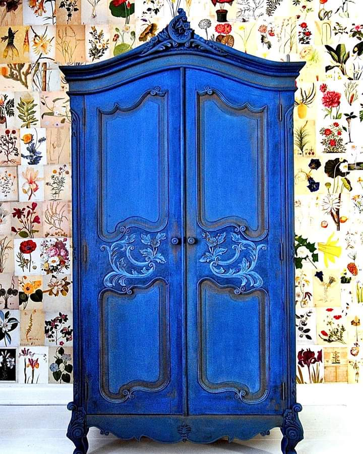

Cu miere să fi dat tot patul și pernele și atmosfera și nu cred că prea dimineața asta ar fi fost mai lipicioasă și somnul atât de dulce când șturlubatica asta de minte a aprins brusc lumina la creieraș. Chiar nu știu pe cine sau pe ce să dau vina trezirii mele, că lumina e mică, rozalindă și difuză, de abia se deznoadă noaptea de plecare și ziua de sosire, e liniște, toate păsările dorm, numa' una n-are somn, și aia sunt eu. E o vorbă din popor care sumarizează sarcastic momentul: când dormi prost noaptea, e imposibil să te trezești deștept dimineața. Nu știu la care cotangentă am greșit aseară, când m-am pus la somn, că nu mi s-a legat de-un somn lin, m-am tot frichinit, când pe-o parte, când pe alta, m-am tot trezit, iar ceasul ce proiecta ore mici-mici pe tavan aproape că mă enerva. De pe la 3 și ceva, aș putea să jur că mintea mea s-a pus la o concurență neloială și pierzătoare din start: deschideam ochii, vedeam ora mică, îi închideam strâns înapoi, să mai prind un somn. Puțin după, deschideam doar un ochi, vedeam ora mai mare, tuști, înapoi la somn. Un strop mai târziu, iar ochi deschis, să văd dacă mai am timp și mai am de dormit. Și tot așa, până când n-a mai fost somn, că timp mai era.

Deși numa' odihnă n-a fost asta, Universul ăsta mă are în vedere și azi cu energia, poate o țâră mai molicică decât ieri, dar, având în vedere cât am depus la banca de odihnă, azi confirm cu mâna pe inimă, că nu întotdeauna principiul "shit in, shit out" funcționează. Câteodată, intervine o magie care mermelește shit-ul de intrare și iese energie cu sclipici. Yep, am și zile d-astea norocoase, trebe să le văd și să le recunosc, că poate, apreciate, vin mai des.

***

Am eu voință și dorință de făcut și de dres dar la partea cu costumul de corp, nu stau chiar roz: mă doare tot, fiecare centimetru zici că a tras ieri la plug, mă simt ruginită, parcă mi-ascut urechea să văd de mă aud scârțâind. Am muncit ieri, ce-i drept, dar nu mai mult ca-n alte dăți și nu am mutat munții să mă doară toate cele în halul ăsta. Trec peste prima întâmpinare făcută și încerc o întindere, asta întotdeauna mi-a făcut și bine, și plăcere. O, da, chiar de doare, se simte tare bine întinsul de mușchi, de oase, de piele, de toate și-mi vine, instinctiv, nu știu de unde, să mă scutur. Sunt încă la orizontală, îmi înfrânez pornirile să nu scol buimace două ființe, care mai de care mai cuvântătoare-n tril, domnul meu, sau în tors, coconetul care mi-a simțit trezirea și-a pornit motorașul mic și purrrfect. Parchez ideea și, dacă mă ține până la bucătărie, atât ea cât și balamalele ridicate la verticală, o s-o pun în fapt acolo.

Primul pas pe parchet a fost chiar cu plumb, am adunat în tălpi toată greutatea din lume, mă și vedeam, cu panică la început, și-apoi cu un bușit mic de râs, cum rămân înțepenită-n loc, că nu pot să-mi mai car pașii și corpul mai departe. Cu efort, m-am cărat înc-un pas și ușor-ușor s-a instalat ușurința-n mine și-am ajuns, neplumbuită la parter, la apa mea caldă.

***

Aici mi-am ținut scurt respirația când mi-am dat seama c-am plecat în zi fără dragul meu ritual de început și de mulțumiri. Stai, bre, ce te sperii așa, se mai întâmplă! Doar nu o să mă treacă fiori acum de câte ori ratez una sau alta. Cât de repede se atașează omul de bine sau de o sursă care-i face bine.

Nu-i bai, mă relaxez, să nu-mi mai trimit cortizol aiurea-n sânge și pun de-o clacă mică în trei: eu, cât de cât trează și cât de cât limpede, apa mea caldă, cu juma' de lămâie și mănunchiul de recunoștințe, toate vegheate cuminte de-un albastru vătuit cu alb dens și cu roz pudră șters. Mi-a plăcut twistul ăsta nou, e bine din când în când să faci cărări noi în obișnuință că, o dată, ești mai atent și mai focusat, și a doua, că înseamnă noi rețele neuronale, deci 2 în 1 bun-bunuțe.

Mi-a dat lămâia asta un zvâc în corp și mi-am adus aminte de pornirea de mai devreme, natural venită, de scuturare. Hai! Măi, dar a fost spectacol unde-am fost și protagonistă, și spectatoare și mi-a plăcut la nebunie! Scuturarea asta, însoțită de intenția mea mentală de a azvârli de pe și de la mine toate cele ce-mi stau lipite inutil, a fost tare faină, mi-am cam zdruncinat toate cele dar, uimitor, mintea mi s-a așezat mai bine într-un corp ușor răscolit. Până la urmă, dragul meu corp știa ce are nevoie, el întotdeauna știe, m-a ghidat scurt și mă bucur că l-am auzit și l-am ascultat. Iaca, am dormit prost, dar uite că m-am trezit oleacă mai ascultătoare, fix acolo pe unde trebe. Bun așa!

***

Mi-am făcut smoothieul, azi am pus și vișine, să-mi dea mii de acidulări papilelor gustative, mi-am făcut și ceaiul și, scuturată de multe, ca un canvas curățat, sunt gata să urc la mândrele de la etaj. Îmi ordon: fără așteptări și fără speranțe, que sera, sera.

Și fu, tot fără, dar fără de nici unele, pentru că mama are un zâmbet pe față, larg, zâmbetul ăla de copil, fără griji, fără gânduri, fără minte. O întreb cum e și cum a dormit, se uită zâmbind la mine, dar nu răspunde nimic, ca și cum fie trebe să înțeleg eu cuvintele nespuse din spatele zâmbetului, fie nu-s cuvinte deloc nici în spate, nici în minte, nicăieri.

Mă canalizez către Sassylina mea dragă, să torn către o ființă grija cu care am venit la ele și ea-mi întoarce, cu un mieunat mic, atenția. Mă privește fix, pentru o secundă am impresia că, dacă ar putea vorbi, acum ar face-o. Sunt convinsă că la nivel de energie ea ne percepe și pe mine, și pe mama, dar asta e cam tot ce pot specula, în rest, habar n-am dacă ea sesizează lipsurile și lapsusurile tot mai mari și tot mai dese ale mamei. Mă duc în baie, unde nici nu zici că ieri am făcut curat spumă și mă apuc din nou de curățenie. Mama, în pat, zâmbitoare, privește la televizor. Că și vede ceva acolo sau doar privește, numai ea știe și nu cred că e capabilă acum să împărtășească. O las în lumea ei caldă și bună și mă duc să mă bucur de lumea mea caldă și bună.

***

N-am stare de stat în casă, am chef de aer curat, de vânt, de verde, de mirosuri. Afară e o vreme bestială, m-am întâlnit cu două libelule albastru-străveziu, mici, delicate și superbe, mi-am imaginat și clanul The Moles sub picioarele mele, că au mai apărut cinci noi castele la suprafață, unul din ele fix lângă o dalie, pe care-a dărâmat-o-ntr-o parte, în câmp este un cerb tânăr, are între urechile erecte două cornițe scurte încă, dar destul de crescute s-arate că-i posibil cap de familie, familia de fazani e tot lângă gard, ferită în niște buruieni de doi metri înălțime, e o larmă acolo și mi-e drag tare să mi-i imaginez cum se-nghesuie unul într-altul, picotind. Mi-a fost dor de micile vieți ale ființelor din jurul vieții mele și abia acum îmi dau seama, iar și din nou, cât de mici sunt problemele mele mari. Cât de "importante" sunt ele în imensitatea Universului și câtă non-valoare poartă-n cutele lor.

Trifoiul a crescut din nou ca Făt Frumos, din verde, pajiștea s-a făcut albă de la flori, îmi salut pomișorii, așa sănătoși sau bolnăviori cum sunt, îmi umplu sufletul murele, multe și grase, iar eu simt că m-am întors în locul de unde am plecat acum ceva timp, distrasă aberant de griji și nevoi și drame care nu neapărat m-au făcut mai bogată. Momentele mele de viu, din natură, sunt unele dintre cele mai curate momente pe care mi le permit mie, care nu mă costă nimic, dar fac toți banii din lume. Mi-e tare dor de-un munte, de-o plimbare, de-un mers, dar până atunci, am asta aici, la botul calului, în fiecare dimineață. Trebe doar să mă spăl pe ochii ăia obișnuiți să caute dedesubturi maronii când evidența e atât de simplă și de curată și de bogată.

***

Dejunurile ființelor dragi cu care împart casa, aproape se suprapun iar eu sunt constanta-n amândouă. Mama a mâncat bine, a primit și cafeaua cerută, e mulțumită, dar din nou n-are cuvintele la ea. Vrea doar să știe unde mi-e pisica, "Sassy a mea e sus, stă sub pat și când vine lângă mine și mă fac că n-o văd, mă freacă cu lăbuța". Doamne, te rog eu mult, lărgește oleacă fanta asta de unde accesează ea subiecte sau teme de discuție și mai strecoară și altele, că e teribilă limitarea asta atât de mare. Chiar dacă vin cu povești noi sau cu suflu nou de afară, de la roșii sau de la viața asta ce freamătă în afara zidurilor ce-o țin captivă și fizic, mama nu mai percutează la ele, nu mai pare interesată de mai nimic din afară. Nu știu dacă ea vede filme pe care eu nu le văd sau își trăiește timpul într-o stare de nimic sec care n-o deranjează. Dilema zilei: s-o las acolo sau s-o trag cu forța aici?

***

Dau o fugă să mai iau pepene, dragostea noastră nelipsită în aceste după-amiezi, să mai lipesc și alte comisioane, să mai bifez diverse.

La poștă, unde m-am oprit să iau un colet mic-mic, c-un porțelan vechi, am parte de-o reacție brutală din partea unei femei către o altă femeie: cea de la ghișeu mai că n-a făcut-o proastă pe cea din fața ghișeului, că nu știa contul unde trebuia să facă plata unui timbru nu știu de care. Tipa din spatele ghișeului era roșie de iritare, cea din fața, roșie de rușine. Nu m-am amestecat în ciorba lor că nu era momentul oportun, îmi venise și mie oficianta cu coletul, dar am ieșit de acolo cu două conștientizări mișto.

Prima, importantă, a fost că nu am luat partea niciuneia, nu m-am plasat susținător secret și tăcut pentru niciuna. Din papucii fiecăreia sunt sigură că se vedea dreptatea în dreptul ei. Nu cred că mai fi simțit vreodată o așa detașare, de obicei mă revoltă și țin partea ăluia care mi se pare mai năpăstuit, cum ar fi fost femeia roșie de rușine, în cazul de față. Uite că azi n-am fost părtinitoare! Se simte ciudat, ca orice început necunoscut. Dezlipirea emoției de pe o situație duce la o observare neutră și îmbracă în aceeași înțelegere ambele tabere. Wow, dar cât de mișto e așa! Câte cuvinte și discuții sunt scutite în noua abordare, câtă liniște și lipsă de judecată stau cumincioare în înțelegerea asta! Cel mai tare mi se pare că eu nu am gândit, cred, niciodată că poate există și alternativa asta. Justițiara din mine mereu a luat părți, mereu s-a situat ba la unul, ba la altul, cel mai des la cel considerat nedreptățit. Înțelepciunea populară, care se pierde încet-încet, că nu mai încape pe ecranele din ce în ce mai mari ale smartfoanelor, zice bine ce zice: every story has two sides. Eu, cu proverbiala-mi chioreală, n-am văzut asta. Până acum.

A doua, la fel de importantă, a fost că în marea majoritate a situațiilor, mie nu-mi mai este rușine când nu știu ceva. Pur si simplu și jur că nu știu când s-a petrecut miracolul ăsta.

Înainte, demult, în viața aia netrăită din viața mea de acum, dacă mă întreba cineva ceva și nu știam, mă lua cu valuri de căldură. Eu TREBUIA să știu totul, de parcă mă născuse mama pe-un raft al bibliotecii din Alexandria și eu în primii ani de viață, am mâncat informații pe pâine. Dorința, care s-a transformat rapid în nevoie dureroasă, de a nu mă face de râs în fața nimănui, nu concepea ca eu să n-am răspuns. Dacă, doamne ferește, mă lovea vreun trăznet, răspundeam greșit și eram "prinsă", se lăsa cu gemete în interior, de mă lua la propriu cu durere de stomac. Și, pentru că eram sadică, de câte ori mi-aduceam aminte, mai gemeam o dată, cu rușine maximă. Iar pe cel sau pe cea care "mă pusese" în așa o situație ridicolă, îl sau o asociam mereu după aceea cu momentul dureros și nu mă mai bucuram de întâlnire deloc. Trist, dar al naibii de adevărat și al naibii de greu de trăit.

De ceva timp, m-am ridicat deasupra stupizeniei acestui mecanism atât de strâmb și văd cu ochi curați ce e de făcut: aplic, la un nivel extrem de simplist, teoria jocurilor și-mi maximizez real rezultatul. Mă mai doare sau înțeapă că nu știu? Aiurea! Deloc! Dacă mi se ivește oportunitatea și văd că nu știu ceva, pun întrebări, sincere, fără tendențiozitate, dintr-o energie bună și astfel învăț. Nu mă mai interesează aproape deloc cum mă privește cel care vede că nu știu sau dacă i se pare stupid să nu știu ceva, atât de "la mintea cocoșului". Am acceptat că știu că nu știu și sunt într-o perpetuă învățare, fără să mai adun gemete dureroase, colici abdominale sau scame pe suflet. Câte idei geniale se pierd pentru că ne e frică sau teamă sau oroare să nu zicem prostii… câtă risipă.

***

Cu sufletul mai sus un pic, bucuroasă de noile mele cuceriri pe tărâmuri necunoscute și nesondate emoțional până acum, descarc cumpărăturile, evident că m-am lipit de mai multe decât de-un pepene, și-apoi mi-ajut domnul să rezolve duda pe care o are de câteva zile vasul nostru de expansiune și ne dă fluctuații mari la presiunea apei.

Doar ce mai apuc să umplu vasele de apă pentru udat roșii, să mai împăturesc rufele uscate, să mă-nvârt ca un titirez, făcând una-alta și s-a făcut de prânz. Alo, stai frate timp, mergi o țâră mai încet, că nu țin pasul!

***

Mama e în ziua în care iar nu mai vrea carne. Nu mă deranjează, mâncare fără carne am, evident că nu aia care-i place ei, ea ar mânca niște cartofi prăjiți cu acritură, atât. Ok, facem. Vrea și pepene, degeaba-i explic că, peste mâncare, va fermenta, n-am cu cine, e copil mic și vrea acum. Ok, nu se dărâmă lumea dacă mănâncă o dată, mai ales că, în urmă cu vreo două zile decreta că "ea nu le are cu pepenele". Îmi pare că are o stare mai bună și încerc marea cu degetul, e de acord să reluăm smoothieul dimineața? Niciun răspuns. Repet întrebarea, ridică ochii la mine, iar tăcere. Întreb jumate sarcastic, jumate panicată, dacă vorbesc singură și aceeași reacție mă lasă perplexă. A hotărât ea să nu-mi răspundă și asta face. Clar, e ziua noutăților.

Ce să zic, a mâncat ceva, e bine și așa, ea pare satisfăcută și pleacă-n pași mici, eu rămân să strâng după ea, un strop uimită și, un strop mai mic, tristă. Cum se împuținează omul la final, din toate punctele de vedere.

***

Am mâncat cu domnul meu, i-am ascultat poveștile, dar îmi observ absența. E o paralelă dură între momentul de mai devreme, despuiat de orice emoție și trăire și viață și cel de acum, plin de vivacitate și spumos, iar eu am fost în amândouă ca parte. Mă strânge ușor, chiar dacă știu că suntem datori cu o moarte toți, să văd cum se scurte vioiciunea și sclipirea din mama și lasă-n urmă un corp abandonat, ca o magazie dărăpănată. Mă doare ca fiică a ei dar mă și sperie ca ființă umană: orice ar fi, sper să n-ajung așa! Când vezi cât de urât se poate ajunge, și eu știu că încă n-am atins apogeul urâtului, mai ales în Alzheimer, oricât ai fi de centrat și de evoluat, eu tot cred că ți se strecoară perfid în suflet o mică temere-întrebare: cum o să fie la mine? Sper că nu așa!

***

Aceeași stare pe care nu știu să o numesc în niciun fel mă întâmpină și la momentul unghiilor. Cred că în această seara a fost ultima seară de pilit serios, de acum înainte va fi mai mult un zgâriat ușor, de suprafață, că aproape nu mai am ce să pilesc. Este un rezultat parțial, dar atât de mult îl merit încât sărbătoresc cu zgomot în mine, mica victorie, că numai eu știu cât de greu mi-a fost să ajung aici. Mai e puțin dar greul, sau grosul, depinde la ce fac referire, s-a dus. Momentul ăla din baia noastră, în care-mi clătesc fața și nările în apa călâie, e aproape delicios de fain, am impresia c-am spălat toate pilirile astea grele pe care le-am dus până acum. Ducă-se!

***

S-a pornit furtuna, s-a întunecat brusc dar mișto afară, iar eu nu-mi doresc decât să stau în pat. Fără telefon, fără tv, fără cărți, doar eu cu mine și cu ale mele. Domnul meu este the cherry on top iar Spikylina, care s-a prins că e rost de drăgăleală, s-a lipit caldă de-o gambă și închide cercul zilei: toarce purrfect.

Am petrecut o zi blândă, cu noutăți mișto în mine, cu unele grele în mama, cu bucurii mari la viețișoare mici, cu to do-uri consumatoare de timp și viață dar și cu recunoștință pentru:

1. Twistul nou al micului meu ritual de început!
2. Prietenele mele!
3. Ploaie, tunete și trăznete, răscoală în natură cu liniște în mine!

Frumosul zilei mele este:

Painted by Ildiko Horvath
