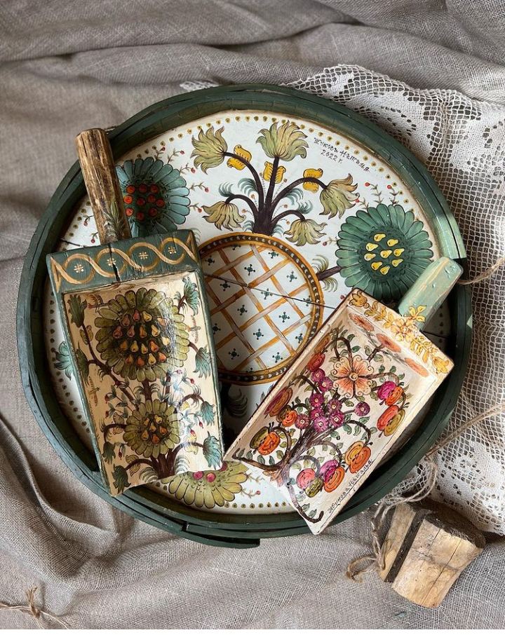

Prea dimineața asta ține în căușul ei o mine neutră, nu mă dă pe dinafară nici bucuria de viață, dar nici nu mă inundă lehamitea. Sunt liniară într-un fel în care trezirea mi se pare un act firesc, căruia nu-i mai caut interpretări și nu-l mai îmbrac în senzații și trăiri. M-am trezit că așa era pe traseul meu de viață și atât. 

În lumina sta de nici prea-prea, nici foarte-foarte, ritualul meu de trimitere mulțumiri devine doar un act simplu, și el dezbrăcat de emoții. Are totuși o nuanță diferită de bifă, mi-am luat timpul să iau notă de ce tot ceea ce mulțumesc, dar nu m-a mai invadat nicio căldură vibrantă pe dinăuntru.

Și la strigarea de prezență a corpului, pățesc la fel, întinderea de mușchi este un act mecanic, îl percep în fizic, dar parcă s-a întrerupt conexiunea între simț și interpretare mentală. Sunt încă confuză, nu mi-e clar ce e noutatea asta în mine, cum s-o iau și de unde s-o încep, așa că, tot dintr-o neutralitate ce pare că mă acaparează cu totul, o las să fie și mă las să fiu.

\*\*\*

Sorbitul apei calde, tot cu lămâie și cu ochii tot pe marginea de cer din dreptul meu, din obișnuință, se simte ca un corp ce bea o apă. Brr! Începe să nu-mi placă așa, mintea mea vrea înapoi familiarul, realitatea asta neutră, brută, fără interpretări și fără trăiri, nu e pe placul ei. Din mine, observatorul vede și ființarea neutră, vede și zbaterea minții să aducă înapoi ființarea în emoții. De ce a venit la mine asta, acum? Ce trebe să înțeleg și ce trebe să fac cu ea? M-am prins, așa, un strop, că viața fără emoții e ca apa minerală plată, te hrănește dar nu mai e nicio bulă acidulată care să-ți dea cu aromă de "sus" sau "jos", care să te ridice la o suprafață pe care nici n-ai imaginat-o, nici n-ai știut-o până atunci. Ăsta o fi răspunsul la întrebarea: în viața asta trebe să n-avem emoții? Dacă da, înseamnă c-am pus prost întrebarea pentru că, în mine, știu că nu e așa. Bucuria de viață, indispensabilă unei vieți mișto, e tot o emoție. Hai să merg mai departe în zi, poate vine sora claritate să-mi dea o mână de ajutor aici.

\*\*\*

Mamei îi e bine, nu știu dacă nevoia ei de a-și face ordine în pătrățelul în care-și târăște viața vine dintr-o minte clară în dimineața asta sau din automatismul unei vieți trăite în curățenie, dar își aranjează patul, își împăturește hainele cu grijă, curăță litieră lui Sassy, udă plantele de la geam. O văd pe cameră cum deretică și nu vreau să intervin, pentru că o dată ce-aș deschide ușa, și-ar vârî capul și pe ușa ei, egoul. Ar începe să sufle greu, să se miște cu greutate, ar apela la artificii ca să-mi acapareze atenția și compasiunea. Când termină, intru și eu în scenă cu pliculețul pentru blănoasa cu ochi superbi și cu o vorbă pentru amândouă. Da, îi e bine și da, la înaintare, la ea deja s-a instalat egoul, care respiră greu de la cât a muncit. Ori de la neutralitate, ori că mă așteptam la ea dinainte, doar a făcut click în mine și am mers mai departe, fără nicio intenție de a hrăni egoul ei, acțiune care-mi vine de undeva de peste mine și de peste minte. 

\*\*\*

Pe scări, în coborârea spre timpul meu liber, am avut o impresie stranie că aș fi o marionetă, de fapt corpul meu, în care locuiesc emoțiile, personalitatea și trăsăturile mele de umană, este manevrat de ființa mea, aia care n-are nicio legătura nici cu carnea, nici cu caracterul meu de format și cizelat de poveștile vieții aici. E o disociere clară pe care o simt dar umanul din mine vrea cu înverșunare să le împletească din nou, să se așeze liniștit în ceva ce poate înțelege mintea.

Ca să nu mai stau cu mine și să simt ce simt, mă arunc cu dorință de uitare pe net, pe site-uri de second hand sau de antichități. Știu eu că acolo pierd cu totul noțiunea timpului și a mea, și doar croșetez povești în spatele obiectelor vechi sau mintea mea creează noi moduri de a vedea și folosi obiectele văzute. Îmi dau ceva de făcut, ca să nu fiu nevoită doar să fiu în această dimineață ce are o aromă extrem de nouă și intrigantă.

Mi-a ieșit din prima, am plecat cu atâta nonșalanță din mine și din prezent, că atunci când a coborât domnul meu parcă trecuseră doar cinci minute. 

\*\*\*

M-am agățat de prezența lui Mr. H ca de următoarea liană de care să mă prind și să rămân în aceeași suspendare de la mine, aia nouă care s-a trezit în această dimineață. Îi sorb cuvintele și mă culcușesc și eu în starea lui bună, împrumut tot ce pot să încropesc aroma aia care "mă definește". Facem planuri, îi ascult povestirile și mă adăpostesc cuminte la el în viață, că asta nouă a mea mă încurcă. Pentru că nu știu cum să-i articulez prin ce trec, las povestea asta pentru altă dată și mă arunc pe următoarea liana, pregătirea micului dejun al mamei. 

Mai cu aoleli, mai cu povești d-ale mele spumoase, mama mănâncă tot oul fiert și ceva cașcaval lângă, plus o bucată bună de ardei roșu. Cireașa de pe tort a fost când mi-a cerut ea, o cănuță de lapte bătut. Avem, cum să nu, vine imediat! Chiar dacă mie încă nu mi se aliniază viața aia pe care o știam cu asta în care m-am trezit azi, faptul că mama a mâncat bine a creat o mare ușurare în mine. Posibil că am împachetat nemâncatul ei într-o grijă și-am pus-o-n mine, în debaraua aia în care tot strâng griji și nu mă încumet să mai intru și să strâng păienjenii d-acolo. Când oi avea timp.

\*\*\*

Mama a hotărât că azi, la prânz, va mânca și ea ce măncăm noi. Adică linte, că asta e în programul meu artistic de gătit azi. Îmi place la nebunie lintea și o fac în stil indian, doar că fără iuțeală. Azi va trebui să-mi potolesc asezonarea cu garam masala și cu curry, că mamei nu-i plac mâncărurile prea condimentate. Ca mai întotdeauna când gătesc, las să curgă vreun podcast sau vreo cuvântare a celor pe care îi am în subscripțiile de youtube. 

N-a apucat să intre bine ce aveam de ascultat, că primele intră reclamele. Iar ochii mei au prins o frântură dintr-o imagine cu un castel.

Așa m-am prins că-n mine încă e tristețe. Unde ochii mei întâlnesc frumos, s-apucă să curgă, în loc de radieze. Mai e o pungă de lacrimi pierdută pe undeva prin-năuntrul meu, ce se vrea plânsă. Mă lipesc de ceapă ca de scuza pertinentă, în cazul în care intră inopinat domnul meu. Și plâng, de zici că toată tristețea din lume s-a înțânat la mine-n prispă, plâng de tot și de toate, dar e un plâns curățător. Am oprit orice zgomot mi-ar deranja firul ăsta de plâns, nu pentru că vreau să mă las trasă cu totul în el, ci tocmai pentru că vreau să-l consum pe tot, aici și acum. Măcar atât să fac azi conștient, pentru mine, să spăl apăsarea asta care stă acolo așteptând un colț de frumos ca să mă acapareze. Oricum, țopăiala aia oriunde, mai puțin în viața mea, asta mai detașată pe care o trăiesc azi, începuse să mă obosească, am picioare scurte, din ce în ce mai scurte, când îmi doresc să fug din acumul meu.

\*\*\*

Ochii noi care-mi stau în ziua asta pe față mi-arată, cât mă las eu să-nțeleg, plinătatea de ego. La mine, la alții, peste tot. 

Cel mai mare indicator, stegulețul cu care defilează prietenul ăsta îngâmfat și pe care-l văd de la o poștă, este cuvântul "mai". Cu cât eu sunt mai mișto decât altcineva, cu atât sunt mai puțin ființă și mai multă uman egotic. Cu cât eu vreau "mai" mult, cu atât hrănesc o sugativă care vrea și mai mult, cel mai mult. Cuvântul ăsta mic comprimă nesperat de multe în el, dar cuprinde esențialul de la care pleacă multe din suferințele noastre:  lipsa în încrederea în noi, în cine suntem acolo dedesubt, sub miile de straturi de spoială. În loc să ne apucăm să dăm rahaturile astea întărite-n zoaie de pe noi, să ne curățăm de comparații, de idealisme, de cai verzi pe pereți și așteptări tâmpite, coacem idei și planuri și ne zdrelim sufletele și corpurile ca din paralelele făcute între noi, noi să ieșim cu plus. Nu ne oprim o clipă să vedem că o comparație cu o altă ființă umană e cel mai stupid act pe care putem să-l facem și să ne consumăm timp cu el, nu vedem că paralelă înseamnă fix că fiecare e pe drumul lui singur și e cel mai frumos de pe drumul lui. Asta e tot ce contează.

Am citit undeva ceva ce mi-a dat o perspectivă seacă, dar comprimată, la zilele noastre, astea multele trăite pe social media: We are the saddest generation with the happiest pictures. That said it all…

N-am mai ascultat nimic, era deja zarvă mare-n interiorul meu. Dar mă bucur că s-a legat așa, mă simt o țâră răcorită. Nu, nu s-a întors vechea mine în mine total, încep să ies din neutralitatea aia anestezie, încep să simt senzații, emoții, dar culmea, începe să-mi placă și distanța asta pe care o poți avea față de viață sau, mai granulat, față de ce-ți construiește viața. Distanța asta poate să fie fix pansamentul de care e nevoie să te vindeci, să nu mai faci răni noi sau să le lași p-alea vechi să facă coajă și să se usuce. 

\*\*\*

Ce surpriză nesurpriză! Mamei nu-i place lintea, nici măcar așa, necondimentată, cum am făcut-o. Nu am altceva pregătit pentru ea, dar după câteva linguri oricum decretează că de fapt nu-i este foame și că nu mai vrea nimic. Dacă aveam ceva friptură de porc la cuptor, ar fi mers. Păi nu ai zis femeie că nu mai vrei carne?! 

Acum ar fi bună distanțarea de context, pentru că din nou își arată colții iritarea. O las să vină dar poate mintea, poate altceva mai puternic din mine, așează rapid înțelegerea că nici nu-i sănătos, dar nici n-am cum să previzionez toate buclele astea pe care le face mintea ei. Nu pot să stau toată ziua să gătesc și aia, și ailaltă, doar în ideea că dacă nu-i place una, să i-o servesc pe a doua. Că sunt șanse tare mari că nici a doua să nu-i placă, și nu sunt vreo magiciană care scoate din pălărie, la un pocnit de degete, feluri de mâncăruri pe bandă rulantă. O să forțez revenirea la smoothie dimineața, măcar o zi da, una ba, am fructe proaspete în permanență în casă și p-astea le acceptă și ce-o fi, o fi. Nu vreau să o umflu cu pastile pentru poftă de mâncare că și-așa ia o grămadă de pastile deja. 

O să caut să văd dacă există vreo corelație între demență și gust, pe de o parte, și o să încep conștient să-mi antrenez mintea aia iute-n iritare și frustrare, să accepte că fac tot ce pot. Să-mi dau viața peste cap, mai mult decât deja am făcut-o, nu cred că scrie în nicio karmă. Și dacă scrie, n-are decât, eu cred că a face ceva din sacrificiu atârnă greu pentru ambele capete ale sacrificiului. Iar eu mi-am propus să fiu din ce în ce mai ușurică, în multe. Eventual în toate.

\*\*\*

Deși mă strădui să "fă rai din ce ai!", să sorb mici înghițituri de bine din cupele clipelor în care-mi torn prezența, să mă bucur de orice nimic pe lângă care altă dată aș fi trecut cu nepăsare, azi am resimțit puternic lipsa socializării. Tare mult mi-ar plăcea să mai primesc și eu invitații la o cafea, oriunde dar nu doar la mine, la un brifcor și-o bârfă, în oraș, pe mal de apă sau la o terasă. Oamenii din jurul meu s-au dau la o parte din calea invitațiilor iar eu nu am inima să mă autoinvit nicăieri. E adevărat că nu pot oricând pleca, dar azi am simțit dureros neieșitul ăsta al meu, în lume. Ieșirile mele sunt la cumpărături sau la copila mea, cu treabă și ajutat, răruț la vreun eveniment. Deși îmi place în liniștea și muțenia mea, din când în când parcă mai simt și eu nevoi. Doar că din obișnuința proastă, le înăbuș în loc să le desfac sănătos. Poate că asta e și ea o țeavă ce alimentează tristețea asta din mine deși socializarea este de fapt un mod superficial de a trăi. In the end, suntem oricum singuri, dar am venit să experimentăm o viață pe Pământ, iar asta înseamnă să te amesteci cu alte ființe care fac același lucru. Oricât de mult aș citi sau aș vedea postări pe social media, nimic nu poate înlocui o perspectivă aburindă, oferită la prima mână, de un uman cu care ți-e drag și curios și bine să-ți petreci timpul. Doar că la mine s-a îngustat dramatic plaja asta de oameni, că a devenit o linie pe care pot să-i număr și fiecare are viața lui, cu timpul și prioritățile proprii. Aștept cumincioară să cad într-un timp și-o prioritate, când s-o putea. Everything will come to you at the perfect time, deci e un timp pentru toate.

\*\*\*

De azi încep să răresc pilitul de unghii și doar să mă folosesc de crema cu uree să dizolve ce a mai rămas din copite. Adică mai puțin de o treime. Cu hotărârea asta, urcatul meu la supliciul pe care-l trăiam seară de seară a fost mult mai cu inima sus și mai cu nările libere. E un merit pe care mi-l arog cu plinătate și trebe să recunosc că dacă aș pune măcar juma' de grijă în dreptul meu cât am pus în dreptul mamei, aș fi mult mai cu "oile acasă" decât sunt acum. Dacă m-aș focusa cu persistență pe hrănitul sănătos, dacă n-aș mai deraia cu așa patos în râpa aia a victimizării și plânsului de milă, dacă aș gogoși bucuria de viață în mine, în cât mai multe clipe, cu consistență, viața mea ar fi radical alta. 

\*\*\*

Până atunci, privesc apusul printr-o plasă de țânțari și mă "lovește" cum mă uit la ce văd în genere printr-un filtru, care de cele mai multe ori distorsionează vederea și-o imprimă într-o trăire strâmbă. Când oi avea timp, clasica mea scuză și fugă, o să mă las deschisă țânțarilor și-o să privesc fără nicio sită zilele ca cea de azi, parțial a mea, parțial a unei mine altfel decât toate de până acum, care-și numără recunoștințele:

1. Starea de prezență a mamei la prima oră!
2. Antichități cu miros de visare!
3. Răritul pilitului de copite!

Clipa mea de frumos este:

