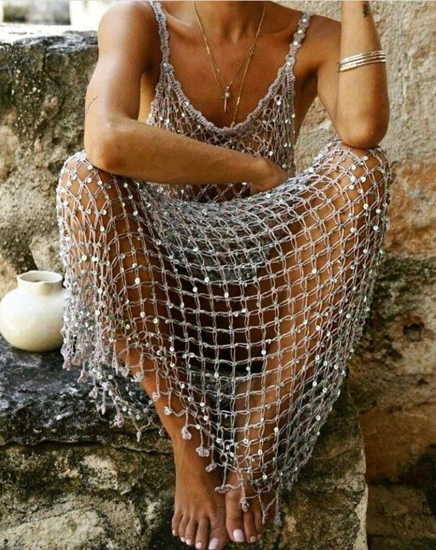

Alarma interioară cu care este dotată mașinăria asta miraculoasă, așa alintatul "fratele porc", mi-a dat deșteptarea cu 10 minute înainte de alarma superficială a telefonului domnului meu. Până azi, am tot evitat să folosesc cuvântul deșteptare, pentru că sensul lui primar mi se pare că n-are nicio legătură cu sensul pe care i-l atribui eu, tot primar. Deșteptarea la o nouă zi la mine nu e sinonimă cu deșteptarea la o nouă viață așa că, chiar dacă zilele pe care le trăiesc îmi servesc conștientizări pe tavă, eu tot cred că deocamdată sunt doar trezită. Mai trebe să mă coc ca să mă deștept, zice mintea mea sau asta e o credință limitativă, ce-ți taie din avânt, zice inima mea. Le las în pace să se contreze și eu mă întind într-o respirație adâncă.

Inversez o țâră ordinea, așa, for a twist în life, și-mi întreb întâi corpul cum se simte. În linii mari, e bine, tot pe la șale e o nemulțumire, dar o iau și pe ea pe sus și-mi întind cât pot eu de mult corpul, ca și cum aș vrea să mă lăț-lungesc până la soare și până-n adâncul pământului. Vreau să mă pârâi de întindere, să-mi activez mușchii, să mă cuprind și-n toate astea să mă culcușesc comod, un stropșor de timp, să-mi trimit recunoștința. Azi noapte, pe la 3, m-am trezit să dezlipesc blănoasa de piciorul domnului meu, să-l las și pe el să se miște în voie și singurul gând ce se auzea în mine a fost mulțumirea că sunt în viață. Mi-a preluat recunoștința asta tot liberul arbitru pe care l-aș putea avea eu în miez de noapte dar mă bucur că a făcut-o. Poate tot repetând asta, la ceasuri mici și liniștite și adânci de noapte, îmi intră atât de tare în tot ceea ce sunt eu, trup și suflet, încât nu mai uit nici în trezie că asta e esențial și că trebe să fac the best of it. În prea dimineața asta, recunoștințele vechi au mai racolat, ele știu de pe unde, o recunoștință nouă care era inclusă mai la modul general, fără accentuarea pe care o merită: recunoștința pentru inimă, sub toate formele pe care eu o percep. Mi-a plăcut tare și de noua prietenă, am băgat-o și pe ea în cercul dimineții și la final, mi-am surprins colțurile buzelor ridicate. M-am pornit către zâmbet fără ca măcar să realizez asta, colțurile ridicate m-au făcut atentă la asta și, dacă tot sunt cumincioară și cu chef de noutate, hai să fac și exercițiul profei mele, să răspândesc zâmbetul către toate organele, să zâmbesc cu toate, să-mi aduc soarele si-năuntru. Yep, viața e frumoasă iar momentele astea mici-mici sunt geniale! Și sunt de luat în poșetuța zilei, ca nelipsitul ruj al unei femei cochete.

M-am ridicat la verticală cu sprinteneală, deși corpul nu mi-e neapărat odihnit, dar mintea a hotărât ea, impresionată subliminal de trăirile astea faine, că și azi e zi numa' bună de trăit. Da' de trăit, nu de simulare.

***

Spiky e deja la geamul din biroul lui Mr. H, urmărește cu atenție câțiva fazani ce se plimbă țanțoși pe câmp și nu-i arde încă de mâncare. Stau și eu să privesc, e atât de frumoasă pârloaga și așa de mult mi-aș dori să rămână așa, să nu se construiască case, că am plecat cu gândul mai departe și-am uitat să mai privesc. Mă aduc înapoi, privesc și doar privesc și mă duc spre bucătărie, să-mi pregătesc cele necesare pentru ritualurile dimineții.

Apa, deși o îmbălsămez cu intențiile curate, nu alunecă lin, parcă am o clapetă de retur în gâtlej și fiecare sorbitură e oprită, verificată și apoi înghesuită. Cu fiecare sorbitură am băgat și una plină de aer astfel că după juma' de halbă simțeam că nu mai intră picătură. Hait! De la ce sete aveam zilele trecute la înțânarea asta, e ceva cale, las apa deoparte, îmi clătesc ochii scurt pe cer, măcar el e curat, fără niciun norișor, iar privirea-mi alunecă lin până departe, în orizonturi. Și-acolo se duc și gândurile mele și iar dispar din prezent și din viața mea minute bune. Am plecat departe mânată de dorința mea de a medita, și m-a "lovit" instant că mă folosesc de meditație ca să evadez dintr-o viață care nu-mi e pe plac 100%. Giiizz, pe undeva, chiar așa e! Nu puteam, măi, să nu contaminez frumusețea asta de stare cu libidinoasa mea victimizare, cu fuga mea parșivă și neaducătoare de nimic bun de prezent? O să fiu mai atentă, să mă dezinfectez de gânduri de evadare data viitoare când mai plec pe-o aripă de meditație.

Pesemne că atenția a fugit toată pe uimirea noii descoperiri, că mi s-a destupat gâtul și mi-am terminat apa de băut și intențiile de trimis. Sunt gata și cu smoothieurile, ceaiul e la infuzat și-s pregătită, cu subiect și predicat, să mă duc la fete, la etaj.

***

Nu știu dacă am fabricat mental și mi-am trimis în nări, având istoricul zilei de ieri, dar la ele miroase tot nașpa așa că mi s-a decis, fără drept de apel, prima parte a zilei: curățenie generală. Deocamdată deschid large ferestrele, aduc miros fain de fructe zdrobite, strâng minimal și mă concentrez pe ființele camerei: mama și Sassy. Îi mulțumesc blănoasei că suplinește ea căldura unei întâmpinări pentru că mama, deși zâmbitoare, nu are încă cuvinte-n vocabular și emoții-n buzunarul inimii. Ce așteptări aiurea am și eu, s-o fi săturat de mine, că doar mă vede de nu știu câte ori pe zi. Vorbesc cu Sassy blând, ca tonalitatea mea să fie percepută de mama ca fiind bună și în siguranță și le las în legea lor încă puțin, până revin la șmotru.

***

Timpul meu liber s-a dus tot pe editarea scrierilor pe 3 zile, pe care nu am mai apucat s-o fac zilnic. În decursul unei zile eu îmi notez momentele impactante și apoi le schițez și dau contur postărilor, numa' că de câteva zile nu m-am mai învrednicit să fac conturarea, de oboseală. Scrierea și editarea nu se face în cinci minute, îmi trebe timp liber și liniștit să stau și uite că nu l-am găsit, nu l-am avut sau când l-am avut, nu am avut și chef. Pentru că e o promisiune a mea față de mine, azi am redactat toate cele trei zile și le-am terminat și lansat cu un mare sentiment de ușurare. Nu vreau să devină corvoadă scrisul și atunci când n-am chef, nu redactez, dar azi mi-am dat seama că pe mine mă bucură, mă hrănește, mă ajută și mă crește scrisul ăsta zilnic. Iar dacă asta e o supapă și o butelie mișto în același timp, n-ar fi păcat? N-a fost tocmai magic timpul, dar nici fuștereală. Am imprimat niște zile din viața mea în el.

***

Am ratat micul dejun al domnului meu, dar pe cel al mamei nu-l pot fenta. Măcar știe din prima ce vrea iar asta ne ajută pe amândouă. Pentru că doar când pomenește de Sassy pare animată, ăsta e butonul pe care apăs și eu, ca să mai schimbăm două-trei vorbe. De la Sassy, unde dialogul e destul de limitat la câteva propoziții, fac saltul la Spiky și îi povestesc cum doarme coconetul ăsta mic de-a latul, între mine și domnul meu, și fac haz de necaz iar mamei i se destinde chipul și începe să mă privească, fără să mai fixeze cu privirea farfuria și dumicații. Dac-aș putea să susțin cât mai mult conversația în ritmul ăsta care-i place ei, să-i țin privirea sus și să mănânce tot, ar fi minunat. Dar amplitudinea atenției ei scade brusc și dramatic, la fel și zâmbetul și la fel și mestecatul. La modul cel mai brutal cu putință și cel mai realist, în clipele astea am avut impresia nașpa a unei păpuși stricate căreia îi cad dintr-odată bateriile. N-a fost o trecere lentă, o închidere treptată, ci ceva atât de tranșant că m-a lăsat cu bucata de cuvânt nerostită pe buze. Offf, doamne!

***

A urcat la ea, iar mie îmi trebe câteva minute să mă recalibrez. E bine că devin din ce în ce mai conștientă de impactul ei asupra emoțiilor mele și nu mă mai las să băltesc prea mult în ele. Nu reușesc mereu dar un lucru mi-e limpede: asta e calea și asta e practica. Nu-mi iese acum, bag o fisă din nou și tura viitoare și tot așa, cad și mă ridic și iar cad și iar mă ridic, over and over. Până la urmă, dacă bag în forjă voință și dorință, o să mă mai scutească impactul ăsta negativ, o să-și ia catrafusele și-o să plece iar eu o să rămân stâncă-n mine.

Îmi mut focusul pe altceva și, ca să-mi ridic spiritul, mă uit peste vechituri, pe site-urile deja consacrate pentru asta. Câte minunății încă se mai găsesc! Nu sunt adepta teoriei pe care o flutură mulți conform căreia "nu se mai fac lucrurile ca pe vremuri", dar eu știu că mie-mi plac la nebunie lucrurile vechi, că au o savoare și-un parfum și o formă care, din punctul meu de vedere, nu sunt egalate de produsele fabricate acum. Niciodată în ochii și inima mea nu va exista egal între un produs de serie și unul vechi, fie el tot de serie, dar la o scară mult mai mică sau, și mai și, unul executat manual. Dacă până acum câțiva ani, priveam lucrul vechi cu ochi de "expert" și deja îl vedeam curățat, revopsit, remodelat, reinterpretat, acum sunt înnebunită de-a dreptul de patina dată de vechime. Am corpuri de mobilă pe care le-am luat de pe olx la prețuri de nimic sau donații, pe care le-am șlefuit ca să le "șterg" loviturile sau găurile cauzate de istoria și viața lor. N-aș mai face asta acum. Chiar dacă e la modă antichizarea, unui obiect noi nu-i poți atașa o aromă și-o istorie și-o viață în care a bucurat ochi prin câteva tușe de ceară neagră.

Ce mi se pare mișto este că am început 1. să-mi văd schimbările în percepții și 2. asta nouă, ce devin cu fiecare zi trăită ce trece, să n-o mă mai eticheteze pe cea veche, care interpreta viața cu uneltele pe care le avea sau putea să le vadă la momentul ăla. Peste câțiva ani, cine știe cum voi privi lucrurile? Sau poate chiar peste câteva luni? Încep să-mi înmoi convingerile. Încep să înțeleg că o convingere e un loc mort. La fel cum e și cel în care ți-ai agățat și decretat dreptatea asupra unui obiect sau subiect. În momentul în care eu hotărăsc că am dreptate în ceva și rămân acolo, țin cu dinții de dreptatea mea, de punctul meu mic de vedere, mă condamn inconștient la un loc fără nașteri de noi perspective. Ce dacă acum zece ani credeam că sarcasmul is the shit? Ce dacă acum cinci ani credeam că eu sunt pe calea spiritualității, "mai" trează decât alții? Ce dacă acum 10 ani îmi ploua în gura la mirosul unui grătar iar acum îmi plouă-n suflet uciderea acelor ființe? E totul o curgere și oriunde eu bat un țăruș și strig cu gura plină că "așa e, cum zic eu", nu viața o țintuiesc, ci doar îmi limitez o infinitate de posibilități la una singură, de care m-am atașat c-am fost capabilă s-o articulez. Încep să percep că îmbățoșarea nu mă coafează. Deloc. Și nici nu rezistă.

***

Cu aromă de trăire plăcută, mă îmbărbătez să mă duc la curățenie. Două ore am luat la puricat fiecare colțișor, niciun centimetru n-a rămas necercetat, am pus la spălat covorașele, am despăroșat totul, am curățat tot ce se putea curăța și cred că mi-am ars senzorii de miros din nări de la atâtea lichide de curățenie. În fiecare centimetru curat am lăsat o altă imagine, viziunea mea asupra camerei așa cum a fost ea înainte să vină mama aici și așa cum va fi când nu va mai fi mama aici. Nu pot schimba nimic la mama, pentru că în demență nu te joci cu schimbările de perimetru. Dacă se oprește curentul și mama nu mai aude televizorul mergând, se panichează, se irită, se agită. Dacă vreau să-i aduc un corp de mobilă mai mare, pentru hainele pe care le mută și permută de nu le mai știu nici eu locul, se opune cu vehemență. Așa că nu-mi dau reset la planuri, nici din convingere și nici din ipocrizie, se vor materializa când va fi posibil, dar nu le șterg. De fapt, visarea asta a mea de acum m-a ajutat teribil să scot mizeria și mirosurile, fără să-mi întorc și eu stomacul pe dos. Chiar dacă-i cu trișare, e conștientă, știu că fug, dar o fac pentru că mi-ar lua mai mult timp să mă scot din starea aiurea, și fizică și psihică decât dacă n-aș face-o. Toată lumea e câștigată, totul sclipește, chiar dacă mama e plată, eu mă bucur în interiorul meu că le las într-un spațiu curat și mișto mirositor.

***

Evident că nu-s capabilă de prânz, dar ea este, o cobor și mă bucur că lipesc momentele, că așa am și eu un timp liber după, să-mi trag sufletul și să mi-l bucur cumva.

Cât mănâncă ea, eu toc busuiocul proaspăt cules și-l pregătesc pentru montare: într-o tăviță de făcut gheață, cu multe compartimente, pun busuiocul tocat în trei sferturi de pătrățică și torn ulei de măsline deasupra. Miroase absolut demențial busuiocul ăsta mov, o combinație delicioasă de busuioc și lămâiță și o să fie o încununare culinară peste viitoarele paste sau salate. Mama nu e curioasă ce fac, dar eu tot îi povestesc și arăt, îi dau să miroasă și lipsa de reacție mă convinge să-mi conserv și vorbele și energia, că le irosesc. Am băgat tăvița în frigider, până se solidifică un strop uleiul, apoi o pun într-o pungă cu ziplock și la congelator. De câte ori o să fac paste, pac, trântesc un cub d-ăsta congelat să-mi extaziez papilele. Cât de simplu și cât de fain! Zilele următoare o să fac și tava cu forme de brioșe în care pun în fiecare rotund, o felie de lămâie, o felie de lime peste lămâie, 3 frunzulițe de mentă, apă cât cuprinde și băgată la congelator. La fiecare limonadă pui 2-3 "straturi" d-astea congelate și e o minunăție, fix pentru zilele astea caniculare. Chestii mici cu impact mare și sănătos.

***

Azi nu prea mi-a trebuit mâncare, am ronțăit când și când fructe iar acum, după ce am spălat și strâns după prânzul mamei, am o mare poftă de pepene. Curăț și tai în bucăți un castron mare și mă-nfig în colțarul din living, la televizor. Nu am chef de nimic altceva, vreau o după amiază lejeră, să-mi "spăl" puțin gândurile și să-mi revină mirosul, încă anesteziat. Nu vreau să fac nimic și nu mă simt rușinată de asta. Am avut o mare conștientizare referitoare la curajul meu de a sta, de curând, pe care încă nu am procesat-o și nici destructurat-o îndeajuns, dar mi-am propus să fac pași mici conștienți, către acolo, către zona aia în care să fiu confortabilă cu cei din jur, dar mai ales cu mine, dacă aleg să nu fac nimic o oră, o zi, o săptămână. Mai pritocesc la ea încă dar mi-a dat cu fiori pe piele.

***

Răcorită de pepene și odihnită, sunt gata să o iau de la început cu făcutul și zici că m-am băgat înapoi în priză: pilit și cremuit de unghii, curățat litieră, spălat vase pisici, pus mâncare pisici, scos fructe de la congelator pentru smoothie, curățat și tăiat pepepe pentru domnul meu, spălat vase, adunat Spiky de afară în casă, măturat terasa, am pregătit totul și apoi mi-am adus aminte că voiam să stau. Am uitat.

***

Apa aproape rece mi-a adus în mintea derularea zilei înapoi și-am văzut unde m-am faultat și unde am triumfat, în viață trăită. Am lăsat părerile de rău să se ducă cu apa pe scurgere și-n clipocitul ăla sublim de apă, în catifelarea aia mișto și rece de apă, mi-am punctat recunoștința pentru:

1. Capabilitatea mea de a accepta joaca ca o nouă formă de trai!

2. Scrisul ăsta care-mi va aminti conștientizările, peste timp!

3. Curajul de a sta!

Frumosul a venit la mine sub forma:

Networking :-))
