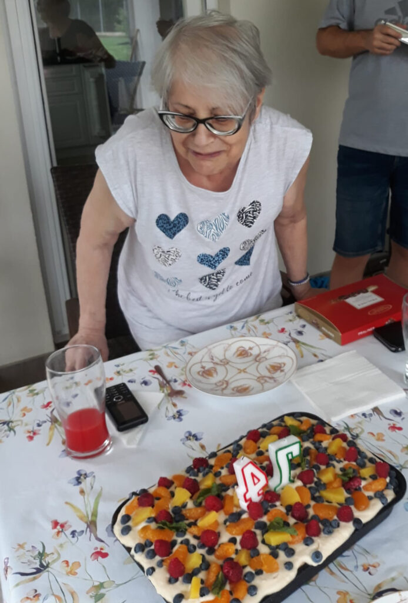

Țopăi dintr-o aniversare-n alta, fiecare cu aroma ei, fiecare îmbrăcată-n iubirea mea pentru protagonist, mai mult sau mai puțin împărtășită. În semiîntunericul prea dimineții, la ora asta mică-mică la care m-am trezit, mă suprind singură cu o claritate ca-n zilele "bune": diferența între ziua de ieri și ziua de azi constă în surpriza zilei de azi. Mamei am vrut cu tot dinadinsul și cu toată oboseala și efortul implicate, să-i organizez petrecere surpriză, prima și probabil ultima din viața ei. Nu compar zilele între ele, că n-ar avea sens, mă compar pe mine între ele, să văd cum mă simt și cum mă percep înăuntru. Îmi dau seama, pe zi ce trece, că sunt din ce în ce mai liberă și mai eu lângă domnul meu. În schimb, deși s-a mai tocit, în ceea ce-o privește pe mama am încă așteptări de validare, aș vrea să o impresionez atât de tare încât să-mi zică o dată că mă iubește, că sunt suficientă, sau mai mult decât atât, în ochii ei, să-mi ajungă data asta spusă pentru tot restul vieții și să spele jumătatea aia de viață care s-a scurs deja cu handicapul în inimă. Chiar dacă la nivel cerebral, m-am prins de mecanismul ăsta ce mi s-a încleștat în inimă, la nivel emoțional e încă rană deschisă acolo și am eu speranța că o recunoaștere din partea celei de la care am așteptat toată viața și n-a venit nimic, ar închide-o frumos. Mici tâmpenii cu impact colosal care mi-au acaparat atâția ani…

Ce-mi doresc eu de la Univers pentru ea? Nici de data asta n-o să rog Universul nimic, tot din același principiu de recunoaștere lipsă care spune că dacă ceri, înseamnă că n-ai, validezi eterului o lipsă. Doar o să-i mulțumesc că e în viață, că demența ei, pe lângă diavolii pe care mi-i înfige în minte, mi-aduce diamante în inimă și-n înțelegere, să recunosc Creatorului că mama a ales un mod extrem de ciudat și alambicat de a mă pregăti pentru viața asta și că acum, după zeci de ani, am avut privilegiul să mă spăl de zoaiele de pe ochi și aoleala de pe buze și să văd și partea aia mișto, ascunsă, de învățare directă, la cald, a celor mai dure lecții dar și cele mai valoroase. Poate că e o spoială asta, poate că exagerez eu conferind demenței mamei puteri pe care nu le are și lecții pe care nu le dă, dar eu asta simt și asta mă ajută să merg mai departe. Și dacă mie mi-e de folos așa, ce contează ce crede altcineva?!

Sunt curioasă cum va reacționa când o voi coborî la micul dejun și acolo, pe terasă, cu masa aranjată frumos, cu toate bunătățile vrute și nevrute, o așteaptă prietenele ei de-o viață. Mi-a plăcut mereu să fac surprize, la partea cu primitul stau eu mai prost, și copilul de mine mereu s-a entuziasmat peste măsură la partea organizatorică. Am pus la punct toate, iar azi se vor desface rând pe rând, s-o bucure deplin, sper eu.

Scanez extrem de scurt corpul, are aceleași junghiuri pe la mijloc, în felul lui brut, îmi arată că-i obosit dar nici azi n-am urechi pentru el. Trebe să mă trezesc, să pregătesc cele de toate diminețile, să-l trezesc pe domnul meu care se duce în orașul unde m-am născut să le aducă pe prietenele mamei astfel încât să fie toată lumea prezentă la micul dejun, ca ea să nu bănuiască nimic.

***

Nu știu de ce a apucat-o pe Spiky fix azi dragul maxim de mine că, deși i-am dat să pape, nu vrea deloc afară, ci doar în picioarele mele. Poate eman prin pori extaz și ăsta atrage, habar n-am, cert este că mă-mpiedic de câteva ori și mă rățoiesc la ea, că n-am timp să mă lățesc acum pe jos toată grămadă.

Îmi beau rapid apa, sunt o țâră absentă și de la ea și de la albastru, mintea mea lucrează febril și-mi structurează acțiunile și ordinea lor cât mai eficient din punct de vedere timp. Deja am trecut la smoothie iar domnul meu a plecat la drum. Sunt conștientă de fuștereala acestor clipe în dimineața asta dar nu pot face altfel, așa știu să fac tot ce am de făcut, că sunt multe.

***

Mama e trează, așa că urc la ea și recunosc că pe parcurs mă rog ca ea să fie ea azi. Aș vrea să se bucure pe petrecerea ei și de fetele care vor veni s-o vadă, să-i fie ziua plină și inima la fel. Intru timid la ea, e iritată de transpirații, dar e prezentă. Pfiu, lasă că-i trece supărarea, mai târziu. Nu-i zic La mulți ani, nu bat niciun apropo, ea nu mai știe că e ziua ei oricum, așa că-mi văd de treburi ca-n oricare altă dimineață. Mai strâng prin cameră, fac curat la baie, aerisesc și plec fuguța să aranjez la parter "locul crimei", nu înainte de a-i spune că vin eu s-o iau un strop mai târziu, că trebe să iau pâine înainte, pentru micul ei dejun.

***

Fac repede salata de vinete, să fie super proaspătă, aranjez platourile cu mezelurile și brânzeturile lor și cel mai frumos e castronul cu legume, trei sferturi din el cu roșii de toate soiurile și culorile, din curtea mea, de care-s tare mândră. Nu le scot afară pe terasă pentru că într-adevăr trebe să dau o fugă să iau pâine proaspătă și niște zmeură, să pun și un picușor de roșu pe tiramisu de fructe. Menta o pun atunci, când îl duc la servire, ca să nu se ofilească. Las toate pregătite pe masa din bucătărie și zbor la brutăria din sat să iau baghetă cu maia și la Mega să iau zmeura și cifrele pentru tiramisu-tort.

Domnul meu mă anunță că e pe drumul de întoarcere și gata, ies pe terasă, le aranjez pe toate, sunt atentă la detalii, vreau să fie o frumusețe și vizuală și o plăcere pentru gusturi, pentru ele toate.

La 9 și un pic, doamnele dragi sunt instalate pe terasă iar eu urc să o aduc pe mama, care nu bănuiește nimic. O conving calmă să se schimbe de pulover și să-și ia rochița de bumbac, aia sexi cum îi zice ea și coborâm. Domnul meu e cu "fetele" pe terasă, gata la semnul meu să înregistreze pentru posteritate momentul.

***

Prima reacție a ei a fost de zăpăceală, nu înțelegea de ce e masa în mijlocul terasei și ce e cu "oamenii ăștia" pe terasă. Nu le-a recunoscut din prima, iar când cea mai veche prietenă a ei a îmbrățișat-o strâns, s-a tras ușor speriată și a fabricat rapid o scuză, că o dărâmă. M-am prins repede că nu cuplează figura cu amintirea și le-am spus numele. I-am simțit carnea sub mână cum se relaxează și cum începe să zâmbească: știa acum cine e "lumea aia" și a înțeles că au venit pentru ea. Nu contează că confundă ziua de azi cu ziua de Sf. Maria, nu mai știe că e ziua ei, tot ce contează acum e că știe cine sunt ele și că se bucură. S-a așezat, e copleșită, își duce mâinile la față, își îngroapă chipul în ele și zice: doamne, ce surpriză!

***

Am zbârnâit ca un chelner pe lângă ele, să nu le lipsească nimic. Mama începe să realizeze plin că are musafiri, că e ziua ei, mănâncă câte puțin din de toate, antrenată de ele, râd cu poftă, glumesc, se bucură unele de altele, iar eu sunt plină. Mai dau p-afară și mai bâzâi din când în când, când știu că gândul primar în organizarea întâlnirii lor anul ăsta a fost că la anul clar nu o să mai știe cine sunt ele și sper să încununeze ziua asta și unchiul meu, cu un telefon de La mulți ani.

Am ratat momentul și-mi pare rău. Aseară, mi-am chemat în ajutor în gând bunicii din partea mamei, să-i dea gândul ăla bun băiatului lor, recte fratelui mamei, și el să fie cald cu mama, care-l pomenește cu dor mai mereu. Ori n-am fost eu clară, ori materialul clientului e varză, că unchiul meu a sunat nu să-i spună La mulți ani, ci s-o certe pe ea că fiică-sa, adică eu, l-am certat pentru lipsa de empatie și emoții în ceea ce-o privește. A fost pata care i-a întunecat ziua mamei dar, slavă domnului, prietenele ei au prins înțelesul și au estompat major durerea mamei. Nu știu dacă va uita telefonul ăsta, văd eu că ce-o impactează grav nu uită, dar știu că a putut să treacă peste, să se lumineze la față și să se bucure de clipe încă vreo trei ore, până la tort.

***

Momentul tortului-tiramisu este unul pe care nu o să-l uit niciodată. Nu pentru că behăiam toți, fiecare pe câte-o tonalitate, "cine să trăiască?", ci pentru că eu i-am privit chipul tot timpul și i-am văzut acolo emoția înăbușită. Mama nu știe să arate emoții, dar asta era așa de mare că o sugruma. Când am pus-o să-și pună o dorință și să sufle în lumânări, a închis ochii, ca un copiluț, s-a oprit timpul în loc și pentru ea, și pentru mine, și a suflat încetișor, cu lacrimi în buza pleoapelor. S-a redresat rapid, să nu o vadă nimeni, dar pentru mine clipele astea s-au derulat cu încetinitorul și le-am văzut sinceritatea goală, fără retușurile mamei. Nu a făcut nimeni pentru ea asta niciodată, nu e obișnuită, dar a primit ca pe-o comoară în inima ei toată ziua. Nu reușește să spună nimic, nu mai iese emoția afară, dar eu am văzut. Și am înțeles.

***

Pe la 16 s-a spart gașca, mama e obosită, fetele vor să ajungă acasă, iar eu pot în sfârșit să mă opresc din alergatul ăsta ca titirezul. Le-am pus tuturor la pachet din de toate dar mai ales roșii de la mine (hihihi) și le-am îmbrățișat cu mare drag pe fiecare în parte. Faptul că și-au făcut timp să vină la ea, să stea cu ea, să se poarte ca și cum nimic nu s-a schimbat deși mama e în bucle repetitive, pentru mine e înduioșător. Asta e prietenia de modă veche, aia de suflet care trece peste ani și peste boli și peste locuri.

La ea în cameră, mama abia așteaptă să șe așeze și-mi spune, cu licăriri în ochi, că așa surpriză mai rar. Cu asta, închid o dată pentru totdeauna ușa la cămăruța aia ce ține în ea așteptarea unui Mulțumesc, unui Ești minunată! unui Te iubesc. Mama nu le zice și nu le va mai zice niciodată iar eu ar trebui să ucid o speranță pe care o țin stupid în viață și-o hrănesc de juma' de viață a mea. Nu e scris să mi se întâmple asta și punct.

***

Mă apuc să strâng și-mi cercetez sufletul, să văd cum se simte. Sunt ușoară, nesperat de ușoară, deși așteptarea mea nu s-a materializat. Poate că undeva, în fundul minții mele, știam că mama nu-mi va spune ce vreau să aud, nu pentru că nu vrea, ci pentru că nu e capabilă. Am o încărcătură emoțională dar nu generată de-o așteptare idioată nesatisfăcută ci de o bucurie imensă, că m-a dus mintea și am primit ajutorul, de la domnul meu, să pun în practică asta. A făcut un efort să se ducă să le aducă, să le ducă înapoi iar asta arată că și el a contribuit cu vibe-ul lui bun la ziua asta. Sunt emoționată, mai dau apă la șoricei, din când în când, dar e un preaplin care vrea să se descarce, nu e picătură de tristețe pe nicăieri.

***

Mi-am făcut un duș și mi-am așezat corpul muncit în pat. Mă dor tălpile, spatele, mijlocul, parcă-s bătută cu totul, dar nu contează. Am început cu o așteptare egoistă și am terminat cu o mulțumire departe de orice individualism. Mi-am primit o lecție superbă de la aceste femei care se caută și se bucură de timpul lor puțin pe care-l au, fie împreună, fie din viața lor. Am învățat de la mama cum să nu-mi înăbuș emoțiile, cum să mulțumesc și să dau feedback, cum să nu mă ascund nici când sunt jos, nici când mă simt pe culmi. Am învățat de la domnul meu blândețea și de la copila mea disponibilitatea. Chiar de nu are timp, ea tot a dat o fugă să fie cu buni, în aceste clipe.

Mulțam Universule pentru tot! Sunt recunoscătoare pentru tot și toate și toți! Nu pot să fac o nedreptate să aleg doar trei lucruri când eu simt cu fiecare por că mulțumesc pentru întreaga zi, cu toate darurile ei.

Să ne fie bine, e esențial. Iar azi, ne-a fost. Din plin.

Clipa mea de suflet este:

