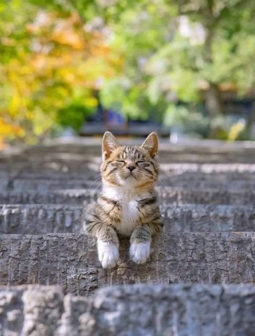

Cred că creierul a transmis semnal corpului să oprească toate turațiile motorului și să mă lase la un minim de efort și de rulare, altfel nu-mi explic noaptea dintr-o bucată care a trecut instant prin fața ochilor închiși a somn și nici senzația asta de minimă activitate pe care o am în corp, în astă prea dimineață. M-am trezit simplu, fără grabă dar și fără chef de trezire. Am oboseala-n toate celulele și chiar dacă emoționalul m-a ținut în priză să îndeplinesc tot ce mi-am propus zilele astea, corpul meu, și-așa hărtănit, îmi strigă deja că e la limită. Frate porc, zău că te înțeleg, zău că aș dormi o lună-ntreagă dac-aș putea, dar trebe să-mi sprijin oasele-n verticală și să-mi agit corpul în acțiunile necesare mamei. Nu-mi trebe apă, nu vreau smoothie, nu vreau cer sau timp magic, vreau somn și odihnă cât cuprinde, fără grija unei treziri și ridicări din pat. Afară se mărește ziua și la fel și lumina, în mine se lasă întunericul frustrării și începe dialogul răzvrătirii. Vreau să nu vreau. Să pot să nu pot. Să-mi permit să nu mai permit altora să-mi dicteze viața. Dar încă n-am găsit nici răspunsul și nici balanța aia care să mă ajute să mă-mpac și pe mine și pe mama și pe domnul meu și pe copila mea și toate treburile și toate viețuitoarele care depind de mine. Încă sunt într-o înverșunare aici, tocmai aici și tocmai acum când știu că principiul care ne guvernează e ăla al curgerii. Viața bate filmul, iar practica nu se aliniază cu teoria. Să curgă, nu zic nu, dar să mă lase o țâră să-mi trag sufletul că AM OBOSIT. Pe bune.

\*\*\*

Știu că mama e trează, până și știutul ăsta mă irită pentru că mă-mpunge cu andreaua prin gard, să mă mișc, să fac ceva când eu vreau să nu mă mișc și să nu fac ceva. Domnul meu și cu Spiky dorm profund, niciunul nu mi-a simțit trezirea, e drept că sunt încă mică în mișcări, și tare i-aș însoți și eu în leneveala asta faină în pat. 

M-am supărat ca văcarul pe sat și uite că n-am chef de nicio mulțumire, de parcă pe Univers îl doare-ntr-o coastă dacă eu, Biannca Locatelli, îi trimit azi umila mea mulțumire sau nu, mă notează acolo într-un răboj și-mi dă nana cu prima ocazie. Știu că mă faultez singură, dar azi nu-mi arde de nimic. În loc să văd că mă văduvesc singură de momente calde, de bine, mă încrâncenez și mă hotărăsc să trec și peste ceremonialul mulțumirilor și peste verificarea stării de bine sau nebine a corpului și plec din cameră. Decid să rup starea asta de toropeală și plec să mă apuc de treabă.

\*\*\*

Asta e intenția minții dar ea a uitat să dea comanda de la panoul central și corpului, să mă ajute să și ajung acolo unde vreau. Mă dor toate, orice mișcare se lasă cu durere în mușchi, am nisip parcă în ochi și mi-i simt uscați, la fel mi-e și gâtul, de fapt senzația asta de uscăciune pare că-i generală în corpul meu. Nici nu-i de mirare că ieri nici ceaiul nu mi l-am băut pe tot. Ok, lasă că beau apa caldă și se rezolvă.

Greșit! Prima gură de apă caldă a fost și prima de vomă. Mi-a revoltat apa caldă întreg stomacul, că-ntr-o clipă mi-a fost la gură și-n a doua a început deversarea. Sunt din nou, cred, într-o criză de bilă de data asta, într-o manifestarea total nouă pentru mine: nu mă mai ia prin învăluire cu durere de cap și apoi cu greața, ca de abia la final să se lase cu episoade vomitive, de data asta începe cu finalul, să mă curețe direct. Cum spuneam, cut the craps. Deși nu-i mai plăcut modul ăsta nou, trebe să-i dau meritul și să spun că e drumul cel mai scurt de a intra, bălti și ieși dintr-o criză biliară. Dacă asta o fi. Că poate să fie și o revoltă cu totul nouă a corpului, ca reacție la oboseala cronică deja. Am scos tot ce avem în stomac, nu prea multe, că nu prea am mâncat ieri și m-am așezat moale ca o cârpă pe colțarul din living. Corpul și-a făcut numărul, nu am înțeles mesajele lui repetate, m-a pus lată ca să pricep naibii o dată că enough is enough. Cum să-i explic eu că înțeleg cu subiect și predicat toate semnele lui, dar el nu, ce îi spun eu?! Cum să-l fac să priceapă că eu aș sta dacă aș putea, dar nu pot! Nu vine nimeni să mă ajute. Nu e aoleală, e purul și singurul adevăr. Nu mă mai plâng dar nici nu mai tac din teama că s-ar putea interpreta că mă plâng. Nu am răspunsuri, pentru că nu am ajutor la capitolul ăsta. Nu înseamnă că n-am tot ajutorul de la domnul meu sau de la copila mea dar în anumite limite firești, pe care și le poate asuma fiecare. Nu e nici vina lor, nici responsabilitatea lor faptul că eu mi-am asumat viața maică-mii. Așa că, dacă am asumat-o, trebe să merg până la capăt. Indiferent care va fi ăsta.

\*\*\*

Nu mai insist cu apa, care s-a și răcit între timp, nu-mi mai caut cu privirea nici cerul azi, ci fac un singur smoothie, pentru mama și mă întăresc să-l duc la ea. S-a trezit, nu s-a dat jos din pat, stă și se uită ba la televizor, ba pe pereți. 

Nu mă dă entuziasmul pe dinafară, nici ea nu pare trezită cu totul, e numai bine că ni se întâlnesc liniștite și decid să rămână așa, nespuse. Îi mulțumesc mamei în gând că nu mă ia nici cu tânguieli, nici cu priviri din alte lumi, fac mecanic, cu stomacul strâns și mic, mai strâns și mai mic în baia ei, unde strâng de suprafață, până oi fi, mai târziu, în stare să fac cum trebe. Acum vreau să las smoothieul, să-i dau lui Sassy să mănânce și mamei impresia că totul e ok. Cred că am reușit.

\*\*\*

Mă reașez pe colțarul din living și, dacă tot nu pot face nimic, măcar să mă apuc de scris, de ajuns cu postările la zi. O fi din perfecțiunea mea prostească, sau dintr-o dorință de a nu mă dezamăgi eu pe mine căzând într-o inconsistență, dar nu-mi place când nu reușesc să aștern trăirile zilei în ziua în care s-au petrecut. Sunt tare în urmă și mi-am propus să mă adun și să mă repun pe șine și pe făgașul pe care mergeam eu, lin și cătinel, în 365 de zile de scris zilnic. Sunt cu câteva zile în urmă dar colica biliară mi-e aliat acum, dintr-un alt punct de vedere, și vreau să mă aduc la zi.

Am terminat de scris și editat o zi până la micul dejun al mamei și, cufundată cu totul în scrieri și simțiri, am și uitat că mi-a fost rău. Ce mișto! În continuare nu pot să înghit nimic, dar nici nu mai încerc. 

\*\*\*

O aduc pe coana mare la micul dejun care are, din nou, întrebarea ei clasică pe buze: cine și cum a găsit-o la ea acasă, atunci când i-a fost rău? De ce o chinui-o întrebarea asta, mă depășește. Îi răspund mai mult ca să-i potolesc curiozitatea, dar când insistă și vrea detaliile "suculente", îi tai destul de brusc macaroana. Nu vreau să alimentez o tânguială și-o plângere de milă, ce a fost, a fost, e norocoasă că am trecut pe acolo fix atunci și asta e, end of story. 

Adevărul e că într-adevăr povestea pare fantastică. În anii trecuți, drumurile mele în orașul natal erau rare, de două ori pe an, de sărbători și atunci stăteam puțin, că trebuia să bifăm și alte două vizite, în alte două localități învecinate. Anul trecut, șansele ca noi să trecem pe la ea, fix când ea era căzută lângă pat, fără capacitatea de a înțelege ce e cu ea și ce trebe să facă, erau aproape nule. Și totuși, Universul ăsta a făcut ca noi să mergem la părinții domnului meu și la întoarcere, să trec să-i las mamei țuica pe care o tot cerea, ca să bea un păhăruț de țuică fiartă de sărbători. Cine s-ar fi gândit că lucrurile vor lua o așa întorsătură? Că nu era ca și cum stăm la trei blocuri distanță unii de alții, ci la două ore de mers cu mașina. Cred că și pentru ea a fost greu, smulsă din locul ăla familiar în care a trăit o viață, de lângă prietenii și oamenii apropiați. Dar acum suntem aici, ce a fost nu se mai întoarce și nici nu găsim sau vedem acum motivele adevărate pentru care lucrurile s-au întâmplat cum s-au întâmplat. La drept vorbind, până la finalul vieții noastre, fiecare va înțelege ce poate din experiența asta.

\*\*\*

În timpul micului lui dejun, domnul meu se hotărăște să vină cu mine, să văd un corp de mobilă pe care l-am găsit pe olx și care mi se pare uimitor. E în București, are un preț fenomenal și e o raritate. Mă bucur că alege el să vină, nu că-l fac eu să vină, pentru că nuanța asta e importantă. Când decide el o acțiune, șansele ca apoi să se aricească de la căldură, de la foame, sau de la orice altă posibilă cauză, scad dramatic. Și mă mai bucur pentru că nu mai sunt inconștientă cum eram odată, când mă duceam singură și mă trezeam într-un apartament, cu un necunoscut, care încuia de trei ori ușa pe dinăuntru și-mi îngheța sângele în vene. Nu i-am spus niciodată de experiențele astea, pentru că m-ar fi certat că sunt atât de naivă, dar eu le-am trăit și am învățat din ele.

\*\*\*

Timpul pe care-l am până la plecarea în București mi-l consum pe spălarea, ștergerea, cântărirea și pungăluirea a 9 kg de afine de cultură, aduse de domnul meu direct de la sursă. Sunt 4 lădițe a câte 3 kg, dar vreau să-i dau o lădiță și copilei. Sunt multe și mărunte și-mi ia ceva timp să le spăl în câteva ape, să le scurg, să le șterg cât pot ca la congelator să nu se lipsească bobițele între ele și să se facă o borșeală. I le pregătesc și pe ale copilei la fel, o anunț pe mama că plecăm dar venim repede-repede și gata, ne-am aruncat cu curaj în miez de zi, în miez de căldură.

\*\*\*

Nu știu de unde, clar nu din viața asta, am o atracție irezistibilă către casele cu camere înalte. Ca de palat, de altfel. Anii trecuți, când mă plimbam în weekenduri prin București, în zonele cu case vechi și superbe, tare aș fi vrut să rog câte-un proprietar să mă lase să intru, să văd arhitectura casei pe interior. Evident că nimeni n-ar lăsa una de pe stradă să-i intre în casă, dar eram atât de ingenuă și atât de disperat de doritoare să le văd, că-n visele mele era posibil ca cineva să zică da. Tipul la care am ajuns azi, tânăr, nu are o casă veche dar stă într-un bloc vechi, din centrul Bucureștiului, cu camere înalte de 3,5 m. O nebunie. Corpul de mobilă, într-adevăr uimitor, e masiv și mult mai mare și impunător în realitate. În apartamentul ăla fain, cu camere cu amplitudine, nu se simte masivitatea atât de puternic și nici nu lovește privirea, dar la noi în casă, la 2,6 m înălțime, sigur ar fi părut elefantul din încăpere. I-am mulțumit, i-am vizitat tot apartamentul, mi-am hrănit niște vise și satisfăcut o curiozitate și am plecat înapoi, tot în miez de zi, într-un miez și mai mare de căldură. Îmi pare rău de nereușită dar nu-mi pare rău că am fost să-l vedem. Plus că tipul, blând și calm, parcă mi-a resetat experiențele anterioare și mi-a restaurat încrederea în umanitate. 

\*\*\*

Am ajuns fiartă acasă, cu tot aerul condiționat din mașină. Și din fierbere, dau în coacere, că trebe să-i pregătesc mamei o garnitură lângă friptura de porc rămasă de ieri. 

Gândul îmi fuge la bălăceală, alimentat de o nouă poză de concediu primită, din Thassos, cu o apă albastră și bănuiesc eu, rece. Ptii, dar ce bine mi-ar fi și mie să stau într-o apă! N-am mai avut bucuria asta de ceva ani, așa că nu mai pot s-o recreez cu acuratețe, dar știu cât de mișto e dușul, așa că-n mijlocul bucătăriei, mi-am pus corpul într-o bălăceală imaginară. Am simțit apa călduță pe piele, cum mă îmbrățișează, am simțit libertatea supremă pe care eu o asociez, nativ și involuntar, cu apa. Creierul nu știe diferența între realitate sau imaginație așa că răspunde cu o stare roz la imaginația mea albastră și rece. Are dreptate Dispenza, gândurile îți pot face bine sau îți pot face rău, te pot face bine sau te pot îmbolnăvi. Cât de fabulos este corpul ăsta, cum ne pune el la dispoziție toate uneltele iar noi îl tratăm ca pe o mârțoagă, pe care-o obosim peste măsură și-o mai și certăm când nu mai poate trage. 

Tot în mijlocul bucătăriei, m-a năpădit un fluviu de lacrimi. Îmi plâng de milă. Mi-e milă de corpul meu obosit și mi-e milă de mintea mea care nu găsește o soluție viabilă și eficientă. Sunt sătulă de sfaturi de genul "Dar nu le mai face!", vreau soluție acolo unde eu nu o văd. De când nu mai lucrez, nu m-am simțit îndreptățită să vreau un concediu, pentru că credința limitativă a mea dar mai ales a altora, mi-a închis mereu gura: dar stai acasă toată ziua! Cu timpul, chiar dacă am înțeles și am văzut pe pielea și pe mine că muncesc acum mai mult decât munceam când aveam job, am renunțat să mai conving exteriorul, dar m-am complăcut și am acceptat tacit poziția lor: eu stau acasă. Cuvintele astea sunt sabie care m-au făcut să mă simt mai puțină, mai prejos, mai neîndreptățită să cer sau să vreau. Numai că ele nu sunt ale mele, nu mai vreau să cred în ele și nu mai vreau să le las să-mi creeze o realitate strâmbă. Partea proastă acum e că nu mai am nici timp, nici libertatea de a mă duce să stau într-o apă doar din plăcerea mea imensă de a simți apa. De fapt, de a simți libertatea.

\*\*\*

M-am întristat, am adus-o pe mama la prânz, am dus-o pe mama sus, am strâns, am pus masa pentru noi, am strâns și n-am mai avut chef de nimeni și de nimic. Mi-am luat laptopul și m-am cufundat în scris, măcar așa fac 2 în 1: mă aduc la zi cu postările și uit de plângerea asta de milă, care mi se întinde pe sub piele și-mi dă cu valuri de lacrimi pe la ochi. I'm only human.

\*\*\*

Închid o zi care, cu două excepții, nu mi-a făcut mare plăcere. Corpul mi s-a revoltat, mintea mi s-a dus cu ușurință pe cărări ciulinoase care m-au zgâriat pe inimă. Am trăit azi durerea fizică dar și un pui de disperare, că nu găsesc ușa aia să ies din realitatea care nu-mi servește interesele imediate. Știu clar, nu știu de unde dar știu, că realitatea asta e treapta aia de pe scară de care trebe să trec ca să văd mai de sus, să am o perspectivă mai largă, dar mi s-a prins piciorul într-un cui de disperare pe treapta asta și s-a-nțânat acolo, nu mai ridic piciorul către următoarea și-am rămas să mă băltocesc în perspectiva asta redusă de perspective. E totul doar un joc, de cuvinte, de trăiri, de încercări, dar azi nu i-am mai gustat dulceața. Mai e și mâine o zi. Cred.

\*\*\*

Ca să nu închid ziua tot fără mulțumiri, cum mi-am început-o, mi le listez scurt, sec, dar prezentă:

1. Pentru scurtătura pe care a luat-o colica biliară, azi!
2. Pentru camerele înalte și mobila maiestuoasă de lemn masiv!
3. Pentru imaginație!

Clipa mea de fain este:

