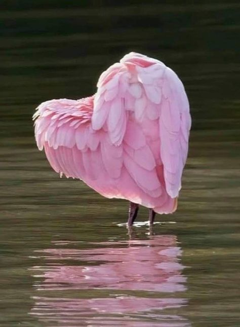

De două nopți nici Spiky nu-mi mai caută compania, semn că vibe-ul meu devine respingător. Cred și eu, că iar m-am trezit cu fața la cearșaf și cu un sfredeluș care-mi pătrunde toate oasele și mușchii.

În prea dimineața asta mi-a venit în minte, din nou în miimi de secundă, amintirea saltului cu parașuta. E o întreagă filozofie un salt cu parașuta, iar în prea dimineața asta am claritatea mentală să văd similaritățile dintre el și viața mea. La fel ca-n saltul cu parașuta în care m-am avântat inconștientă, să sar, și-n viața mea am făcut la fel. De puține ori am gândit cu adevărat consecințele, de multe ori am acționat impulsiv sau compulsiv, aș zice acum. La fel ca și-n salt, prima parte e o nebunie haotică din care n-am înțeles nimic. Când am pășit în gol, din avion, la 4000 de metri altitudine, am avut impresia că m-am aruncat într-o mașină de spălat care m-a învârtit pe toate părțile încontinuu, cu o viteză amețitoare și, deși îmi încordam toți mușchii, gravitația și forța cu care mă învârtea tamburul mașinii de spălat mi-au anulat orice control. La fel și-n viața mea. Doar că saltul cu parașuta are o parte, finală din păcate, sublimă, de plutire. Cred că stropul ăla de divin este drogul care-i atrage pe parașutiști over and over. Well, în acest moment al vieții mele am devenit conștientă că aștept cu nerăbdare plutirea, deși asta vine inevitabil cu finalul. Vreau să ies din mașina de spălat. Partea nașpa e că vrutul nu e suficient.

***

Aseară, în timp ce-mi făceam dușul și apa asta faină mă curăța de negreala simțirii și nesimțirii de peste zi, mi-a devenit limpede un lucru: încă n-am tras linia și n-am făcut totalul ca să pot trage o concluzie consistentă, dar timpul ăla mic al meu cu mine, în fiecare dimineață, în care-mi rostesc fie și numai o singură recunoștință, nu mi-a făcut niciodată rău. Și dacă nu mi-a făcut rău dar are potențial de bine spre foarte bine, n-ar fi prostesc din partea mea să-l anulez, doar așa, de răzvrătire? Ș-apoi, în fața cui mă răzvrătesc, pe cine pedepsesc cu neținerea și nerostirea ritualului meu? Doamne, cât de perfidă și cât de prezentă e în mine credința că cineva acolo, în afara mea, dar nu știu cine anume și nu știu unde, îmi face rău, iar eu îmi iau jucăriile și plec. Privit din punctul ăsta de vedere, supărarea asta a mea e de-a dreptul hilară. Doar știu că nimeni nu-mi poate face rău decât dacă-i permit eu. Drumul ăsta în care să-mi asum pe deplin responsabilitatea a cine sunt e lung și îngust, mi-alunecă ușor pasul pe lângă și mi-e dulce fructul pe care-l găsesc acolo și din care mușc cu toată gura: e mereu "altcineva" sau "altceva" care e împotriva mea și a fericirii mele. E infinit mai ușor să dai vina pe altcineva decât să te asumi. Și atât de simplu și atât de natural. Dezvățul ăsta cred că e unul dintre cele mai grele din câte am exersat eu.

***

Așa că, deși mă simt greoaie ca un elefant, din toate punctele de vedere, m-am văzut un colibri ce-a fugit acolo, în mine, în edenul plasat acolo, în adânc și-am mulțumit cu prezență că sunt în viață. Am stat în mulțumirea asta, nu m-am grăbit către nicio alta și mi-a fost de ajuns. M-am întors caldă la realitatea din cameră și la papucii ce mă așteaptă cuminți.

Spiky doarme pe prima treaptă a scării, giiiz, da' departe a alungat-o energia mea ne-bună! Trec încetișor pe lângă ea, dar se trezește și mă însoțește veselă, spre parter. O iubesc pe zvârlugă  iar articularea asta în mine aduce un zâmbet pe buze. Hai că e binișor.

Îi dau să pape ei întâi, să-mi întorc într-un fel recunoștința pentru veselia cu care m-a însoțit și apoi îmi văd de ale mele. Făzăneii sunt iar în curte iar pe mine mă trece, la propriu, un fior, ca un scurtcircuit prin corp, când realizez că simt cum mi-am pierdut legătura și apropierea cu mama natură, cum n-am mai apucat să fac împământare, cum n-am mai stat în trifoi, cum n-am mai buruienit, cum n-am mai trăit clipe prezente afară iar asta se simte în dezrădăcinarea cu care mi-am trăit zilele astea ce-au trecut. Era să zic, ultimele zile, dar mi-a sunat lugubru și-am corectat. Este posibil ca ruperea asta de pulsul atât de mișto și de viu al pământului să mă ducă la netrăire și nepăsare? Da, e posibil iar fiorul ăsta mi-a validat, scurt și intens, adevărul din această posibilitate.

Las totul și ies afară. Mă descalț și mă plimb prin trifoiul ud și rece, cu lacrimi mari și fierbinți pe obraz. Mă simt ca un copil al Universului ăsta mare și simt o mare nevoie de grijă, de protecție. În fiecare pas pe care-l fac, pun și-o grijă, și-un gând de greu, și-o durere și le las în spate. Am ajuns în fundul grădinii și udă, și plânsă, și goală, și plină. O singură dorință n-am reușit s-o pun în niciun pas: aia de a fi protejată, îngrijită, de cineva din afară. Acum, eu nu sunt capabilă să-mi fiu asta.

A alunecat apa asta caldă la marele fix, mai ales că am picioarele reci și mă trece câte-un frison cu pielea de găină. Ca să închid frumos momentul și să-l fac complet, îmi agăț și ochii acolo în înaltul limpede și clar de azi, albastru curat, și îi pun și lui o intenție în palmă: să-mi fie bine. Cum înțelege Universul ăsta că e bine pentru mine.

***

Subiectul zilnic dezbătut de mama, cu participare minimă spre zero din partea mea, este cel al transpirațiilor ei. La petrecerea mamei, una dintre colegele ei a spus o chestie pe care eu nu o știam sau am uitat-o: că mama, de când o știe ea, și o știe de dinainte să mă nasc eu cu mult, așa a transpirat tot timpul. M-am bucurat că a spus-o de față cu mama, dar ei nu i-a plăcut și nu a rețint asta. Nici nu intru bine în cameră, că și începe să se plângă, că transpiră într-una, că nu doarme, că nu știe ce să mai facă.

Mă uit cu atenție la ea, să văd dacă e în lumea ei sau e cu mine în realitatea noastră și decid să încerc marea ci degetul: Măi mamă, cum să nu-ți fie cald când tu stai cu bluză groasă, cu mânecă lungă, cu toate geamurile închise și cu pilota pe tine?! Afară e vară! Nu crezi că e normal să transpiri?! Chiar dacă tu nu știi că e vară, corpul tău știe!

Se uită la mine și dacă privirea ar ucide, acum aș cădea secerată. Nu-i convine ce spun, deși tonul mi-a fost calm, și începe cu scuzele și cu fabricarea de scenarii. Nu o mai ascult, deschid geamuri, iau pilota de acolo și îi dau haine ușoare, de bumbac, să se schimbe. Se ambiționează, eu nu reacționez, o las în pace și-mi văd de treaba de la baie. Nebăgată în seamă, mama se schimbă și când mă întorc în cameră, găsesc o față relaxată, care-și bea smoothieul. Drăgălesc pisica, îi spun că e superbă, mama se leagă de complimentul meu pentru Sassy și amândouă am uitat momentul de încrâncenare ce tocmai a trecut. Bun așa.

***

Roșiile mele m-așteaptă să le ud, la fel și florile, și smochinul și puiucii de liliac. Experimentul meu din vara asta mi-a mâncat timpul liber, uneori magic, dar cred că e momentul să-mi asum asta. Da, aș face altceva acum, dar am bibilit 9 luni la roșiile astea, de la sămânță la rod, că ar fi de-a dreptul idioțenie ca acum să mă opresc. Roșiile soiul "inimă de bou roze" sunt cele mai mari dar cherry-le galbene rămân preferate mele. Aștept să se coacă deplin roșiile "Negru carbon" să le simt și lor gustul. Daliile mele înfloresc întruna, sunt superbe, iar smochinul meu, mai scund de-un metru, crește cu grijă 3 smochinuțe. Mai am 2 smochini, în curtea mare, care au aceeași vârstă, dar sunt tare piperniciți. Ăsta din curtea de flori, a stat un an întreg sub formă chioară de simplu băț, de vreo 15 cm înălțime, ca anul ăsta să explodeze în creștere. Totul e surprinzător în viața asta și fiecare poate fi o lecție dacă-ți pui ochelarii ăia buni de privit pe nas. Culmea, deși port ochelari de mică, câteodat-au fost de cal, alteori n-am văzut deloc prin ei, acum încep să mi se deschidă și lateralele. Doamne-ajută, cum vine vorba!

Piersicii sunt plini de rod, din păcate toate sunt jumătate înnegrite. O să le culeg și-o să le arunc, nici măcar la compost nu mă risc să le pun, să nu trec boala de pe-un an pe altul. Din toamnă, o să încep să-i tratez, să-i fac bine pentru sezonul următor.

M-am umplut de natură și mi-a făcut bine. Binele ăsta a fost întotdeauna acolo, dar nu l-am mai văzut de ziduri.

***

I-au rămas trei feluri de cașcaval, mozzarela, felurite mezeluri "alese", roșii la discreție, pe soiuri, ardei gras, castravete, lapte bătut, iaurt, iar mama ar mânca sendviș de pâine cu pâine, dacă se poate. I le scot pe toate, i le înșir pe masă, să vadă opțiunile, nu doar să le audă. Frica aia de a nu avea o face să vrea cât mai mult, din cât mai multe, dar sfârșește prin a mânca puțin. Nu mai poate. Dar ceva dulce am? Nu pot s-o mint și nici nu pot să nu-i dau și ei puțin tiramisu, pe care-l termină instant. Iaca, s-a mai putut.

În timp cu urcam cu ea, să-i dau cu cremă pe unghii, o auzeam în spatele meu cum pufăia și mi-am surprins un strop de iritare. De abia s-a ridicat de pe scaun, când naiba a și obosit?! Îmi impun să nu mai judec și o aștept sus. Aici, reîncepe subiectul transpirațiilor.

***

Acum ceva timp, am adus de la copila mea un ventilator. Nu i-a plăcut. Domnul meu s-a dus și a cumpărat altul. Nu i-a plăcut nici ăla. Azi mai fac o încercare: are Mr. H pe undeva un ventilator mic, de birou. Nu e puternic, cât poate să facă un ventilator de birou?! O cremuiesc și plec să găsesc și aduc ventilatorul. Mă coțopenesc să acomodez și micuțul și după ce-i dau drumul, am surpriza maximă, care m-a biciuit efectiv, să aud: nu, nu-mi trebe așa ceva! Că bate tare și ultimul lucru pe care-l vreau e să răcesc! 'tu-i mama ei de treabă, păi da nu-s eu singura tâmpită din situație?! M-au apucat niște nervi teribili, am luat prăpăditul ăla de ventilator și dusă am fost! N-are decât să stea în saună, nu știu ce naiba îmi mai trebe să pricep odată că nu mai gândește coerent, dar eu cică da, și să mă opresc. Partea proastă este că eu nu pot să nu gândesc, nu pot să înțeleg cum e să nu gândești și d-aia nici nu mă pot opri din enervat. Mi-am stricat tot zenul și simt cum clocotesc. Pentru că știu, văd, că nu îi e bine și orice soluție cu care vin e respinsă. Mă enervează că sunt neputiincioasă, mă enervează că e neputiincioasă.

***

S-a pornit ploaia, la fix, că și-așa aveam o stare de rahat, numa' bine să mă alimentez și de afară cu griul ăsta ce s-a pus pe cer. Cu gânduri și dialoguri și reproșuri în minte ca niște țânțari tembeli, mă apuc să pregătesc prânzul pentru noi și pentru ea. Și, ca să mă decuplez total de la un prezent nervos, o ascult pe Connie.

Dacă am un mare regret, dar mare regret, este că nu m-am dus la cursul ei de relații, la care voiam să mă duc. I-am scris pe email, mi-a răspuns, dar pentru că m-am lăsat influențată de cineva care-a plasat valoarea cursului la "nu merită", nu m-am mai dus. Iar acum, nu mai am la cine. E un regret care mă inundă cu lacrimi și dau vina pe ceapa pe care-o tai, ca să nu-mi recunosc prostia. Cu cât o ascult mai mult, cu atât îmi dau seama cât de mult semăn în gândire și în exprimare cu ea. Ascult diverse dialoguri de-ale ei cu diferite personaje și nu pot să nu văd strălucirea și farmecul ei irezistibil, care iese la iveală mai ales dacă interlocutorul e cel puțin dibace, că n-am văzut unul care să se ridice la ștacheta pusă de calitatea ei.

Am nimerit azi un dialog care mi-a contribuit imens și care a articulat atât de simplu ceea ce știu și am știut tot timpul, dar abia încep să practic: nu există evoluție.

Acum câțiva ani, am întâlnit o femeie, profă de yoga, tare diafană, care mi-a dat una peste ochii "spirituali" de atunci, pe care multă vreme n-am înțeles-o: în cultura indiană tradițională, nu există principiul evoluției. Astăzi, Connie, mi-a și explicat de ce: pentru că noi suntem "după chipul și asemănarea lui Dumnezeu" deja. Noi suntem deja dumnezei. Doar că peste aurul ăsta noi am pus, în decursul omenirii, zoaie de păreri, credințe, frici, judecăți, care-au astupat dumnezeul și, nemaivăzându-l, ne-am pierdut. Tot ce trebe să facem de fapt este să ne întoarcem la "chipul și asemănarea lui Dumnezeu", să dăm la o parte mizeria și să ne reamintim. Atât. Spus atât de simplu, a aprins ditamai farul în mine și, pentru că în ultima vreme sunt o plângăcioasă, mi-a rupt un mare zăgaz de lacrimi, care s-au pornit ca nebunele. E-n plânsul ăsta și regretul că mi-am refuzat ocazia de o întâlni pe femeia asta fantastic de mișto, și neputința care mă-ncearcă prin demența mamei, deși eu mă comit să mă spăl de rahatul de pe ochi și conștiință, e și-un plâns de milă, e și-o răcorire.

Am terminat de gătit și am făcut pace cu mine. N-am reușit să fac pace cu mama însă și cu aoleala ei continuă.

***

Recunosc că nu am chef să o aduc la prânz, pentru că nu mai am răbdare. Nici să aud repetițiile ei, nici să văd absența ei, nici să ascult plângerile nesfârșite. Nu mai am răbdare și nu vreau să bag asta sub preș. Îmi dau seama că doar o ființă nepământeană, angelică, care nu există aici, în realitatea asta fizică, ar putea să aibă răbdarea și căldura și dragostea infinită de care ar avea nevoie un bolnav de demență. Rectific, pentru că nu știu ce are nevoie de fapt un bolnav de demență. Răbdarea și căldura și dragostea infinită m-ar ajuta pe mine, dacă le-aș avea, să nu mă mai critic, să nu mă mai judec, să nu mai sufăr când nu le am. Adică ar satisface un ego. Guess what? Nu sunt nici nepământeană, nici angelică! Am voie să fiu orice și am voie, câteodată aș zice că-s chiar îndreptățită, să m-apuce toți dracii din lume, să nu mai am răbdare, să vreau să se termine coșmarul ăsta oribil. Și la fel e pentru toți cei care au în grijă un bolnav de demență. În perioada de dinaintea pandemiei, ca și acum de altfel, tot aud povești în care personalul medical, de orice natură sau specializare, pare lipsit de empatie. Nu știu cum e la ei, dar la mine, la o scară mai mică, unde nu văd sfârtecări și alte grozăvii, pot să spun că da, cu timpul, te imunizezi. Auzi plângerile și nu le mai auzi, auzi repetițiile și nu le mai auzi, îți închizi frecvențele pentru că altfel, este un consum emoțional infernal, care duce la o sinucidere lentă.

Iar asta nu-l ajută nici pe bolnav și, în mod cert, nici pe îngrijitor. Eu încă nu sunt acolo, nu m-am imunizat total, încă mai sufăr, că e mama, încă mai judec, că nu pot concepe, încă mă mai enervez, pentru că lucrurile sunt simple, la mintea cocoșului. Și totuși, în demență, mintea nu e nici măcar acolo.

***

După ce mama a urcat la Sassy a ei, m-am apucat cu domnul meu să tundem trifoiul. E o vreme ideală pentru asta, nu arde soarele și chiar dacă trifoiul e ud, în doi lucrurile se petrec mai iute. Într-o oră jumate am terminat de tuns trifoiul și mi-a mai luat încă pe-atât să strâng cu lăbuțele trifoiul crescut pe lângă gard sau în jurul copacilor sau al caprifoiului. Plus legat de roșii, plus curățat de flori uscate.

***

Am mai descărcat din nervi în mama natură și i-am pus la loc când m-am dus să-i curăț unghiile mamei. M-a bușit sauna de la ea, în condițiile în care afară e o vreme sublim de plăcută. Deschid iar larg geamurile, cu gesturi repezi și aproape că mă strâng în mine, fizic, când mama începe să se plângă că nu mai poate cât transpiră. O ignor o dată, de două ori, dar egoul ei, bătătorit 70 de ani, nu cunoaște limite, el vrea să sugă compasiune de la mine iar eu mă încăpățânez să nu-i dau. Strepezită toată dar hotărâtă să nu deschid gura ca să nu scap naibii vreo vorbă de duh, am dat zor cu unghiile, i-am dat pastilele și papa lui Sassy și aproape c-am zburat din cameră. Nu înainte de a mă face că închid geamul dar l-am lăsat rabatat, cu draperia trasă peste, să nu observe. Ei aș, am văzut pe cameră că n-am închis bine ușa după mine că a închis și ea, țâfnoasă, geamul. Dacă vrea să se coacă, n-are decât. Am făcut tot ce-am putut.

***

Îmi trebe multe dușuri, reci de-a dreptul, să-mi spele nervii care mi-au condus ziua azi. Cu mici excepții în care am trăit, în rest am băltit într-o stare de iritare, de judecată și de vină. Cum nu se poate mai proastă combinație. Cu toate astea, nu mă grăbesc să cataloghez ziua ca fiind de bilă neagră, am totuși niște mulțumiri pentru:

1. Reîntoarcerea la mine!

2. Reîntoarcerea la natură!

3. Contribuția lui Connie!

Clipa mea de fain este:

