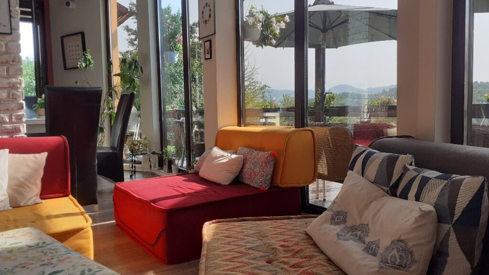
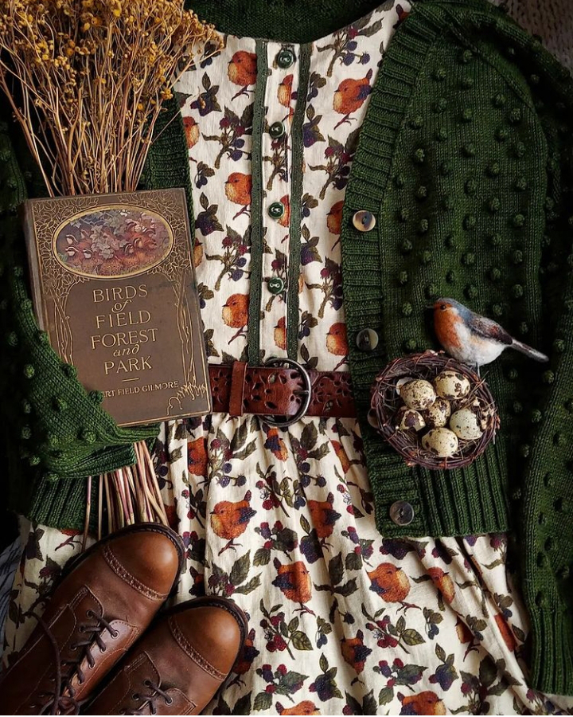

Nimicul ăsta care mă locuiește toată noaptea, aici la Akasha, e minunat pentru că mă îmbrățișează cu odihnă pură. E adevărat că și umblatul haihui prin sătucul ăsta fermecat, fix pe lungimea sufletului meu, mă pică lată seara, că adorm în timp ce fie îmi pun capul pe pernă, fie-i urez domnului meu noapte bună. Cred că o vorbă sau un gest rămâne neterminat, că mă înghite brusc și total un somn adânc. Nu știu dacă și ce am visat nopțile astea, dar știu că diminețile aici am altă pornire decât acasă. O fi exacerbare din partea mea și, vorba Ilenei Vulpescu în geniala ei "Arta conversației", toate bubele sunt acum pe capul "experienței mele de viață de acasă" și toate alea bune sunt la Akasha? O fi extazul meu, de la fiecare bulb de clipă, rezultatul evadării mele dintr-un cotidian strâmt? Habar n-am și nici nu cred că mă interesează răspunsurile astea pentru că nu contează. Esențialul acumului meu este că trăiesc cu atâta voluptate clipa și că mă bucur atât de plin și de inocent de zilele astea superbe, încât orice alambicare o fi făcut mintea sau inima mea ca să sug seva lor nu-mi poate fi decât benefică. 

Alarma asta de yoga a telefonului lui Mr. H iar mă smulge din dulcea picoteală în care mă lăfăiam. M-am trezit cu puțin timp înainte dar, pentru că nu mă fugărește nimeni și nimic, stau așa într-o stare mișto de plăcere. Îmi pleacă întregi și clare toate recunoștințele către Universul ăsta care mi-a dat imens în ultimele zile, și, în afara nasului gogonat de alergia la ambrozie și un stropșor picioarele de la atâta mers, sunt toată rotundă într-o bucurie de viață, niciun colț nu iese hâd de pe nicăieri.

Domnul meu, deși și el e obosit, are voința și curiozitatea și plăcerea de a se duce la yoga.

Nu că nu mi-ar plăcea dar și azi, în spatele scuzei cu alergia și mucii aferenți, stă tot lipsa de voință. E o mică răzvrătire în mine, lașă și aiurea de altfel, dacă ar fi să o iau la bani mărunți, care nu vrea să facă nimic altceva decât bunul meu chef. Zilele astea nu vreau să înghit nicio impusă, vreau să mă hrănesc doar cu ce simt că am poftă și mi-e lin să fac. Fain este că, din nou, după ce mă conversez cu mine, tot nu mă simt vinovată. 

M-am întins prin tot patul, am scrollat prin social media și am sfârșit prin a pune muzică. Nu tare, că poate or mai fi leneși ca mine, dar îndeajuns încât să-mi dea scântei în interior.

M-am apucat să strâng bagajul pentru că după micul dejun, îl încărcăm în mașină, chiar dacă noi încă o să mai umblăm să mai cuprindem niște munte în inimă, să ne țină ceva mai mult. Mă încearcă regretul și-mi dau seama că la mine încă nu s-a încetățenit înțelepciunea aia care să mă bucure că ceva a existat în viața mea, la mine încă stă tulburarea că se termină ceva ce a fost sublim. Am o mică strângere pe care o simt în gât dar încerc să mă concentrez pe muzică și pe făcut, ca să nu iau notă de simțit.

\*\*\*

Sunt dezmorțită, îmbrăcată și dornică de-un ceai fain și-un verde cât cuprind cu ochii. Îmi pregătesc tacticos ceaiul, azi ceai verde cu bucăți de portocală și-un strop de lemn dulce și ies pe terasa de unde mă pot înfrupta și cu yoga, care se petrece pe terasa de dedesubt, dar și cu spectacolul naturii care mi se desfășoară în față. Cu ochii pierduți în colinele din față, aud engleza specifică indienilor, simt vibrația lui bună cum îi învăluie pe cursanții de azi de la yoga, ascult explicațiile pline de sens și atât de simple și îmi doresc, din toată inima mea de copil, ca acest moment să-mi devină veșnic, să rămână așa, să nu mai treacă nicio clipă peste această clipă în care totul mi se pare că e și simt că e perfect. M-am pus contră închiderii momentului și încerc din răsputeri să țin crăcănată minunăția asta care mi se întâmplă în fața ochilor și în adâncul inimii. Eșecul inevitabil descătușează lacrimile care oricum stăteau pitite în colțurile ochilor, gata să iasă pe scenă la semnalul dat de creierul care înțelege, cu toată forța, că se termină pauza mea. Și plâng și curg toată și mă las să iasă din mine neplecatul ăsta de aici, unde îmi este atât de bine și atât de curat în suflet. Ce noroc că am scuza alergiei la îndemână, pun plânsul pe seama ei și nimeni nu se uită într-o dungă la mine. Nu că mi-ar păsa, nu că s-ar uita. Ermetica din mine, aia care n-a lăsat decât extrem de rar pe cineva s-o vadă că plânge, încă își mai scoate capul din când în când și ascunde vulnerabilitatea.

\*\*\*

Ultimul mic dejun a fost, cum altfel, decât bestial. Piersici reci și zemoase cu banană coaptă peste care am scuturat lingurița de unt de arahide făcut proaspăt în bucătăria lor, porridge moale doar cu bucăți de curmale, mix de semințe înmuiate și un strop de scorțișoară, suc de măr, sfeclă, morcov și ghimbir și cafea. 

I-am îmbrățișat pe toți cu ochii și cu sufletul și din nou mi s-a încețoșat privirea: în zilele astea mici de timp și uriașe de simțire, m-am legat cu drag de cuplul ceh de yoghini, firavi dar care emană atâta putere, cu mersul lor cuminte și desculț și cu privirea în care poți să te oglindești atâta e de curată; de cuplul dolofan, stăpânii lui Maya, un pointer german de ciocolată, care formează împreună un trio excentric dar atât de mișto prin atitudinea copilărească a domnului, prin vestimentația super colorată a doamnei și prin dresajul exemplar al Mayei; de cuplul cu un îngeraș de fetiță cumincioară, cu ochi de căprioară, ce râde cu gura până la urechi la ai ei părinți, degajați și relaxați cum n-am mai văzut părinți de copil mic, așa, de ceva timp; de cuplul îngrozit de viespi dar capabil să recunoască asta cu zâmbet pe chip și autenticitate-n vorbă, fără jenă de judecată sau credință că-s mai puțin dacă au fobii, de proprietarii, deveniți și mai dragi, de pufuri, de livingul ăsta care a strâns în el mii de clipe frumoase cu oameni frumoși, de locul ăsta pe care-l simt binecuvântat prin însăși grija și atenția la cel de lângă a celor care i-au călcat pragul. 

Îmi las aici, forțată de împrejurări, un strop din suflet și o fericire adunată în trei zile mirifice. Plec repede că altfel mă jelesc cu gura mare și nu mă mai dezlipesc de câmpul ăsta plin cu nectarul necesar mie.

\*\*\*

Înainte de ieșirea din Peștera, ne-am oprit, așa cu jumătate de chef, la niște căsuțe de tip A frame, ca să vedem cum arată și cât costă. E o curiozitate a mea, mai puțin a lui Mr. H. Evident, ca mai toate interacțiunile umane din zilele astea, am dat fix peste proprietar care a avut generozitatea de a ne invita înăuntru și de a împărtăși informații. Casele sunt destinate turismului, sub numele de Amont Chalet, dar arată superb și grija la detaliu abundă peste tot. M-a cucerit amplitudinea camerei de la parter, care înglobează și un șemineu și pentru o fracțiune de secundă, am avut imaginea clară, reală, a unei seri de iarnă aici, la foc. Miroase a lemn demențial și cred că îi vom călca pragul și noi, ca oaspeți de data asta, cândva. Mi-am satisfăcut curiozitatea și sunt gata să mergem mai departe.

Următoarea oprire a fost în Poiana Mărului, un alt sătuc idilic, unde mergem să vedem un teren ce sună promițător. Sătucul ăsta, deși mai puțin cunoscut, are pantele mai line ca la Peștera, poate că nu e la fel de spectaculos, dar sigur e mult mai prietenos cu construcțiile. Ne-am umplut cămările sufletului cu noi priveliști, cu nou verde și cu miros puternic de pădure pentru că, la terenul pe care urcăm să-l vedem, nu se poate ajunge decât prin pădure, pe un drum forestier destul de precar. Cu toate astea, nu m-ar deranja ca drumul spre casă să treacă printr-o așa minunăție cu foioase.

Am ajuns la teren, e cocoțat pe cea mai înaltă colină, n-are nicio utilitate, e superb dar lipsit de orice practicabilitate apropiată. Pentru cineva care vrea să facă o posibilă investiție, poate fi jack pot, pentru noi însă lipsa oricărei utilități plus drumul destul de anevoios au fost show stoppere. Am luat însă cu noi plăcerea drumului și frumusețea locului și am purces din nou la drum.

Următoarea oprire a fost Șimon, un sătuc arondat Branului, unde aveam o sugestie de casă de vânzare. Aici bifăm toate căsuțele de utilități, curtea e măricică, are și ceva verdeață dar e o zonă dens populată, pensiune lângă casă lângă pensiune, prea mult pentru noi, care ne dorim ceva mai multă izolare. 

Gata, pornim spre casă cu credința-n suflet că, dacă va fi să fie, își va croi drumul către noi fie terenul, fie casa cu terenul de la munte. Nu mai împingem, nu mai îndoim realitatea după bunul nostru plac, știm că-n milioanele de realități posibile, e și una cu noi locuind la munte și dacă materializarea ei va fi spre creșterea noastră, se va întâmpla.

\*\*\*

Și la întoarcere am parcurs drumul în liniște, de data asta o țâră cu tristețe pe la toartele inimii. De la Bușteni până la Sinaia s-a mers înfiorător de încet, parcă să-mi lungească și mai mult și mai dinadins palida agonie a reîntoarcerii acasă. Ultima masă la care am fost servită am luat-o la Sinaia, unde am mâncat nesperat de bine la Crama Rina.

Gata, drum drept și fără nicio oprire până acasă.

\*\*\*

De cum am coborât de la munte, am simțit în plămâni aerul diferit și căldura soarelui mult mai puternică, noxele mai în largul lor și nepăsarea oamenilor mai intensă. Or fi credințe limitative sau impresii, dar ce mi-ar plăcea să facem stânga-mprejur și să ne întoarcem acolo de unde taman ce-am plecat. 

Acum mulți ani, cu puțin timp înainte de a-mi da demisia din corporația care mi-a înghițit anii pe nesimțitelea, luam masa cu un tip, vânzător și el la o altă mare corporație, căruia i-am spus, habar n-am cum am reușit să mă dezetanșeisez la acel moment, că nu găsesc oameni cu care să pot vorbi ce simt eu nevoia să vorbesc. Ce mi-a spus omul ăsta nu o să uit niciodată și spun și eu la rândul meu, poate face cuiva o diferență: dacă vrei mere, te duci la taraba cu mere. Taraba mea de mere bune e și la munte. Sau, e mai ales la munte.

\*\*\*

Acasă m-a întâmpinat o mamă căreia i se citea fericirea pe toate pliurile feței și ale inimii: ooo, ce bine că ai venit, mi s-a luat o piatră de pe inimă! Egoismul ăsta, bate-l vina! E bucuroasă că am venit, să pot să am grija ei, nu neapărat bucuroasă că m-am reîntors eu. Mda, mie tocmai ce mi s-a pus o piatră pe inimă când am văzut cu coada ochiului șmotrul ce mă așteaptă. Mâine, azi ar fi mult prea abrupt pentru sufletul meu.

\*\*\*

Spiky, care a umblat mult pe afară, pe unde știe ea, zilele astea cât am fost plecați, o fi crezut că am abandonat-o, că aproape că s-a întunecat și ea nu mai apare. Am ieșit și am strigat-o peste tot, pe unde știu eu că vagabonțește și când deja parcă-mi intra panica pe sub piele, am zărit mișcare la poartă și pe alee: vine alergând către mine!

S-a prins că ne-am întors, n-a vrut nici mâncare și a stat în picioarele noastre și apoi între noi toată seara. Și toată noaptea, să fie sigură că nu mai plecăm.

Mi-e dragă casa mea, i-am simțit sufletul bun, pe care i l-am crescut în anii ăștia în care am construit-o, de cum am intrat, dar recunosc că mă simt un strop stângace azi în ea.

M-am întors la aceeași rutină și încep cu dușul, care în seara asta n-a avut strălucirea dăților trecute și cu recunoștințele, care mi se îndreaptă către:

1. Micul dejun vegan delicios!
2. Aerul curat de munte și mama pădure!
3. Feeria pe care am trăit-o zilele astea!

Frumosul meu este:

