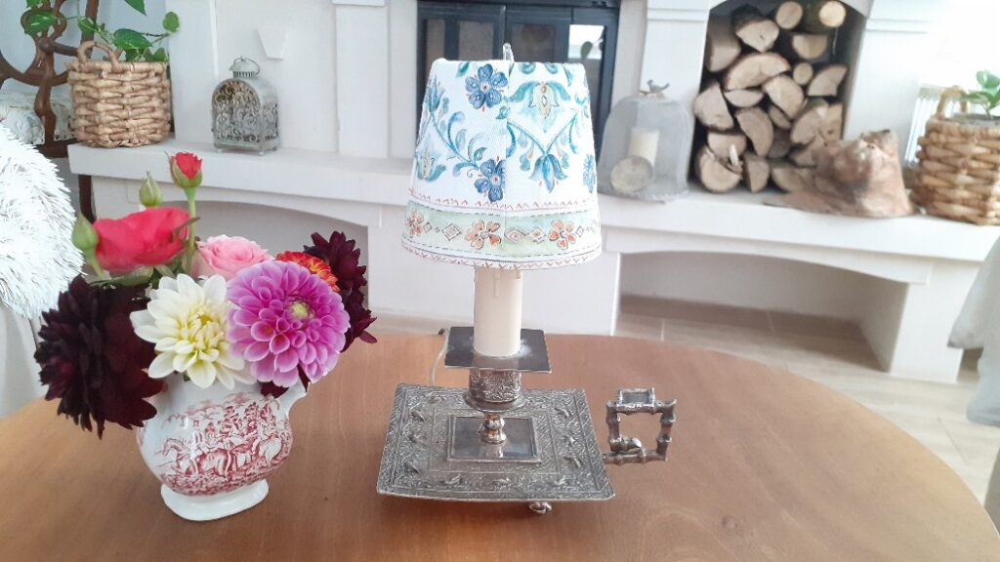
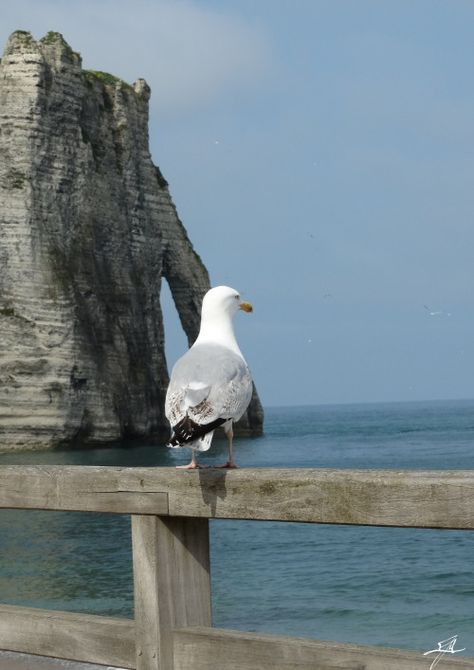

Alarma asta de telefon care urlă-n liniștea nopții și a somnului meu îmi dă de știre că e două noaptea, că trebe să-i dau medicamentul și gelul lui Mr. H. Dar îmi mai spune ceva și nu-mi place deloc: că mai sunt doar puținele ore și trebe să mă trezesc. Ora asta e o bornă de mijloc a nopții dar acum mi-aduce ceva senzație de vomă iar asta-mi sună mie în interior o alarmă: iar m-am obosit peste măsură, iar mă trage bila la răspundere. Cum eu nu am varianta de a sta în pat o zi și-o noapte, într-un somn și-o odihnă care să mă refacă și să nu mă adâncesc în colica biliară, tot ce pot face este să-mi dozez pornirile mele titanice de a face totul și să fac mici popasuri, de tragere de suflet și frână, pe parcursul zilei. Ok, o să încerc.

Mă reîntorc la somn, dar prădalnicul a zburat în altă parte sau s-a insinuat la domnul meu, care a adormit instant înapoi, iar eu încep să număr oi. O oaie, 10 gânduri, două oi, alte 10 gânduri, se înmulțesc nebunele astea exponențial și oile n-au nicio șansă. Habar n-am cum am ajuns la castele, de la castele am ajuns la scoala gimnazială, de acolo făceam proiecții în bugete în corporația ce m-a crescut și tot așa de ziceai că gata, îmi defileaza viața prin fața ochilor, până aci mi-a fost.

Am alunecat, într-o clipă de neatenție a șturlubaticei minți, într-un somn superficial, părea că dorm dar părea că și sunt acut atentă la ambientul dormitorului, cert este că lumina zorilor m-a găsit gata perpelită și pregătită pentru trezire. La cât de obosită m-am culcat, nu mă așteptam să nu dorm buștean toată noaptea, dar uite că nu a fost scris în stele așa. Sau în numărat de oi.

***

Probabil pentru că am fost mai într-o stare de trezie de pe la jumătatea nopții, judecata mi-e destul de limpede, nu mă încețoșează nimic și nici nu mă înghiontește vreo emoție.

Dacă tot sunt pe-un fundal calm, hai să mă întorc în mine, în zona aia altar, liniștită, atotcuprinzătoare și atotacceptatoare, de unde să mă uit un pic în jur. Într-un mod ciudat, a început să-mi placă singurătatea în care-mi petrec marea parte din zi dar solitudinea asta pe care o simt acolo, în interiorul meu, e de o frumusețe și o plăcere aparte. Acolo, în locșorul ăla intim din mine, nu mă grăbește nimeni, nu mă judecă nimeni, nu mă pune să fac nimic, acolo sunt un copiluț inocent, cu toate barierele jos și cu încrederea, dată de inocență, la cote maxime. În mine, atunci când e liniște și toate vocile sabotoare, tot ale mele dar împrumutate în decursul timpului, tac și nu mai strigă anateme, e cel frumos loc în care pot fi vreodată. Uit asta constant dar, doamne, aș putea să mă refugiez aici oricând de afară mă îndoaie câte-o circumstanță sau mă împroașcă câte-o percepție. Sunt indubitabil o umană uitucă dar am mare noroc cu ființa din mine care, atunci când nu mai sunt un cocoș înfuriat, mă ia de mână și mă întoarce în mine, să văd sublimul de acolo. Mare noroc.

***

Cu vizualul în ochi, cu mine așezată în mine, cuprinsă în toată cuprinderea mea, mi-au curs ușor și nezdruncinate mulțumirile către tot, către toți și toate și către Univers. De ieri am început să pricep, deocamdată mic, dar se mărește dacă-mi încordez atenția asupra, că existența ființelor din viața mea este un rezultat direct și negreșit al voinței și dorinței lor, nu este ceva ce generez sau pot să generez eu, este un exterior care se lipește de viața mea prin pura și nemanipulata voință proprie a lor. Iar pentru asta, pentru toți oamenii care-mi trec prin viață, gând și casă, sunt profund recunoscătoare.

Observ că reîncep începuturile bunicele de zi dar nu pot să mă fac că plouă că le fușteresc pe parcurs. Mă uit cu atenție să văd dacă a doua parte e critică sau doar observație și parcă ar fi jumi-juma. O să cresc starea de bine când și cum voi putea.

Mă iau cu corpul greu încercat aseară, la tunsul trifoiului, care mă înjunghie de prin toate părțile, și mă duc la parter, unde mă apuc de treburi dar în primul rând de apă. O să amân un strop smoothieul ca să ajung la 16 ore de fasting dar cu apa pot să mă delectez, mai ales că-mi simt corpul avid de apă. Doar că nu l-am auzit sfârâind, așa de multă nevoie avea de apă și din două guri, am terminat halba. Asta e, n-am putut să sorb ca păsărica când la mine era o sete de Gulliver.

***

S-a trezit și mama, s-a apucat să-și facă patul, să-și strângă hainele întinse peste tot la uscat din cauza transpirațiilor pe care le acuză, chiar și așa, fără smoothie, și, nu știu de ce, nu am chef să urc la ele. O fi vreo teamă ascunsă-n mine că mi se risipește starea asta blândă pe care o am, că sunt vulnerabilă din poziția asta de copil cumnicior cum mă simt acum, habar n-am dar știu că nu vreau să mă duc. Amân să-i dau de mâncare lui Sassy, pentru că văd că mai are cronțonele în bliduleț, n-o să facă foamea până mă duc.

***

Ca să nu mă zgândăre, dau mai într-o parte iPad-ul, să nu mai văd toată imaginea și dau drumul la youtube pe TV să mă înfrupt tot din design.

Frumosul în decoratul interior mă face să mă duc cu totul acolo, să mă pierd în ideile altora, să mă bucur de ce văd, să visez, să creez în imaginația mea, să plutesc. Vorbeam cu domnul meu că eu nu știu ce am venit să fac în viața asta, în afară de a avea grijă constant de câte cineva. Că dacă mă uit la lucrurile care-mi fac mie inima să cânte și-mi produc plăcere, nu se înrudesc unele cu altele și nu dau un fir narativ pe care să pot să-l conturez. Îmi plac castelele, îmi place designul interior, îmi place grădinăritul, îmi place arta, dar nu mă prind ce trebe să leg eu din toate astea. O, da, oi fi venit să fiu castelană, să decorez multele camere de palat, să am grija grădinilor și să admir arta. Și ce să fac cu astea?! Încă nu văd. S-o limpezi în episodul următor sau următor sau următor. Sper eu să se limpezească ca să pot să îndeplinesc cât încă pot.

***

Mr. H e tot cu ochii umflați, are niște pungi sub ochi de zici c-a plâns toată noaptea, e o țâră chinez așa, el, care are ochii mari și frumoși, să mă privească cu două linii. Facem haz de necaz, pot sta lângă el la micul dejun un strop mai caldă, mai calmă și mai potolită față de zilele trecute. Se bucură pentru mine și simt asta, arunc iarăși un scurt mulțam Universului pentru omul ăsta frumos îngăduit în viața și inima mea, mă bucur și eu pentru mine și pun la fiert oul pentru micul dejun al mamei. Am amânat momentul ăsta dar acum trebe să-l înfrunt. After all, nu e un balaur.

***

Nesperat, mama e bine, nu suflă flăcări pe nări și nici nu mă impresionează cu balauri scoși pe gură, din neguri de minte. E molcomă dar e prezentă, mănâncă tot oul și-un strop de cașcaval și juma' de sticluță de lapte bătut. Nu ne conversăm profunzimi, un dialog ușurel, despre ce altceva decât despre pisici dar simt cum s-a dezumflat starea aia a mea de așteptare a ceva nașpa. Hai că am mai trecut și de hopul ăsta.

***

Nu am chef de curățenie, nu am chef de gătit, am chef de creat, de bricolat, de făcut ceva cu mâinile mele.

Am cumpărat acum puțin timp niște veioze mici, cu model fin de păsărele în relief și cu mânerul stil inel, o superbitate cum nu am mai văzut nicăieri niciodată. Nu-s niște antichități și nici valoroase dar pentru ochii mei reprezintă un stop de privire scăldată în frumusețe. Fetele astea, două la număr, au venit cu niște abajururi de toată jena, urâte și murdare, care nu le făcea cinste absolut deloc. Azi fac dreptate.

Am un șervet de masă luat acum mulți ani de la Zara, care e prea mare pentru un șervet de masă, e prea unul ca să-l folosesc ca șervet de masă și prea mic să fie napron. De azi încolo o să fie învelitoare de abajur și o să completeze cu frumusețea lui altă frumusețe.

Mi-a luat aproape o oră să spăl baza abajururilor, să măsor, tai, croiesc forma și să le lipesc cu pistolul de lipit. Sunt încântată peste măsură de rezultat și de faptul că azi mi-am petrecut aproape o oră făcând altceva. Me destul de happy! De la niște abajururi. Tare, nu?

***

E sfârșit de lună, sunt administrativele lunare, plățile de utilități, indecși, toate hangarelele care se țin într-o casă modernă. Tare mi-ar plăcea să reușească dosarul meu depus la Casa verde de la ANM și să pun panouri fotovoltaice, să mai reduc și din costuri, și din dependență. Toate s-au scumpit, cum eu am memoria cifrelor și țin evidența lună de lună, e un mare semn de întrebare cum se descurcă cei în vârstă și singuri, fără copii sau fără ajutor. În condițiile în care eu nu cumpăr cărnuri iar lactatele sunt în principal pentru mama, tot s-a îngreunat la bani coșul de cumpărături și nu ajung acasă cu cine știe câte. Orice reducere de dependență nu poate fi decât benefică.

***

Vreau, nu vreau, azi trebe să bifez cumpărăturile și sunt alea mari, de lucruri pe care le iau o dată pe lună plus uzualele de fructe și legume. Mă arunc în sarcofagul meu umblător, și roșu pe deasupra și dă-i bice la Carrefour. Aici am nimerit într-o zumzăială de mi-a dat cu virgulă, parcă aș fi tăia-o rapid înapoi acasă, e o tulburare în aer pe care o simt visceral.

Din nou, îmi surprind curiozitatea cu care-i privesc pe cei din imediata mea apropiere. Sunt grăbiți, indiferenți, absenți, străini de ei și de cei cu care sunt, triști. Chiar și cei mai "jmecheri", dacă știi cum să-i privești, fără judecată dar dintr-un pliu de înțelegere, vezi că au o tristețe teribilă în ochi. Vorba lui Connie, sunt morții perfecți. Sunt doar la un pas de o discuție, de un cuvânt, de o nuanță care le-ar putea aduce scântei în creier, inimă și ochi. La tineri mai e suportabilă tristețea asta, dacă pot să zic așa, dar la bătrâni e de-a dreptul dureroasă. Nu că aș vrea eu acum să fac dreptate lumii, nu că țin neapărat să mă lipesc de o stare de durere ca să-mi alimentez vreo trăire sugativă, dar eu știu că suntem cu toții unul, împreună formăm un organism extraordinar și știu că nu pot să trec cu vederea neputința sau durerea unuia chiar dacă mie mi-e bine. Pentru că de fapt, la nivelul ăla colectiv pe care-l simt adevărat, nu are cum să-mi fie mie bine dacă e un putregai undeva mai jos sau mai sus în organism. E pură biologie.

Poate d-aia mie, când văd o ființă singură, fie ea umană sau necuvântătoare, mă strânge ceva în interior și-mi vine să mă duc să o iau în brațe, să o mângâi, să o alint, să o bucur. E ceva în mine, habar n-am dacă fac ce mi-ar plăcea să mi se facă mie sau e ceva ingenuu, fără nicio altă conotație în spate, care mă împinge incontrolabil în a alina unul. Să nu mai fie doar unul, să se simtă văzut, apreciat, mângâiat, iubit.

Tot la mine, că doar pe mine îmi pun lupa intensiv lately, am observat că m-am sensibilizat peste măsură la vederea binelui. De câte ori văd pe cineva în jurul meu sau aud sau citesc despre o faptă bună, făcută onest, mă impresionează până la lacrimi, vine un val imens dinăuntrul cu o putere maximă care-mi pune rouă-n ochi și o căldură și bucurie de nedescris în inimă. Zice cuprinzător reclama celor de la Acts for good: Când facem bine, ne facem bine.

***

Când căram bagajele de la mașină, mama s-a hotărât să coboare. Bine că am ajuns acasă, vrea să mănânce iar asta mă lasă mască și uit cu totul de cumpărături. Le las în mașină că le-o veni și lor rândul, deocamdată e nouă asta cu "mi-e foame!" și nu trebe ratată sub nicio formă.

Îi pregătesc prânzul și mă așez și eu să-mi trag sufletul și să văd în ce ape se scaldă. E gureșă și animată, așa că o ascult, să văd dacă are în palmares și alte subiecte decât pisica. Deocamdată nu, așa că-mi dau jos ochelarii și-mi masez puțin fața, mă simt o țâră obosită. Întrebarea ei m-a luat prin surprindere, dar bine că sunt la adăpostul mâinilor: Tu de cât timp porți ochelari? O întrebare deplasată având în vedere că e mama mea, dar una normală dacă o plasez pe mama în categoria "o femeie cunoscută în pielea maică-mii". Îi răspund și o întreb, de dragul conversației, ea de cât timp îi poartă.

De aici s-au dezlănțuit balaurii: ea îi poartă de când era mică, în liceu, dar că a surprins-o profesorul ei și a dus-o la medicul de familie care a obligat-o să-i poarte. Și băiatul medicului ei de familie a operat-o de cancer la sân și i-a făcut o injecție care i-a dat copitele de la picioare. O ascult cât de senină povestește, fără nicio pauză, practic ea crede cu tărie în tot ce spune, că altfel ar avea sincope necesare să scornească inepțiile astea. Când era ea la liceu nu existau medici de familie iar între perioada aia și cancerele ei s-au scurs vreo 50 de ani. Ea a fost operată în București, nicidecum de băiatul medicului ei de familie, cât despre injecția generatoare de copite, ce să zic? O las să scoată afară tot ce are de spus, poate se golește ciubărul ăsta de alambicări din memoria ei și data viitoare, se duce la unul cu realități.

Am lăsat-o să dondănească, mi-am scos din sacoșe caisele și bananele și m-am apucat să le spăl bine, să le pregătesc de congelator. Mă mai întorc din când în când, o mai aprob, mai mormăi și eu câte ceva dar și verific dacă mai e acolo, că acum știu că pleacă atât de încetișor că nici nu mă prind.

A terminat și masa și depănatul, e mulțumită de ea și de poveștile ei, mă bucur sincer pentru ea și las balaurii să se odihnească acolo unde-au plecat.

***

Pachețelele mele cu caise și banane tăiate, pentru o lună, sunt aliniate regulamentar și mă bucură. Am observat și azi, în magazin, că nu mă mai atrag fără drept de apel porcăriile, am început să salivez la fructe sau la legume, ceea ce, pentru o pofticioasă ca mine, e mare lucru. Dacă las și pâinica, mă declar satisfăcută.

Nu știu când s-a făcut seară dar știu că nu am stat nicio clipă locului.

Mi-am adus cumpărăturile, le-am curățat, le-am pus la locul lor și apoi am zis gata, mă opresc.

Mi-am adus aminte că trebe spălat covorul de la mama, plin cu diverse și am dat drumul la mașină, la temperatura maximă, să dezinfecteze și să ardă totul. Am zis că gata, nu mai fac nimic.

Mi-am făcut curat în frigider. Cu mirosul de oțet în nas, mulțumită de treabă, am tras aer și mi-am promis o seară liniștită.

Am cărat lemne pentru șemineu, la șemineu. Plină de așchii pe mâini și pe brațe, m-am scuturat de toate și am zis stop joc.

Oare câte trebe să mai fac să văd că nu mai pot? Ce naiba e în neregulă cu mine de nu mă pot opri din a face?! Și dacă eu mă opresc, cine le face?!

***

Domnul meu pleacă să facă o surpriză colosală părinților lui. Tatăl lui își dorește o altă mașină iar fiul lui i-o dăruiește pe a lui, mașină cumpărată acum doi ani, nou-nouță. Îmi umple imens sufletul omul ăsta atât de generos și împărtășesc cu el emoția gestului. Afară s-a pornit o ploaie mocănească iar eu m-am oprit din făcut.

Am prins gustul creației și am hotărât să pictez un tablou care mi-a plăcut mult. Nu mă pricep deloc la pictat, am două mâini stângi, dar tabloul e ușurel și nu văd ce aș putea greși.

Mi-aduc vopseaua cretată în toate culorile cerute de tablou, îmi iau blocul de desen cu foaie groasă, pensule mici rămase de la copila mea, deschid larg un geam să aud ploaia asta liniștită și mă apuc de treabă. Îmi place ce fac, îmi place concentrarea, îmi plac împrejurimile imediate și așa de mult mi-aș dori să fiu singură în casă, să cânte muzica, să cânt și eu, să fiu singură… oricât de egoist ar suna, asta îmi doresc. Pentru că toată plinătatea momentului este scuturată, din când în când, de camera de supraveghere a mamei, care mi-aduce aminte, mereu și mereu, că nu sunt singură, că nu pot face în casa mea ce vreau să fac. Și asta, mi-aduce tristețe. Iar tristețea-mi strică plăcerea pictatului și nu-mi mai place ce fac și nu-mi mai place ce iese. Am reușit să stric feng shui-ul clipei, iremediabil, așa că spăl pensulicile, strâng vopsele și închid blocul de desen.

***

Ca să nu stric farmecul serii și al ploii și al gestului generos ce se desfășoară în altă parte, mă împachetez emoțional ermetic și mi-aștept revenirea acasă a omului iubit. Tare mi-aș dori să fiu singură acum, aici, în acest căuș de timp.

Dau stingerea cu gustul bucuriei pe buze, darul domnului meu și-a atins scopul și a bucurat un alt suflet. Trimit și eu gând de mulțumire pentru:

1. Zona altar din mine!
2. Ființele care acționează în favoarea altor ființe!
3. Omul meu frumos cu totul!

Clipa mea de similitudine este:

