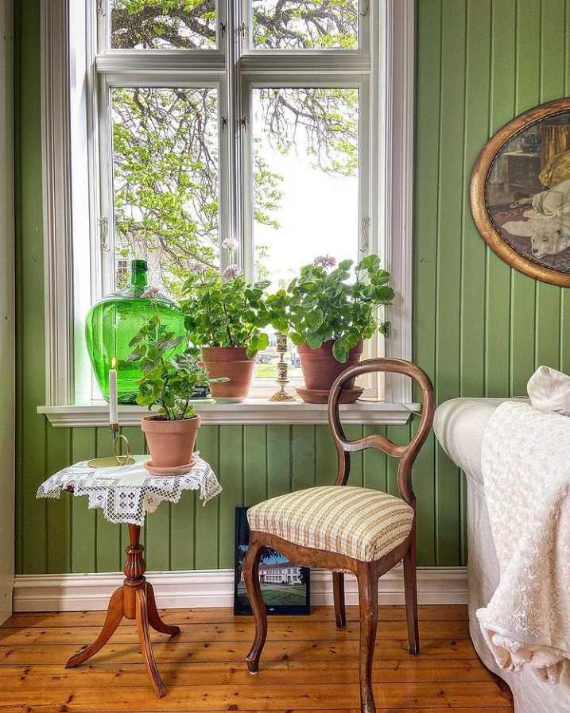

M-am trezit capie. Am un văl pe ochi, și la propriu și la figurat, care mă împiedică să văd, tot și la propriu și la figurat. Nu vreau să mă ridic și mă folosesc de scuza asta să-mi fac mintea coțofană să tacă odată din meliță, să stingă lumina aia pe care mi-a înfipt-o-n creier și să mă mai lase și pe mine să mai prind o picoteală de poale, să mai fur câteva clipe calde de somn moale. Dar cum în mine e și blândețea dar și duritatea, ca și seninul și depresia, mintea, pe care-n amorțeala mea matinală o las să mă conducă, îmbracă haina durei și ordonă scurt trezirea. Chiar dacă rezist, chiar dacă stau cu ochii închiși, somnul nu-mi mai leagă pleoapele într-o plecare portocalie ci mai degrabă am o grabă vineție.

Ce ritual de mulțumire, ce scanare, ce întindere de mușchi, ce cuprindere de corp, minte și spirit?! Am zis scurt un mulțam pentru viața din ziua asta iar corpul mi l-am simțit când m-am priponit în semiverticală, pe marginea patului. Mi-am prins părul rebel ca să-mi eliberez privirea dar nu el e "vinovatul" ceții din mine și din afara mea. Dau cu mâna prin aer, ca și cum asta ar alunga prăfuiala asta din ochii și, netrezită, mă pornesc către parter. În timp ce cobor scările, verific gradele de implicare în noua zi dar nu-s multe nici în zona de plus, nici în zona de minus. N-am nici nervi, n-am nici exaltare, sunt călare pe-o linie pe la mijloc, nedătătoare de mari bătăi de inimă.

\*\*\*

Deschiderea ferestrelor către aerul răcoros al dimineții a speriat un strop mica familie de făzănei, care a devenit obișnuita curții, cât să se refugieze cu toții în spatele grădinii, pitulați după lăzile de compost. Au crescut puiuții, au deja dimensiunea mamei dar majoritatea sunt băieți, după colorit. Spiky, care s-a repezit fresh la geam, s-a oprit din elan și îi urmărește cu atenție. Nu se mai dă la ei, că au depășit-o și nici nu vrea să iasă, să stea la o șuetă cu ei, îi privește de la distanță, așa consideră ea că-i mai drăguț.

M-a amuzat mica scenetă, cât să mai urce o țâră bucurometrul zilei. Am o senzație de arsură în capul pieptului iar apa, trimisă ca pompierul să curețe și să vindece, nu reușește mare lucru. De pe la jumătatea halbei, a fost o forțare să beau restul de apă, pur și simplu mecanica gâtului nu mă ajută s-o las să se ducă. Nu renunț, stau cu halba-n brațe, în fața chiuvetei, cu ochii la albastrul dungat de nori roz și albi, deșirați de o mână care mie-mi scapă privirii. Nu sunt neliniștită dar privirea imensului îmi trimite o senzația că nici liniștită nu-s. Nu pot pune degetul pe ce am sau ce n-am dar dacă mă întreb brusc, fără prea multă gândire, răspunsul care-mi vine sec și rapid este: sunt sictirită. Nu fac analize pe text, iau notă de asta și mă apuc de smoothieul meu, plusul care aduce norii ăia roz peste pâcloasa sictireală. 

\*\*\*

E un picuț mai răcoare afară dar mama deja e echipată de iarnă. Peste pijamalele lungi și-a luat halatul pufos și s-a băgat sub pilotă. Încă nu vreau să mă gândesc cum o să fie la iarnă, ca să nu mă aricesc de la gând în sine. Tot nu vrea smoothie dar eu, deși Universul mi-e martor că nu am nicio picătură de chef, trebe să urc la ele. Să văd cum e ea, să-i dau să pape frumoasei cu ochi albaștri, să strâng și să spăl. Cum aș putea să fac astea doritoare și cu zâmbetul pe buze? Zi tu Universule, dă-mi un semn d-ăla mare, să-mi dea peste ochii inimi și să mi-i pună pe făgașul ăla de unde să nu mă mai opărăsc cu nervii ăștia are mă strâng ca niște menghine. Și dacă se poate să-mi zici mai repede, ar fi minunat, că mai e o țâră și se face anul și aș vrea să sărbătoresc cu schimbare, nu tot cu băltire.

\*\*\*

E ok, doar se plânge că n-a dormit bine. Așa o fi, n-o contrazic, dar știu că și dacă n-ar fi fost asta, ar fi fost sigur altceva și nici n-o întreb de ce, pentru că nu ne aduce niciuneia nicio valoare adăugată. Mama are obișnuința văicărelii cronice, boală grea de care sufăr și eu, în varianta ei acută, așa că am vaga impresia că panaceul este nebăgarea de seamă și nedatul apei la moară. Și la ea dar și la mine.

Trecerea de la paradisul zilelor petrecute departe de demență la mizeria dimineților îmi scârțâie din nou pe tabla sufletului ca nisipul între dinți. E grosolană și a naibii de odioasă.

\*\*\*

Îmi trebe ceva timp să pot să-mi beau smoothie, dragul meu drag, căruia îi mulțumesc vocal pentru bunătatea cu care mă inundă. Nu pot să n-o fac, pentru că deși sunt sictirită, sunt totuși prezentă la mine, la senzațiile mele, la trăirile mele, la viața mea. 

Da, recunosc onest că trăiesc, mai ales acum după ce am gustat trei zile de libertate superbă, o buclă de timp parcă închisă într-o cămașă de forță. Am mâinile legate la spate și simt visceral neputința. A mamei, a ei pentru ea dar și pentru mine dar și a mea, pentru mine. Sunt într-o dualitate continuă dar, dacă e să iau o diferență între data asta și data trecută, mama nu simte nimic aiurea venind din partea mea. Aproape constant sunt cu o vorbă bună la ea, din domniță sau don'șoară n-o scot, e curată și e curat, doar în mine încă mă mai lupt cu demonii, dar nu răzbate nimic până la ea. Iar asta e un pas imens față de perioada în care am avut grija ei cu cancerele, doi ani care-au zburat jur că nu știu unde.

\*\*\*

Singura oră complet a mea din întreaga zi e acum, până la micile dejunuri, treburi, alergături. Și azi simt nevoia să o revăd pe Cordelia de Castellane în casa ei de lângă Paris, care mie mi se pare cutremurător de fermecătoare. Tipa e director artistic la Dior Maison, vine dintr-o familie cu tradiție în frumos și nu doar că tot ce e în jurul ei e fain, ea însăși mi se pare că emană o frumusețe aparte. Am mai văzut filmulețul de prezentare dar atât de mult m-a impresionat, că azi l-am revăzut și mai tare mi-a plăcut. La început, am fost din nou fetița care se zgâiește pe la geamurile altora care au chestii mult mai interesante în casă decât are ea, care trăiesc o viață glamorous, mult peste ce poate ea, care sunt "mai sus", acolo, în zona aia de neatins pentru ea. Apoi, mi-am aruncat privirea în jur și m-am adunat înapoi în viața mea de acum, în care mi-am adunat pic cu pic lucruri care mie mi-au plăcut și mi-am creat căminul intim dorit. Iar la final, am putut să las toate astea în urmă și doar să mă bucur de ce-mi întâlnește privirea în prezentarea casei Cordeliei iar asta mi-a dat, în câteva minute comprimate, o relaxare care mi s-a întins peste toți ani ăștia în care am jinduit la altceva, la ce au alții. 

\*\*\*

Mi se pare incredibil cât de fragili fizic suntem de fapt și cât de puțin vedem asta. Domnului meu i-a coborât umflătura sub ochi și pe aripile nasului iar vârful nasului are tente violacee. Dacă n-aș știi că e de la insolație, aș zice că i-a tras cineva un pumn sau că l-a ciupit ceva de s-a umflat în halul ăsta. Nu are chef de nimic și de nimeni azi, e de înțeles, așa că-mi iau cana de cafea și mă tirez tiptil, să-l las să-și mănânce micul dejun în pace, că nu cred că poate să-l savureze. 

\*\*\*

Mamei i-am fiert un crenvurșt, a cerut și cașcaval și lapte bătut și le-a mâncat pe toate. Nu e mult dar decât trei dumicați, tot e ceva. Eu n-am chef de socializare, am rămas cu aroma aia de frumos de la ce am văzut mai devreme și zău dacă pot încropi de-o conversație basic, de copil de 2 ani. Nu-mi vine, nu mă strofoc să-mi vină și Universul îmi sare în ajutor cu lipsa de chef și din partea mamei. Ea oricum vine la masă ca la tăiere, mereu zice că nu îi e foame și probabil că în mintea ei micul dejun sau prânzul sunt doar de bifat, fără nicio plăcere. E doar o supoziție, cam tot ce cred eu despre ea e în registrul ăsta de supoziții, că așa e demența. Și, dacă stau strâmb dar gândesc drept, un procent destul de mare din viața mea e ocupat de supoziții. Cred că adevărurile sunt alea care vin spontan doar din mine, acele știuturi pe care le simt adevăruri chiar dacă ele frizează realitatea sau adevărurile altora, iar perlele astea sunt rare.

Ea s-a dus cătinel și clătinat, cu pași mici și repezi, la Sassy iar eu, în fuga mea să fac mici cumpărături, ratate sau nou apărute. 

\*\*\*

M-am oprit să iau toner color la imprimantă și lângă Altex, e și-un Jysk. N-am mai intrat într-un magazin să mă uit pe îndelete de mult timp, în pandemie nu eram vaccinată, acum m-am vaccinat dar a apărut demența, deci s-au adunat niște ani. 

Azi am intrat, tot pe fugă, să iau niște pături de bumbac, că mi le-a luat copila pe toate când a plecat. În tot magazinul, nu eram decât eu și o altă doamnă, plus o fătucă de-a magazinului. Ce m-aș fi pierdut pe acolo, măcar ca inspirație dacă nu pentru a cumpăra, dar amân pentru altădată. Această amânare se adaugă la multe alte amânări și-mi dă din nou senzația de cămașă de forță. Am, din nou, tendința fizică de a mă scutura de părerea asta care n-are nicio treabă cu fizicul și mă duc țintă spre zona păturilor. Culori triste și terne, multe din poliester, doar 2 tipuri sunt 100% din bumbac așa că înșfac doar o pătură și mă îndrept către casă. Acolo, cealaltă doamnă, co-parteneră în cumpărături, împroșca în jur țâțâieli din vârful buzelor. Fătuca nu era la casă, s-o servească prompt pe ea ci descărca și aranja ceva marfă pe la jumătatea magazinului. Dacă aș fi avut un țâțânometru să măsor starea de iritarea a doamnei, cu siguranță că ar fi piuit la vreo doi metri de jur-împrejurul ei. Era o energie atât de densă, simțeam atât de pregnant că-i pute, că instinctiv m-am ținut mai departe de ea, să nu intru și eu în bula aia de-o înconjura și-o acapara atât de tare că a uitat că și fătuca e făcută tot din praf de stele, ca și ea. Îmbufnată, a trântit pernele pe tejgheaua de la casierie și a plecat să adune tânara și s-o aducă să-i încaseze ei banii. 

Recunosc, că mi-am tras scaunul virtual și m-am așezat la spectacol. Nu-i unul nou, nu e premieră, se întâmplă frecvent dar încerc să văd valențe noi. Probabil că ușuită cu ceva vorbe, cărăușa, devenită în spatele tejghelei casieră, s-a aricit și ea. Deși eticheta impusă de poziția de angajat o forța să fie amabilă, la rându-i ei arunca în aer o energie densă, în duel cu cea a cumpărătoarei. Se crease în zona casieriei o stare atât de nașpa că abia așteptam să se spargă în vreun fel momentul, să răsufle bășica asta de vibrație aiurea, care nu le face bine nici lor, nici mie și nimănui, doar gogoșește starea de rahat între două ființe umane care uită că-s la fel. 

Nu știu dacă a fost ironie sau o frază care trebuia să însoțească standard înmânarea bonului dar m-a bușit râsul când am auzit: mulțumim pentru cumpărături și la ieșire avem și o tabletă pentru feedback! Hahaha! Doamna a privit-o stupefiată, cu un gest brusc și-a luat pernele și ieșit val-vârtej pe lângă tabletă, mormăind ea știe ce. Fătuca m-a privit, mi-a prins zâmbetul din urmă și s-a relaxat și ea. Era muncită, se vedea, și o afectase starea proastă a femeii de dinainte. Dar, amabilitate de angajat sau doar mimetism, a început să zâmbească iar eu am simțit cum s-a spălat zona. 

Inconștiența e cea care ne duce să împrumutăm starea vecinului. Lipsa de prezență. Lipsa bucuriei de viață și a poftei de viață. Comparația. Neînțelegerea și nevrutul de a înțelege. 

Adevărul e că e greu să nu te molipsești, atât zâmbetul cât și țâfna au o putere de contaminare fantastică. Mie mi-e greu să mă "apăr" de stările celor apropiați iar la capitolul "străini" sunt în faza în care experimentez, încerc să las garda jos și să nu mă mai simt prost, mai puțină, sau insuficientă ca să reacționez din energia asta și să ripostez. Întotdeauna există o explicație, omul poate avea o zi proastă, o stare proastă, o ceva care e doar al lui și cum se poartă cu mine, din energia aia nașpa, nu are absolut nicio legătură cu mine. Mi-a luat ceva timp să prind nuanța asta, nu-mi iese mereu, dar practic de câte ori apare oportunitatea și începe să lege roade. 

\*\*\*

Ar trebui să fac curat, ar trebui să fac mâncare dar nu am chef să fac nici una, nici alta. Sictirul care m-a întâmpinat în mugurele de zi, se instalează confortabil în mine, pare că vrea să mă locuiască un timp. Mai e ceva de mâncare pentru prânz, nu e chiar atât de mizerie în casă așa că mă apuc de mini proiectul început aseară: tabloul pentru bucătărie.

La lumina zilei culorile folosite nu mi-au mai plăcut deloc, așa că am decis să las pictatul pentru cei care au pasiunea asta și să înlocuiesc tonerul color în mica noastră imprimantă. Apoi print și asta a fost tot. I-am pus lângă surata veiozei și am fost mulțumită de decorul vesel din bucătărie.

Povestea începe acum câteva zile, când eram la pensiune, unde am decoperit pe olx un tablouaș tare mișto cu niște câini, mere și păsări, stilizate într-o variantă modernistă. Mi-a plăcut mult, costa 50 de ron așa că i-am scris tipei care-l vindea că-l vreau. Partea și mai bună era că vânzarea se făcea personal în București, am aranjat să-l rezerve pentru când mă întorc. Cum viața bate filmul, taman când trăgeam sforile să ia copila tabloul, că era în zonă, tipa îmi zice că n-o lasă soțul să mai vândă tabloul. Pe olx, totul și orice e posibil. "Norocul" meu a fost că făcusem screenshot să i-l arăt fiică-mi așa că am pus google lens-ul pe el și-am aflat că artistul se numește Kessler. Am găsit alt "tablou" ce mi-a plăcut iar restul e doar un buton de imprimantă apăsat. Plus o după-amiază de pictat inutil.

Rama de tabloul o aveam iar alăturarea lor, deși nu e una "normală", mie îmi place la nebunie. 

Descopăr la mine că explorez combinații din ce în ce mai neașteptate atât în design cât și în mâncare. E o formă subtilă de evadare a mea dar și experimentare. Nu mai țin cont de păreri externe în alegerile mele de design, ci doar de excitarea ochilor mei care privesc obiectul sau combinația. Nu-mi mai pasă și nici nu mai aștept validări. După ani de suspendare într-o căutare de acceptare, în sfârșit mi-a ieșit nepăsarea supremă. Și e atât de bine! Și-mi place atât de mult!

\*\*\*

Evident că mama n-a observat nimic nou în bucătărie deși tabloul are și culori vii și dimensiuni mari. Nu mă afectează asta dar mă irită repede modul cum începe să-mi dea porunci: să-mi scoți apa din frigider! să-mi pui doar atât la încălzit! dă-mi pâine cu semințe, asta albă nu-mi place! vreau sare!

Măi, o dată n-ar zice te rog sau mulțumesc. Știu asta, știu de mult dar azi sunt sictirită și deși îndulcită cu momentul tabloului, frazele astea reci și seci sunt dușul rece care mă trezesc la realitatea în care sunt: acasă, lipită de casă, de o mamă care are demență, pe care nu pot s-o părăsesc. Asta e incorect și-mi revoltă și stomacul și nervii. Dar tac, îi pun masa cum și cu ce vrea și strâng, spăl și așez totul după ea.

\*\*\*

Mă simt câteodată vinovată că nu ajung la zi cu postările dar efectiv nu știu când să le fac pe toate. 

Eu nu am timpi morți și cu toate astea nu prididesc cu toate, zău dacă știu când se face seara. 

Doar ce mi-am mai pus caise la congelator, am mai recoltat niște semințe de roșii inimă de bou roze, am spălat și sâmburii de la caise că vreau să-i pun în pământ, sunt curioasă dacă se prind, am strans și spălat la bucătărie și s-a făcut ora mirifică de curățat unghii.

Mai am puțin, simt eu că mai e puțin și gata, dar e grea tare ultima sută de metri. Unghiile mamei nu mai suportă pilire, acum le rașchetez cu muchia forfecuței iar azi am dezlipit bucăți mari din cioturile rămase. Cu fiecare bucată scoasă, chiar dacă e oribilă procedura și scârboasă din plin, crește și inima-n mine că mai e puțin și gata. Chiar dacă tot zic așa de ceva timp, după ziua de azi, simt eu că chiar așa e. Doamne ajută, please!

\*\*\*

Doar ce mai apuc să scriu o zi, să-mi ascult poveștile de peste zi ale domnului meu și să fușteresc un duș, în care-mi număr recunoștința pentru:

1. Răcoarea de afară!
2. Artă!
3. Dezlipirea fâșiilor de unghii, semn că finalul e pe aproape!

Frumosul verde al zilei este:

