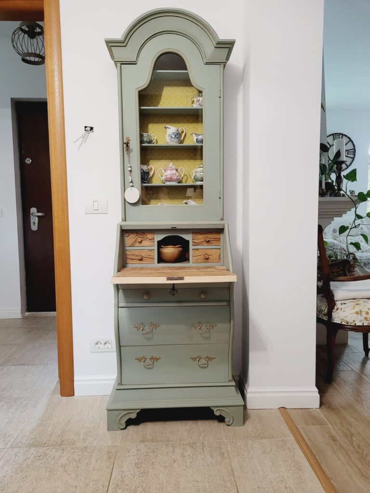

Azi m-am trezit cu fața la cearșaf. Din perspectiva din care m-am pus în fund azi și privesc viața, nu sunt 237 de zile de trăit cu demența, sunt 237 de zile de nefăcut ce vreau, când vreau. Azi joc cartea absolută a egoismului și, deși observ că-mi limitez privirea și-mi mijesc ochii să privesc doar prin fanta aferentă vieții mele, nu mă pot abține să nu mă pun pe primul loc. Azi, sau ca să nu gogoșesc starea pe întreaga zi că poate nu m-o ține atât, acum, sunt surdă la faza cu "am venit aici să servim altora, dar să ne trăim profund experiența de viață". Acum aud doar finalul și tare mi-ar fi plăcut să mă trezesc pe-o colină de Toscana sau în Franța rurală. Nu m-ar deranja nici un cottage englezesc, mic și cu mult șarm. Oriunde, numa' nu aici, unde îmi fragmentez "profunzimea" experienței în mic dejun, prânz și unghii, cu presărări printre ele de făcut mâncare, făcut curat, spălat, curte, cumpărături.

Într-o dimineață, domnul meu m-a "scuturat" un strop, punându-mă să văd altfel lucrurile, deși eu nici nu mă mai plâng, poate că se citește pe mutra mea cu câtă plăcere și chef plec la drumul unor zile. L-am "scuturat" și eu pe el punându-l să-și imagineze că atunci când vrea să facă ceva, există o piedică și nu poate face. Și nu poate o dată, nu poate de două ori, o zi, două, 237. Cum e? Aproape că i-am văzut umbra ce i s-a pus pe ochi și neplăcerea la gândul că nu poate. Mă bucur, deși nu mă bucur, dar așa poate se oprește din a mă cârmi către acceptare. Nimeni și nimic nu mă poate face să accept decât eu, în momentul în care o să pot. Sau nu.

Cu aroma asta de neputință pe creier, îmi vine să mă ridic și să plec, să dau skip la rutina de recunoștințe, uite așa, de-a naibii. Noroc că mă prind că oi fi a naibii dar și stupidă tare sunt, dacă mă supăr pe-un ritual care, atunci când îl fac prezentă, mi-aduce numa' căldură bună în inimă. Așa că o trag înapoi pe zmucita de mine care deja se ambalase și transmit un gând de mulțumire pentru că m-am trezit azi. Știu că acum nu-mi pare mare lucru ăsta, dar dacă mâine o să am parte de un miracol, nu ar trebui să mulțumesc zilei de azi că a fost puntea către ziua de mâine? Am șuntat un strop modul de a privi lucrurile ca să pot face sens pentru o mulțumire pe care, șifonată cum sunt în astă prea dimineață, nu o pot procesa altfel. Again, scopul scuză mijloacele.

Corpul mi-e bun și ascultător și nedureros, și-mi pleacă către el un gând chiar curat de gratitudine. Hai c-am adunat de două. Pentru o zi morocănoasă, nu-i rău.

***

Îmi beau apa destul de absentă la ea sau la lămâia pe care am turnat-o generos sau la cerul ce mă privește statornic și nepărtinitor: nici nu-mi dă dreptate, nici nu mi-o ia, mă lasă să decid singură cum îmi croiesc ziua, că tot eu o s-o și trăiesc după aia. Fair enough din partea lui.

Cu un ochi pe cameră și unul la un mesaj primit de la copila mea, se conturează planul zilei: după micul dejun al celor doi colocatari, încep drumurile și alergăturile. Foarte bine, să-mi iasă pe nas cearșaful care mi s-a lipit de față, să mă obosesc, și fizic dar știu eu că și mental, că așa fac când stau prea mult doar eu cu mine. Cu puțin ajutor de la Univers, poate nu m-oi istovi și emoțional, ca să fiu lată diseară pe toate planurile. Dar, cum nu-mi însușesc o dată abilitățile alea intrinseci ale oricărei ființe umane de a-și crea realitatea, sunt la mila exteriorului și deocamdată doar cu focus la reacția mea.

***

Interacțiunea cu mama e ok, cât se poate de ok dimineața, când îi duc pliculețul de papa lui Sassy. Mulțumesc tare mult Universului pentru existența acestei pisici în viața mamei dar și în viața mea și în camera lor. Aproape mereu "dialogul" pe care îl avem noi două stârnește ceva în mama: fie dorință de participare la conversație, fie gelozie, fie un zâmbet, fie o laudă pentru Sassy a ei, mai nou Blue eyes. Nu am auzit-o în trecut pe mama să-i spună așa dar de ceva timp tot o aud cu Blue eyes în sus, Blue eyes în jos. Am și întrebat-o odată de ce îi spune așa și mi-a răspuns, candid, că așa i-a zis mereu. Așa că n-o mai întreb, că oricum la ea timpul când se comprimă, când se dilată, că nu mai înțeleg nimic. Adevărul e că Sassy are niște ochi albaștri superbi.

Deretic în baie și o anunț că o să fiu pe drumuri azi, că am niște treburi de rezolvat, dar e domnul meu acasă, dacă are nevoie de ceva. Din nou nu mai știe cum îl cheamă, noroc că mă prind repede și-i zic ca din întâmplare, să nu mai ia scama jenei și să se închidă din nou ca melcul. Mi-a ieșit, a preluat informația ca și cum i-ar fi venit din interior și mi-a spus "da, puiule, ne descurcăm noi amândoi, stai liniștită". Pfiu, she is back.

***

Vrea, nu vrea, micul dejun al lui Mr. H e ocupat parțial de mine, care îi pun pe masă decizii de luat, decizii în funcție de care îmi stabilesc și eu traseul.

Credeam că Universul nu acceptă în aceeași casă doi oameni treziți cu fața la cearșaf, dar uite că m-am înșelat. Nici domnul meu nu e în cele mai roze stări, eu vorbesc cu el, el se uită pe pereți, pe mine mă deranjează, dar pentru că învăț să comunic și practic asta constant, îi spun.

Întotdeauna am avut o problemă cu asta: când vorbesc cu cineva, vreau să se uite la mine, vreau să mă asculte, vreau să facem contact vizual, vreau să îmi onoreze timpul. Dacă nu vrea o discuție, prefer să-mi spună asta și mă opresc. Mi s-a părut mereu o lipsă de bun simț din partea interlocutorului să se uite pe pereți sau în telefon. Deși amândoi cu potențial uriaș de iritare, faptul că i-am spus ferm, fără reproș, că dacă vrea să mă asculte, **am nevoie** să se uite la mine, a dezamorsat totul, pentru că și el a făcut un efort să mă înțeleagă. Asta mi se pare tare mișto într-o relație, nu neapărat doar de cuplu: să găsești un om capabil să nu se aricească dacă îi faci observație ci să o ia constructiv, să vrea să audă și să priceapă ce ai nevoie și să aibă dorința și voința să-i pese. Mi-a plăcut extrem de mult cum au evolut lucrurile la acest mic dejun, cu o chestie care aparent e minoră dar care s-a rotunjit atât de fain și-a prins în căușul situației doi oameni ce-și doresc să le fie bine împreună, dar și fiecăruia. A fost ca o palmă zdravănă dată peste egoismul cu care m-am trezit.

***

M-am îmbarcat pentru drumuri, cu traseul stabilit în minte.

Prima oprire este la clinica din sat, unde avem și medicul de familie, să fac programări. Știam că e full tot timpul dar am găsit zile libere de abia la sfârșitul lunii.

Pentru că am ieșit din pandemie, medicul psihiatru al mamei nu ne mai poate ajuta cu referatul pentru dosarul de ajutor de îngrijitor, așa că o iau de la început în altă parte, iar primul pas firesc este medicul de familie. Mi-am făcut programare întâi mie, ca să pot să-i explic pe îndelete situația mamei și să o rog să se poarte delicat cu mama. La fel de delicat aș vrea să-mi dea și o recomandare de medic psihiatru la care să o duc pe mama și care să nu-i trântească în față că are demență. Mama nu știe că are Alzheimer, habar n-am dacă bănuiește, recunosc că nu am curaj s-o întreb asta, și nu vreau că cineva, indiferent că e doctor sau nu, să intre cu bocanci peste sufletul ei, cu stigmatul de dementă. Sper să găsesc doctori-oameni, nu doctori-imuni, pe care nu-i mai judec acum cum o făceam o dată, acum știu cum e să devii imun ca parte din autoprotecție.

***

A doua oprire e la notariat, să-i fac copii legalizate copilei la certificatul de naștere. E pe ultima sută la înscrierea la masterat iar actele ei au rămas la mine.

La notariatul din sat, de câte ori am intrat, de tot atâtea ori am dat peste o atmosferă încordată, doamnele de acolo au mereu buzele strânse, nu vezi urmă de zâmbet, de abia răspund la salut, senzația mea permanentă a fost că deranjez. Nici azi nu fac excepție deși, culmea, nu mai sunt aceleași doamne ca data trecută. O fi vreun tipar la angajare sau poate devii așa într-un notariat, who knows?

Am intrat, pregătită deja, să dau de strepezeală, așa că nu m-a lovit vibe-ul de acolo și nici nu m-a iritat. Am salutat și mi-am spus dorința ca și cum erau cele mai drăguțe doamne din lume. În timp ce așteptam copiile, în picioare, cât mai spre ușa de la intrare, ochii mi-au plecat clasic spre afară, spre natură: pe terasă erau trei scaune și o masă iar în curte un petic de verdeață. Imaginea asta iar a declanșat în mine dorința de socializare, locurile alea asta strigau viață, oameni, comuniune. Mi-au dat și o stare de bine și mi-au și pus o etichetă: sunt un cumul de paradoxuri, îmi place și solitudinea, îmi place și socializarea. E drept că am ajuns s-o iubesc pe prima forțată de lipsa celei de-a doua, însă acum le pot acomoda pe amândouă în mine. Fără prea multe gânduri în zona asta, închid paranteza ce s-a ivit în mine, cu ocazia acestei imagini, în mod plăcut și-mi iau gustul mișto din ea. Nici n-am mai văzut cutele buzelor strânse, nici nu m-a atins modul minimal de interacțiune dintre doamne și mine, ocazie cu care am mulțumit în sinea mea unui simplu set de terasă. Tare!

***

Următoarea oprire este la DN, unde a răsărit o pepinieră nouă, doar-doar oi găsi și eu un tei mai mărișor, cu flori pentru ceai. Au, sunt italienești și sunt pentru ceai. Am luat notă, i-am văzut, am aflat prețul și studiez să văd de are sau nu dreptate cu teiul italienesc. Mai am timp până în octombrie.

Destinația mea finală este la copii, să las copiile legalizate și să-i ajut cu o comandă de frigider nou, că cel vechi s-a supărat și și-a dat obștescul sfârșit. Sunt și ei plecați, așa că fac un popas pe drum la mall, să caut niște perii de spălat vase, din fibre naturale, pe care le găsesc la Zara. Întotdeauna mi-a plăcut magazinul ăsta, are lucruri mișto dar scumpe tare, așa că m-am apropiat de el doar la reduceri. Mi-am delectat ochii cu ce-am văzut, mi-am tras un picușor sufletul și am mai privit și-n jur.

Eu, de când "m-am retras" din viața aia neviață, am impresia că toți au început să vadă lucrurile cum le văd eu acum, sau că deja o făceau. Probabil d-aia mă și "lovește" realitatea care nu e așa, poate d-aia îmi sare în ochelari atât de repede egoul ăla primar, care vrea atenție prin modul cum se îmbracă, se aranjează, prin atitudinea "superioară", prin tupeu. Am văzut multe femei aranjate, văruite de-a dreptul pe față și îmbrăcate "țiplă", dar am văzut doar o singură femeie frumoasă. Nu știu de avea și ea fața smăcuită, dar știu că era superbă prin atitudine: îmbrăcată în culori deschise, cu spatele drept și cu un mers calm, cu ochii în față, la fel de liniștiți.  M-a impresionat puternic deși am văzut-o câteva clipe. 10 pași mai departe, mi-a părut rău că n-am avut prezența de spirit să mă duc să-i spun că e frumoasă. Anyway, are un punct în plus în karma ei că mi-a dăruit mie o imagine frumoasă, ce m-a impactat.

***

Am uitat de acte, am uitat de comandă, am uitat de tot și toate, la vederea Măyuței mele dragi. Și, după cum dă din curuț și ciotulețul ăla mic de coadă, și ea a uitat la fel. Nu mai suntem decât noi două, într-o zmotoceală, pupăceală, băloșeală, drăgăleală și dondăneală. Ies cu ea afară și depăn, pe repede înainte, toate câte mi s-au întâmplat de când nu-mi mai încep diminețile cu ea la mine în brațe. Trag puternic pe nări mirosul ei inconfundabil, și-mi stă în brațe cu ochii în ochii mei. Nici nu avem nevoie de cuvinte, ea-mi simte iubirea, eu îi simt extazierea și asta e tot ce contează și ce ne leagă acum. Nici nu știu când au început să-mi cadă picuri mari și calzi pe obraz, m-am trezit că mă linge.

Mi-aș dori să șterg ultimele luni din viața mea. De fapt, mi-aș dori să dau timpul înapoi cu 10 luni și să șterg în viitorul ce ar urma posibilitatea demenței. Uite că încă am ascunsă-n mine, pe undeva, mica speranța că ce trăiesc e doar un coșmar, că o să mă trezesc într-o dimineața și o să fiu iar în casa noastră nouă, cu Maya sforăindu-mi în brațe. Am rămas afară, pierdută-n gânduri și-n sentimente amestecate și încurcate. M-a trezit iubitul copilei mele și bine a făcut, că panta pe care am alunecat nu era sănătoasă pentru starea mea de spirit.

***

Am plecat o țâră atinsă-n aripi de la ei. Pe drumul spre casă, în mașină, am avut o poftă să tot merg, să tot conduc, să mă plimb, fără să mă grăbesc spre un interior unde să bifez prânzurile, treburile.

Învinsă-n dorințe, fac stânga de pe DN și mă opresc la cofetărie, să mă supun dorinței mamei, care vrea din nou savarină.

***

Restul zilei a fost dominat de o senzație de înfrângere. Deși am fost prezentă în timpul meu și am văzut-o în toată splendoarea, nu am reușit să schimb acest gust amar cu nimic. Nu pot să-mi cârmesc sistemul de credințe și nici nu am puterea să-mi fac creierul să creadă altceva decât ceea ce este și anume, o placare continuă a unor dorințe simple.

O privesc pe mama cum mănâncă, fără nicio bucurie, nici a gustului, nici a socializării și vreau și mai tare să fug de asta. Viața pe care eu o simt că e viață nu e despre asta! Viața care mie-mi pulsează-n vene nu vrea placiditate, nu vrea ochi goi și absenți, știe că ne e dată ca să fim nothing less than brilliant! Iar eu, cu știutul ăsta-n mine, ard și-mi topesc timpul, la un ritm amețitor, fix less than brilliant.

***

Nu vreau să capitulez total în fața unor senzații de neputință, de repulsie, de frustare și chiar nu vreau să pierd (încă) o zi, așa că mă duc în garaj, atelierul meu drag și mă așez acolo, așteptând inspirația. Pentru că-n mine clocotește creativitatea, nu-mi trebe mult și ochii-mi pică pe vopseaua de la Annie Sloan, culoarea galben - English yellow. E o culoare tare, nu e caldă dar nici stridentă, e fix ce am nevoie pentru partea din spate a Trumeau-lui pe care l-am vopsit în anul în care ne-am mutat în casa nouă. Culoarea lui este cea a oului de rață iar galbenul ăsta e fix ce e nevoie să complimenteze interiorul, unde eu vreau să-mi pun colecții de lucruri mici.

Următoarea oră, cât am tot vopsit la catifeaua grena ce era lipită pe spatele mobilierului, efectiv m-a golit de trăiri. Sunt sigură că mi-a zburat mintea în o mie de zări dar n-am puricat nicio analiză, n-am avut niciun dialog sau monolog interior, nici nu mi-am hrănit starea aia nașpa pe care o aveam înainte să-mi pun pensula în mână. Creatorul este cuprins în creația lui, they say. Cred că am scuturat și eu emoțiile mai cu tentă de gri pe căptușeala grena și le-am acoperit repede, ca să le țintuiesc acolo, cu un galben englezesc. Și, ca să aibă și un twist și-un model, peste vopseaua asta faină am pus o bucată de material rămas de la un proiect mai vechi de retapițare, ce are în el fix aceeași culoare dar are și un model modern, contrastant cu Trumeau-ul. Vai, ce-mi place! Cu o cutiuță de vopsea i-am dat brânci înfrângerii, poate nu total, dar am ușuit-o din ziua de azi, să nu-mi atârne greu de inimă și de gânduri.

În drumul meu spre dormitor și duș, mă opresc la mama pentru o scurtă socializare cât timp scârm eu la unghii, să-i dau pastilele, să hrănesc o rubicondă blănoasă și să mă asigur că toate-s la locul lor, cum trebe să fie.

***

C'est fini! Asta mi-a fost ziua, mult mai densă decât mi-aș fi dorit, cu atârnare mai spre gri decât spre roz, dar cu recunoștințe spontane pentru:

1. Vointă și dorință!

2. Viața Mayei!

3. English yellow!

Clipa mea de fain este:

