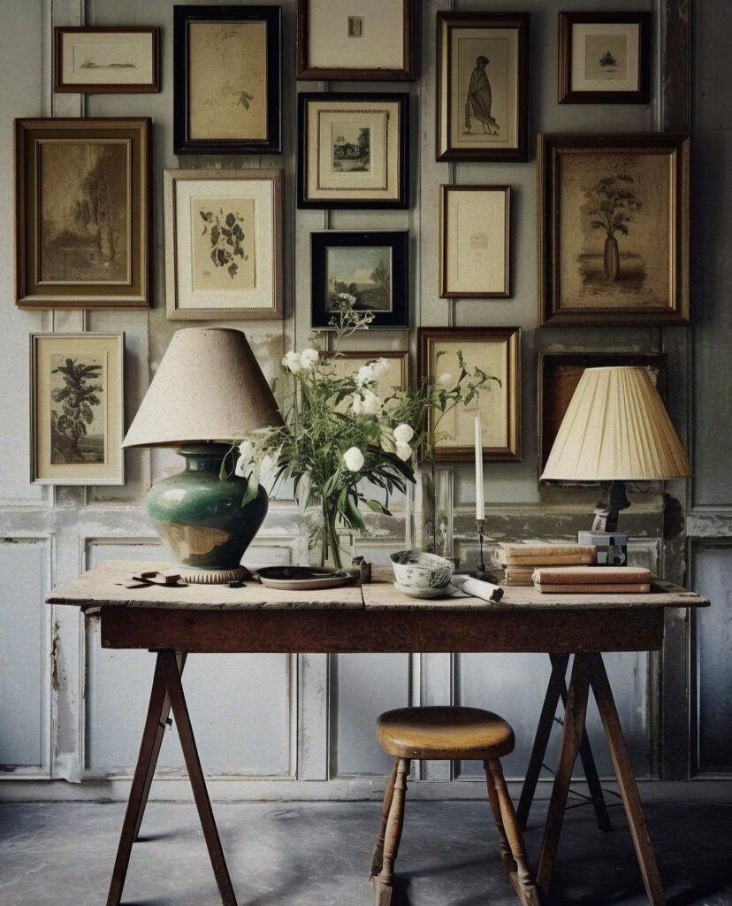

Pentru o fracțiune de secundă, când am mijit ochii a nouă dimineață, nu mi-a fost clar nici unde sunt, nici în ce timp sunt, nici ce e cu mine. În aceeași fracțiune de secundă, parcă mi-a venit în nări miros de copilărie, de mine puiucă, când mă trezeam cu noaptea-n cap la măița mea, pe care am iubit-o infinit, să nu pierd timp din bucata de vreme pe care o stăteam cu ea.

Niciodată nu m-am săturat de ea. Când venea la Moreni, la noi acasă, nu cumpăneam nicio clipită în a o alege pe ea, în detrimentul jocului afară, cu copiii. În dimineața asta m-au năvălit cu o putere incredibilă amintirile unei vieți la început de drum: cum mă trezeam cu noaptea în cap să mă împiedic printre fustele măiței, care mă lua blând cu ea în gradină să mă spele cu roua bujorilor ș-apoi fugeam fericită să urmăresc cum zumzăie albinele pe gămăliile de usturoi înflorit, cum încălzea apă în lighean, la soare, și mă spăla cu săpun de casă și mie mi se părea că mă îmbrac cu portocaliul cald ce spăla pământul, cum mergeam desculță din satul măiței până în satul vecin, la bâlci, sat unde, neștiut și neștiindu-ne, aveam să descopăr, mulți ani mai încolo, că copilărea la fel de fericit și Mr. H, cum mă bălăceam cu picioarele în apa ce curgea prin canalul îngust din fața porților și mă înfruptam cu zarzăre roșii și prune grase, cum zburdam cu copiii de seama mea și doar chemarea măiței mă oprea din asta, cum mâncam sub nucul din curte omletă cu roșii cum nu am mai mâncat niciodată de atunci, cum mă mângâia seara palma aspră a ei peste frunte și păr și-mi spunea povești și mie îmi părea că pielea ei miroase sublim.

Nu am mai trăit niciodată aroma aia de iubire, pentru nimeni, nicio singură clipă. Din momentul în care cea mai iubită dintre pământence a plecat subit din viața mea, s-a închis brusc și pentru totdeauna cămăruța în care locuiam doar noi două, în inima mea. Din când în când, ca azi, sub habar n-am ce presiune internă, se mai deschide câte-un geam și mai răsuflă amintiri, dar pentru că dorul de ea nu a dispărut din mine și mă suferă, ferec repede toate crăpăturile să se etanșeze și să rămână acolo. Nu vreau să le pierd și pe ele, ar fi zgârietor tare de suflet.

Cu obrajii uzi de lacrimi calde, stau un strop eu cu mine și cu Biannca mică și trec cu ochii minții prin viața asta care mi-a trecut prin oase și prin ființă. Mi se pare că a trecut o eternitate între mine mică și mine adult. Ce zic eu aici, mi se pare eternitate între mine anul trecut pe vremea asta și mine acum! Cât de relativ e totul și cum filtrăm totul în funcție de intensitatea trăirilor… Chiar că ce repede se face târziu în viață.

***

În timp ce-mi ridic fizicul la verticală, mă traversează, cu emoție la stomac, ideea clară, cu ecou, că eu sunt responsabila cu apăsatul pe play la viața mea, sau la nivel granulat, la clipele mele. Oi mai fi fost și-n alte dăți atât de precisă de asta, dar acum parcă se făurește în mine, cu subiect și predicat, că clipa n+1 se naște dacă eu la clipa n am apăsat pe buton și-am dat action la viață. Coțofana asta de minte pleacă zburând pe aripile ideei și mă trezesc gândind: ce-o veni azi, mai încolo, de am eu nevoie de conștientizarea asta așa, la prima oră? Habar n-am. O voce mică din mine are însă habar că-și dorește să nu vină vreun cataclism. Păcătoasă vocea asta!

Cu urechea ascuțită să surprind zgomotele de la coana mare din cameră, mi-arunc ochii scurt pe camera de supraveghere, cât să văd că doar Sassy e la promenadă, mama e încă în lumea viselor. Foarte bine, să mai stea acolo, îmi zic egoist, ca să apuc și eu un timp cu mine, doar cu mine. Parcă am rămas cu un gust de copilărie-n mine și vreau să mă întorc acolo, în timpul ăla fără griji, fără alergătură, doar cu soare, apă, fructe și multă iubire neîntinată de interese.

***

Beau cu înghițituri mici apa cu lămâie și mă minunez cum te duce viața asta. Pentru că eu am o statornicie în mine, program sau iluzie, pentru că până nu demult preferam cunoscutul în locul schimbării, de fiecare dată când amintirile mă răscolesc, vorba cântecului, sunt uimită de întorsăturile și curbele și contorsiunile pe care le-a făcut zăpăcita asta de viață a mea. Din țăranca-pui la adolescenta rapperiță-rebelă la corporatrista fițoasă, ultimele pe un fundal de autoinsuficiență, la casnică îngrijitoare de mamă cu demență, scriitoare de blog, grădinăreasă, bricolatoare dar, cel mai important, femeie care-și spală zilnic zoaiele de pe ochi și creier și scoate la aerisit și înlocuit programele din și cu care a crescut. And the night is young and so are we…

***

Mama este senină, nu mă copleșește cu entuziasmul ei față de micul dejun, dar nici nu mă cocoșează cu apatia, ceea ce e un lucru bun. Pentru că în mine adastă dorul de cea mai frumoasă femeie din linia mea generațională, măița mea, încerc marea cu degetul și îi menționez mamei, ca din greșeală, de ea. Mă unge pe suflet când mama, chiar și cu orizontul de amintiri limitat, îmi validează ce am știut și simțit dintotdeauna despre bunica din partea tatălui: a fost o femeie tare blândă și bună! Iar mă scaldă niște ape pe la ochi, aș vrea să-i închid și să mă transport acolo, în timpul ăla fără egal, să-i simt mirosul, s-o văd, s-o ating. Mi-e atât de dor, mereu mi-e dor.

Deocamdată sunt aici, în bucătărie, cu mama, așa că-mi înfrâng fugitul (sau evadarea) în alte timpuri și mă întorc lângă cea care are nevoie de mine. E veselă, face și-o glumiță, mă bucură, dar sunt încă prea plecată sufletește într-un sat, ca să îi pot susține momentul. Iau notă de ce face și ce zice ca un spectator și mă prind că sunt absentă de la ziua mea. E prea dulce amintirea și ademenitoare și nu-i rezist.

***

Am, n-am chef, trebe să dau o fugă să cumpăr un bec pentru veioza de sare care stă aprinsă, noapte de noapte, în baia mamei, să-i lumineze spațiul în plimbările ei nocturne catre wc.

De multe ori, fără falsă modestie, mă apreciez pentru limpezimea și claritatea cu care am aranjat în doar 2 zile, toate lucrurile în camera devenită peste noaptea de 18 decembrie 2021 camera mamei. Deși m-am îndoit (ce surpriză!) de mine, deși mereu am crezut că ce fac nu e tocmai bine, că alții ar face mai bine, în toate momentele de intensitate maximă din viața mea, am acționat fără cusur, am o abilitate extraordinară să gândesc și să acționez sub presiune de zici că asta am făcut toată viața. Sau poate, chiar așa o fi fost. Cum îmi spunea odată cineva, trebuia să mă fac chirurg, atât de rece și calculată și precisă pot fi. Nici acum nu știu dacă a fost un compliment.

***

Cu niște dâre de copilărie prin inimă, cu ochii întorși aproape total spre un timp atât de departe și totuși atât de intens prezent, dau nas în nas cu un fost coleg corporatrist. Masca asta de pe față m-a descalificat la șansa de a fi recunoscută și eu de el, dar m-am dus țintă la el, plină de încântare și de plăcere că-l văd. Întotdeauna omul ăsta a emanat vibe bun, blând, are ceva în felul de a vorbi, de a merge, de a-ți zâmbi cu inima pe față, de mă atrage de fiecare dată. Am fost odată la el, la casa nouă pe atunci de pe un mal de lac din Moara Vlăsiei, și de câte ori îl văd îl asociez involuntar cu un apus superb de soare. Pare-se că și el s-a bucurat de întrevedere, ar vrea să bem o cafea, o, doamne, și eu aș bea vreo trei și tot p-atâta aș sta la bârfă, dar nu pot, nu am luxul ăsta în aceste vremuri. Ne îmbrățisăm la plecare, îl fac să-mi promită că vine pe la mine când are drum și timp și plec în alergarea mea clasică, și cu niște dâre de regret și cu unele de bucurie. Chiar m-a uns pe suflet această scurtă ciocnire și, culmea, nu mi-a scormonit nimic în mine despre vremurile trăite aproape exclusiv pentru corporație.

Arunc un ochi pe camera de supraveghere, numa' la țanc să văd cum mama aruncă niște firimituri pe jos, lângă pat, cum trage covorul peste ele, senină și suavă. Se așează pe pat, strânge de pe pat ghemotoace de păr de-al lui Sassy, le aruncă și p-astea pe jos, tot lângă pat, se dă jos, se duce la baie, se urcă în pat, aducând sfintele ghemotoace pe tălpi, înapoi în pat. Mi-apare un rictus pe față, de silă, și pornește țintă și-un gând de judecată. Rămân cu ochii la circuitul scamelor în natura camerei mamei, mă strepezesc, încep un dialog cu mama în mine, simt cum se scurge-n dialogul ăsta o țâră de reproș, simt cum mi se încordează stomacul și-apoi, într-o clipă de atenție pe clipă, mă prind că de fapt eu tocmai voiam să cumpăr un bec. Atât. Asta fac eu acum. Nu sunt nici cu mama acasă, nici nu am discuții cu ea pe marginea unor amărâte de firimituri sau scame, și nici nu cred că ea-și dă seama prea bine ce face. After all, mama mea a fost o femeie extrem de curată și de gospodină, în vremurile ei bune.

Mi s-a dezumflat punga aia ce se strânsese brusc în stomac, am încercat să mă mufez la starea de bucurie pură pe care am simțit-o fix înainte de a privi camera de supraveghere a mamei, dar pentru că prezentul e prezent, mi-am furat o ușă-n nas de la starea aia, că e deja trecut. Ok, e șah mat acolo, hai să mă racordez la acumul meu.

***

A murit regina Angliei. Șoc.

Pentru mine, întotdeauna e șoc când aud despre trecerea în ne-ființă umană a unei persoane planetar știută sau supercunoscută. Așa mă prind că-n mine am adânc înșurubată credința tâmpă că unii ar fi forever printre noi, ca și cum trebe să fie acolo pentru noi până nu mai suntem noi, cu ei nu pot asocia moartea, oricât de natural și normal ar trebui să fie. Nu mai spun că, văzând și ultima poză cu această femeie puternică, m-a impresionat dramatic postura ei mică, pipernicită, cu mâinile vinete, o umană chircită, parcă aplecată puternic spre pământul care o chema pesemne. E adevărat că are și media asta un talent de a sublinia dramatismul situației într-un fel care ți se strecoară prin toate crăpăturile de inimă și te zgândăre, dar și eu mă știu extrem de impresionabilă la capitolul ăsta, am în mine imagini care m-au impactat imens la un moment dat și s-au înfierat acolo, înăuntru, pentru tot restul vieții.

Renunț rapid la social media, de peste tot inundă mesaje, păreri, istoria personală a unei femei cu un rol superb în această viață, dar bănui eu că și o viață grea, cu o responsabilitate cocârjătoare pe umeri și pe vorbe și pe acțiuni și pe orice apariție, că mi se pare că de la punctul la care am citit despre plecarea ei dintre noi a venit să locuiască în gândurile mele și poate o avea și ea altă treabă, în noua dimensiune în care s-a catapultat.

***

Mama își mănâncă cuminte prânzul, nu pare deloc afectată de moartea unei regine, cum de altfel cred că ar trebui să fie și normal, uite că (mai) are și demența asta lucruri normale în ea. Printre felul unu și felul doi de mâncare, mama îmi repetă, cum știe ea, obsesiv, cu zâmbet în cuvinte, că l-a văzut pe domnul meu cum tundea iarba. N-o contrazic, nu știu în ce film sau ce timp e ea, dacă vede în trecut sau în viitor, cert îmi e că nu le are cu prezentul deloc, acum. Dau din cap la fiecare buclă în care-mi spune, nu o abat de la subiectul ăsta pentru că pare fericită că împărtășește cu mine asta. Dacă ei îi face bine și mie nu-mi face rău, cred că suntem pe drumul cel bun.

***

Mă simt un strop sleită, în mine azi s-au petrecut multe intensități și, în miezul forfotei care mi se învârte prin gânduri, apare soră-mea. Habar n-am de unde s-a ițit și de ce, dar pentru că mi-ajunge pe ziua de azi, calc balaurul de gând pe cap și-l împing de unde a venit, mă doare (încă) absența ei din viața mea, din viața mamei și (încă) n-am făcut pace cu modul ei de a vedea existența asta aici, pe pământ. Nu reușesc să fac loc în mine modului prin care unii și-au pus prelată opacă peste inimă, să nu simtă, au închis ochii, să nu vadă și și-au astupat urechile, să n-audă. Știu, intelectul îmi șoptește suav, că nu e nimic rău cu modul ăsta de a trăi, e doar un fel de a face față vieții care la toți a fost faultată într-un fel sau altul, doar că e o voce care mă șmirgheluiește în mine și nu mă lasă liniară în fața gândurilor despre soră-mea care mă trec.

***

Gata, înving balaurul pentru moment, și-mi țes seara cât se poate de liniștită, că nu mai e loc de tumult.

Îmi fac timp și pentru mine, doar pentru mine, să fac un review al zilei, să-i dau o notă de trecere și un bilanț de recunoștințe:

1. Șansa de a avea o iubire atât de iubire cum am trăit și trăiesc pentru măița mea!

2. Bucuria spontană și curată simțită la întrevederea unui om fain!

3. Faptul că sunt în viața și, vorba clasică, asta îmi ocupă tot timpul!

Clipa de fainoșag a zilei:

