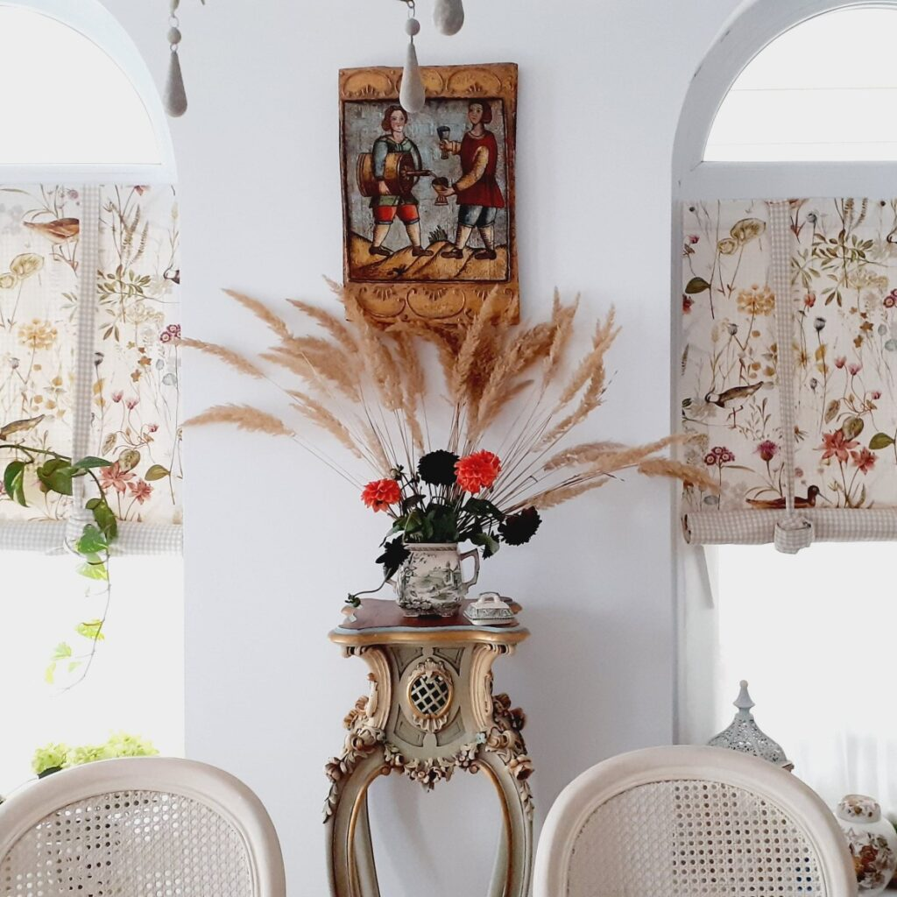
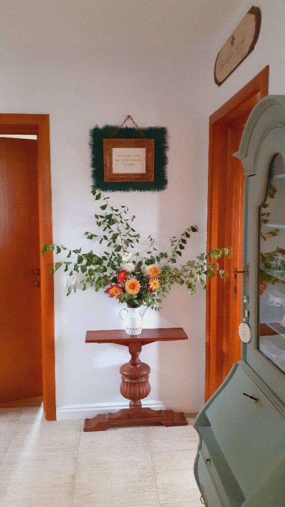
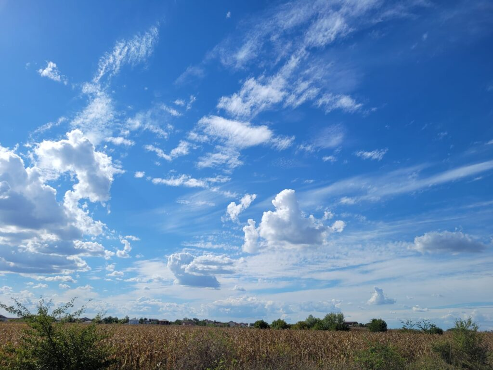
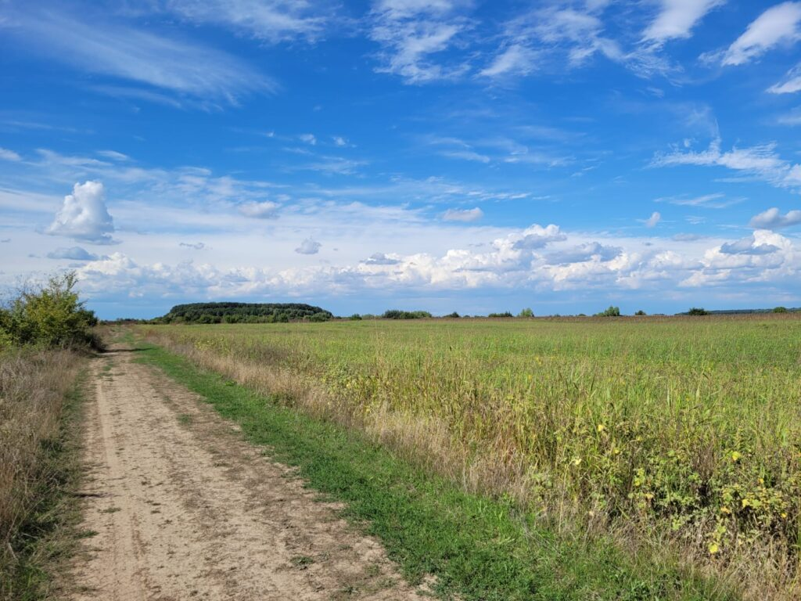

Am deschis ochii încet, lumina asta a dimineții mi i-a deschis, că-mi bătea destul de insistent în gene dar eu eram "plecată" din zonă. Nu vreau să mă trezesc, e o duminică tot d-aia blândă și cumincioară, cu liniște aproape absolută, nici lupițele nu au chef să spargă blajinătatea asta care e aer, făzăneii or dormi și ei pitulați prin pârloaga din jurul nostru, până și cocoșii tac mâlc. Al meu domn șuieră încetișor, semn că-i în somnul profund, Spiky mă încălzește cu spor pe-un sold, și ea cu ochii închiși.

Eu de ce m-aș trezi?! Mama nu mai vrea smoothie, nu prea dă semne că ar ieși din cameră dimineața, Sassy nu moare de foame, chiar n-am scuză d-aia veritabilă pentru care ar trebui să mă dau jos din pat. Numa' că la mine, o dată ce mi s-a aprins lumina în interior, rareori mai adorm la loc. Închid ochii la loc, cu respirație mică, să nu-mi agit celulele și să le dau semnalul deșteptării și aștept să văd dacă se mai alege de-o ațipeală. Și cu cât stau să văd, cu atât, prin auto-observarea asta, mai rău mă trezesc. Ok, hai să profit de umbrela ochilor închiși și să-mi cercetez intimitatea: în ce ape mă scald azi? Ce gânduri pregnante mi se așează la masa dimineții? Cu ce emoții mă înnod? 

Nu sunt nici bucuroasă, dar nici tristă. Mai tare mi se pare că nu sunt nici liniară, ci sunt un mănunchi de mai multe, nu e niciunul mai cu moț sau mai puternic încât să tragă căruța trăirilor într-o rână sau pe-un drum drept. Nu stau acum prea mult la dezșurubat emoțiile încâlcite în mine că n-am chef să mai adap ronțăitoarea asta de minte de la cele mai mici momente ale noii mele zi. Are timp să tot facă și desfacă scenarii, stări, gânduri, de ce așa și nu așa, și mai târziu în miez de zi, acum vreau să mă adun să-mi numesc, cu subiect și predicat, recunoștințele. Deși nu țopăi de fericire că am o pagină de zi nouă în față, îi recunosc zilei darul pe care mi-l face, de a fi în viață. Chiar și așa, nehotărâtă în mine toată, am o mică revelație să prind nuanța pe care Universul ăsta mi-o tot dă dar eu, avidă după culori intense, n-o văd: orice vine după trezirea în viață într-o nouă zi, e BONUS. Și, pentru că știu asta, mama ei de treabă, extra bonusul este că făcutul zilei e jobul meu. Numa' că eu îs plecată cu aoleala sau cu visarea și andrelele acumului meu merg singure, după cum le dictează non conștiența mea. 

\*\*\*

Deschid fereastra larg în living și curtea efectiv îmi inundă retinele. O invitație concretă și insistentă care-mi intră în carne dar la care răspund cu o pasivitate pe care mi-o observ. Din nou, simt în gură parcă gustul sentimentelor amestecate care mă trec acum: îmi place curtea, trifoiul ăsta verde mișto rău n-are cum să te lase inert și, cu toate astea, nu-mi vine să ies afară. E un du-te-vino intens în mine și din duelul ăsta iese câștigătoare absenta din mine. Nu ies, nici pe terasă, nici afară. Habar n-am de ce nu dar picioarele mi s-au țintuit în bucătărie.

Nu zăbovesc prea mult cu gândul-analiză la de ce?, ci-mi beau apa, mult lămâiată, poate o imprima vreun zvâc sau direcție în mine. În afară de prezența de spirit aia bună ce s-a format în pilot automat și care repetă mantric pretențiile pe care le am de la apa asta magică, nu se adună de niciun strop de bucurie. Dar, din nou, nici stropi de tristețe nu se-adună-n baltă iar cerul mi-e martor azuriu inocent.

\*\*\*

Mama e trează, cu pilota până la nas, răbunită toată în pat, cu Sassy lângă ea. Nu are chef nici măcar să se dea jos din pat, a pornit TV-ul și s-a mufat integral acolo. Mă strecor în camera lor, pe lângă grasa care flanchează deja ușa, și mă duc rachetă spre geam. Contrar aparențelor, mama e prezentă, îmi răspunde la întrebări, doar n-are chef încă de nimic. Eh, nici eu n-aș avea de făcut curat în baie și la Sassy, dar la mine nu e cu vrut, e cu trebe. 

\*\*\*

Au trecut 20 de ore de la ultima masă. 

Am pornit de miercuri cu postul intermitent de 18 ore pauză, cu 6 ore de masă, numa' că ieri de la 12 nu am mai avut chef să mănânc. Domnul meu e și el cu mine în experimentul ăsta, ne susținem reciproc când ne mai vine câteo poftă care nu e "în program".

Trebe să recunosc că mi-a luat mult până să mă setez la postul ăsta, mi se părea greu de ținut, mai ales că la mine mâncarea a intrat de ceva timp în zona de confort emoțional. După o zi grea sau muncită, simt nevoia să mă recompensez cu ceva bun, mai ales seara, mai ales cronțonele. Uite că o dată ce i-am spus coțofenei de minte că eu vreau să țin postul, nu a fost cu întrebare, ci cu fermitate, toate s-au dat la o parte și s-a făcut cărare. Nu mai am nici pofte, nu mai simt nici nevoia de comfort food. Pur si simplu, când mă încearcă valul de foame în stomac, beau ceai sau apă și trece. Mi se pare chiar interesant să-mi observ corpul la momentul de vârf al foamei, atunci când cred eu că începe autofagia, când corpul trece să consume din resursele de grăsime pe care le-am făcut în timp. E la început ca o mică arsură, pe măsură ce trece timpul, se lărgește arsura și ea, după care e un moment de climax, când parcă mă strânge stomacul și apoi e liniște. Foamea vine în valuri, de fapt ce ne prostește în general e pofta, ea e păcăliciul care ne atrage în cursa colăceilor. Ea și emoționalul. 

Vreau să țin tipul ăsta de post o săptămână, după care vreau să țin o săptămână tot cu două mese pe zi, una - smoothie, prânzul - mâncare solidă, dar vreau să-mi permit după amiaza o cană mare de suc de struguri negri, excelenți drenatori limfatici. Dacă tot trec zilele astea în goană maximă, măcar să treacă cu folos pentru mine și corpul meu. Că sunt sigură că repaosul alimentar dă ceva rezultate și-n emoțional, și-n mental.

\*\*\*

Mi s-a trezit și domnul și-a coborât la micul dejun. Azi are vervă-n el și mă adun cu el la micul lui dejun, să ne petrecem timpii împreună. 

E lumea asta atât de mică, oriunde am pleca, la un moment dat, într-o conjunctura, într-o situație la care nici nu te-ai fi gândit vreodată, dai de oamenii pe care i-ai lăsat în urmă, în itinerariul tău de viață.

Well, domnul meu a văzut un film pe Netflix despre educație financiară și i s-a pus pata că trebe să ne educăm în gestionarea eficientă a banilor. Pentru că filmul era în mare aplicabil celor din State, a căutat resurse locale și a dat de nașul copilei mele, devenit între timp un mare "dresor de lei", trainer și speaker pe spețe financiare. E o lume mică, after all…

Pentru mine, subiectul banilor e un subiect delicat, asta pentru că eu nu am un job care să producă bani la propriu. De câte ori e vorba despre bani, mă simt în genere prost și mai puțin decât restul, majoritatea în clanul "producătorilor de bani", adică salariați. 

Dacă dimineața nu mi-era hotărâtă în ce direcție să tragă, micul dejun cu Mr. H și discuția de educație financiară a decis-o: în mine a început tragedia. M-am simțit încolțită, arătată cu degetul, împinsă de la spate, deși domnul meu nici nu a făcut asta vreodată, nici nu are intenția. Mintea mea proiectează asupra lui lucrurile pe care mi le urlă în creier credința mea limitativă și rușinea cronică, intrată în oase, că eu nu produc bani. 

Această credință limitativă, care taie șuvoiul abundenței și posibilităților în viața unui om, nu e natural a lui, nu vine intrinsec la pachetul din naștere. Ea se copiază, se învață, se educă și se crește prin expunerea la criticile celor din jur: păi și ce faci?! Stai acasă?!

Nu-i judec pe cei care judecă că și eu le-am îngroșat rândurile. Nici măcar nu mă supăr. Singura asupra căreia îmi întorc judecata și câteodată supărarea sunt eu. Dar, contrar așteptărilor celor care nu (mă) înțeleg, din cu totul alte motive.

\*\*\*

Cu corăbiile înecate, am adus-o pe mama la micul ei dejun, deși nu-mi arde deloc de placiditatea ei. Tare bine mi-ar prinde acum, la cald, un timp de mine cu mine, să mă iau la puricat și la scos la suprafață rahatul ăla pe care nu reușesc să-l spăl o dată de acolo, din adâncul care mi-a pus singur stigmatul: nu ești suficientă dacă nu produci bani. Am o lacrimă-n gât și cred că nici figura nu mă ajută dar n-am o mamă care să mă aline, ci una absentă care doar mă suge de atenție. Îi dau și ei o bucățică din mine, o privesc cum mestecă cu zgomot, o parte din mine e aici, o parte a plecat departe.

\*\*\*

Ca să șterg urâtul ăsta care s-a căscat în mine, încropesc o realitate rapidă, cu lucruri materiale frumoase. Îmi trag cizmele pe picioare, înșfac foarfeca de tăiat și mă avânt pe pârloaga din spatele gardului, unde sunt bălăriile de-un metru, să tai niște iarbă înaltă, uscată, unduitoare. Tai și câteva crăci dintr-un copăcel ce dă să se usuce și mă reîntorc, la fel de grea în suflet, în curticica mea de flori. Tai și de acolo câteva dalii și fac două aranjamente simple, care să-mi ducă toamna în casă și să-mi alunge starea asta de rahat care m-a cuprins.

Nu am reușit să mă curăț. Mă apuc să spăl terasa, poate așa s-or spăla și emoțiile mele.

Din scaunul pe care stau acum, după ani de căutări, căderi, găsiri și pătrunderi de sensuri nevăzute la prima vedere, îmi dau seama că nu reușesc să mă dezbăr de judecata asta extrem de strâmbă care mă arată cu degetul lumii (de parcă asta ar conta!) că "stau" acasă de 7 ani. Deși și asta e destul de grea, că mă cobor singură eu pe mine în ochii mei, adevărata tragedie nu este aici ci în faptul, pe care l-am cuprins cu înțelegerea acum puțin timp, că prin judecata asta îmi creez toate catastrofele din viață.

Deși pare alambicat, după ce am reușit să văd, mi se pare uimitor cum de n-am văzut firul ăsta de dinamită până acum. 

\*\*\*

În urmă cu 7 ani, îmi dădeam demisia, în urma unui burnout. Eu, care am muncit de la 18 ani non stop, care pierdeam weekenduri la job, care stăteam până târziu și eram mereu disponibilă, care intrasem în rotița de hamster să produc bani să-mi susțin mica familie de trei, eu, copila mea și mama mea, m-am trezit dintr-odată fără job și fără banii mei. Dar nu asta m-a doborât, ci rușinea că stau acasă, jena față de ceilalți care erau "regulamentari", care aveau un scop, un job, bani și care mă vedeau dintr-odată slabă. Și ce-am făcut? La nivel non-conștient, mi-am fabricat "scuze" pentru care stau acasă.

Paradoxal atunci, dar normal când le înțeleg acum, pentru că exista acolo o mare intensitate, lucrurile au început să se lege iar scuzele, croșetate dintr-o inconștiență crasă, s-au născut în realitate: la 3 luni după demisia, a început saga cu cancerele mamei care mi-a furat doi ani de nici n-am respirat. Am terminat cu ele, m-am apucat de casă, care și ea mi-a ocupat vreo trei. Apoi ne-am mutat dar nu erau toate gata și mereu am avut ocupație. And finally, acum mi-am servit demența. Știu că sună incredibil dar știu, în mine, și că e adevărat. Am tot cerut claritate mentală Universului și am primit cât să desfac îmbârligătura asta. Deși sunt profund recunoscătoare că am putut să desțelenesc ceva ce părea bătut în cuie, îmi dau seama că ăsta e efectul unei cauze care încă e nevindecată acolo. Toate dramele rezultate din "trebe să fac ceva care să justifice de ce nu produc bani, de ce n-am job" vin din faptul că eu cred în continuare, într-un strat al naibii de ascuns, că e o rușine să stai acasă, să fii casnică. Până nu voi înmuia rahatul ăsta ca să-l pot spăla, o să tot fabric scuze și o să tot îmi aduc ocupații de timp și răpiri de libertate.

\*\*\*

De la terasă, unde am frecat de strălucea gresia dar lucirile nu mi le-am dus și înăuntru, unde colcăie credința asta tâmpită, am trecut la curtea de flori, unde m-am apucat să tai și să strâng roșiile care și-au terminat fructificarea, la toate etajele. Am o țâfnă și o adâncire în mine, de cred că pot să curăț toate grădinile din zonă, fără să crâcnesc. 

În tot soarele ăsta care mă dogoare, la fel de tare cum mă arde "puținătatea" care mă simt după o banală discuție de educație financiară, am avut și epifania: da, stau acasă, dar eu țin casa, cu tot ce presupune ea. Sunt femeie de serviciu, spălătoreasă, călcătoreasă, bucătăreasă, grădinar, advisor pe utilități, administrator, handy(wo)man, susținătoare de spirit sus, ascultătoare de probleme și dătătoare de soluții. Am realizat că singurul om de care mi-era de fapt rușine și a cărui părere contează pentru mine este domnul meu, dar am realizat, aproape instantaneu, că el poate să facă banii, că poate să aloce timp pentru tot ce face, pentru că eu l-am degrevat de tot restul. Poate că nu produc direct dar indirect sunt un stâlp, formăm o echipă cu două picioare din care unul sunt eu. Mi-au mai trecut așa razant, în timp, unele din astea pe creier, dar niciodată legate, niciodată să simt așa o mare ușurare. Doamne, parcă am spălat de pe mine zoaie de tone! Am trăit carnal o impresie de eliberare, parcă mi-a căzut lumea de pe umeri, că mă apăsa tare mult! Nu cred c-am curățat rahatul de la cauză total dar faptul că am putut să-mi recunosc meritele eu mie dar și relaționat la domnul meu, a fost e revelație divină, de care am avut mare, dar mare, nevoie.

\*\*\*

Încă pritocind dar vizibil mai bine, pun prânzul pentru noi, unde domnul meu îmi obține acordul pentru o plimbare și apoi prânzul mamei, pe care o alint cu noua ei preferată, savarina. Am o bunăvoință în mine pentru toți și toate acum, simt că mi-am cucerit eu mie o mare victorie, parcă mi s-a dat șansa unui reset iar asta îmi umple toți porii de o stare de bine.

De anul trecut de pe vremea asta nu am mai fost cu domnul meu la o plimbare pe coclaurile satului. Mama e mulțumită cu savarina și promite solemn că nu pleacă pe scări, iar noi suntem bucuroși de o vreme superbă, cu un soare domolit și adieri calme.

Au fost 3 (!) ore de plimbare, de pus suflete pe tavă, de împărtășit descoperire, de comunicare curată. Domnul meu mi-a recunoscut meritele, pe care el credea că eu le văd, iar din mine am mai scos o cărămidă greoaie de la fundația rușinii, stigmatului, auto-insuficiența. Mi-a luat 7 ani să fac un mic pas, poate nu mi-o lua tot 7 să curăț de tot zona, să iasă bujori acolo.

\*\*\*

Tot restul serii m-am simțit ușoară, vie, împăcată cu viața asta pe care am început s-o trăiesc și s-o practic cu prezență. Nici unghiile mamei, care par un izvor nesecat, nu mi s-au mai părut scârboase, dușul mi l-am făcut cântând încetișor, ce să mai, împrăștii bucurie de viață. Perseverența, dorința mea să desfac ce-am înnodat, lupa pe clipă și pe stare, au dat roade iar eu am fost capabilă să le văd. Mai e de desfăcut dar un nod mare s-a topit.

\*\*\*

Început nepromițător, ziua ce mi se duce la culcare a fost tare bună cu mine, mi-a adus, după ani de cârpeală și negare, o mare înțelegere și o cheie. Ține de mine să nu mă mai întorc acolo, să ferec din nou cine știe ce elucubrații, dar pentru asta pun în borcan o mare bilă albă zilei și sunt recunoscătoare pentru:

1. Casa și curtea noastră!

3. Frumusețe!

5. Încununarea a 7 ani de stigmat cu o revelație eliberatoare!

Frumosul meu azi:

