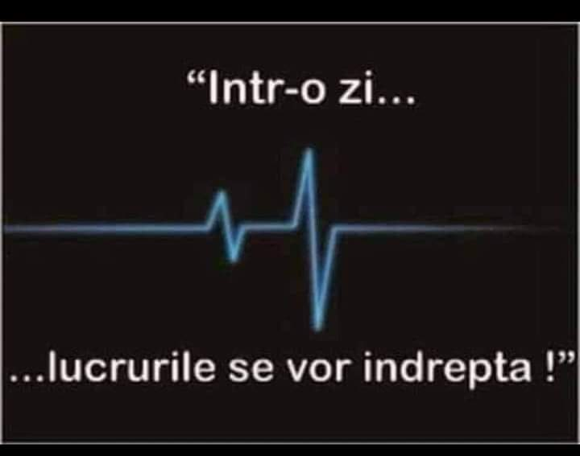

Sunt udă leoarcă, obosită și terifiată de coșmarul din care m-am smuls cu multă greutate să mă aduc în realitatea asta din afara visului. Am trăit haotic o trezire în vis, nedublată cu adevărat de o trezire faptică și crezând că am scăpat de coșmar, am lăsat garda jos, la fix cât să mă întorc acolo în miezul oribil al lui. Trăiesc niște vremuri grotești, asta e clar, și mi se pare cu atât mai grotesc cu cât pare că e o înscenare demnă de-un thriller. Cum altfel să cataloghez impresia atât de "reală" că m-am trezit, că am scăpat de oroarea care tocmai era pe cale să mi se întâmple, și să-mi opresc fuga și zbaterea, îndeajuns de mult încât aproape că era s-o sfârșesc?

Ca să pot să mă scutur de strângerile astea oribile, încerc o dedublare, mă observ de undeva de afară și văd, tranșant, că totul e plăsmuirea mea. Conștientă sau inconștientă, nu mă odihnesc și-mi aglomerez și nopțile stupid, pentru că hoarda asta de gânduri ne-bune care mă cutreieră secundă de secundă s-a năpustit nesupravegheată și nestingherită ea știe prin ce cotloane de groază, am pierdut hățurile, rațiunea și bunul simț. Dacă m-aș apleca din nou, măcar minimal, în clasicii pași mici, asupra lucrurilor care-mi călâiesc măcar prezentul, poate m-aș umple pic cu pic și de fain și n-ar mai fi atâta spațiu în mine, care, în lipsă de ocupație, plămuiește lucruri greu de dus până și de mine. Mi se pare fantastică mintea asta, cum întortochează și trunchiază și aranjează macabru experiențele în coșmaruri, atât de sucit, atât de imposibil de cuprins cu aceeași minte dar în stare trează, încât încep parcă să întrezăresc, pe cât îmi e permis și posibil, ce e demența. Doar o clipire face diferența între un coșmar astfel creat și demența.

E o mare ușurare trezirea, chiar dacă aș fi preferat să fie multă lumină, să mă invadeze și la propriu și la figurat, să mă cotlonească prin toate colțurile și să alunge cerneala asta neagră și oribilă care m-a încătușat atât de vivid în ea. Îmi liniștesc respirația precipitată și-mi aduc în ochi priveliștea domnului meu. Prezența lui fizică și știutul că e cel puțin încă un suflet viu aici cu mine, îmi picură stropi de liniște în interior. Gata, a trecut.

Vine destul de repede să mă locuiască o durere de cap dar, pe lângă ce tocmai am experimentat în vis, fătuca asta pare o briză ușurică. În toată agitația asta de dinăuntru, dublată de o împietrire exterioară, singurul gând de mulțumire care mi-a plecat săgeată a fost ce bine că m-am trezit! Nu neapărat că m-am trezit la viață, ci bine că m-am aruncat din coșmarul ăla nenorocit în realitatea asta care e mai ușor de dus. Pic cu pic.

Pe Spiky o găsesc jos, de data asta nu i-a funcționat senzorul care-i dădea alarma că i s-a trezit umana și doarme atât de profund că nici nu mă aude când cobor pe scări. Abia când sunt lângă ea, făcută covriguț în fotoliul ei din living, se trezește și-mi aruncă un chi scurt. O fi fost ceva azi-noapte în atmosferă, de ne-a anihilat pe amândouă în așa hal…

***

Adaug o a cincea intenție în spinarea apei aproape fiartă pe care o beau și o rog pe ea să-mi arunce afară din sistem urmele de frică și oroare rămase încă în fibre, că mă mai trece razant, din când în când, câteo imagine din coșmarul nopții. O alung de fiecare dată repede, și-mi mut atenția pe ceva fizic, așa că în loc să-mi storc lămâia în apă, am mâncat cu speranță din pulpa acră, de m-am strepezit toată dar măcar m-am adus cu totul în bucătărie. De abia acum, după juma' de lămâie acră ca naiba, m-am trezit și eu. Să încep de aici, zic.

Frica de a nu-mi veni înapoi flashurile pe care vreau să le îndes în uitare, mă face acut prezentă la acțiunile pe care le întreprind: deși sunt deja automatisme, ochii zăbovesc un strop mai mult și se încântă de culoarea mov plin a zemei lăsate de murele dezghețate, nasul simte mirosul suav de caisă pârguită bine, împletit cu cel al bananei, mâinile mi se uleiesc lejer de la avocado, e totul organic și-mi atinge simțurile plăcut. Ce tare, a fost nevoie de un coșmar să mă aducă din nou pe calea asta a micilor minuni, care au fost aici și-n zilele trecute, doar că eu n-am fost aici în zilele trecute. Be careful what you wish for… ce să zic, scopul scuză mijloacele pe care le folosește Universul ăsta să mă altoiască c-am pornit-o prin miriște.

***

Mama încă doarme, foarte bine, să mai doarmă, că parcă mi-ar mai prinde bine nițel timp, să mă ancorez și mai bine în ziua asta. Nu mi-e ușor să trec de la miros de fructe la izuri, și nici de la un cer ce se luminează a bunăvoință la un întuneric adăpostit de draperiile grele. Mai vreau un timp, acum mai mult ca oricând în ultima perioadă, mai vreau un strop de timp în mine, cu mine.

Că tot m-am delectat olfactiv și tactil cu fructele, continui tot în linia asta și dau pe canalul youtube al tipei faine de la pickuplimes. Mustește canalul ei de rețete mișto, are și un vizual la înălțime, așa că timpul meu liber al acestei zile i-l dedic ei și rețetelor ei. Nu neapărat ca să mă inspir ci mai degrabă să respir frumos, fresh, organic, simplu, curat, proaspăt, zâmbet. Al doilea mulțam care a venit natural dar cu toată puterea din interiorul meu s-a dus către Sadia și sper să-i prindă bine recunoștința mea.

***

Acum, că m-am prins că există și opțiunea de 2 în 1, prefer s-o accesez mai mult p-asta: urc la mama să hrănesc grasa blănoasă și să fac ordine și la coborâre o "agăț" și pe mama pentru micul ei dejun.

Deși nu-s tocmai într-o stare de conversație, azi duc mai ușor prezența mamei dar mă și ajut de radio, dat poate un pic prea tare. În bucătărie răsună muzica postului Romantic și lasă falsa impresie de voioșie iar dacă radioul reușește să facă asta de unul singur, eu nu mă pun de-a curmezișul.

Răspund la dialogul cu mama care-mi povestește, cu un lux de amănunte nespecific perioadei pe care o trăiește acum, cum l-a sunat ea pe fratele ei întruna până a răspuns. Chiar dacă știu că nu e adevărat, o las să brodeze și să facă tot felul de înflorituri, poate ăsta e modul ei de a se elibera de demonii dorului de el. Deși povestea ei are tentă de supărare și amărăciune, din ton și din finalul cum închide îmi dau seama că e și o tandrețe acolo. Însă concluzia m-a adus rapid la realitate: tu știi că fata lui, soră-ta, nu m-a sunat de ziua mea? Mi-a luat câteva secunde să procesez ce vrea să spună și i-am înțeles și oful, și asocierile: încep să cred, din repetițiile astea continue, că mama a păstrat în suflet doar doi oameni: pe fratele ei și pe sora mea. Iar în amintirile ei, îi leagă în diverse forme și grade de rudenie. Asta în timp ce pe copila mea o numește "fiica ta", iar pe mine nu mai știe câteodată cum mă cheamă. Nu-i cu supărare, e doar cu uimire, e o descoperire care începe să mi se contureze a claritate. Asta e, nu poți să placi la toată lumea. Chiar dacă "toată lumea" asta a fost cândva, literalmente "toată lumea" mea.

***

Ies afară și mă plimb prin grădină. Chiar dacă culeg de pe terasă gândul pe care l-am scăpat p-acolo că suntem trecători, atât de trecători, mi-e încă pe buza clipei amintirea plăcută a pregătirii de smoothie, când am fost atât de acolo, încât vreau să repet figura. Are Mel Robbins un citat devenit celebru, care se mulează mănușă pe contextul meu actual:

https://www.youtube.com/watch?v=SqN5SvASjMA

Îl ascult zilnic în speranța ascunsă că-mi va prinde cândva o crăpătură sau o ușă întredeschisă și mi se va infiltra în mintea aia care să mă adune și să-mi dea push-ul în direcția potrivită. Un bobârnac măreț care să-mi dea un șut în fund atât de tare încât să mă mute măcar un pas mai încolo. Că chiar de nu-i cine știe ce un pas, măcar nu mai sunt în locul ăla în care **pare** că toate corăbiile mi-s înecate. It's all about perception, cum zicea "bunicul" Bruce Lipton.

***

Chiar dacă nu mă trage ața s-o fac, e nevoie să întorc compostul și să-l transfer dintr-o ladă în alta, să-l vântur și să-l ud, să grăbesc procesul de descompunere. E incredibil cât de ușor duce nasul mirosul greu al compostului când mintea nu-i dă conotații grele, că nu-i atârnă tălăngi și etichete grele. Deși nu e tocmai plăcut, nici nu mi-a mai căzut tot părul din nas, nici nu m-a lovit la ficat, m-am apucat voinicește să încarc furca sau lopata, după caz, și-n două ore și un pic am terminat treaba asta puțitoare. Spre deosebire de dățile trecute, niciun șoricel sau neam de șoricei nu și-au făcut casă în compost, ceea ce e bine și sanitar pentru el și pentru mine.

Am apucat un duș rapid, destul de absent, dominat de scremeri de creier cu ce să-i pregătesc mamei la prânz, în afară de ciorba făcută ieri. Dacă o refuză p-asta, sunt total descoperită. Nu că ar fi o dramă, doar că mintea mea freak control, vrea să aibă lucrurile aranjate și un plan de backup.

***

Păi dacă n-a vrut ieri pastele că au prea mult sos, ia să fac eu, special pentru ea, paste cu puțin sos. E varianta cea mai rapidă și sper eu, rezonabilă.

Pastele astea nu sunt ca pastele pe care le știe ea, așa că împinge cu un gest în dezgust farfuria la o parte. Habar n-am cum sunt pastele pe care le știe ea, dar nici nu încerc să aflu. Deși am o tendință inițială de flamboaiere, îmi dau seama cât de stupid este să mă supăr. Pur și simplu, a venit cu atâta claritate stupiditatea asta în mintea mea, încât n-a lăsat niciun stropșor de loc liber care să fie ocupat de nervi. Ieri pastele aveau prea mult sos, azi nu-s ca alea de le știe ea, mă amuz gândindu-mă că mâine, dacă insist tot cu paste, fac pariu că au prea puțin sos. Cum naiba să te pui demența? E ca-n vorba lui Twain, nu te pune cu prostul că te trage la nivelul lui și te bate cu experiența.

***

Nu am chef de nimic. Nu pot să spun că am vreo drama în vene sau vreun nor pe vreundeva, doar sunt parcă anesteziată și pur și simplu nu-mi vine a face nimic. Treaba am destulă, am de unde alege, doar că-mi lipsește intenția sau dorința iar motivația e și ea plecată cu sorcova.

Îmi iau căștile, ies afară, mă duc într-un colț de curte și dau drumul la muzică de meditație. Nu-mi arde nici de asta, nu cred că-mi pot îngrămădi împrăștierea într-o fantă de meditație dar așa mi-a venit, așa fac.

Dacă plec cu ceva consistent din timpul ăsta melodios a meditație este știutul sau șoptitul care mi-a intrat în fascie în răstimpul în care priveam cu ochi de carne, dar nu vedeam nimic și mi-a răsunat puternic în cască, că eu nu m-am născut să am o personalitate, un caracter, să fiu plăcută sau nu, să fiu iubită sau nu, să joc după cum mi se cântă sau să cânt ce mi se cere. Oricât de ciudată sau sofistricată sau aiurită sau puternică sau sălbatică aș fi, privită din exterior, am înțeles că eu nu trebe să-mi sting lumina aia pe care am venit s-o adaug spectrului, alături de alte 7 miliarde de umani, doar pentru că alții nu-și văd propria lor lumină sau sunt orbiți de a mea sau se lipesc libidinos și sug ca lipitorile din mine și energia mea.

Iar știutul ăsta sper eu să fie fundul oceanului, să nu mă duc mai jos, să nu existe un mai jos, să mă trag ușor-ușor spre sus, cu curaj și voință, pentru că deja știu că "no one is coming".

***

Azi am simțit, chiar și așa, mai palid, recunoștință pentru:

1. Scoaterea din coșmar!
2. Sadia!
3. Șoapta aia din meditație care mă dezleagă total de așteptările celorlalți!

Iar adevărul acestei zile este:

