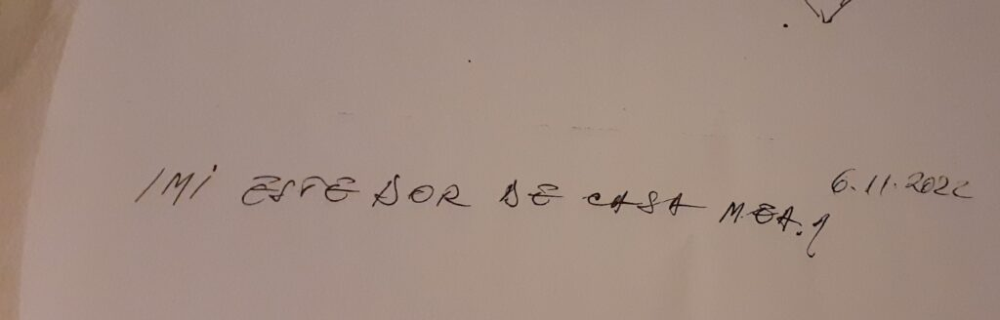

Noaptea asta e mai scurtă cu vreo lună decât mi-ar fi mie, probabil, suficient să mă odihnesc, să mă recuperez, să-mi pun ordine-n minte, ca ea să-mi pună ordine-n corp și ele amândouă să mă ajute să-mi aerisesc o țâră viața. Cu tot anghirolul pe care-l iau pentru bilă, cu tot regimul alimentar pe care-l țin, colica se îndârjește să-mi fie alături zi de zi dar și noapte de noapte. Dacă până acum, când mă cuplam la tărâmul evadării în somn, îmi lăsam în papucii de la intrare durerea de cap și de stomac, acum durerea de cap merge cu mine mai departe, să se țină lipită dureros de miez, să nu cumva să uit, chiar și-așa nocturn, că e acolo.

La fiecare trezire de peste noapte, dau peste ea, de fapt, ea dă buzna peste mine și-mi dă o stare nașpa. Vreau ca măcar nopțile să-mi fie blânde, ca măcar nopțile să mă pună pe o linie de plutire, dar am reușit să le împovărez și pe ele. Oricât aș vrea să găsesc o vină acolo, în afara mea, pe umerii căreia să pun această responsabilitate, știu că elementul comun și din zile și din nopți și din viața mea sunt eu. Și la mine în mâini stă toată puterea. Doar că mâinile mele acum sunt conduse prea mult de minte și prea puțin de intuiție, de partea aia din mine care știe, de locul ăla în care nu se nasc intrigi și nici judecăți pentru că totul este cum trebe să fie. Doar mintea mea nu acceptă asta. Deși, din când în când, o simt că se mai înmoaie pe ici, pe colo, sub puterea unui știut interior care-i peste rangul ei de slujitor și unealtă. 

Cu sau fără durere de cap, cu sau fără gânduri-sfredeluș în creier, nu renunț la a mulțumi chiar și pentru faptul că sunt total trează deși-i doar 5 și un pic, chiar și pentru faptul că mă strânge fruntea și arcada ochiului stâng unde s-a adunat matracuca de durere, chiar și pentru faptul că, atât pot să cuprind acum pe baza a ceea ce știu, mă așteaptă o zi ca aia de ieri, de alaltăieri, lipită de casă și de curățenie, mâncare, rutină. 

\*\*\*

Spiky a zbughit-o deja la parter, mă duc și eu pe urmele ei și în dreptul scărilor, aud televizorul de la mama. Dacă starea asta pe care o accesez, deja involuntar, deja by default, de câte ori mi-aduc aminte de toată situația asta dementă, ar avea un corp, în mintea mea ar fi o hidoșenie, un monstru cocoșat și rău. Fix ăsta se așează pe pielea mea când mi-aduc aminte că o iau de la început, fix p-ăsta l-am simțit acum când am auzit televizorul. Normal că s-a trezit, dacă se culcă de la 17-17.30.

Apa cu lămâie multă îmi mai taie din greața ce-o simt în gât, dar îmi dă și o mare senzație de sațietate, că aproape nu-mi vine să-mi mai fac smoothieul. Doar gândul că fructele astea mi-aduc papa bun în sistem mă convinge și smoothieul cremos, de la avocadoul din el, mă răsplătește vizual că nu l-am abandonat. Mai târziu, când stomacul meu o să-mi dea ok-ul, o să-l savurez, așa cum merită.

\*\*\*

Nu știu dacă să-i mulțumesc Universului sau lui Big Brother care ne veghează căutările pe internet și ne dă reclamele la fix ce vrem sau produsele la care taman ce ne-am gândit, dar faptul că am descoperit Chateau DIY e o comoară pentru sufletul meu. Trăiesc cu fiecare castelan bucuria și exaltarea atunci când restaurează, renovează, mobilează și readuc la viață părți din castel, parcă mă doare și pe mine când au eșecuri, am descoperit o mare comunitate de iubitori de vechi, de oameni care simt același fior în fața sau la vederea unor ziduri vechi, pline de istorie și vieți trăite și destine mărețe, schimbăm păreri, impresii, ne însuflețim unii pe alții, iar asta mi se pare fantastic. Am știut dintotdeauna că omul simte nevoie unei apartenențe, că e delicios și hrănitor de inimă să găsești oameni cu care să vorbești aceeași limbă a pasiunii, pentru alții de neînțeles. Cât de mult mă bucur că suntem diferiți, cât de mult mă îmbogățesc relaționările cu alte perspective ale unui fundal comun. Vreau să-mi cumpăr o hartă a Franței, s-o pun în garaj, să pun pin-uri pe ea acolo unde sunt castelanii pe care-i urmăresc și, când s-o putea, să-mi iau domnul și să dăm o raită prin Franța, în vizite. Gândul ăsta e ambrozie curată pentru zilele pe care le trec acum. Că nu prea le trăiesc.

\*\*\*

Sendvișul cald și laptele bătut sunt mâncate în liniște de mama, sub supravegherea mea, oleacă cocârjată, dar hotărâtă să stau acolo. Deși nu am motive, deși nu sunt nici prea jos cu starea, nici euforică nu m-aș putea numi, mi se pare că zvâcul vieții din mama a plecat aproape tot din ea și s-a mutat în mine, deși e liniște între noi două, doar radioul mai aruncă în aer note muzicale, eu am o mișuneală și un tumult și zgomote și un întreg Univers în mine. Mă uit la mama și înțeleg cu simțurile fizice că e liniște la ea, că și eu îs tăcută, dar cu un alt simț ce n-are corporalitate, simt că abund în viață. Cu tot răul ăsta ce-mi împresoară carcasa, mi se pare fantastică trăirea. Cam cum sunt toate momentele, împărțite doar de mintea analitică în mișto sau nu, atunci când sunt atentă la mine, la clipă.

\*\*\*

Am hotărât să nu fac nimic. E drept că m-au hotărât și durerile dar vreau doar să stau în pat, să meditez, să-mi atârn un strop mintea-n cui și să-mi las ființa să se odihnească, fără foșnăitul și râșnitul continuu de gânduri și inutile și sterile. Vreau să-i dau un răgaz corpului să se concentreze pe creșterea imunității și nu pe cortizolul pompat de griji, stres, scârbe. Ca să fiu sinceră cu mine până la capăt, îmi permit aroganța statului pentru că e curat în casă, pentru că e mâncare în frigider, pentru că-s toate așa cum le vrea mintea mea obsesiv-compulsivă. Dar dacă tot am terenul pregătit, dacă tot mă îmboldește și capul și stomacul să mă așez o țâră, de ce n-aș face-o?

Meditație, carte, muzică clasică, Netflix, Youtube, Spiky, ceai cald și bun, sunt un cocktail de vitamine pentru suflet. Le las aici scrise, să nu uit.

\*\*\*

Prânzul mamei e îngrămădit de telefonul psiholoagei, care vrea să ne întâlnim pe la mijlocul drumului, să-mi dea referatul ce-i gata. Nu pot să-i spun mamei unde plec, aș vrea să fi uitat de acea evaluare, așa că mint, stau ca pe ace în timp ce ea mestecă și mestecă și mestecă iar eu risc să n-ajung la timp.

Adrenalina-mi pompează-n corp suport să pot să alerg cu mașina la punctul de întâlnire, să stau de vorbă cu doctorița, să revin acasă nerăbdătoare, să citesc raportul. Oare de ce-oi fi așa curioasă?

Citesc și de la a doua pagină nu mai văd nimic de lacrimi. Acest raport mi se pare o violare de viață de om. Deși partea cerebrală din mine înțelege că facultățile mamei au fost evaluate de un ochi specialist și raportul documentează concluziile acestuia, aproape matematic, după niște grile, atât și nimic mai mult, din punct de vedere emoțional îmi e greu să duc, să citesc cum această femeie, pe care o cunosc literalmente de-o viață, a mea, este prezentată sec: debilă. Cum femeia asta, care a avut și ea o viață, visuri, iubiri, drame, povești, prietenii, impresii, acum este o bolnavă mintal care nu are conștiința bolii.

Mi-e tare milă. Și, la un nivel care n-are legătură cu lumea asta, cu convențiile ei, cu birocrația și modul de viețuire tâmpit pe care-l impune, parcă nu vreau să merg mai departe cu acest dosar. Mi se pare o înjosire umană, o terfelire grosolană a unei vieți de om, pentru niște bani.

La ultima pagină a raportului, este scris răspunsul mamei la întrebarea: care este cea mai mare dorință pe care o aveți?

_Îmi este dor de casa mea._

Aici m-a atins atât de tare că plânsul nu mai e doar pe dinafară, în lacrimi, e și pe dinăuntru, pe suflet.

\*\*\*

Umflată de plâns, am adus asistenta să începem B12 injectabil, dar eu nu pot să urc la mama, ca nu vreau nici ea să-mi vadă fața, dar nici eu nu pot s-o văd pe ea. Mi se pare că-i coc o trădare cu nenorocitul ăsta de dosar și încă nu mă țin balamalele să mă arăt în fața ei.

Am bifat prima injecție, din 10. Pe drumul de întoarcere de la domiciliul asistentei, am sunat pe cineva drag. N-a răspuns. Am sunat din nou. N-a răspuns. Am sunat a treia oară. Fără succes. Aveam mare nevoie să împart cu cineva, detașat emoțional, povara asta care-mi apasă inima și acoperă cerul sufletului. Dar, probabil că nu întâmplător, n-am găsit. Că nu toată lumea e ca mine, acolo, când e nevoie.

Îmi dau seama că eu nu mi-am tratat oamenii niciodată ca pe niște halte în drumul meu. În naivitatea mea, mereu am imprimat eternul în oameni, lucruri, situații, în speranța că ei vor fi acolo cu mine mereu. Utopic si prostesc, chiar nesănătos, mi-a arătat viața. Dar eu tot n-am învățat. Deși nu atârn de glezna nimănui, deși nu opresc pe nimeni din plecare, nu mai manipulez, nu mai cer, fiecare plecare m-a durut în doli emoționali mult peste unitățile astea de măsura a durerii fizice. Și am rămas în urma plecării descumpănită, retrăind abandonul ăla primar, mereu și mereu, neînțelegând de ce efemerul e mai puternic decat eternul. 

Acum știu că oamenii vin, îți contribuie, în varii forme, plăcute sau neplăcute și pleacă. Acum știu că e o singura persoană care nici nu vine și nici nu pleacă, care e acolo mereu. Și fix p-aia o abandonez eu mereu și mereu că, deh, abandonul ăsta e o boală molipsitoare.
