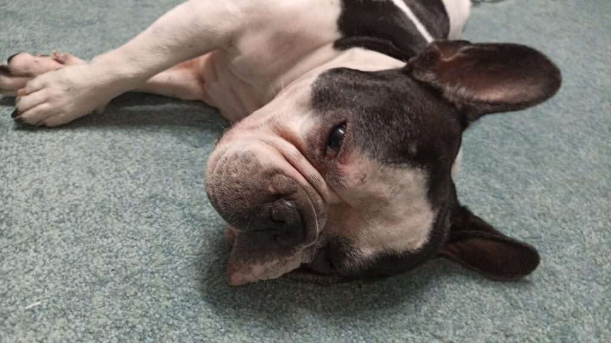

N-aveam niciun dubiu că răceala lui Mr. H nu ne va tulbura somnul și nopții care a trecut, singura necunoscută era momentul la care își va bagă coada, ca un șarpe perfid ce mi se va strecura printre gene închise și mă va smulge nemilos. S-a făcut lumină, și la propriu și la figurat, pe la 2 dimineața, când, din nou, mi-am luat tălpășița din dormitorul conjugal, însoțită de pilotă și de pernă, și de-o Chichirică nedumerită, dar angrenată total în acțiune. Văd cum merge înainte mea, o țâră împleticită și mi se umple sufletul de drag, are pufoșenia asta mică un fel de a-mi spune "stai liniștită, mami, I got your back!", de mă invadează toată duioșia din lume. Cu un zâmbet cât un miez de noapte de mare, cobor și eu după ea, dar încetișor, să nu mai zdruncin rămășițele de somn ca să pot să le înnod și să mai prind ceva ore de odihnă totuși. 

\*\*\*

La 6 îmi fierbeam mulțumită apa și-mi pregăteam smoothieul. 

Azi se închide rotund ideea primită cadou de ziua de la cercul meu de femei faine: dacă simți că te strânge situația ta, mișcă-te din loc. Poate că ele i-or fi dat îndemnului un sens figurat, numa' că eu, hotărâtă să sorb cât mai mult din viața asta ce-mi vine-n zile, i-am atașat și sensul propriu și azi plec la drum. Plec să-l iau pe Sett de la acasa lui, din Ploiești, pentru o serie de analize care să indice clar drumul medical de urmat.

Mă observ și-mi simt mâncărimile din tălpi, am așa un zvâc și-o bucurie și-o dorință să fac, că nu mă mai deranjează nici că n-am dormit plin și dintr-o bucată, să mă încarc pentru consumul pe care cu siguranță că-l voi descărca azi, nici șovăiala mamei care se sperie că plec și-mi repetă obsesiv "toată ziua ești plecată?!" deși o liniștesc că e domnul meu acasă și că oricum, vin cât pot eu de repede înapoi, nici vremea încețoșată de afară cu cer ce-mi cerne stropi de ploaie.

Calmul care m-a îmbrăcat azi pare să aibă efect asupra mamei, ce-și mănâncă dumicații liniștită și mă întreb dacă nu cumva a și uitat că plec. Oricum nu mai aduc vorba despre asta, iar dacă ea a și dosit informația prin vreo negură, acolo i-o las, ca să-i tihnească micul dejun. 

\*\*\*

Gata, am pornit la drum să cunosc puiul ăsta de French Bulldog pentru care am deschis cutia Pandorei ce m-a forțat să învăț lecții pe care poate nu le-aș fi vrut chiar acum. 

Eu n-am fost și nici nu sunt vreo bisericoasă, deși am avut în viața mea momente la limită în care aproape că era să mă călugăresc sau când am urlat la un Dumnezeu să mă ajute de mă dureau fălcile, dar, în vremuri de acalmie, nu eram sigură că știu ce cred. 

Acum m-am făcut mare și eu și îmi permit mie să cred ce vreau și simt eu să cred, fără să mă mai duc după turmă. Acum știu că există îngeri păzitori și cred că, pe undeva, am știut asta toată viața mea, însă n-am fost capabilă să pun punctul pe î de la înger. Le-am simțit prezența și ajutorul în decursul vieții mele, dar am fost câteodată prea ignorantă, iar alteori prea arogantă, să le las lor creditul pe care-l meritau. 

Mi-aduc aminte de o situație din copilăria puiului meu, care a fost sigur rezolvată de o intervenție din afara acestei lumi: copila-mi pleca într-o tabără în Anglia și pentru asta, an de an, trebuia să obțin o țidulă de la notariat care să țină loc de accept parental din partea tatălui. Obțin hârtia vineri, că duminica pleca mândra. Sâmbătă dimineața, în timp ce mă spălam pe dinți, mi-a venit, cu mare putere, în cap gândul că țidula e greșită. Atât de intens a fost gândul că efectiv mi s-a strâns stomacul cât un pumn. M-am clătit rapid și am coborât la băgăjelul ei, unde pusesem hârtia, s-o verific. Era greșită! Pentru că eu o făceam la același notar, an de an, ei luaseră forma de anul trecut că aveau toate datele acolo, dar uitaseră să modifice anul. Practic, hârtia n-avea nicio valoare. Am înghețat! E sâmbătă, notariatele nu lucrează sâmbăta iar mâine dimineață, la 6 e plecarea cu avionul. Sun la notăriță, e plecată din București, toate sunt cum nu se mai poate mai prost aliniate. Îi explic femeii că nu pot să-i fac asta copilei care de abia așteaptă excursia, că da, sunt vinovată și eu că n-am verificat dar e și greșeala lor, să ne întâlnim undeva la mijloc să reparăm. Long story short, notărița s-a întors în București sâmbătă seara, a deschis biroul, a refăcut hârtia și copila a avut o excursie demențială. Iar eu am știut atunci că un înger păzitor, al meu sau al copilei, m-a strigat în gânduri.

Acum plec la un drum și pe un drum în care am mare nevoie de ajutor, din toate părțile: de analize relevante ca să elucidăm evoluția, de medici faini, de bani, de aliniere planete să nu i se întâmple ceva lui Sett cât e în custodia mea, așa că trimit un gând-cârlig către lumea aia imaterială, poate se prinde în el careva și ne iese treaba.

\*\*\*

E o vreme urâtă, plouă și e și ceață, pe DN se merge prost, dar ajung la Sett în timp util, să nu ratăm programarea de la medicul care îl va și opera într-un final. Micul francez e un pupăcios și-un lipicios și-un vorbăreț. Deși "mama" lui m-a avertizat că are rău de mașină, nu am avut niciun eveniment, poate și pentru că am mers încet, fără frâne sau mișcări bruște, cu muzică clasică dar, cel mai important, cu o mare calmitate la mine în interior. Deși nu ne cunoaștem, ne-am povestit tot drumul intimități, fiecare pe limba lui. Într-un final, după ce mi le-a povestit apăsat pe ale lui, de la monotonia drumului, a adormit. Iar la intrarea în București, ploaia s-a oprit, s-a făcut senin și a ieșit soarele. Zic un mulțumesc știu eu cui, că am nevoie să mă mișc ușor prin oraș, iar în capitală, cum pică câțiva stropi de ploaie, cum paralizează tot traficul.

\*\*\*

Consultul neurologic, din păcate, nu e optimist, dar îmi primesc trimiterea pentru imagistică, să avem o dovadă concretă și palpabilă. Eu n-am nevoie de ea, se vede cu ochiul liber cum lui Sett îi scapă picioarele din spate, dar urmăm protocoalele. Tot din păcate, nu reușesc să-i fac RMN-ul tot azi, ci de abia mâine, așa că profit că îl am cu mine și dăm o fugă la cabinetul celei mai bune și mai faine doctorițe pe dermatologie veterinară din România, cu recunoaștere la nivel european. I-am obținut francezului, cadou, o consultație pro bono și mergem într-acolo, unde îi recoltează mostre de blăniță, de scuame și cerumen.

Dacă aveam emoții că nu găsesc parcare, la oră de vârf, în București, cineva acolo sus mi le-a spulberat pe absolut toate: fix când ajungeam la cabinet, tocmai pleca o mașină chiar din fața cabinetului. Așa s-a întâmplat la consultul neurologic, așa s-a întâmplat la dermatologie, cum am intrat în cabinete, Sett a fost luat pentru consultații, toate au mers șnur.

Tot drumul spre casă mi-a vorbit întruna: e când o jale, când o bucurie, când dor de ai lui, când încântare de prieteni noi, adică eu. Deși mi-e sufletul greu de la consultul lui neurologic, nu las asta să plutească între noi, mai ales că lui trebe să îi fie tare greu: are probleme grave la coloană, probabil și dureri pe măsură, e umblat de o necunoscută prin locuri la fel de necunoscute, e frecat și întors pe toate părțile și nici nu va pleca acasă în seara asta, că mâine avem de făcut RMN-ul.

Acasă am organizat rapid sufrageria, cu barieră, ca Sett să nu aibă ideea creață să urce scări, Spiky a tăiat-o la etaj, mama nu înțelege cine latră și plânge, apuc să fac un scurt super rapid duș și-mi petrec toată seara mângâindu-l, drăgălindu-l, scos afară la piș, înfofolit, ținut în brațe, în poală, pe picioare, cât mai aproape de mine. Pe la 11 noaptea a căzut lat și-n secunda doi, l-am urmat.

\*\*\*

O zi cu plecări și veniri, cu bucurii și tristeți, cu griji și relaxări, cu o mână invizibilă care ne-a ținut pe amândoi în palmă, o zi ce o închei recunoscătoare pentru:

1. Spikylina mea iubitoare!

3. Settuțul meu lipicios!

5. Ajutorul primit, de la umani și nu numai!

Frumosul zilei este cine altcineva decât un urecheat trist:

Sett
