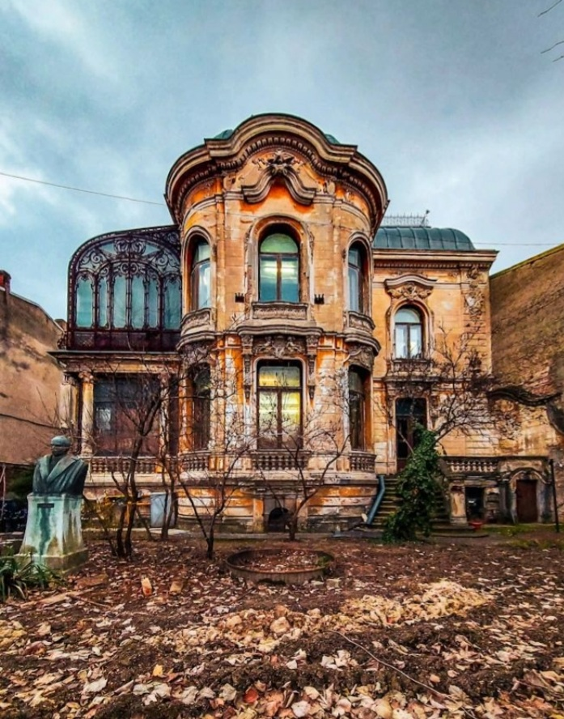

Fiecare celulă din corpul meu, hrănită empiric, dar bogat, de emoția bună a zilelor trecute, strigă după somn, lung, odihnitor, liniștitor, vindecător somn. Nu știu care sunt ingredientele sigure care mi-ar coace un astfel de somn, dar știu sigur care nu sunt, iar unul dintre ele este sforăitul pe voci la care s-a specializat domnul meu. Așa că noaptea trecută, mi-am luat băgăjelul de noapte, pilotă, pernă și Spiky, și m-am aciuat în living.

E drept că patul nu-i la fel de moale, că peste noapte mă tot trezesc să-l caut pe Mr. H, că Spiky are reprize de joacă pe timpul nopții de care, fiind la etaj, habar n-aveam, dar am încropit totuși de-o liniște până pe la 5 și 12 minute. M-a trezit un usturat în gât, pronunțat, o uscăciune urâtă, hârșâitoare dar, după scanarea rapidă a corpului, am sondat împrejurimile și trăirile și mi-am adus aminte că sunt acasă la mine, că nu am nicăieri de alergat, că toate sunt bine, că-mi trăiesc normalul la care m-am adaptat, cum am putut. Mă foiesc a culcușeală mai adâncă-n colțar, parcă-i și simt dezumflarea lui Spiky ce credea că-s aptă de trezire deja și mă dedulcesc la o lălăială. Și o vărsare de recunoștințe din preaplin. Și la o împachetare cu bine, cât mai etanșă, mai pe toate părțile, mai ales p-acolo pe unde mă trădez cel mai repede.

Se aud stropii d-afară și un vâjâit mai cu spor și mai mult mă lipesc de pat și de molcomul care mă îmbrățișează blând. Mulțam și mulțam și mulțam!

***

Apa caldă, la limita de fierbinte, cu multă lămâie alunecă parcă cu zgârieturi pe gâtlej și simt cum mă trage de-o aripă o grijă mică, un pui de panică: zi-mi că nu-i gripă! sau covid! sau orice altceva care ar putea să treacă de la mine la mama. Beau cu și mai mult spor apa și parcă mi-aș mai face o halbă, numa' să nu mă pască nimic virozabil de după colț. Lasă ca-mi fac și-un ceai, mai torn ș-acolo o tonă de lămâie, poate mă ocolește.

Dau skip și-n dimineața asta la curățenia de la mama din cameră, pentru că e-n planul zilei oricum, și-n timpul ăsta dintr-odată liber, mă mai întind la o orizontală scurtă. Parcă nu mă țin toate balamalele azi, dar îmi zic că-i doar pornirea înțânată, o să mă ung încet-încet și-o să ajung la parametri la care mă cunosc. La ăia la care m-am adus mereu ca să-mi tot cer lucruri de făcut.

***

Cu încetinitorul în mișcări, îi pregătesc mamei un sendviș cald, îi scot și laptele bătut și o aduc la micul dejun întins. De câte ori sunt prezentă la momentul ăsta al fiecărei dimineți, mi-aduc aminte cât de mult am tânjit și tânjesc și eu să am mic dejun "la botul calului". Dar, când văd care sunt circumstanțele la care ea s-a calificat la acest mic dejun pregătit, mă răzgândesc și nu-l mai vreau. Deși e o inepție să le leg între ele, la mine s-a făcut această conexiune și s-a bătătorit calea neuronală, așa că mai bine zic "pas", e prea scump, nu mi-l permit.

Ea mănâncă, eu mai strâng, tot așa la ralanti, prin bucătărie și mă întorc către ea, împinsă de nu știu ce imbold, taman cât s-o văd cum mișcă din buze dar nu iese niciun sunet. Mă uit mai cu atenție, da, n-am înnebunit și nici n-am surzit subit, ea dă din buze, dar fără glas. Ca s-o abat de la ce trăiește, indiferent ce-i fi, o întreb tare și vesel "domniță, îți place sendvișul?" Jur că dacă aș avea termometru de măsurat căldura din privirile ei, acum s-ar da peste cap. Recunoscătoare, ea știe de ce, mama reușește să vorbească și să-mi spună că ea ar mai vrea "bobițe d-alea". Îmi scormonesc mintea și memoria să văd ce bobițe i-am dat eu și realizez că 1. datul mărunt din buze era rezultatul faptului că-n mintea ei e blank, nu găsește cuvintele și 2. bobițele = struguri. Validez cu ea dacă se referă la struguri și se uită la mine, liniar cu ochii ei negri: _Struguri se numesc? Nu știam._

O umbră la fel de cărbunoasă ca adâncurile ochilor ei s-a așezat brusc și comod pe inima mea.

***

Plec la cumpărături și-mi iau cu mine și hârșâiala din gât și încetineala în carne. Oricât aș vrea eu să mă mișc mai cu talent, azi nu-mi iese.

Primul venit, e un sentiment de iritare a mea pe mine, pe corpul care nu se supune unei minți ce a orânduit ceas toate acțiunile zilei, militărește. Am de făcut și aia și aia și ailaltă, n-am nevoie de timpi morți. Și, cum îmi trag picioarele de plumb prin Carrefour, mă lovesc în frunte, parcă cu zgomot, întrebările: Alooo, unde te agiți, fetiță?! Ce-ai cu corpul tău? E al TĂU! Și acum, ca o mârțoagă istovită, nu mai poate să tragă în același ritm!

Dacă aș fi văzut pe altcineva în fix aceeași postură în care sunt eu, imediat m-ar fi cuprins o duioșie și o grijă și o înțelegere, i-aș fi luat de pe umeri și minte ce-l macină și i-aș ușura, cât de mult aș putea, clipa. Uite că nu fac la fel și cu mine. Am mai văzut asta până acum, nu e prima oară când mă prind, dar e prima oară când mă inundă cu totul aroma asta de neglijență pe care mi-o dau, resturile astea pe care mi le arunc, în loc să mă pun în capul mesei. **Întotdeauna vor fi lucruri de făcut și niciodată nu le voi termina.** Articulez asta apăsat, și folosesc intențional cuvintele astea definitive și grele, ca să mă infiereze și să rămână marcat, poate data viitoare oi ridica ochii și le-oi vedea acolo, arse-n mine, și nu m-oi mai surghiuni și împinge și irita eu pe mine. Că nimeni altcineva nu o face, ci doar eu.

Mai cu împăcare prin interior, parcă și cu o țâră de atenție la mine, îmi permit să termin cumpărăturile în cât timp s-o putea. Și am simțit puternic trecerea de la agitația aia imprimată inutil la mersul ăsta agale, după putirință, a fost ca o secvență de reluare cu încetinitorul într-un film în care totul se petrece pe repede-nainte. Merg printre rafturi și pot să văd și altceva decât ce aveam pe lista de cumpărături, îmi fac timp să citesc etichete, să compar, să înțeleg. Când mi-am permis să respir adânc, și viața mi-a făcut spațiu.

***

În spațiul și timpul astfel create, s-a strecurat și ciorba mamei, am pus și la spălat lucrurile pătate de Sett și mă apuc și de curățenie. Într-un final, în ritmul cerut de el și nu impus de mine, mi s-a uns și corpul și și-a dat drumul la a face. Îi fac și mamei și lui Sassy baie și, cred că sub imperiul analizei care mi-a consumat parte din zi, mă șochează și înfioară cât de mult se descărnează corpul la boală. O și mai mare duioșie pentru mine m-a cuprins, împletită cu un strop de groază, de frică, de gânduri. Corpul ăsta căruia îi dăm ce trebe sau nu, mai devreme sau mai târziu, ne va trăda. Nu mai bine mă asigur că la mine va fi mai târziu? Cât de mult mă costă automatismele, inconștiența, programele inoculate care nu-mi permit deraierea de la un plan, nevoia asta ascunsă de a face totul, care are și mai ascunsă de fapt nevoia mea de validare exterioară: _Da, măi, le face, pe toate. Ce tare e!_ Bullshit!

***

Dacă de dimineață încerca, dar nu găsea cuvintele, la prânz s-a stins și pâlpâirea asta. Mama mănâncă tot ce are în farfurie, dar nu pare să aibă vreo frecvență deschisă nici cu mine, nici cu exteriorul. Are aceeași privire seacă și goală, care pe mine m-a cutremurat la începutul drumului meu cu mama la mine. E o privire non-privire, e o senzație stranie că deși ochii îi sunt vii, totul înăuntru e mort. Nu știu dacă există ceva mai trist sau mai absent la om decât această neprivire, îmi pare că în aste momente mama își dă shutdown, fără să vrea și fără să știe, la simțuri.

***

Gata, mă locuiește tristețea. Deși eu am o înclinație și-un apetit aparte pentru tristețe, bucata asta de emoție care mă încearcă acum are și o tentă dureroasă pe alocuri. Pe de o parte înțeleg că trecem și ne trecem cu toții, fără excepție, pe de alta mă umple regretul și vreau să fug înapoi în timp. Văd în mama efectele bolii și ale bătrâneții și mă disperă și mă sperie și mă face să vreau să sug cu aviditate maximul din fiecare clipă ș-apoi mi-aduc aminte că n-am clipele pline de libertate așa cum mi le doresc și mă învârt într-un cerc vicios. Mă împac cu ideea în cele din urmă dar mă revoltă trecerea inexorabilă a timpului. Eu nu prea am înțeles mare lucru din viața mea, până acum. Se pune?

***

Ca să fac un shift către altceva, să nu mă mai macine gândurile astea cu tentă de prisos, mă apuc să citesc din cartea primită cadou, despre familia care locuiește în noi și simt că e prea mult pentru mine. Încep să pricep că-n mine sunt toți, cu durerile și cu reușitele lor, cu visele și eșecurile lor, și mă uimește cât de mare mi-e inima ca să-i cuprindă pe toți, pe lângă mine, care am tendința de expandare în orice și oricând. Azi parcă nu pot să-i duc pe toți, mă simt ocupată parțial cu mine și parțial cu mama. Dacă niciodată până acum nu mi-am dat silința să-mi cunosc neamul, uite că azi mă simt invadată, fără drept de veto, de toți. Și-mi vine, din locul ăla în care nu mi-e nici ușor și nici bine, să-i iau pe toți la rost, să-i întreb unde le-a fost și capul și inima, când nu s-au gândit ce lasă în urmă, ce moștenire emoțională urcă pe umerii succesorilor lor, de ce au fost așa de îndârjiți și concentrați doar pe ei, de ce nu s-au ridicat o țâră mai sus de condiția proprie, să spele puțin neamul ăsta mototolit și mocirlit pe alocuri.

Ș-apoi, în timp ce caut înverșunată posibile răspunsuri, îmi vine unul cât toate la un loc: ce-ai făcut tu 40 și de ani?! Exact ce-au făcut și ei! Wow, unde dai și unde crapă.

***

Seara se încheie în aceeași notă de prăpăstios pe care o întrețin deja de o juma' de zi: au venit rezultatele lui Sett de la imagistică, iar puiul are două hernii la coloană, dintre care una care-i poate aduce, în orice moment, paralizia.

Doar de dragul exercițiului și pentru că, mental, nu emoțional, ȘTIU sigur că am de ce, sunt recunoscătoare pentru:

1. O prea-dimineață blajină!

2. O claritate emoțională!

3. Tot ce au pus în mine predecesorii mei, că-s convinsă că mi-au dat și multe bunătăți (și poate-mi spăl și păcatele față de ei pentru oțărârea mea de azi)!

Frumoasa zilei:

Casa Macca, București
