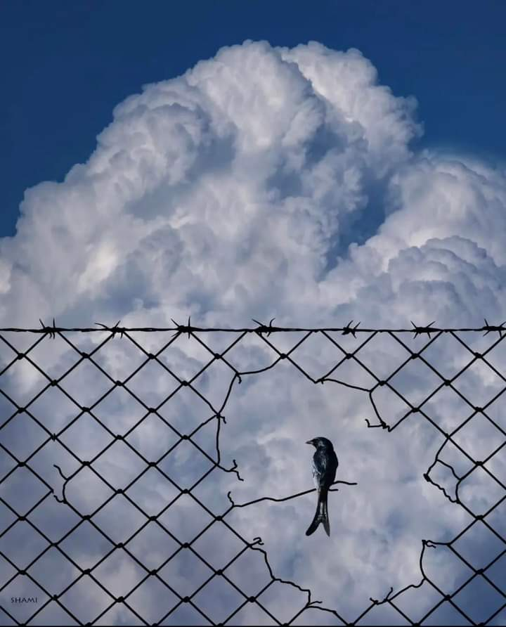

Am suflat, cu toată puterea mea, noua mea grijă pentru mine în Univers și mi s-a întors și cu toată grija pe care mi-o dădea oricum, nevăzută, Universul. Liniștea care m-a umplut ieri mi-a complotat o noapte ușoară, ca un fulg, parcă nevrând să-mi îngreuneze în vreun fel prezentul, să nu mă răzgândesc sau să uit ce tocmai am înțeles ieri. M-am odihnit cuprinzător și vreau să-mi țin ochii doar pe asta acum, deși din laterale mă-ncearcă și gânduri-meschine de genul "cu o floare nu se face primăvară". 

Mă lălăi sub pilotă, mă înmoi bine în căldurică și-n calmul dormitorului nostru, n-am nimic butucănos în trezire și mă întind în mine să ajung la claritatea atât de necesară pentru o nouă zi. 

De multe ori îmi dau seama, surprinsă, că am avut toată viața la dispoziție totul, mereu au fost informațiile acolo, măi, dar extrem de rar mi-am deschis urechea să le aud. Am trecut atât de nonșalant prin viață și atât de puerilă și de superficială, că nu numai că n-am prins sensul ăla adevărat al lucrurilor, dar am mai și făcut mișto de el, ori de câte ori am putut, că dădea bine să fiu sarcastică. Deși peste tot se predică și pe toate gardurile scrie "află ce vrei", mi se părea atât de la mintea cocoșului, atât de simplist spus, că nu m-am aplecat să și înțeleg. De ceva timp am prins și plinătatea aia ascunsă a acestei lozinci simpliste: dacă nu-ți petreci timp aflând ce vrei, cu subiect și predicat, cum ai putea să ajungi acolo ever? Dacă nu-ți detaliezi, pe cât posibil, intențiile și ce vrei tu, cum ai putea să te crești, să-ți definești comportamentul, să te pui în mișcare înspre direcția aia? Dar aurul curat nu este ce-ți dorești, aurul curat este **de ce** îți dorești ce îți dorești. Fără un de ce puternic, nu vei avea motivația să rămâi pe traseu, mai ales atunci când se iscă, de obicei din neant, a naibii furtună. 

Așa că eu, după ce m-am dumirit cum stă treaba, măcar în linii mari, vreau să-mi cresc claritatea. Pentru mine, ăsta e nivelul 0 de la care pornește orice de ce. Iar la nivel micro, este cărămida aia cea mai de jos de la construcția unei noi zile.

\*\*\*

Probabil că să fiu sănătoasă cât mai mult posibil în viața asta este de ce-ul care stă la baza apei mele calde spre fierbinte în fiecare dimineață sau a fructelor, pasate sau nu, și a ceaiului, toate de peste 1 an și ceva. Am eu convingerea că, o dată ce o să-mi conving mintea că în spatele acestui de ce se mai așează și restul meselor de peste zi, cât mai naturale, și mișcarea, cât mai zilnică, o să mi se lege mai ușor treaba și o să le organizez mai lejer. Până acum, chiar și atunci când m-a tăvălit neprevăzutul în zi, m-am ținut nedesprinsă de apă, smoothie, ceai. Vreau să fiu atât de convinsă în mine și de celelalte, nu doar la nivel mental, încât să nu mă abată nimic mai încolo. Sunt încă la faza de știu ce vreau, de ce-ul, deși puternic, încă nu mi s-a scurs printre crăpături în interior.

\*\*\*

Mama doarme, cu televizorul pornit, semn că s-a trezit mai devreme și acum a ajuns-o din urmă somnul neterminat. O să le fac vizita și de curtoazie și de curățenie o țâră mai încolo, mai vreau să mă scald în apele astea calde și plăcute în care mi se odihnește și corpul, dar parcă și mintea, e mai maleabilă, mai înclinată să-mi dea o mână de ajutor cu gânduri galbene, nu să-mi bage bețe-n roate cu d-alea gri.

Ca să-mi bucur și inima, mă dedulcesc la o meditație ghidată, o feerie cu explozie de bucurie interioară. Câți ani am pierdut eu, dându-mă pe după cireș că nu știu cum se face o meditație, că mie nu-mi iese, deci nu e în cărți pentru mine, că-mi trebe pași clari cu instrucțiuni… iar acum, mă duc într-una și doar dacă stau cumincioară câteva minute, cu focus pe respirație și pe relaxare. Ce bine-ar fi să se predea în școli. Ba nu, chiar de la grădiniță.

\*\*\*

Dar cea mai mare bucurie a dimineții, a zilei, a săptămânii, este mesajul de la adminul grupului de bulldogei că gata, s-au strâns banii necesari pentru operație. În trei zile! Ca orice minune! Eu m-am câcâit 2 săptămâni ș-am adunat de-un RMN, iar fetele astea au strâns în trei zile de cinci ori mai mult. Astea înseamnă să fii omul potrivit, la locul potrivit, adresându-te celor potriviți.

Oricât de nestrămutată mi-a fost încrederea că vor reuși, mesajul ăsta m-a electrocutat cu fiori prin tot corpul. “Am spus stop donații, s-au strâns banii” îmi sună cu ecou minunat în creier și-n toți porii ființei mele. E o exaltare și-o avântare în mine, un iureș de fericire, că-mi trebe puțin să le pot cuprinde pe toate, întâi ca sens și apoi ca trăire. Respir adânc, mai citesc o dată, mă uit la cine mi-a scris, mă uit la dată, mintea mea vrea să facă check la fiecare informație, să întregească puzzle-ul și să-mi dea liber la exuberanță. Daaaa! Am reușit! Avem banii! Sunt și mă simt, și la propriu și la figurat, un șuvoi de senzații, efectiv radiez din tot ce sunt și trimit în Universul ăsta atâta fericire să ajungă, prin efectul de fluture, la cea mai neagră nefericire a cuiva și s-o mângâie un strop. Absolut nimic nu e întâmplător în Universul ăsta. Și nimic nu se risipește în neant.

\*\*\*

Sunt o cintezică care roiește veselă prin micul dejun al mamei. Îi povestesc și ei, de la început, toată experiența cu Sett, dar de data asta nici măcar nu mai am așteptarea ca ea să înțeleagă și să-mi priceapă efervescența, de data asta doar împărtășesc, fără nicio tinichea atașată de asta. Sunt prea plină de mișto și, decât să dea pe dinafară, mai bine inund cu miștoul ăsta și golul din mama, poate încet-încet i-o încălzi interiorul și-o da ceva muguri de flăcăruțe de viață în ea. Nu sunt indiferentă la cum îi e ei, dar sunt prea de neatins acum. Mă asigur că are tot ce-i trebe, că mănâncă, că am creat în jurul ei o atmosferă bună, iar mai departe las Universul să-și facă partea.

\*\*\*

Încă cu vâlvătaia reușitei în sânge, mă adun din zările în care m-am împrăștiat și mintea începe să-mi lucreze febril: trebe să organizez logistica pentru operația în sine. Trebe să-i anunț pe părinții lui Sett, medicii, să aflu ce trebe să facem preoperator și postoperator. Îmi dau seama că în mine se imprimă subtil, atât de subtil că nici nu mă prind, dar mă trăiește, faptul că trăiesc în clipă, nu mai clocesc și coc planuri d-alea pe durate. Că devin ce trebe să fiu fix în clipa în care trebe să fiu, că aflu și primesc informațiile în clipa în care am nevoie de ele, altfel le-aș stoca și mi-ar ocupa inutil spațiu din mine. Unii ar numi asta inconștiență, lipsă de predictibilitate. Mie începe să-mi placă așa. Parcă îs oleacă mai liberă de-un rezultat. 

O dată pus în mișcare angrenajul, spulberă din calea lui orice obstacole, mai timide sau mai solide, care se ițesc de pe nicăieri. Îmi dau seama că am pornit o imensă roată cu țel final operație reușită pe coloană pentru Sett și că și eu sunt un instrument care trebe să se alinieze cu aceeași mișcare pornită. Înainte de toate, trebe să am grijă că domnul meu lucrează de acasă, în timpul în care eu aș fi plecată, că este mâncare pregătită, că las totul în ordine și ușor de gestionat. Abia apoi mă apuc de programări, sun, vorbesc, organizez. Sunt atât de cu totul în asta, încât nici nu știu cum zboară timpul prin mine, dar prânzul mă găsește cu planul făcut, am înșiruirea de evenimente organizată, componenta aia din mine control-freak, care-și mai bagă coada din când în când, e satisfăcută. 

\*\*\*

O, cât aș vrea s-o îmbarc și pe mama cu mine în croaziera asta mișto, cu Sett! Cât aș vrea s-o fac măcar părtașă la bucuria mea, să-i umplu și ei timpul și spațiul cu bucăți din fericirea mea, dar mama este închisă într-un Univers doar al ei și pe mine m-a-nchis pe dinafară.

Nu mai face nazuri la mâncare, poate măcar partea asta a înmuiat-o trăirea mea de dimineață, dar nu are nici cea mai mică dorință sau intenție să participe și cu spiritul la prânzul ei, alături de mine. Temperată un strop în efervescență, sunt tot gureșă, tot povestesc, tot gesticulez, tot dau din gură și din mine bucăți de suflet și i le pun pe tavă, să se servească, după poftă. Numai chef nu pot să-i dau, să le primească.

\*\*\*

Cea mai mișto reprezentare a întrepătrunderii între bine și rău, alb și negru, sus și jos și tot așa, este o remarcă pe care-o primesc în toată povestea asta a lui Sett, care-mi arată că nu poate fi totul roz, că întotdeauna va fi cineva sau ceva care va încerca să-ți taie din aripi, atunci când tu ți le crești. Și nu e deloc tendențios acest "întotdeauna".

Când o să înțelegem cu toții că succesul unuia nu înseamnă că s-a epuizat stocul de succes și altul, de la coadă, nu mai apucă? Că dacă unuia îi merge bine, nu trebe să tabăr pe el cu invidia, să-i ciuruiesc câmpul de energie frumoasă cu săgeți otrăvite? Că tot ce trebe să fac e să mă îngrijesc de grădina mea și s-o fac să înflorească și ea, altfel, dar să înflorească? Nu toate grădinile trebe să fie la fel, ca să fie succes. Cum ar fi dacă toți am fi la fel? La figură, la trăsături? Cât de plictisitor! Suntem unici și creșterea sau întoarcerea la noi ne e unică, la fel și înflorirea. Și apoi, ce contează cum îmi vezi tu mie înflorirea, dacă eu, pe dinăuntru, o simt superbă?!

Trec nesperat de ușor peste remarcile de vibrație densă ale unui om ce consideră că viețile se prețuiesc în funcție de rasă și nu-mi întunec, nici minimal, ziua asta atât de luminoasă și de radioasă.

\*\*\*

Dacă ieri voiam să fac copy-paste la zi, bine că nu mi-a ascultat Universul micul gând și mi-a dat ceva mult mai mult decât atât. Am trăit azi atâta recunoștință că nici n-o pot exprima. Dar, de dragul exercițiului și deprinderii, o să-mi numesc mulțumirile pentru:

1. Neprețuita claritate mentală!

3. Reușita imensă pentru Sett!

5. Scuturarea asta de scame de invidie, fără încasări la glezne!

Clipa de frumos:

