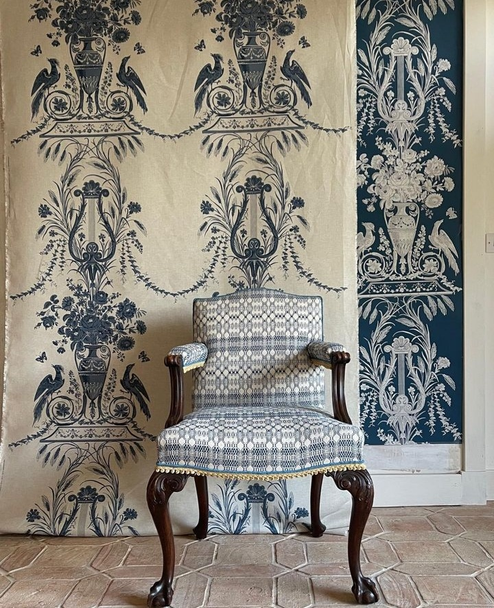

E limpede, oi fi supărat-o pe zâna apelor, că se răzbună pe mine în somn, îmi trimite vise să mă inunde, să mă înece, orice, doar să fie cu multă apă. Ori frica aia din mine, născută din faptul că nu știu să înot, vrea să-mi transmită ceva, cert este că e a doua noapte când, în loc să zburd lejeră în visuri, scăpată de greutatea unui corp, eu mă "trezesc" pe fundul mării sau în zone cu apă ce vine năvală peste mine. Evident că nu stau lemn-Tănase, încep să mă agit, și-n vis, dar și-n așternuturi, așa că alarma de la 3 a fost clopoțelul salvator.

Nu mai sar din pat ca lunatica, una, că am simțit toți pereții pe corp deja de acu' două nopți, și două, că am nevoie să-mi trag o țâră sufletul, că tocmai ce-am înotat de mama focului. Respir și-mi umflu burta și pieptul și plămânii de liniștea din noaptea asta de pe pământ și nu mă satur doar cu o respirație d-asta conștientă. Mai bag câteva și-n procesul ăsta, oarecum instinctiv, îmi dau seama că propriul corp mă conduce spre ceva ce-i face bine și-l liniștește. E și o tehnică clasică de respirație ce tocmai am făcut eu dar, la ora asta din pântec de noapte, numa' la tehnici de respirație nu m-am gândit. Uite că, dacă-mi dau un bob zăbavă, o face corpul pentru mine. 

Toată acțiunea asta mică, strecurată în pliu de noapte, de a-i da mamei pastila și de a o face blând, azi a fost lină, neașteptat de lină, având în vedere că am trecut printr-un zbucium cu doar puținel timp mai devreme. 

M-am întors, cuminte și în pace cu mine, în pat și-am alunecat cu poftă sub pilota ce încă-mi poartă căldura trupului. Ce bine e! Același loc însă a prins în memoria lui, hapsân, și zvârcoleala mea și încep să văd colții urâți ai coșmarului din care m-am trezit. Nope, nu te las să-mi acaparezi și prezentul, mai ales că-i călduț, cu omul drag dormind liniștit lângă mine, cu magia pe care numai noaptea o împrăștie celor care sunt dornici să i-o vadă. De după cortina, îmi apare ritualul de mulțumiri, ca un colac salvator, și mă apuc de el ca înecata: curg din mine mulțumirile, aprig, apăsat, ca și cum i-aș face în ciudă, fie zânei apelor, fie fricii de apă. Pe la jumătate, mă prind că le recit ca să le dau peste nas ăstora, așa că o iau de la început, agale, cu prezență, cu atenție, cu cuprindere. Și-n agalele ăsta, adorm cald.

Poate pentru că am suprimat și n-am lăsat să se consume totul, fratele, mai vitreg așa, că n-a avut aceeași intensitate, al coșmarului de dinainte de 3 a fost și cel care m-a trezit de tot, la o nouă zi de văzut, de simțit, de făcut, de iubit, de trăit. Sper să se fi terminat carafa de coșmaruri cu apă, că l-am trăit pe tot ăsta de dimineață și am ieșit supraviețuitoare. 

\*\*\*

Aceeași sete ca ieri am în corp și-n timp ce beau apa, realizez că mie de fapt nu îmi e frică de apă. Mie îmi place la nebunie să curgă apă pe mine, să mă bălăcesc în apă, în meditație îmi plac sunetele ploii sau ale valurilor sparte-ntr-un țărm. 

Nu apa mă sperie, ci frica de moarte. Aia de care eu zic că nu sufăr, dar care e înfierată-n ADN-ul uman. Toți suferim de ea și ea este mama tuturor fricilor, orice teamă își are rădăcina în asta, primordială. 

Mi-aduc aminte cum odată, plimbându-mă cu Mr. H pe la o margine de sat, am dat peste o haită de câini, care avea un câine mare drept mascul alfa. Mie nu mi-e frică de câini, dar frate, când a început ăla să latre și să vină spre mine, din 2 pași am fost pe primul gard și-am urlat de mi-am auzit fălcile cum trosnesc. Aveam eu impresia că dacă deschid gura larg, din ce în ce mai larg și urlu tare, din ce în ce mai tare, ne ajută cineva. Naivă! Am auzit uși deschise, chiar de la casa pe a cărui gard atârnam, dar n-am văzut niciun ajutor. Tot omul meu a fost cel care a aplanat situația și a dovedit că el e masculul alfa, nu câinele. Am râs după aia, mult mai târziu, când am fost capabilă, că mă dureau oasele feței. Pe mine, aia căreia nu îi e frică nici de câini și nici de moarte. 

Cu un zâmbet mic pe față și o relaxare nouă în mușchii care au înțeles cauza, îmi fac și smoothie-ul și o cafea dublă, să fie. 

Cu priceputul ăsta în mine, am sorbit și din fructele pasate și din design cu multă poftă și cu multă plăcere. E timpul meu magic.

\*\*\*

Azi îl externez pe Sett și îl duc acasă la el. Îl implic și pe domnul meu, pentru că mi-ar fi tare greu să merg cum am făcut-o când l-am luat pe Sett de la clinica unde a fost operat, cu o mână pe volan și cu una pe el, drumul e lung până la Ploiești. Noroc cu planetele aliniate care au dat zile libere în perioada asta. Cum altfel ar fi putut fi ele, dragele de ele, decât aliniate?!

Singurul meu stres, unul mare de altfel, este că plecăm amândoi de acasă, iar mama va rămâne singură. Îi pregătesc un mic dejun consistent, un ceai englezesc de fructe cu multă lămâie și miere, strugurii ei preferați și banda mea de patefon stricat, care-i repetă întruna că rămâne puțin singură, în 3 ore și-un strop, ar trebui să fim înapoi.

Am avut și răbdarea la purtător să ascult întrebările ei candide: _Cine e Sett? Dar de unde îl știu eu pe Sett?_ și remarcile ei sincere _Tare frumos e Sett! E mai cuminte ca celălalt câine_ (Maya noastră), iar întrebările candide, iar remarcile, dar, la a treia buclă, o opresc și îi repet că venim cât putem de repede. O văd că ezită, parcă acum a ajuns informația la ea, dar, ca să nu-i las spațiu temerii să se umfle în ea, îi spun că o sun de pe drum să stăm de vorbă. S-a simțit în aer relaxarea ei carnală și emoțională, așa că am hotărât că mai mult de atât nu pot face, trebe să plec.

\*\*\*

Externarea a durat mai mult decât am preconizat noi, pentru că trebe să cumpărăm niște medicamente de la o farmacie umană și am primit indicații rutiere în fix direcția opusă de cea unde se afla cu adevărat farmacia. Și eu stau prost la capitolul orientare, dar măcar nu mă hazardez să dau informații, dacă nu sunt stăpână pe ele. Alții n-au filtrul ăsta.

Într-o juma' de oră sunt cu Sett în poală, stresată maxim să nu fac vreo mișcarea aiurea pentru coloana lui. N-a plâns absolut deloc, a fost blând, dar eu sunt încordată la maxim și mă doare mâna de la mângâiatul non stop. Dar dacă el nu se plânge, cam cum aș putea eu s-o fac?

\*\*\*

Fericirea sublimă a lui Sett are aroma casei părinților lui. Fericirea la necuvântătoare e a naibii de superioară fericirii umane. Poate și d-asta nu vorbesc ele, să nu ne facă invidioși. 

Cât Mr. H îi montează cușca în care va trebui să stea, la repaos, o lună după operație, Sett e numa' în picioarele mamei lui, e o fericire și o bucurie și-un lătrat și-un alergat după ea, de mă stăpânesc cu greu să nu mă scurg prin lacrimi de extaz. Mă umplu de el, de fericirea lui și de a mamei lui. Priceless.

Am plâns tot drumul de întoarcere. De descărcare, de bucurie, fericire, drag, superb, greu. 

A fost o mare responsabilitate pe care mi-am luat-o, inconștientă, să am încă o viață pe mâini, dar totul s-a închis superb. E un amalgam de stări în mine, dar cea care plutește deasupra tuturor este recunoștința. A mea pentru ce a făcut Sett pentru mine, a mea că Universul m-a considerat omul potrivit la momentul potrivit pentru ființa potrivită, a mea că am putut să salvez o viață și să trăiesc ce trăiesc și e greu să transpus în vorbe banale, a mea pentru ușurarea ce le-am putut-o da unor oameni pe care nu-i cunosc, dar îmi sunt semeni. În aceste clipe, m-am iubit cu frenezie, cu duioșie, cu putere, cu larghețe. 

Din drum ne-am luat o ciabatta caldă, plăcerea noastră vinovată, și am ajuns acasă în timp util, pentru prânzul nostru, pentru cel al mamei. 

\*\*\*

Recunosc că mă simt ușurată că toată acțiunea s-a terminat și ușurarea asta mi-a făcut spațiu în interior și-o foame de lup. Mama, care în timpul plecării noastre, a coborât și a cotelit prin frigider, de unde s-a delectat cu un iaurt de fructe, mă anunță senină că nu prea îi e foame. O confrunt, nu știu de ce, poate pentru că-s o țâră supărată pe ea că nu stă sus, cuminte, cum a promis, dar ea-mi spune că nu s-a mișcat din pat. Minciună sau uitare? Clasica mea îndoială. Cert este că nu mă mai pot baza pe ce zice sau ce face absolut deloc. Nici măcar minimal. Iar asta se lasă cu zgârieturi de minte pentru că nu știu de unde să-mi scot ochii ăia prin care să privesc un adult, care a avut personalitate cum a avut mama mea, și s-o tratez ca pe un copil de 2 ani. Nu pot încă să corelez înțelesul cu simțitul.

\*\*\*

Restul serii mi l-am petrecut în relaxare, cu domnul meu. Mi s-au desfăcut din încordare toate fibrele, mă simt moale toată, dar mă și străbate un val de viu prin tot ce sunt. Tot ce mai pot face azi este să ascult un podcast bun, de unde să-mi trag niște înțelegeri noi, peste alte înțelegeri mai vechi, care încep să aibă sens: primul și cel mai mare inamic al corpului nu este neapărat zahărul, ci ceea ce generează vârfuri de glucoză în carcasa asta a noastră de carne. La început, când am dat de Jessie, autointitulată GlucoseGodess, am judecat-o în mine și nu i-am dat niciun credit. Că așa facem noi, judecăm o carte după coperți. Mare țeapă mi-am luat! E fătuca asta o suavitate și vorbește atât de fain, și are cursivitate și are știința în spate cu studii și cercetări, că în secunda doi i-am dat follow pe Instagram. Merită din plin. 

https://www.youtube.com/watch?v=VrdzMi8QqwM&t=5469s

\*\*\*

Îmi închei o zi albă, cu supărări prea mici, ca să întineze o fericire atât de mare. Dacă nu mi-aș fi propus să numesc zilnic, seara, la culcare, trei recunoștințe, aș fi băgat și supărările alea mici tot la mulțumiri și aș fi zis că-s recunoscătoare pentru întreaga zi. Dar m-a învățat Universul ăsta că trebe să fiu specifică, generalitățile sunt doar pierdere de timp, așa că mulțam pentru:

1. Ritualul meu luminos ce mi-a adus un somn portocaliu!

3. Fericirea lui Sett, a mamei lui Sett, a mea, a lui Mr. H, a tuturor implicați!

5. Jessie!

Frumosul zilei mele vine de la:

Jet&Co fabrics
