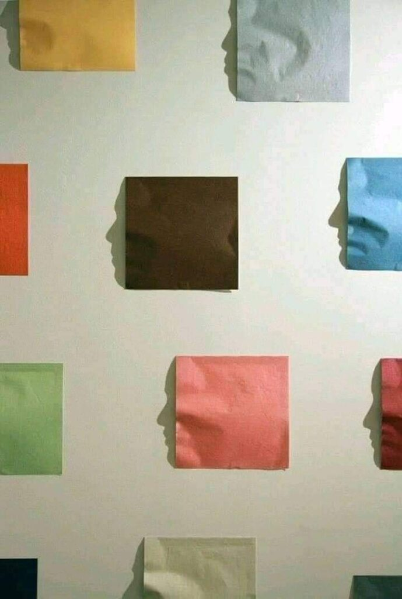

Noaptea, ce mi-a trecut prin carne și vise, a fost o întortochere de oameni din trecut, veniți parcă toți cu câte-o ocazie în prezentul meu din spatele ochilor închiși. Nu știu ce au vrut să-mi spună, fiecare în parte, dar știu că m-am simțit tare înghesuită și neliberă cu ei și lângă ei. O senzație de rupere iremediabilă a plutit în toate visele în care mi-au apărut oameni ce mi-au mers alături pe bucăți de drum de viață, mai mult sau mai puțin timp. Nu m-au stânjenit ei, m-a bucurat prezența fiecăruia, dar mi-a dat și o aromă de gol, câteodată de neînțelegere, alteori de tristețe, dar invariabil la toate am simțit abandon. Asta pentru că eu nu am priceput atunci, că unii oameni sunt ca florile în viața altor oameni, când li se scutură petalele, și-au terminat contribuția pentru viața ta și pleacă mai departe, să înflorească în alte vieți, eu am atașat inconștient, că doar așa am știut să funcționez, eticheta aia de părăsire. Chiar dacă acum pricep mai mult și văd cu ochi proaspeți rana din care am acționat atâta amar de vreme, tot nu sunt bună la a mă bucura de floare, fără să mă însoțească regretul că nu mai e. Dar omul cât trăiește învață. Sau repetă până pricepe.

\*\*\*

A dispărut borna aia de la ora 3, nu-i mai dau mamei pastila, așa că trezirea mi s-a petrecut dimineața, ca la toată lumea. Mă simt plină de toate visele astea, parcă-i am pe toți în mine așteptând ceva și eu nu știu ce să fac cu ei. Îmi vine în mine, ea știe de unde, propoziția pe care o simt tare strâmbă-n realitatea multora: să îl ierte Dumnezeu. 

De când desfac cuvintele și le înțeleg în miez, realizez cât de aiurea îmi sună asta. Dumnezeu nu trebe să ierte pe nimeni, ci oamenii trebe s-o facă între ei. Fiecare neiertare a unui om împotriva altui om, funcționează ca un fir întins și încordat între ei doi, care-i ține în corzi și înțepeneală, care nu-i lasă liberi în mișcări și viață ulterioară, dar de care sunt rareori conștienți. Suntem legați rigid de oamenii din viața noastră cărora nu le-am iertat o vorbă, o privire, o judecată, o acțiune, o trădare, o părăsire și ne întrebăm superficial de ce ne simțim înțânați. Wow, cât timp mi-au stat oamenii ăștia buluciți în suflet! Deși alambicat, am înțeles și de ce mi-a venit în minte la primă oră asta cu iertatul, ca să mă scutur un pic.  În dimineața asta, am lăsat să plece din mine, cât m-am priceput și cât am cuprins, toate ancorele alea grele și atârnătoare cu care i-am fixat în mine pe cei cărora nu le-am iertat, deși n-aveam, pe bune, ce să le iert pentru că, la fel de pe bune, ei nu mi-au greșit, ci doar m-au crescut. Forțat pe alocuri, zdrelită pe ici pe colo, dar m-au făcut mare. Numa' că eu eram plecată în alte zone din mine, unde voiam să mă măresc, să mă fălesc, și n-am mai aruncat o privire înapoi să văd ce-a dospit acolo, în locul în care eu credeam că-i rană.

\*\*\*

Mi s-a dus apa caldă cu lămâie până-n prăsele, mă simt o țâră cintezică, ușurică, cu ceva zâmbet în suflet și-n mișcări. Îmi iese lin și smoothie-ul din mâini și ceaiul de mușețel, cu florile lui mici și superbe, de coroniță. 

Mă plimb însoțită de o senzație de lejeritate și prin olx, și prin design și prin castele și-mi iau fix cât am nevoie, parcă am un barometru cu care măsor cât îmi trebe, să nu mă simt nici prea plină, dar nici nesăturată. Ptiu, cum s-a sucit începutul de zi!

\*\*\*

Antena mea interioară reperează mulțumirea mamei care mestecă încet, a savurare parcă, omleta micului dejun. E prea plină de gust, cred eu, că nu mai are loc și de cuvinte pe care să le împartă cu mine. Sau așa vreau eu să cred. Nu mă deranjează, îi stau prin împrejur, poate apare vreo fisură mică pe vreundeva, neașteptat, pe unde să iasă ceva din interiorul ei. Toată viața ei a fost ermetică, probabil intenționat, iar acum e ermetică prin natura bolii. Poate dacă mi-aș da jos lentilele tristeții cu care privesc situația asta, aș putea vedea cât de interesantă e totuși demența asta. 

Spre finalul omletei, așteptarea mi-e recompensată de întrebarea ei buclată la 2 minute: când vin sărbătorile? Primul răspuns al meu a fost că azi suntem în 5 decembrie. _Așa, și?_ M-am uitat la ea și i-am văzut curiozitatea sinceră din ochii mici, duși în fundul capului: mintea ei nu poate să lege continuarea după informația mea. Îi spun blajin că mai sunt 20 de zile până la Crăciun, mai e timp, iar după bucata de liniște de 2 minute între răspunsul meu și întrebarea ei repetată, sar peste prima parte, îi spun direct că mai sunt 20 de zile. Demența nu se înțelege bine nici nu matematica, bag eu seama.

\*\*\*

Mă apuc de administrative, că am multe liniuțe în lista mea de to do-uri pentru ziua de azi: trebe să-i găsesc nitrofurantoina, medicamentul ăsta deficitar pe care mi-l tot prescrie medicul de familie, să fac programare la psihiatrie, pentru ea, la oftalmologie și la injectabil B12, pentru mine, să-mi fac limpede în minte ce meniu pregătesc de sărbători, pentru ei și pentru mine, liste de cumpărături, facturi, emailuri.

Îmi zboară informațiile prin creier ca nebunele, încerc să-mi organizez sertarele memoriei corespunzător pentru fiecare, asta probabil că mi-a rămas în reflex de pe vremea când lucram în corporație, eu nu mă pot relaxa sau odihni până nu le văd sau știu pe toate la locul lor, fie că-i vorba de planul ăsta material sau nu.

Mă opresc că simt că nu mai intră și mă focusez pe gătitul prânzului, meniu vegan azi, chifteluțe de dovlecei cu tofu afumat, porumb, usturoi și mărar, plus piure.

O mișcare bruscă, din afara ferestrei lângă care pregătesc ingredientele, îmi trezește interesul. E Spiky care pare că a prins ceva, așa că le las pe toate baltă și ies ca vijelia, să salvez eu vietatea prinsă-n gheruțele vânătoresei. O strig scurt și ferm, s-o fac să lase ce comoară are ea acolo și din doi pași sunt lângă ea. Draga de ea a dat drumul, de bunăvoie, iar eu mă minunez de două ori: prima dată, că mititica asta se juca cu o frunză de nuc și a doua, că i-a dat drumul, mi-a făcut-o cadou, fără să crâcnească. M-a înduioșat și m-a făcut să mă simt căpcăună. Întoarsă în casă, din spatele ferestrei, o văd cum reia frunza și se joacă în continuare cu ea. Deci mândra mea a făcut voluntar gestul, mi-a lăsat mie frunza ei, știa clar ce face și de ce. Numa' eu eram în ceață.

\*\*\*

Cu un episod de somn înainte, prânzul mamei nu mai e străbătut de nicio întrebare, nu mai are nicio curiozitate, dar pare că nici gânduri n-o mai tranzitează. Eu vorbesc cu ea generalități, pentru că dacă spun ceva aplicat, rareori reacționează. Nu cred că nu mă aude, ci îmi place să cred că nu are chef, chiar dacă nici măcar la întrebări nu-mi răspunde, probabil că vine un timp, în timpul tău, când consideri că nimic nu merită efortul și risipa de energie. E atât de obosită și e atât de vizibil… De dragul un zumzet bun în aer, îi listez și ei meniul pe care-l am în minte pentru zilele festive, eu întreb, eu răspund, las cuvintele să umple bucătăria, ca să nu văd bătrânețea și nedorința din ea.

\*\*\*

Am găsit o fereastră liberă la asistenta medicală la care-mi încep injectabilul de B12, așa că o las pe mama, care s-a pus din nou la somn, și fug. 

De abia la întoarcere, când la modul cel mai adevărat posibil, nu am niciun motiv coerent să zbor așa, mă prind că mi-am alergat prin zi atât de tare, că am stomacul cât un pumnișor de mic.

Cred că la asta trebe să lucrez cel mai mult la mine: să-mi desfac lianele astea adânc încarnate care-mi dau bice agitate să fac, să fac, să fac. Respir adânc și, involuntar, ridic piciorul de pe pedala de accelerație a mașinii. Unde-n viața mea am avut eu momentul în care am decis atât de catastrofal că trebe să fac așa? Trebe să-l găsesc și să fac undo acolo. Sau să mă iau la o vorbă, pe mine, cea de atunci, și să-mi spun că fuga prin clipe mă văduvește de cumplit de multe, mă face absentă din viața asta și-așa al naibii de scurtă. Singura amintire ce mi-a venit în carne a fost aia în care mama, înaintea plecării la serviciu, ne împărțea sarcinile mie și soră-mii: tu să dai cu mătura iar tu să ștergi praful, să schimbați lenjerii, să fie lună când vin acasă. Ghinionul meu a fost că, deși sarcinile veneau împărțite, la primire eram doar eu, iar dacă mă opuneam, îmi luam niște bătăi crunte de la soră-mea, așa că nici nu comentam. Și uite așa, am tot făcut, întâi forțată, apoi inconștient, cu securea amenințării inițiale întinsă asupra tuturor momentelor ulterioare. O să mai sap, să văd dacă mai vine și altceva la puricat și nu mă las până nu-i găsesc originea modului ăsta strâmb în care am înțeles eu să funcționez, cândva, și nu m-am mai lăsat de el de atunci.

Deși la 48 de ani am ajuns la excelenta claritate să înțeleg că viața e doar a mea, că nu trebe să dau socoteală nimănui, că acțiunilor, pe care le fac sau nu le fac, eu le suport consecințele, uite că mecanismele astea de-o viață-ntreagă mă fac, fără să mă prind de ce. Yep, viața se practică, conștient, clipă de clipă. Altfel, nu viața te trăiește, ci o copiluță ce-a decis ceva odată sau o tânără rănită sau o adultă neînțeleasă. Iar asta nu e viața aia pentru care eu semnat, pe propria-mi răspundere, că vin s-o trăiesc. Asta știu sigur.

\*\*\*

Bag și ziua de azi tot la borcanul de zile interesante, deși m-a strâns pe ici, pe colo. Așa, strânsă, pricep că-mi apasă butoane, ca să fiu curioasă să văd ce puroi am strâns sub ele. Nu pot să nu fiu recunoscătoare zilei că mi-a fost, înainte de toate, și apoi pentru:

1. Desfacerea pe care mi-a permis-o, cu aromă de libertate imensă, de oamenii care așteptau în mine o înțelegere!

3. Cadoul inocentei Spiky!

5. Culoarea inconfundabilă și de neegalat pe care o aduce domnul meu în viața mea!

Frumosul zilei mele:

