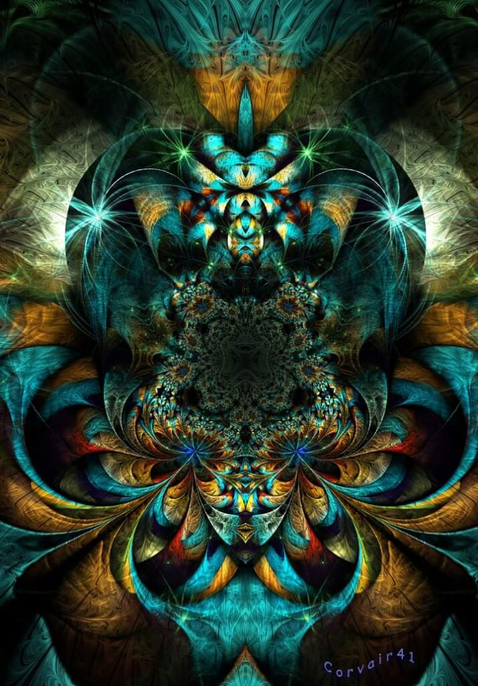

La mine, răul fizic lucrează în ture și, mama lui de rău, e neobosit: după ce a băgat și schimbul 1 și schimbul 2, nu s-a lăsat până nu m-a dovedit și la schimbul 3, ăla cel mai "mișto", de noapte. M-a jucat pe degete și m-a perpelit și pârjolit în 2 episoade: până la 3 noaptea și după 3 noaptea. Eu cred că șugubățul ăsta de Univers vrea el să-mi zică ceva, dar mie-mi trebe mai mult decât atât, îmi trebe ca la copii, mură-n gură, altfel pare că-s grea de cap. Mi-a fost greu să mă trezesc la 3 noaptea, dar mi-a fost extrem să fiu în camera mamei. Mi-e greu mie și când nu sunt posedată de răul fizic, dar acum am experimentat răul la pătrat. M-am întors atât de amărâtă în pat, că nici n-am mai găsit cuvinte în mine cu care să mă aolesc, tot în mine. Pur și simplu, am avut o clipă de colaps total, un breakdown și o dorință dramatic intensă de fugă din prezent.

Și ca să-i dea dreptate dorinței, mintea, care întotdeauna îmi vrea binele, dar are o oca aparte de măsurat acest bine, a venit să țeasă întrebări. Dacă, de fapt, realitatea e aia din aceeași substanță care se găsește în esența mea, imaterială dar plină de pace, de îngăduire, de acceptare, de iubire? Dacă, de fapt, ce e aici, pe pământ, e un vis, pe alocuri fericit, pe alocuri coșmar?

Tot citești diverse chestii, că lumea e plină de idei și perspective, și nu le cuprinzi la prima mână. Peste un timp, conjunctura te duce în același loc, la aceeași idee, dar nici la a doua cheie, ideea nu pornește în tine să crească și să se stabilească-n rădăcini. Doar că sămânța s-a plantat și viața, invariabil și întotdeauna, te duce în locul potrivit și momentul potrivit, oricât te-ai împotrivi, și te face să înțelegi, cu subiect și predicat, cu nuanțe și umbre, ce nu ți-a ieșit până acum. Fără efort, fără încrâncenare, fără scremere de pricepere. Pur și simplu, se așează un știut în tine, blajin și cald și zemos, de viață cu sens. Cam așa simt eu să înțeleg împrejurul meu acum. Nu știu dacă e așa pentru că nu-mi place prezentul sau dacă acum s-a desăvârșit priceputul. Nu știu dacă am dreptate să cred că imaterialul e realul și concretul lumii ăsteia e iluzia, dar știu că viața nu greșește niciodată. Trebe doar să fiu limpede, să înțeleg mesajul corect.

***

Filozofie sau nu, ideile astea n-au putere de panaceu al durerii și nici aromă de somn odihnitor, așa că dimineața găsește o Bianncă ciufută, un strop rătăcită, un strop resemnată. Orice fac și orice gândesc, voința mea nu trece de bariera durerii.

N-am chef nici de mine, nici de apă, nici de fructe, nu vreau să văd sau să aud ceva, vreau să fiu lăsată în pace, ascunsă undeva, să-mi ling durerile și să mă întremez. Dar n-am gura asta de șansă pentru că mă așteaptă o zi plină.

Pe același principiu care mă urmărește îndeaproape, una rece, alta caldă, mama a mâncat bine la micul dejun. Asta e aia caldă, aia rece e că parcă devine din ce în ce mai distantă și mai rece. Nu că ar fi debordat vreodată de căldură, dar acum, vin rar și din ce în ce mai mici, firicele de emoție din ea spre mine. Nu-mi bat nici capul și nici sufletul azi, că poate mi s-o părea, am tendința asta să exagerez când nu mi-e bine, așa că parchez percepția, pentru altă dată.

Cu prosopelul fierbinte pe frunte, mă rog Universului să-mi dea un semn, să-mi spună ce să fac, că m-am săturat de atâta durere înghițită. Și aștept. Și respir. Cam atât pot să fac momentan.

***

Într-o oră, mă sună vecinul care mă roagă să-l ajut cu niște cumpărături pentru tatăl lui, bătrânul, prietenul meu, că fiul nu este momentan acasă și tatăl n-are nici pâine pentru prânz. Eu nu am niciodată "nu-ul" ca răspuns la astfel de cereri, așa că m-am echipat și-am plecat cătinel către Lidl.

În magazin, durerea de cap a început să se scurgă, efectiv o simt diminuându-se și am senzația că curge de pe mine ca un zoi spălat, la propriu.

Ăsta a fost semnul.

Când faci bine, te faci bine. Mai clar decât atât eu nu cred să fi primit în viața mea vreun mesaj!

***

Doar ce-am ajuns acasă și m-am trezit cu mama la baza scărilor, de m-am și speriat. Îi e foame. Ciudat. Dar mă bucur și mă apuc să-i pun masa. La 13 avem programare la endocrinolog pentru evaluare tiroidă așa că decalez prânzul nițel mai devreme.

La clinică, ne întâlnim cu asistenta care i-a făcut și ei B12 injectabil și care mi-l face și mie, o femeie toată numa' zâmbet, aproape mereu. Ne salută, râde cum știe ea, cu toată gura și cu inima pe față, iar mama, prin mimetism, se luminează. Mimetismul ăsta al ei este selectiv, probabil a recunoscut, în femeia faină din fața noastră, aceeași efervescență care era și-n ea odată, dar a cărei genă nu mi-a transmis-o și mie. După ce trece de noi femeia, mama mă lovește cu părerile ei: _M-a ținut minte, de la operația de sân. Înseamnă că-s o tipă bine!_

Puteam eu să-i spun că e asistenta ce i-a făcut injecțiile acu' trei săptămâni? Nu puteam, zâmbetul ei larg se pune contra ușii trântite de mintea ei cutreierătoare. Și de egoul ăla care nu ne părăsește, indiferent câte mai avem din noi.

Vestea bună e că a scăpat de Euthyrox, tiroida ei arată bine, nu a fost niciodată și clar nu e nici acum cazul să ia tratament pentru ea, nu e cazul să ne facem griji. Aleluia!

***

O aduc acasă și plec din nou, de data asta am eu controlul oftalmologic, să văd care e cauza și ce e de făcut cu virgulițele astea negre care mi se plimbă odată cu privirea, plus pata asta slinoasă de pe ochiul stâng.

N-am același noroc ca mama, virgulițele și pata rămân acolo unde sunt, pentru că în vitros, substanța gelatinoasă din ochi, nu există nici inervare, nici capilaritate, așa că nu ai prin ce să transporți eventuale tratamente care ar exista, dacă ar exista. Se practică recomandarea de diverse medicamente, dar pare că, științific și statistic, nu și-au și demonstrat eficacitatea.

Mda, asta e nașpa. Sunt momente în care unele virgulițe sunt așa de îngroșate, încât am impresia că se mișcă ceva în laterala mea și întorc capul brusc în direcția aia. Iar pata asta ca de grăsime e de-a dreptul oribilă. Cică e posibil să se estompeze în timp. Sau să mă obișnuiesc eu cu ele. Încurajator de-a dreptul.

Ca să fie tabloul complet, mi-a pus și picături în ochi, iar acum sunt capie cu totul. Doar eu știu cum am condus până acasă și vreo încă patru ore m-am tot lovit prin casă. Ăsta e modul prin care Universul îmi testează anduranța, dar și trufia: crezi că gata, ți-ai revenit?! Ia d-aci!

***

Știu că sunt nedreaptă, știu că degeaba acuz în dreapta și-n stânga, dar așa de bine-mi face și așa mă răcorește, încât nu vreau să mă opresc. Vreau să-mi dau dreptul la mici supape, chiar dacă n-or fi ele cele mai corecte, dacă mă ajută la dezamorsarea situației, ce mai contează?! Încă nu-s atât de stabilă și nici de pricepută, încât să trec de la cantitate la calitate. Acu' vreau să am mai multe mici momente de respiro. Mai încolo, poate-oi umbla și la calitatea lor, dacă rămân hotărâtă pe viața trăită intențional, cu siguranță va veni și clipa aia în care o să mă rafinez și la capitolul ăsta. Deocamdată, înghesuită de dureri, de virgulițe și pete, mă apuc și eu de ce pot.

Restul zilei mi se scurge printre pastile, gânduri, analize, plecări din prezent, discuții și iar întoarcere în mine, cu care pot să vorbesc ore-ntregi fără să mă plictisesc. Nu cred că o să cuprind în viața asta complexitatea unei ființe umane, asta a mea, că asta mă interesează cel mai mult.

Acum sunt copil naiv, acum sunt adult fricos, acum femeie creativă, acum femeie în care masculinul preia frâiele, apoi iar copil candid, iar plină de păreri de insuficiență, când mă împunge abandonul, când zic că l-am vindecat, când sunt completă, când simt un gol, când vulnerabilă, când îmi pare rău că m-am deschis.

Cea mai mișto aromă a mea e aroma de copil. Copii pot face orice le spui să facă pentru că EI NU CRED CĂ NU POT FACE. La ei nu există pauza asta de putirință, indusă în sistem de o minte care a luat de bune credințe limitative peste credințe limitative.

Dacă plec cu ceva bun și cu vreo hotărâre din ziua asta, târâtă prin dureri și neputințe de tot felul, este că vreau să mă fac copil cât mai des posibil. Vreau să fiu conștientă că mă fac copil, atât de copil, încât să cred și eu, când viața mă-ncearcă, că pot face orice, că nu văd de ce n-aș putea-o face.

***

Copiluța din mine mi-a mai ridicat o țâră moralul și mi-a infuzat corpul cu încredere. Cea mai mișto combinație ever.

Mulțam zilei pentru:

1. Apetitul nou al mamei!

2. Eliminarea unei pastile din lunga listă de pilule ale mamei!

3. Copilul din mine!

Frumosul care mi s-a așezat în clipă:

