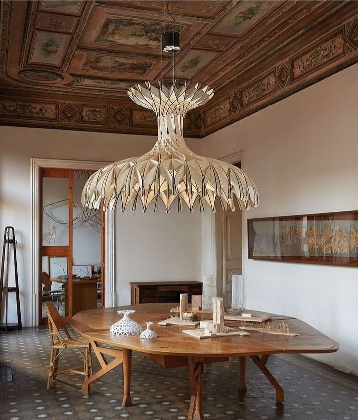

Nevorbirea mea cu nimeni s-a strecurat nestingherită în vise și prima jumătate de noapte, până la borna de 3 noaptea, mamă, da' ce-am mai tot vorbit! Am avut o felie de noapte aglomerată de vise și, din câte îmi amintesc, în toate povesteam întruna. Nu mai știu ce, nici nu contează, cel mai important este că am în mine senzația că s-a desfăcut încrâncenarea aia de-o aveam în sânge și inimă, picul ăla de abandon și teamă și credință că nu contez, care se reiterează mereu și mereu, cu fiecare dată în care nevoile mele, n-aș zice foarte mari, nu găsesc egalul prin care să se compenseze, în exterior. Deși nu-mi face nicio plăcere să mă trezesc la ora asta nedorit de mică a nopții, de data asta îi sunt recunoscătoare alarmei, că așa am avut ocazia să închid capitolul ce rămăsese deschis aseară. Dacă aș fi dormit dintr-o bucată, până dimineață cu siguranță aș fi parcat visele astea și le-aș fi uitat.

Reversul este că trezirea de la 3 îmi cam face praf restul nopții. Mintea asta a mea, antrenată zeci de ani să buteze instant, percepe verticala ca semn clar de trezire și începe să-mi livreze, cu rapiditate aproape perceptibilă fizic, gând după gând după gând.

Deși în camera mamei sunt aproape convinsă că nu plutesc prin eter gânduri, sau cel puțin, nu gândurile ei, nu mă încurcă deloc asta, mintea mea găsește ea destule motive să țeasă povești, și iritări, ajutată de mirosurile izbitoare, și îngrijorări, la văzul stării mamei. De abia am reușit s-o trezesc să-i dau pastila și s-a prăbușit instant la loc, după ce a înghițit-o. Yep, frica m-a trezit de tot.

***

Strecurată sub pilota ce adăpostește căldura lăsată de corpul meu acolo, încerc să-mi aduc raționalul la masă, să stea de vorbă cu frica asta ce parcă-mi paralizează ființa și clar îmi acaparează toată mintea acum. Îmi spun că nimeni nu e veșnic, că nu pot schimba lucrurile menite să se întâmple, că trebe să-mi dresez uimirea în fața morții și să accept că va veni și în cazul mamei, dar sigilez toată vânzoleala asta de la mansardă cu un scuturat din cap, a negație, semn că n-am înțeles nimic din toate câte mi le zic. Frate, e extrem de greu să împaci emoționalul cu raționalul, mai ales noaptea.

Îngrămădită de închipuirile care se nasc în mine, am mai ațipit un strop, cât să-mi iau și bucata de coșmaruri, plămădită de inconștiența mea. Dacă e să fiu sinceră până la capăt cu mine, am știut că așa va fi, la ce negreală îmi trecea prin creier până să adorm.

***

La 6 și-o țâră, sunt deja în bucătărie iar Spiky e deja afară, după ce a cerut cu insistență, semn că o taie oareșce nevoi, care nu mai suportă amânare.

Apa, fierbinte la limita suportabilității, dispare instant din halba de juma' de litru, incredibil ce însetat mi-e corpul dimineața.

Mirosul mișto de fructe zdrobite, afine, vișine, banană, pară, prune uscate, e singurul care-mi ridică nițel starea de spirit, aflată în cădere liberă de nesomn, coșmaruri dar și de la imaginea de pe camera de supraveghere a mamei, care se uită la mine și eu la ea, și mă strânge cu tot ce sunt: mama doarme, dar de abia o pot ghici de sub pilotă. Lângă ea, să întregească tabloul și ciupitura asta din inima mea, e Sassy, loiala Sassy, sor'mea blănoasă.

Viteza cu care Spikylina a venit mi-a confirmat suspiciunea: Hitlerică e din nou pe terasă, iar ei îi e frică de el, ceea ce e de înțeles, având în vedere că ea e cât juma' de Hitlerică. Îi dau repede ei de mâncare în casă și îi pregătesc și lui bolul. N-am nicio șansă să mă apropii și oricum ar fi egoism din partea mea să forțez asta, așa că-i las bolul plin de papa bun și intru în bucătărie, de unde-l privesc din spatele geamului. Nici nu cred că mestecă, devorează mâncarea rapid și apoi ridică și el capul. Facem contact vizual 2 secunde și apoi fuge. O fi prins el, în astea 2 secunde, din privirea mea partea aia în care mi-e drag de el tare, tare? Nu știu, dar mă antrenez, poate data viitoare mai adun ceva secunde, să picur repede în ele căldura din inima mea. **Nicio ființă nu e degeaba pe pământ și nicio ființă nu trebe să moară fără să fi cunoscut, în viața asta, iubirea.** Fără nicio excepție.

***

Din oul fiert, toată puterea mamei s-a cheltuit pe mestecatul unei jumătăți, unsă cu kefir, ca să alunece. Deși nu vorbește, văd că îi este greu să înghită, probabil d-aia și mestecă până când nu mai are ce mesteca. Mi-am adun puterile, zburătăcite de frica asta care mă cuprinde când o văd atât de vulnerabilă și de mila asta pentru corpul din fața mea care se chinuie și de judecata mea către Universul ăsta care lasă lucrurile să se întâmple îngrozitor de mult timp sau să se întâmple îngrozitoare, sau amândouă la un loc, și mă prefac spumoasă, cu povești haioase în tolbă, despre Hitlerică, pisoiul-senzație. În realitate, mă cutremură corpul ăsta descărnat care mă privește cu un zâmbet amar. E greu de privit. Am eu vaga bănuială că imaginile astea mă impactează grav emoțional și o să mă bântuie cândva. Nu știu cum să mă protejez de ele și de trauma care vine la pachet.

***

Înainte de a pleca la cumpărături, trece prin mine, efectiv ca o lumină de lanternă prin hăul ăsta care mă traversează, gândul-revelator că totul e de la pastile. Știu de unde-mi vin gândurile astea revelatoare așa că mulțumesc cumincioară, cu reverență interioară, și-i trimit mesaj psihiatrei mamei. Strecor un mulțam și tehnologiei și încă unul pentru disponibilitatea și amabilitatea femeii de a-mi răspunde și de a conchide împreună că trebe să-i reducem mamei la jumătate, doza de medicamente pe care le ia.

De 6 luni mă chinui să-mi schimb lentilele la ochelari și mereu am găsit scuze să n-o fac, dar efectiv nu mai văd cu ei, atâta s-au zgâriat lentilele. Plus că mi-au și crescut dioptriile.

Prima oprire din traseul cumpărăturilor a fost la magazinul de ochi. Aici, oferte peste oferte, prețuri peste prețuri.

Când am deschis gura și am spus, simplu, cu ochii mei în ochii celei din spatele "tejghelei", că nu-mi permit să dau 1000 de ron pe ochelari, am știut că mă desprind clar de partea aia din mine care vrea să dea bine, de fapt care vrea să nu dea prost, să nu se simtă mică, insuficientă, nesemnificativă. Am știut că mă întorc la mine, la autenticitate și fix din spațiul ăsta am și vorbit. Nici nu jenă, dar nici cu obidă. Detașată. Well, ce am primit înapoi a fost o pătură pufoasă de omenie caldă. Când am lăsat garda jos, nu numai în fața ei, dar și în fața opticianului care a apărut între timp, nu am fost tratată nici de sus, nu m-am simțit nici jos, ci au luat amândoi doza mea curată de curaj de a recunoaște că, deși trăiesc în zona cu poate cei mai bogați oameni pe metru pătrat din țara asta, uite că nu pot să dau atât de mult, și mi-au dat discounturi și au roit pe lângă mine de ziceai că iau ochelari de aur de la ei. O juma' de oră mai târziu, am plecat de acolo și cu inima sus, nu doar cu capul, cum aș fi plecat oricum de altfel.

Wow, ce mișto se simte după ce ești vulnerabil!

***

Dar programul artistic de wow al zilei nu e nici pe departe încheiat.

A doua oprire, la Carrefour, unde altundeva decât la fructe, unde salivez de plăcere doar că mă aflu în vecinătatea lor. Nu prea am mâncat ananas proaspăt la viața mea, din neputință financiară și din neștiință apoi, așa că nu știu cum să-l aleg pe ăla care să fie copt și dulce și moale. Am luat un ananas, l-am întors pe toate părțile, l-am pipăit, ce poate să fie complicat să alegi unul bun, dar parcă nu se lipea niciun fruct de mână. M-am uitat în jur, poate mă lipesc eu de vreun angajat care să mă învețe cum se alege un ananas copt. În fix secunda următoare, o bătrânică mă bate pe umăr și mă întreabă: _Știi cum verifici dacă e copt?_

Jur că mi s-a ridicat instant părut pe brațe și pe ceafă, am simțit că mă trec niște fiori ai incredibilului prin toată ființa! Wtf?! Cum e posibil așa ceva?! Cam cât o fi probabilitatea calculată să mi se întâmple așa ceva?! I-am și zis doamnei că o suspectez că citește gânduri, iar ea a chicotit ștrengărește, ceea ce în ochii mei a făcut-o fermecătoare. Și-am aflat că dacă din "ciuful" de frunze, din "capul" ananasului, smulgi o frunză din mijloc și se dezlipește ușor, e copt. Sau dacă e moale "la fund". Am râs amândouă cu poftă, îmi venea s-o iau în brațe și să mă spăl cu bunătatea ei pe toate mine, și p-afară, dar mai ales pe dinăuntru, aș fi luat-o cu mine acasă, într-un impuls de total egoism, să mă scoată la liman când mi-o fi greu, dar am lăsat-o să plece, iar eu am rămas în urma ei, consternată. Ireal.

***

Are viața asta o ciclitate în ea, câteodată sadică, doar-doar oi înțelege ce vrea să-mi zică, dar, în dulcele-mi stil consacrat, eu nu pricep o iotă.

Au fost dăți când mă rugam cu cerul și pământul ca mama să mănânce orice, apoi au fost dăți când mă iritam că facem mofturi la mâncare, acum iar implor divinități să o facă să înghită cât mai mult. Îi dau nutrienți buni, mâncare sănătoasă, cât mai sănătoasă posibil dar și gustoasă și pe care știu că o acceptă, cu toate asteag ia 2-3 guri și gata, respinde, că nu mai poate. Și văd că nu e moft. Simt că nu e moft. E neputința asta care îi sapă în corp.

Ca să umplu spațiu de emisie, îi povestesc despre meniul de sărbători și ce intenționez să le gătesc. Deși nu pare să înregistreze ce tot turui eu, după alte 2 guri de felul doi, wow-ul Universului se întoarce și-mi servește tura trei de mirare:

_Facem sarmale și cozonac?_

_Facem mamă, facem tot ce vrei, dar la cât mănânci tu, s-ar putea să hrănim tot satul._

Un râs mic-mic al ei a sunat mare-mare în mine și mi-a crescut niște elice în tălpi.

***

Zău dacă o să consider vreodată cinstit modul cum îmi cheltuiesc timpul: o tură de rufe la spălat, un organizat de cumpărături, s-au scumpit al naibii de mult în timpul pe care mi-l consumă și care-mi scapă printre degete într-o viteză ce nu o pot cuprinde nicicum. Încă un așezat liniștit la taste, într-un scris răcoritor, plus o hrănire pisicile casei și Hitlerică al terasei, și-au plecat și astea cu o halcă mare de clipe după ele.

Dacă trag o linie onestă, am avut o zi plină. Cu de toate și, ca Universul să-mi dea peste nas cu clasicu-i umor negru, nu-s pentru toți, ci le-a pregătit doar pentru mine. Sau mi le-am pregătit singură. Oricum ar fi, simt cum sufletul meu se pleacă cu umilință în fața celor mai mari recunoștințe percepute azi de mine:

1. Băiatului de la butoane, de acolo, de sus, care mi-a trimis, telepatic, gândul ăla bun și sper eu salvator pentru situația mamei!

2. Uimirile astea superbe care se lasă cu înfiorare și carnală, dar și de suflet!

3. Râsul mamei!

Secunda frumoasă a zilei:

EMBT architects
