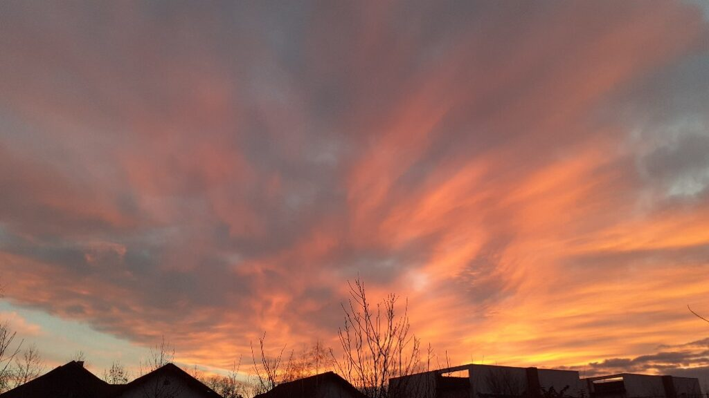

O noapte balsam m-a mângâiat în fundal, pe parcursul orelor în care m-am dus să visez sau să caut, sau să aflu, sau să mă hrănesc. Nu o să știu cu siguranță, clar nu atât timp cât încă mă încorsetează costumul ăsta de carne, ce fac cu adevărat în timpul somnului, dar știu că acum, când am deschis ochii, senzația de moale, catifea, de blând, plutește în aer, semn că a fost acolo în tot răstimpul nefiiri mele în realitatea de aici.

În stânga mea domnul meu încă cotrobăie pe tărâmul de vis, dar liniștit, după sunetul respirației, iar de-a dreapta mea e Spikylina, lipită de-a lungul coapsei mele. Întind mâna spre ea să-i trimit prin degete toată iubirea ce-a născut-o-n mine și ea-mi răspunde vibrând a tors.

Cât de simplă și de bună și de faină e dimineața asta! E de ajuns să mă pătrundă total gândul ăsta, ca șirul recunoștințelor să pornească a se vărsa de la sine. Cu cât practic mai mult ritualul ăsta de mulțumiri, cu atât mai natural și mai la îndemână, mai negândit cu mintea dar simțit cu inima, se petrece. Multam mulțumirilor!

Îmi lipesc coconetul călduț pe mână în ridicarea la verticală și pornim, într-o stare de 2 în 1, spre bucătărie.

***

Am observat că diminețile sunt ca un burete, absorb și sorb cu nesaț ce e împrejurul meu, ca și cum mi-a fost dor de fizicalitate, ca și cum vreau să-mi întăresc prezența în realitatea materială cu tot dinadinsul. Iar în dimineața m-am îmbibat de superb doar lipindu-mi ochii de-un cer absolut:

Simt că m-am trezit la viață nouă, îmi simt starea alertă, cu aromă de prezență, nu de agitație, iar apa ce-o las să mă spele, hrănească, vindece și curețe pe interior pecetluiește acumul meu la care sunt atentă. Îmi observ mișcările prin care-mi pun de ceai și pentru o secundă am senzația ca sunt un păpușar, iar păpușa mi-e corpul. Am știut în miimea aia de miime de secundă că pot să-mi folosesc corpul pentru a face orice, dar mi-am și văzut pereții construiți din convingerile limitative dobândite de-a lungul vieții. Pentru o miime de miime de secundă am fost întruchiparea trupească a lui totul și orice e posibil. Mișto senzația.

***

Feed-ul de Youtube mi-aduce sub ochi 5 ways to build an Alzheimer's-resistant brain, al Lisei Genova. Câteodată mă încântă cum internetul ăsta, de fapt Big Brother din spate, îmi știe căutările și-mi aduce doar subiectele de interes, alteori parcă mă strânge pe la intimitate cum sunt o carte deschisă pe care același Big Brother o poate citi la orice moment. Iar de la asta la manipulare, emoțională sau de orice alt fel, e doar un pas și o decizie.

https://www.youtube.com/watch?v=xBDGgovA1LI

Încă o dată sunt deplin recunoscătoare epigeneticii, în general, și lui Bruce Lipton, în special, care mi-a luminat bucățica aia de informație ce atârna ca o zdreanță murdară pe creierul meu: Alzheimerul e genetic. Pfiu! Cum și Lisa zice în video, doar 2% din cazuri sunt venite pe cale genetică, restul sunt exclusiv determinate de modul cum ne trăim viața și de mediul în care ne-o trăim. Iar informația asta ar trebui să stea la intrarea în oricare spital, de orice fel ar fi el, să ne fie lozincă de viață și de clipă. Cred cu tărie că dacă am deveni măcar curioși, dacă nu interesați, să ne înțelegem un pic biologia dar și să ne prindem că suntem mai mult decât un corp, spitalele n-ar fi decât pentru medicina de traumă imediată generată de accidente. Bolile cronice n-ar avea ce căuta acolo.

***

Cu vocea faină a Lindei răsunându-mi încă în urechi și minte, dar mai ales în miez de inimă, în sâmbure de compasiune, mi-am pus ochi noi cu care o privesc pe mama în dimineața asta: repetițiile ei obsesive sunt rezultatul unui hipocampus atacat și bolnav, vizualizarea asta îmi schimbă mult modul de relaționare cu ea, înțeleg la un alt nivel, nu intelectual, că păpușa mama nu mai funcționează corect pentru că are o parte vitală vătămată, nu pentru că vrea ea așa. Știu că-s lucruri limpezi poate pentru alții, dar pentru mine, care sunt ÎN problemă, integrarea bolii mamei în interiorul meu, ăla responsabil cu emoțiile, a fost și încă este cea mai grea parte din toată povestea asta cu demența. D-aia acum înțeleg visceral că dacă pentru mine ceva e al naibii de simplu iar altul nu îi face față, este pentru că fiecare integrăm la timpi și pași diferiți, fiecare avem putirințe și neputințe proprii.

Zonele mamei neinvadate de placa amiloidă, care aduce întunericul în memoria ei, au rămas doar 3: una relaționată la animale, în special pisici, a doua legată de munca ei de-o viață la poștă, la telegrafie și a treia umplută până la refuz de fratele ei. Zona unde se afla soră-mea a fost năpădită și înghițită de uitare.

***

Mi-e clar că azi e o zi în care deschiderea mea de a auzi, pe bune, și de a procesa, la fel de pe bune, informațiile care-mi sunt servite, e la cote maxime, iar Universul se folosește de asta ca să mă blindeze. Am în față un podcast de-al lui Tom Bilyeu, pe care-l urmăresc de câțiva ani, cu un invitat tare fain: Khan Kashif. Tipul ăsta, care a pornit să studieze genomul uman din pasiune și pentru propria-i înțelegere, vorbește atât de bine și de logic și de clar despre ce înseamnă ADN-ul nostru, ce scrie în genele noastre, încât până și o profană ca mine a înțeles. Iar fervoarea cu care povestește și explică, m-a cucerit din prima. Încă o dată, dacă mai era cazul, mă minunez cum omul le are pe toate în el dar nu se obosește prea mult să se citească. Iar mie, personal, mi se pare inpardonabil că am dormit 40 și ceva de ani din viața asta, și așa scurtă. Și nici măcar nu am scuza lipsei de informații, cum poate o are mama. Nope, suntem în era internetului unde, vorba lui Dispenza, a fi ignorant e o alegere proprie. Proastă. Cea mai proastă, după părerea mea.

https://www.youtube.com/watch?v=xEGEmazVUAg

***

Mă cutreieră prin corp o lălăială, nu prea am chef de faceri azi, probabil că antenele care-mi sunt receptaculi de info calde și bune sunt și mari consumatoare de energie, și nu pot să și fac și să și fiu în același timp. Aleg să-mi dozez atenția și energia doar pe a fi azi, că sunt destul de mult timp doar în modulul de a face.

În starea asta călduță de contemplare, a mea, a vieții mele, a celor din jur, mă bușește dintr-o laterală o nouă conștientizare, sunt capabilă să pun degetul pe o bubă pulsândă: de-a lungul timpului meu, și mai cu precădere în ultima perioadă, am primit validare din exterior destul de multicică. E drept că am fost maxim de alertă, ca o suricată, s-o văd și să mă înfrupt din ea, dar n-am fost miloagă s-o cer explicit, la fiecare pas. Cu toate astea, uneori a dat și pe dinafară de câtă m-a năvălit. Deși și acum câteodată tot sunt sugativă de validare de afară, îmi pare că e ca acetona, se usucă prea repede și n-apucă să îmbibe substraturile mele intime, alea care sunt însetate de confirmări. Well, azi am priceput, cu subiect și predicat, greu, apăsat, că fascia aia interioară a inimii mele, nevoielnică încă, va rămâne așa până când o să mă validez EU pe mine, aluatul validării proprii e total diferit de validarea de la cei din jur, nu dospește la vorbele calde ce-mi intră pe urechi, ci la calificativele pe care mi le nasc tăcute în mine, când sunt doar eu cu mine. Tare asta! Acum, că am pus degetul pe ea, să văd și cum o practic, să văd cum mă fac eu mai atentă și mai impresionabilă la ce-mi spun eu versus ce-mi susură alții.

***

Sunt mult mai caldă azi, din toate punctele de vedere, sunt mai neîngrădită vieții și mai receptivă la clipă și asta se simte, cel puțin eu o simt, în interacțiunea cu mama. Clar a contribuit la asta și pierderea iminentă pe lângă care am trecut razant de curând, dar lipsa asta a mea de încrâncenare, destinderea "corpului-durere" cum îl numește Eckhardt Tolle, care ciupește și gogoșește doar scamele din ce mi se petrece, unge orice acțiune de-a mea și mă unge pe mine ca ființă umană.

Scot povești calde și noi despre pisici care o bucură pe copiluța-mama în timpul prânzului, am în mine și mi se răsfrânge, prin ochi, o compasiune clară și hotărâtă, care cuprinde corpul ăsta al ei ce devine din ce în ce mai mic. Iar în lungimea asta de vibrație, sunt atrase lucruri de același calibru, parcă și mama conlucrează blând cu mine, parcă zâmbetul ei e mai zâmbet, parcă se întremează sub ochii mei pe zi ce trece, susținută de ceva care e mai presus și de mine și de ea.

***

Primul pas pe care trebe să-l facem, conștient, decizional, dacă vrem să înțelegem ceva, orice e acel ceva, e să ne punem pe scaunul de observator. Dacă nu vezi ce faci, "prost" sau "bine", nu vei știi niciodată ce alegeri să faci înspre mai bine sau dacă le faci înspre mai prost. Și dacă nu poți să alegi ceva, dacă nu ești capabil la acel moment în timp, măcar să te muți din locul în care ești oleacă mai hacana, într-o oricare altă direcție, ca să te conectezi, chiar și inconștient, la energia acelui loc nou. Cine știe ce supriză vei avea când asta mică, noua energie, te va ghida către altceva.

Am citit undeva, mai demult, că străbunii noștri, ce nu aveau ezoterisme în creieri, aveau înțelepciunea aia transmisă prin ADN de a face un singur lucru, mic, cel mai mic posibil, direct proporțional cu putirința ta la acel moment în timp când ești răpus, fie de o depresie adâncă, fie de o boală fizică. Azi un lucru mic, mâine poate același lucru mic, dar poimâine încă un alt lucru mic și tot așa, teoria pașilor mici nu e născută de ieri, de alaltăieri, de hipioți drogați, cum am auzit de curând. Teoria pașilor mici e de fapt istoria omenirii, dintr-o altă perspectivă. Dar ignoranța netratată dăunează grav sănătății.

***

Un scroll absent pe Facebook mi-a adus lacrimi în ochi și imbold instant în inimă: o postare despre pierderea unui câine, Ursuleț pe numele lui, mi-a scormonit adânc în suflet și n-am putut să trec mai departe. Adică am încercat, dar în secunda doi dădeam înapoi, să mai (re)citesc comentariile, să aflu că l-a găsit. Nope, mama lui își strigă disperarea către semeni și știu, de curând, că mulți și-au pus niște scoarță pe inimi și pe ochi și pe urechi.

Mă hotărăsc să-i scriu doamnei că eu sunt dispusă să merg să-l căutăm împreună, mai ales că e din zona în care stau. De multe ori, după ce acțiunez impulsiv în cazuri d-astea de ajutor, stau și mă gândesc dacă n-ar trebui să-mi fabric o frână, un mâner pe care să mă apăs, să respir, să cumpănesc și să văd dacă și pot să fac la ce mă comit să fac. Răspunsul îmi vine natural, din mine, parcă cu uimire că am putut să gândesc așa: nu, nu vreau să-mi construiesc niciun mecanism, nu vreau să-mi pun nicio scoarță, carapace, zid între inima mea și o altă inimă care strigă. Și, cum spun toți și pricep și eu, schimbarea începe cu mine. Dacă eu aleg să nu fiu nepăsătoare și azi și mâine și poimâine, poate inspir și pe altul și face și el, și inspiră și el pe altul și tot așa, se naște și crește un lanț de ființă în primul rând, umane în al doilea rând.

Răsplata n-a întârziat să vină, deși nu o așteptam: printre lacrimi și vorbe întrerupte de plâns, am simțit prin telefon speranța și-am avut vizual imaginea unei mâini date fix la momentul potrivit. Femeia îl caută de trei zile, de dimineața până seara, singură, și e deznădăjduită, iar oferta mea este pentru ea o gură de aer proaspăt, cu aromă de speranță. Cât de mult și multe poate face o simplă ofertă, un șir de cuvinte cu intenție autentică în spate, n-o să știm niciodată dacă n-o facem. M-a impresionat și am simțit cu piele de găină până și pe scalp cât de mult a ajutat-o să nu se simtă singură, să nu se știe singură, să mai fie un umăr, o prezență, o altă ființă cu și lângă ea, să schimbe o vorbă, un sfat sau o tăcere. Nu am cuvinte, doar trăire.

***

Închid seara cu un alt ajutor, dat prin domnul meu, către o femeie faină ce are nevoie să ajungă de urgență în satul vecin, dar nu are mașină. Omul meu nu mi-e drag mie că-s eu subiectivă, omul ăsta e bun până-n măduva oaselor, i-am spus nevoia, s-a îmbrăcat și-a plecat s-o ducă pe femeie unde trebe, fără să întrebe de ce. Pur și simplu.

***

Ziua asta a fost fermecată, pe de-a-ntregul și-i sunt recunoscătoare tot pe de-a-ntregul. Mi se pare injust să aleg doar trei momente, o aleg pe ea, cu totul, așa frumoasă cum mi-a fost.

Clipa mea fermecată:

