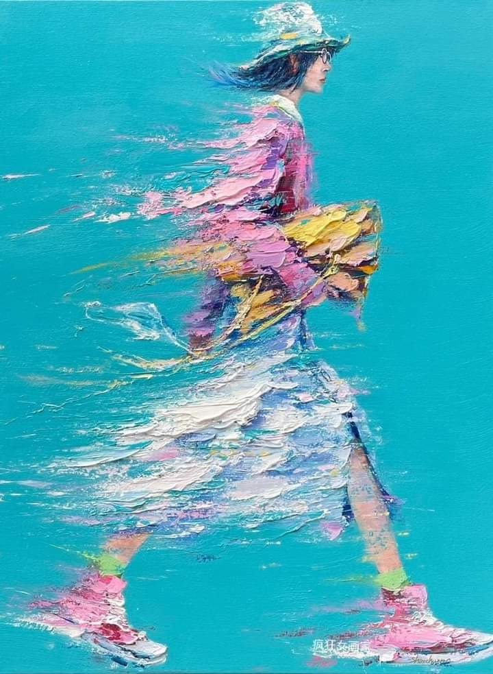

Fără colțuri și fără tăișuri, mi-am pregătit mintea pentru culcuș aseară și, slavă cui merită această slavă, a fost cuminte și ascultătoare și m-a lăsat să dorm fără roller-coaster, fără vise zburdalnice sau coșmaruri neprietenoase, fără halte în realitatea din noaptea dormitorului nostru, fără zgomote care să ciocăne obraznic și violent în poarta somnului. Am dormit dusă, aproape și la propriu ca la figurat. Măi, da' ce bine e să dormi odihnitor. Parcă altfel, mai domol, ți se desfășoară viața înaintea inimii și a minții.

La 6 și un pic, mi-am adus simțurile în lumea asta materială, mi-am deșirat recunoștințele mult mai cu spor după o noapte bună cu mine și nu m-am dat jos din pat până n-am drăgălit vârtos o Spikylină. Boțul ăsta de blană catifelată și caldă mă privește verde prin smoala dimineții, de pe o lăbuță pusă, o țâră ostentativ, peste mâna mea. Nu uit fato că ești, nici n-aș mai putea vreodată să uit, chiar te iubesc.

\*\*\*

Ajungem amândouă în bucătărie și cred că amândouă avem o aromă de început mișto de zi în noi, parcă sunt capabilă să simt, în aer, o energie roz sau piersică sau pastelată care ne îmbracă pe amândouă și nu se disipează și nici risipește alungată de lumina rece a becurilor.

Pierdută în acest văl fain, aproape că m-a speriat mișcarea din spatele ușii dinspre terasă: deși alergat de domnul meu, la ușa bucătăriei, mă așteaptă răbdător și încrezător, Hitlerică. Chiar dacă latura aia din el care-l face teritorial mi-a alungat ieri coconetul, chiar dacă bănuiesc că și el mă vrea doar pentru el, neîmpărțită cu nimeni, de parcă patrupedele astea au luat lecții de "all or nothing" și orice nu intră în lecția asta, le dă cu virgulă și cu bătaie, nu am sufletul să nu-l invit în centimetrii ăia de bucătărie pe care i-a cucerit în zilele trecute, să-i cutreier blana neagra și deasă cu degetele și să-i simt fiorii de plăcere pe care îi articulează, meșteșugit, în torsul cu care mă anunță că-i place. Încă n-am ajuns la performanța de a ne drăgăli cu ușa închisă, trebe să aibă mereu alternativa evadării disponibilă și, afară, iarna nu-i ca vara. Frigul ăsta ascuțit mi-a trezit alerta în corp și, aproape fără să-mi dau seama, mi se imprimă și în mișcări și cum băietul ăsta e suspicios la orice e brusc, o taie afară, în cușcuța lui. 

Rozul cu care a coborât Spiky s-a mai mohorât un strop, e clar că nu-l înghite pe pufarinul ăsta nou apărut în viața noastră, dar n-o las prea mult să se gândească la asta și o preocup în living cu papa ei.

\*\*\*

Îmi încălzesc și eu apa, îmi pregătesc platoul de fructe și îmi pornesc rotițele minții, îmi întind antenele cu care-mi pipăi ziua și cam ce am de făcut în ea. Nu am chef de niciun zgomot și nicio distracție de dinafara mea, stau doar cu mine, în liniște și întuneric și clipele astea fără stimuli sunt excelente pentru a mă centra pe mine, pe ce simt, pe ce gândesc, pe ce-mi fuge mintea aiurea, pe ce planuri croșetează ea și pe ce griji mi-aduce pe platou tot ea. Îmi fac tema zilei din provocarea de obiceiuri sănătoase la care m-am înhămat ca să mă aduc și mai intens în mine și în liniște și în întuneric și apoi îi permit Biencii din mine care are nevoie de o agendă a zilei să-și facă planul.

\*\*\*

La micul ei dejun am adus o femeie tristă, absentă, la prima simțire, un corp care încearcă să mențină o linie de plutire. Mama nu prea are chef de mâncare, nicio variantă din câte îi prezint nu îi surâde, acceptă una, parcă în silă și-n milă, și mănâncă fără nicio poftă.

Hâtrul de gri încearcă să-mi invadeze rozul cu care m-am îmbrăcat în astă dimineață, dar nu mă las prea ușor. Sunt prezentă și la starea mamei și la percepția mea și primul gând care mă umple este că faptul că este apatică NU are nicio legătură cu mine. Wow, ce mă bucur că mi-a venit ăsta ca prim gând! Pentru că atunci când nu mai faci totul despre tine, altfel se deșiră evenimentele, nu mă mai scămoșează iritarea, nu mă mai împung nervii. E drept că nici compasiunea nu mă ține în palmă ci doar am aruncat peste situație înțelegerea. Bun și așa. Mă uit la ea cum abia mestecă și o las acolo, în mestecatul ei, iar eu mă întorc în mine să mă scotocesc de simțire. 

Până la 40 și de ani, eu nu am fost decât o acumulatoare de informații, mi-a lipsit abilitatea de a le articula, de a le înțelege dincolo de scoarța lor superficială, de a pătrunde în zeama lucrurilor, pe bune. Am știut de moarte toată viața și am luat doar notă de existența ei certă. Atât. Nu m-au trecut fiorii definitivului prin toate celulele emoțiilor, nu m-a lovit atât de disperant inevitabilul, nu m-a speriat atât de visceral golul, neantul, dispariția unui om. Dorul care rămâne în urma lui. Faptul că a avut o viață, vise, dorințe, care s-au risipit și dispărut odată cu el. Până acum. O privesc pe mama și simt cum amintirea zilelor când mă suna să-mi spună un banc și râdea spumoasă de mă făcea să râd dinainte de a afla poanta, mă strânge subit de gât și-mi inundă ochii de lacrimi. Toată puterea mea e concentrată să stăpânească această emoție, iar nervii mă prind cu garda jos. Mă apucă așa o furie pe timp, pe trecerea lui, pe neputința pe care o aduce bătrânețea, că aproape că mi se încordează mușchii-n corp. Ce l-aș mai bate pe timpul ăsta! Doamne, cu câtă obidă aș face-o! Da' uite că, nedrept, doar el ne bate pe noi..

\*\*\*

Plec la Direcția de asistență socială, fără mama, în speranța că pot depune dosarul pe care-l pregătesc de ceva timp. 

Aici negrul mă încearcă din toate părțile: zona în care aștepți să-ți vină rândul la ghișeu este de fapt o extindere nefericită a clădirii-mamă, din geamuri termopan, de un metru jumate lățime și vreo patru metri lungime, cu două radiatoare în laterală, să nu înghețăm de tot. În această magazie, suntem înghesuite vreo 20 de suflete.

Cred că n-am văzut niciodată mai limpede mizeria nepăsării unor oameni față de semenii lor, ca aici… câtă lume amărâtă, câți oameni singuri, plimbați și răsplimbați, câtă răutate generată de putere, cât ego, câtă tristețe, câtă resemnare. Sunt oameni care nu au pe nimeni care să îi ajute, sunt în vârstă și nu înțeleg ce au de făcut, nu știu ce e ăla internet și ce le trebe la dosar, sunt oameni bolnavi la care le vezi efectiv în privire cum li se scurge puterea și viața din ei, dar vin să-și ceară dreptul, pentru că bănuții ăia puțini sunt o brumă care îi ajută. Era un bătrân acolo care a venit să-și reînnoiască dosarul pentru o pensie de 60 de roni. 60 de roni!

Mi-am făcut prieteni, i-am ascultat și-am văzut câtă nevoie au să fie auziți, ascultați, mângâiați cu o vorbă, am văzut ce bine le face doar să descarce și apoi am văzut cum s-au strâns înapoi în ei, trântiți de o doamnă doctor, șicanată că n-au ce le trebe la dosar, a cărei treabă NU e să le explice ce au de făcut. Încerc să găsesc loc în mine și pentru primii dar și pentru ea. Încerc să fiu imparțială și să îi găsesc circumstanțe atenuante și ei, dar justițiara din mine s-a lipit cu drag de ceilalți, cei amărâți. Când te gândești că toți suntem același praf de stele… ce păcat că l-a zburătăcit egoul și nepăsarea și s-a dus în nșpe zări și a lăsat impresia că unii ar fi mai presus decât alții.

Mie nu mi-au respins dosarul, nici nu aveau cum, că era complet, doar că nu îl procesează decât dacă vin cu mama. Degeaba îi explic că de abia se mișcă, degeaba îi arăt pe cameră că stă în pat, dacă doctorița de familie n-a scris că nu e deplasabilă, trebe să vină în carne și oase, ca ei să pună o bifă acolo. Ok, mâine o să revin, cu mama și cu credința că, băgată într-o îngrămădeală de oameni, cu 2 măști pe față, nu se va stresa și speria. De ce naiba m-oi fi apucat eu să fac acest dosar?! Am pierdut 5 ore azi pentru el. Pe de altă parte, am câștigat înțelegere nouă pentru oameni. Las așa gândul.

\*\*\*

Îi povestesc mamei la prânz traseul meu pentru dosar. Nu e interesată, iar eu sunt puțin consumată în interior de cele trăite, așa că restul mesei ei se consumă în liniște, ea mestecă de o mie de ori orice îmbucătură, eu mestec de o mie de ori același gând: după această jumătate de zi, după trăiri de moarte și de neputință și de tristețe, mă încarcă o senzație de inutil. Din nou, mintea mea, care mereu încearcă să facă sens din ce-mi vine la procesor, îmi etalează întrebarea seacă: pentru ce toate astea? Pentru ce e viața asta, dacă moartea stă lângă tine la orice pas și te surprinde, chiar dacă știi că e acolo? Pentru ce trăitul ăsta dacă-i cu așa suferință și neputință și durere?

Deși inima mea are un răspuns, mintea-i dă peste mâinile cu care mi-l livrează și se încăpățânează să găsească altul. Nu găsește.

\*\*\*

Mă apuc de curățenie deși e deja după-amiază. Cu bagheta magică a mâinilor mele fac curat la mama, o spăl și pe ea și pe Sassy, și îmi iau răsplata din exclamația ei: _ah, ce bine e! Să nu îmbătrânești niciodată!_ 

O privesc uimită, un strop circumspectă, parcă știe ea firul gândurilor mele, parc-a fost ea cu mine în dimineața asta la protecția socială unde era plin până la refuz de bătrânețe, parcă a fost un semn de dincolo de demență. Cu ochi noi, înțeleg, iar și iar, că mama nu e decât nefuncțională. Uită, dar asta nu-i anulează viața și trăirile și amintirile și cunoștințele.

\*\*\*

Îmi închei seara în stat de vorbă cu domnul meu și ziua îmi dă ultimul giuvaer: împunsă de un cuvânt al domnului meu, după ce mă melcuiesc, cum fac mereu când mă simt atacată, chiar de nu-s, mă prind că a fi flexibil, că a fi deschis să schimbi ceea ce crezi, înseamnă creștere, nu lipsă de integritate. E nevoie de mult curaj și de umilință să stai drept și să privești, cu ochi spălați, o credință proprie care s-a șters și care nu mai are sens pentru tine, în prezentul tău. Nu înseamnă că ai greșit atunci când ai adoptat-o, nu înseamnă că greșești acum, când n-o mai vezi validă. Înseamnă doar că ai crescut, pur și simplu. Pot fi mai multe finaluri pentru același punct de pornire, după cum pot fi mai multe porniri pentru același final.

\*\*\*

Deși am pipăit-o-n zorii ei roz, și am trecut prin griuri și neguri, nu pot să nu-i fiu recunoscătoare acestei zile, pentru:

1. Mortalitatea dar și imortalitatea la care m-a făcut atentă!

3. Diversitatea umană genială care ne înconjoară, spectaculoasă și terifiantă în același timp!

5. Grija și înțelegerea pe care mi le ofer azi, mai pline și mai calde decât am făcut-o până acum!

Frumosul zilei:

