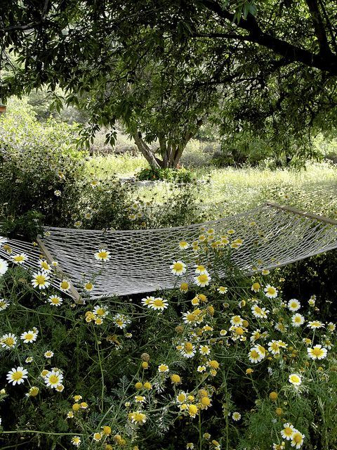

5:06. Pentru că aseară i-am spus și minții și corpului că avem treabă multă pe care trebe să o înghesuim în puțin timp, niciuna nu a crâncit când azi mi-am dat trezirea, ajutată și de Spiky evident, la o oră atât de crudă. Și la propriu și la figurat.

Într-adevăr, dacă le vorbești, atât mintea cât și corpul înțeleg, că nu e SF, și te ascultă și ajută.

Mi s-a părut uimitor cu câtă ușurință m-am dat jos din pat, deși mă pusesem frântă aseară și-am adormit greu. Deci asta e cheia! Ca la copiii mici, să le spui dinainte la ce să se aștepte și nu mai iese circul așa de mare. Bun, am mai priceput ceva, chiar la prima strigare a zilei.

***

Am trecut direct în bucătăreală. Adică bucătăreală serioasă, pe bune, nu doar smoothieuri, ceai și cafea. Aseară, cu ultimele puteri, am făcut foietajul pentru ștrudelul cu mere pe care vreau să-l fac azi, că trebe să stea la rece ceva timp, așa că acum mă avânt doar în mere.

Văd pe cameră că s-a trezit și coana mare și cu zâmbetul în sânge și o stare de bine prin toate celulele, mă duc să-i întâmpin ziua. E mai bine, mai prezentă, ori zâmbetul meu a fugit înaintea mea pe scări și s-a pus și pe fața ei, ori energia mea a împrospătat-o și pe ea, că are și ea fața luminoasă. Hai mamă, că se poate, suntem în viața asta, hai să ne bucurăm de ea!

Starea mea de bine nu se murdărește cu nimic, termin curățenia la ea și îi ciripesc că ne vedem la micul dejun, pe la 9. Doar zâmbește și dă din cap. E bine și așa.

***

Trimit gând de recunoștință profei mele de mate din liceu și băncii la care am lucrat, că m-au învățat să fiu organizată și eficientă. Mi-a folosit mult în viață, eficiența aplicată la nivel micro, de mișcări.

Tot ea este responsabilă pentru numărul mare de bucate sau de treburi pe care reușesc să le fac în același timp. Mereu am grijă să nu am timp morți. Cât timp stă la cuptor ștrudelul, fac aluatul și întind foile pentru prăjitura mea vegană, Albă ca zăpada. Cât se coc foile, fac crema. Le asamblez și am gătat și ștrudelul și prăjitura înainte de micul dejun. Yey!

***

Întâi apare domnul meu, pentru micul lui dejun. Eu nu cred că o să mă satur vreodată să-l văd pe omul ăsta drag. Întotdeauna mi-a plăcut să-l privesc și nu cred că e mult să spun că așa va fi și de acum înainte. Are ceva în el care întâlnește ceva în mine și fac împreună o simbioză tare mișto. Nu avem mult timp la dispoziție pentru că trebe să o aduc și pe mama la micul ei dejun iar el să dea o fugă să cumpere ceva de la farmacie pentru copila mea.

***

Deși nu recunoaște, mama e o pofticioasă. Pe masă trona ștrudelul cald, scos din cuptor, dar la ea nu a mai ajuns și informația că e pentru copii. Ea a vrut să mănânce și aia a fost. Nu-i bai, nu moare nimeni fără două bucățele. A mâncat cu poftă și jur că i-aș fi dat toată tava.

Mama mea e copilul meu acum. E funny să vezi ciclul de viață al unui om, cât poți tu să-l percepi, din afară. Eu nu mi-o amintesc tare mult din copilăria mea că nu prea a fost prin ea sau nu m-a impactat sau m-a impactat negativ și eu am șters cu buretele din amintiri. Dar cât pot să văd, mama a fost o tipă puternică, care a făcut față unei vieți vitrege, care și-a făcut cuibul ei, care a trăit singură mult timp, prea mult timp, și care acum se întoarce prin gesturi și prin minte, la o copilărie care i-a fost furată de urâciunea violului și de multă muncă. Iar eu sunt acolo să o răsfăț. Cât pot și cât mă pricep.

Ascultând-o pe Dolores Cannon, am auzit o perspectivă interesantă: dacă ai o datorie în karma ta, dacă într-o viață anterioară ai făcut un rău abominabil cuiva, viața următoare ți-o vei petrece având grijă de acea persoană, practic viața ta va fi "furată" de grija asta pentru starea de bine al acelei persoane. Sau, varianta doi, când ai pe cineva în grijă și ți-e greu, este foarte posibil că atunci când "ți-ai contractat" noua viață pe Pământ, să fi vrut să crești mai mult și ți-ai luat mai multe de dus.

Încă nu am decis în mine dacă s-a făcut vreun click sau nu.

***

În timpul bucătărelii, m-a lovit inspirația și am hotărât să mai fac un ștrudel și o bucurie pentru un om cu un suflet extrem de larg și generos, care nu are posibilitatea să aibă un Paște îmbelșugat, cum se urează. Dacă aș putea, aș face pe bandă rulantă ștrudele, pentru toată lumea, dar îs limitată de timp. L-am pus pe lista de to do-uri, după ce mă întorc de la copii.

***

Mesaj pe messenger. De la o fostă colegă de liceu (!). Mă așteptam să fie urările clasice de "Să paștem fericiți!" Când colo, mă întreabă adresa, că vrea să-mi trimită cozonacul promis. Răspund repede, să se prindă fata că a trimis mesajul greșit. Nope, nu a greșit, chiar vrea sa-mi trimită un cozonac!!!

Pauză și înapoi în timp, într-unul din anii trecuții, posta ea pe facebook cozonacii făcuți și arătau senzațional. I-am spus la o postare să-mi dea rețeta sau, și mai bine, să vină și pe la mine să facă. Uite că nu a uitat și azi, fix azi, vrea să dăruiască. Cred că "întâmplări" de genul ăsta am avut rar în viața mea și, recunosc, sunt uimită și consternată. Să vină cineva, cu care nu stau bot în bot, să-mi aducă cozonac că am zis eu ceva despre el acum câțiva ani, n-am pățit în viața mea! Tare adevărată e zicerea: oamenii uită multe dar nu vor uita niciodată cum i-ai făcut să se simtă!

Știu că e balanța Universului, care a zis el că dacă dau, hai să și primesc, dar ce frumos lucrează! Speechless! Și mulțam cu imensă recunoștință, că așa o situație de genul ăsta, care-ți sparge tiparele idioate construite o viață, te și forțează să înveți să primești. Că doar așa începe să curgă PRIN tine abundența.

***

Copiii noștri au trecut de la Covid la gripă, așa că vreau să dau o fugă și la ei să le fac puțină ordine și să le duc și lor bunătăți. Să fie răsfățațti, că e primul lor Paște împreună, cap coadă.

Opresc bucătăreala și mă apuc să fac pachetele. Cu câtă bucurie le-am luat și făcut pe toate, cu atâta bucurie sper să le primească și ei. Sunt acolo și stropi de-ai mei de suflet. Într-adevăr, nu există mai mare bucurie decât cea de a dărui.

Cred că mereu am avut asta în mine. Când eram copilă și îmi petreceam mai tot timpul la măița mea, mereu strângeam bani și când veneam acasă, la ai mei, aveam mici cadouri pentru fiecare. Doamne, nu mai puteam să dorm de cu o noapte înainte, de emoția dăruriii! Tot bibileam cadourile, tot aranjam la ele în așteptarea feedback-ului! Că ăsta era plata și răsplata mea. De multe ori, nu-l primeam și mă strângeam în mine ca melcul, dar anul următor, făceam la fel.

Până de curând, deși toată viața mea am dăruit, cu tot sufletul, mereu am avut, în colțul inimii, așteptarea unui răspuns, mă ungea pe suflet reacția primirii.

Well, am observat la mine că am început să fac schimbarea către bucurie ingenuă și atât. M-am bucurat cât le-am făcut curat, m-am bucurat când le-am pus bucatele în frigider, m-am bucurat când le-am lăsat flori pe masă. Nu ne-am văzut, ca să nu aduc vreun pui de gripă acasă, la mama, dar tot timpul cât am stat la ei mi-a fost sufletul ușor, ca un fulg, plin de o stare de bucuria aproape nepământeană. Și parcă și corpul, deși ar fi trebuit să dea semne de oboseală, era ușor și mă susținea în toate. Asta da stare sublimă! Normal că mi-au mulțumit dar asta nu mai era pe lista mea de așteptare. Imensă recunoștință pentru această stare curată!!

***

M-am întors acasă la țanc pentru prânzul mamei, pe care nu-l vrea. Din nou… E molcomă, nu pare prea absentă așa că nu forțez fragilitatea stării. Cobor să mă reapuc de bucătăreală și îi spun că mă găsește jos, dacă cumva o trece foamea.

***

Gata și tiramisu pentru ei, și ouăle tot pentru ei, încă o salată de be off pentru mine și un drob vegan. Plus aluatul de foietaj pentru ștrudelul pe care îl coc mâine, să-l ducem cald. Toate presărate cu o stare minunată care nu m-a părăsit deloc.

***

A fost multă muncă azi, mă dor tălpile fizice dar nu mai simt pământul de bucurie. Cred că se numește beatitudine și e o stare de vis. Poți să ai nimic dacă ai în tine pornirea de a dărui, de a fi de folos, ai în tine totul. Și Creația te ține în brațe și-ți dă și ție ce dai altora. Dar am învățat azi că această stare de grație vine când nu ai nicio așteptare suspendată să se gogoșească de vreo reacție la primire. Când faci pentru că vrei să faci și atât. Nu să se umfle ego, nu să te mângâi pe glandă. Să faci pentru alții, total altruist. Sunt izvor de recunoștință și adorm cu lacrimi calde, de bine, pe obraji. E prima oară în viața mea pentru multe azi.

Sunt recunoscătoare pentru:

1. Alinierea dintre minte și corp și energii și emoții!
2. Starea de beatitudine!
3. Am înțeles, în cel mai concret mod cu putință, cum funcționează legea abundenței!

Clipa mea de frumos este starea de verde:

