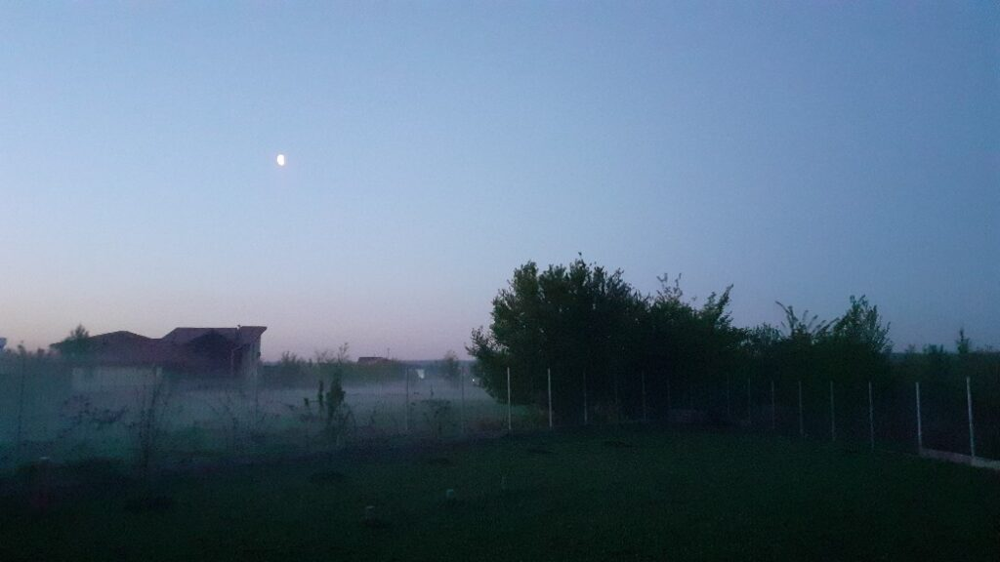
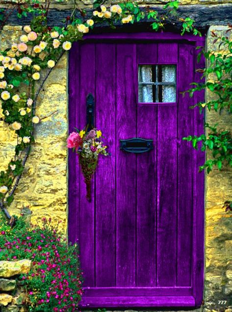

Trezirea la 05:20. Pare că starea asta mișto din celule a călătorit peste noapte și timp și vrea să mă traverseze și azi. Perfect, sunt aici, prezentă și doritoare să mă scufund în ea.

Nu știu ce stare o traversează pe Spiky dar clar o componentă e frichineala. Așa o apucă pe ea, aproape în fiecare dimineață, o nebunie prin gheruțe că vrea să scarmene peste tot, ar vrea și n-ar vrea să intre peste tot, ar vrea și n-ar vrea să stea când la picioarele lui Mr. H, feblețea ei, când la picioarele mele, umana ei. Ca să aduc o limpezime în stările ei indecise, o culeg rapid și ne îndreptăm către o țintă certă: terasa. 

\*\*\*

Începe din ce în ce mai mult să stau pe terasă, în pântecul întunecat al dimineții. E magie în toată splendoarea și azi. Deși e beznă totală, se aude un concert pe mai multe voci ce vine dinspre pădure, și-mi gâdilă tare plăcut urechile. Ce or sporovăi ele așa de devreme, doar ele știu, mie îmi face plăcere să le fiu martor neștiut. Că doar eu am rămas pe terasă, Spiky a plecat în pelerinaj.

\*\*\*

Am avut timp doar să fac smoothieurile și mama s-a trezit. La fix, că vreau să savurez cât mai mult din timpul meu cel mai liber. Mamei îi e bine, e odihnită, cred și eu după cât somn a băgat zilele astea. 

\*\*\*

Azi e Paștele și e o liniște aproape absolută peste tot. Doar câte-un cocoș mai zburdalnic sau vreun câine mai cu țâfnă se mai aude, pe ici, pe colo. Mă așez în această palmă liniștită a Creației și absorb cumincioară tot ce îmi oferă dimineața asta. Și din exterior, și din interior.

Afară se sparge bezna și o lumină difuză se împrăștie calmă peste tot. De fapt, e o ceață suspendată pe deasupra pământului, la vreo 2 metri, ce arată demențial și e oglinda fidelă a ce mi se petrece în interior diminețile.

Uite că dacă văd la natură mi se pare mișto, dacă simt la mine nu mi se pare la fel. De notat. 

\*\*\*

Cu aceeași bucurie, pregătesc încet masa pentru micul dejun, festiv de data asta. Îmi place să le aranjez pe toate dar mai mult decât atât, mă bucură că am cu cine să împart bucatele. Pentru că am pus în ele stare de drag, de bucurie, de plăcere, de gând bun și sper să ducă ele mai departe aceste stări. 

Îmi fac loc și timp și spațiu în mine pentru un gând luminos către toți ai mei. Toți pe care pot să-i cuprind acum cu mintea, toți care îmi locuiesc în inimă, în amintiri, în trecut, toți care vor ei să vină în gândul meu, sunt incluzivă și accept tot ce este. Și când accepți cu pieptul deschis tot ce vine, nu te mai lovește și doare nimic, că e doar curgere lină. 

Pentru că mi-am propus să fiu atentă la percepții, am observat această haină de curgere până mi-am simțit-o pe piele. Nu opun nicio rezistență la nimic, fie el gând, emoție, stare, cuvânt. E o trăire faină, nouă, diferită. 

\*\*\*

În starea asta m-a găsit domnul meu, în aceeași stare am adus-o și pe coana mare la masă, și m-a însoțit pe parcurs. Nu am cerut confirmări că mâncarea e bună, nu am avut așteptări, doar mi-a fost inima plină de prezența a doi oameni pe care îi iubesc profund și care-mi sunt în viață, la un mic dejun în trei.

De la mama am împrumutat și eu programul nemulțumirii, care se manifesta și la mine aproape constant. Acum văd cu mare claritate că o persoană nemulțumită, de viață, de oameni, de situații, întotdeauna de ceva, e ca o cană fără fund. Degeaba torni în ea bunătăți, că nu reține.

La mama, nemulțumirea, sau regretul, nu mi-e clar care e, a fost legată de lipsa mesajelor de orice fel din partea surorii mele vitrege, pe care ea a crescut-o. Din când în când, în demența asta a ei, mai licăre câteva prezențe, dar una este invariabil a surorii mele. Îmi dau seama cât de traumatizant a fost momentul pentru mama când tata a dus-o pe soră-mea să-și cunoască mama naturală. După ce o crescuse și era majoră deja. Ăla a fost momentul când pe mama au dat-o la o parte, când ușor-ușor, că nu mai era nevoie de ea, nu a mai contat. Nu s-a gândit niciunul că te atașezi și de o râmă dacă o crești pe lângă tine, d-apăi de un boț de om. Iar mama, ca întotdeauna, a astupat rana asta cu liniște și cu indiferență aparentă dar uite că Alzheimerul scoate la iveală iubirea ei. Și grija. Și gândul.

Am deviat subiectul cu o glumă, am enumerat motive pentru care să fim recunoscători clipei și a fost un mic dejun reușit. 

\*\*\*

Pentru că așa mi-am promis mie și Creației, am băgat la cuptor ștrudelul de mere pe care vreau să-l dăruiesc împreună cu câteva felii de cozonac. E momentul în care simt că se gogoșește iar starea aia de grație, de bine "nefiresc" pentru mine. Da, e o trăire nefirească pentru că e în firea omului să aibă așteptări și am descoperit eu de câtva timp că doar dacă le scoți din ecuație, îți este permisă o așa stare de plinătate. Mulțam!

\*\*\*

Singurul moment care mi-a micit un strop plutirea azi a fost pregătirea fripturii pentru mama. Mi-a clar că nu mai pot să folosesc carnea, am niște simțiri fizice de rău, mi-e greu să tai carnea și doar faptul că o iubesc și că ea vrea friptură, m-a făcut să pot merge până la capăt. Pe viitor, o să o implic pe ea la capitolul ăsta, că așa e corect. Habar n-am cum s-a insinuat în mine o așa de mare implicare vis-a-vis de carne și de ce culeg din aer oroarea animalului mort, dar nu mai vreau să fac asta deloc, pentru nimeni.

\*\*\*

Domnul meu a plecat să ducă o parte din ce doream să dăruim iar cealaltă parte am dat-o aici, aproape, peste gard, la prietenul meu drag, bătrânul tată al vecinului. Nu puteam să-l uit tocmai pe el și am vrut să simtă cum mă simt eu când primesc de la el tot timpul câte ceva. În inima mea, am simțit primirea și am mulțumit înapoi cu recunoștință. 

Cred că am destupat țeava abundenței că al meu domn, deși plecase să dăruiască, s-a întors cu o ladă de verdețuri crude și atât de faine, dăruite. Doamne, dar se tot adaugă și adaugă și adaugă elemente de bucurie în ziua mea că-mi face sufletul și mai mare să primească, și mai recunoscător, și mai plin! Dacă raționez, realizez că subtil totul e o cauză și-un efect. Dacă doar percep, înțeleg că Universul oglindește și amplifică prezentul tău. E ca la feng shui: e bine să pui o oglindă pe peretele de lângă masă, ca să oglindească bucatele și să le multiplice, practic inviți abundența folosind simboluri. 

\*\*\*

Afară e o vreme superbă, în mine e o vreme superbă, le-am împărțit pe amândouă cu domnul meu pe terasă, la o cană de vin primit. Aș vrea să încremenesc momentele astea în timp sau să le fac buzunare în care să mă arunc atunci când uit că ce dau, aia vine înapoi și arunc în aer cu frustrare, nemulțumire, tristețe. 

\*\*\*

Urc să o anunț pe mama că într-o oră vom lua prânzul, tot în trei, și o găsesc tristă. Aflu destul de repede și de ce: nu are și ea telefon să o sune pe soră-mea. Evident că are dar nu știe să-l folosească. Păi s-o sunăm, zic. Deși sunt câteva probleme rezolvate incorect între noi două, eu mi-am iubit sora tot timpul, chiar și când evidența îmi întorcea clar lipsa reciprocității. Nu-i bai, nu o iubesc ca să mă iubească înapoi, e un sentiment pe care-l am și atât.

Cât de mult contează un telefon! Mamei i-a radiat fața toată ziua deși la un moment dat nu mai știa cu cine a vorbit la telefon. Nici nu contează, eu simt că am dezlegat un nod dureros peste care dădea mai tot timpul mintea, în bezna asta care se instalează acolo. Mulțam și pentru asta!

\*\*\*

Prânzul lung, cu de toate, dar și cu țuică fiartă, cred că mi-a pus capac. Cred că mi-am oprit în sfârșit motoarele turate la maxim iar puținica țuică băută m-a pus cu botul pe labe. Domnul meu a vrut să ne uităm împreună la un documentar, The game changers, cu sportivi care au adoptat dieta vegană și au avut performanțe extraordinare. Nu știu de ce vrea să îl văd și eu, că eu îs deja vegană, dar pentru că apreciez dorința lui, țin cont de ea și mă aliniez. Bad luck pentru documentar, la nici 15 minute de la începerea lui, m-a cuprins așa o stare portocalie, de bine, de moleșeală că am dormit ca valiza-n gară tot documentarul. Și cred că dormeam până a doua zi dimineața dacă alarma din creierul meu, aia de table și duș și masaj, nu ar fi sunat. O dată cu alarma, s-a activat și durerea de cap, care-mi urla că are nevoie de odihnă și să mă întorc la somn. N-am ascultat-o și am urcat la mama.

\*\*\*

Ce bucurie pe ea că jucăm! Chiar dacă-mi bubuie constant, încă mică, durerea de cap, bucuria asta ingenuă a mamei mă ridică. Și asta face parte din dăruire. Că dacă o faci doar atunci când ți-e comod, parcă nu are aceeași putere ca atunci când nu poți și totuși o faci. Nu cu sacrificiu dar cu dorință.

Cu aceeași bucurie copilărească a primit și dușul și masajul. S-a simțit răsfățată și mi-a și spus asta. Am apreciat și verbal și în sinea mea dar am și perceput că nu mai am nevoie, cel puțin azi n-am avut, de reacția ei la ce fac eu pentru ea. Mulțam Biannca că-ți antrenezi și percepția!

\*\*\*

O zi super mișto. Cu recunoștină pentru toată viața mea, cu tot ce cuprinde ea, cu susuri și josuri, cu prezențe și absențe, cu drag și cu durere, cu dăruire și primire. Atât. Fără niciun clasament azi.

Doar cu clipa de frumos:

