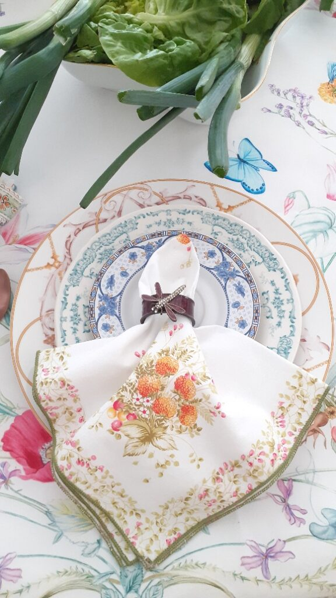
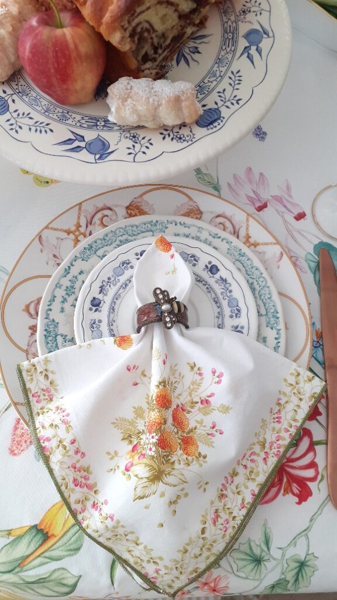
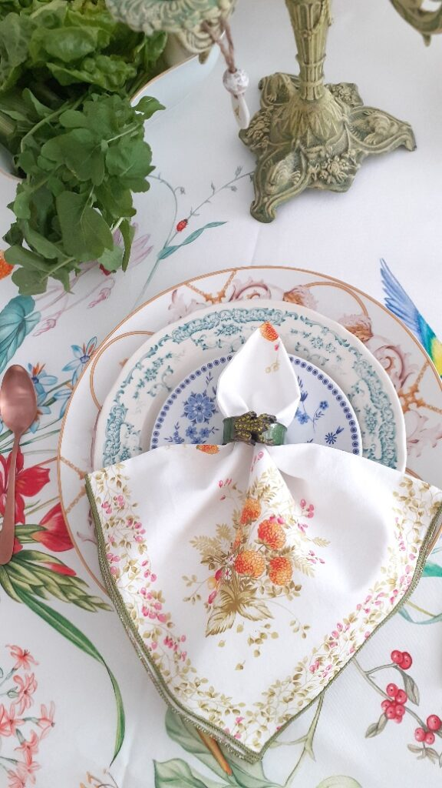
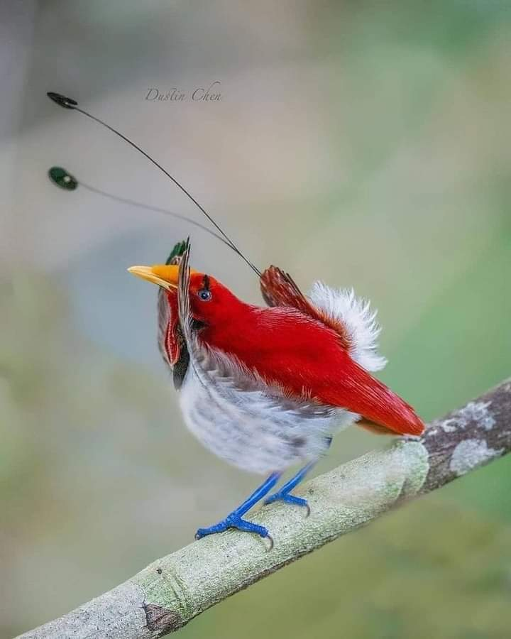

Deși, cel puțin la nivel teoretic, nu ar trebui să mă mai trezesc de cu noaptea-n cap, pe Spiky nu a manierat-o încă nimeni și nu s-a prins că 5 dimineața nu e oră de manifestat talente. Așa că la ea începe spectacolul scărmănatului, defilatul pe catwalkul imaginat de ea în dormitorul nostru, săritul la picioarele care fac greșeala să se miște sub pilotă, ce să mai, e Disneyland combinat cu paradă la o oră la care alții, normali sau cu pisici normale, dorm somnul ăla cel mai dulce. Nu știu ce i-am făcut dar coconetul ăsta nu vrea să mă lase să mă dedulcesc și eu cu o porție zdravănă de somn în zorii dimineții. Asta e, deja mi s-a dus somnul pe apa zilei de luni, că nu mai e sâmbătă.

***

Ajunse jos, nici nu apuc să pun apa la încălzit, că începe frecatul la ușa de la terasă. Afară, fulgere de se luminează toată bucătăria fără lumina aprinsă și tunete de vibrează casa prin toți porii ființei mele. Asta mică, batman, batman, la ușă, să-i dau drumul. Îi explic, pe românește și cu fermitate în glas să simtă, că nu e voie afară. La fel și ea, dar fără fermitate în glas că ea n-are voce ci în lăbuța cu care freacă ușa aia. Măi, poate o taie vreo nevoie și eu nu înțeleg! Îi dau drumul și, neagră cum e, se pierde rapid în întuneric. Nu trec 5 minute și începe răpăială. Toarnă cu găleata, fulgeră și tună sporadic, cerul dă un concert de rock iar Spiky e de negăsit. Strig, pâsâi, ies pe lângă casă, ia Chichirica de unde nu-i. Îmi fac procese de conștiință că am lăsat-o afară dar am scuza cu nevoile aproape. Renunț, că m-am făcut aproape fleașcă de la ploaie și, dacă mai aveam vreo speranță că poate mai ciupesc vreo picătură de somn, acum nu mai am deloc. Nimic, nada, zero.

***

Îmi beau apa care s-a răcorit deja, pornesc să fac smoothieurile și ceaiul dar cu ochii mereu pe ușă, să văd dacă apare zgubilitica. Am terminat toată treaba în bucătărie, mama nu s-a trezit iar Spiky nu a apărut. Mă enervez pe mine că nu pot să stau și eu liniștită, mă tot fâțâi să văd siluetă de felină-n prag în loc să mă bucur de surplusul ăsta de timp care s-a ivit.

***

Pentru că mama lenevește azi neașteptat de mult la somn, îmi beau smoothieul înainte să urc la ea. O să-mi beau cafeaua în timpul meu magic de "după".

Pe la jumătatea smoothieului, mama încă doarme dar Sassy miorlăie de mama focului. Cum la mine se aprinde mai mereu butonul roșu în minte, că așa m-am programat eu sau ai mei sau societatea sau toate la un loc, mă gândesc să nu se fi întâmplat ceva, așa că iau smoothieul mamei, mâncarea lui Sassy și mă duc repejor la ele sus. Nu, nu s-a întâmplat nimic, doar mama dormitează iar lui Sassy probabil că-i e foame. Asta e, am trezit pe toată lumea, am făcut curat, le-am dat să pape și am plecat la fel de repejor cum am venit.

***

Au fost niște zile obositoare, cu multă muncă fizică, cu multă trăire emoțională și sunt, cum zicea copila mea când era mică, "epulizată". Așa că în timpul meu magic doar îmi beau cafeaua ca să nu mă apuce iar vreo durere de cap și nu ascult și nu văd nimic. Doar șed, vorba bancului. Îmi face bine statul ăsta pentru că am nevoie de el.

Între timp a apărut și Spiky, fleașcă toată, murdară de pământ și-n locul unde nu bate soarele așa că o bag la spălat. Azi avem musafiri și n-aș vrea să fie lăbuțe de noroi impregnate pe canapea, pe scaune sau pe unde mai aleargă nebunica asta mică. Nu comentează, simte că-s o țâră supărată pe ea.

***

Dacă tot nu reușesc să doar stau, hai să-mi arunc un ochi pe antichități, plăcerea mea (ne)vinovată. Îmi place la nebunie să "caut" virtual pe la alții prin cufere vechi sau prin poduri. Știu că nu e pentru toată lumea valabil, dar eu rezolv două chestiuni cu asta: nu particip la consumerismul ăsta care e parte din dezastrul către care îndreptăm planeta și îmi face plăcere să ghicesc sau închipui, în cutele sau în semnele trecerii timpului peste un obiect, istoria lui plină de farmec. Win-win.

***

Micul dejun în trei, la fel ca și ieri. Azi nu am putut să mă fac că nu observ ciudățenia situației: Mr. H nu e vorbăreț pentru că nu vrea să o stânjenească în niciun fel pe mama, mama îmi vorbește și povestește numai mie crezând poate că pe el nu-l interesează ce zice ea, eu îi răspund ei la ce-mi spune dar, în pauzele din convorbirea cu mama, vorbesc cu domnul meu despre ale noastre. Ăsta e multitasking baby, pentru că, on top of it, mai vin și cu chestii care să-i privească pe amândoi. E ca aia: tu ai copii tăi, eu pe-ai mei dar i-am mai făcut și pe-ai noștri, să știm o treabă! Mă amuză în interior observația asta dar îi dau înainte, că asta e. Mama pleacă destul de repede, nu înainte să o anunț că-i vom avea musafiri pe părinții lui Mr. H.

***

Mă uit puțin cu domnul meu la un documentar pe Netflix despre Ram Das, un învățător spiritual american foarte cunoscut. Cât am apucat să văd, finalul, mi s-a părut interesant atât ca filmare cât și ca conținut însă ceva m-a atins în interior puternic, pentru că am rezonat instant: viața este un șir de schimbări, care culminează cu cea mai mare schimbare, moartea. Iar fraza asta mi s-a părut genială prin simplitate și impact: **Moartea este ca și cum îți scoți un pantof strâmt!** Chiar că genială! Pentru că mie, cel puțin în ultima perioadă din viața mea, nu-mi mai e frică de moartea propriu-zisă. Da, aș prefera să fie bruscă, nu să mă chinui sau să-i chinui pe alții dar de moarte în sine, nu mi-e frică. Sunt doar curioasă.

***

Mai am puțin timp liber până mă apuc să aranjez masa pentru prânzul familiei extinse așa că dau o raită prin curte. Mi-au răsărit 11 iriși și 4 gladiole! Bujorașii mei au toți bulbișori și îi aștept din zi în zi să explodeze în floare. Lalelele se deschid cu regularitate în fiecare dimineață și se închid la fel în fiecare seară. Mi-e tare dragă natura din curtea noastră!

Mai jumul câteva buruieni, mai ud cele două magnolii micuțe de abia plantate, cadou de la copila mea și spăl și terasa, înainte să se întunece rapid a furtună.

***

Dacă înainte, mulți ani în urmă, focusul meu era pe ce pun pe masă, ca bucate, să fie cât mai variate, se pare că între timp, am trecut asta la obișnuință iar acum mă preocupă și aranjatul mesei. E drept că mi-am educat gustul în această speță în timp, și sunt la început, dar mi se pare tare mișto să-ți bucuri și ochii la o masă, nu doar să-ți încânți papilele gustative sau nările. Eu una m-am bucurat de priveliștea creată!

Mi-am cumpărat inelele pentru șervețele cred că acum vreo 20 de ani iar farfuriuțele mici, diferite, le am de la o tipă de pe instagram, expertă în porțelanuri faine. Me happy!

Prânzul a fost o reușită, din toate punctele de vedere dar mai ales că am fost împreună. Surpriza a fost bunica domnului meu, care a venit cu părinții lui, o femeie la 80 și ceva de ani pe care o admir tare mult pentru mintea ei ageră, deși e femeie fără carte multă, și pentru inteligența ei nativă. Plus curiozitatea cu care selectează ea fiecare informație cu care se întâlnește. Am coborât-o și pe mama, care a stat la masă din nou, a și mâncat, a povestit, s-a simțit bine. Toată scena mi-a umplut sufletul, sunt oamenii noștri dragi, o adunătură de personalități diferite dar cu dorința de a fi împreună. Mi-au fost balsam pentru inimă și mulțam Universului cu recunoștință că au făcut efortul de a veni.

***

După strânsul și spălatul inerente unui prânz de anvergură, urc la mama să-i dau pastilele și să-i iau pulsul stării. E bine, zâmbitoare și asta-mi dă curaj să o întreb dacă i-a recunoscut. De dimineață îmi spunea că se bucură că-i va cunoaște iar eu îi spusesem că-i știe deja, că s-au mai întâlnit până acum și că o să-i recunoască când îi va vedea. Ei bine, i-a recunoscut? Nu, nu știe cine sunt, nu i-a mai văzut niciodată. Iar întrebarea pe care mi-o pune mă pune într-o poziție stânjenitoare: practic, ei sunt rude cu Mr. H? Nu, mamă, nu sunt doar rude, sunt părinții lui! Da?! Nu știam asta! Ok, delete și de la capăt.

***

Sunt tare obosită. Părinții domnului meu spun că am slăbit îngrozitor de mult, mie nu mi se pare, însă resimt acut oboseală. Dar și plinătate. Bucurie. Pace. Liniște. Drag. Incluziune. Toleranță. Fericire. Și multă recunoștință pentru:

1. Mintea asta a mea, zburdalnică și prădalnică, ce totuși pare că se aliniază să ia viața pas cu pas, clipă cu clipă, din curiozitate, nu mai vrea să ardă etape!
2. Frumosul care se încăpățânează să-mi fie martor oriunde privesc!
3. Firul ăsta invizibil care ne leagă pe noi, pe toți, între noi și care ne aduce împreună în pace și bucurie!

Clipa mea de frumos instant a fost:

King Bird of Paradise
