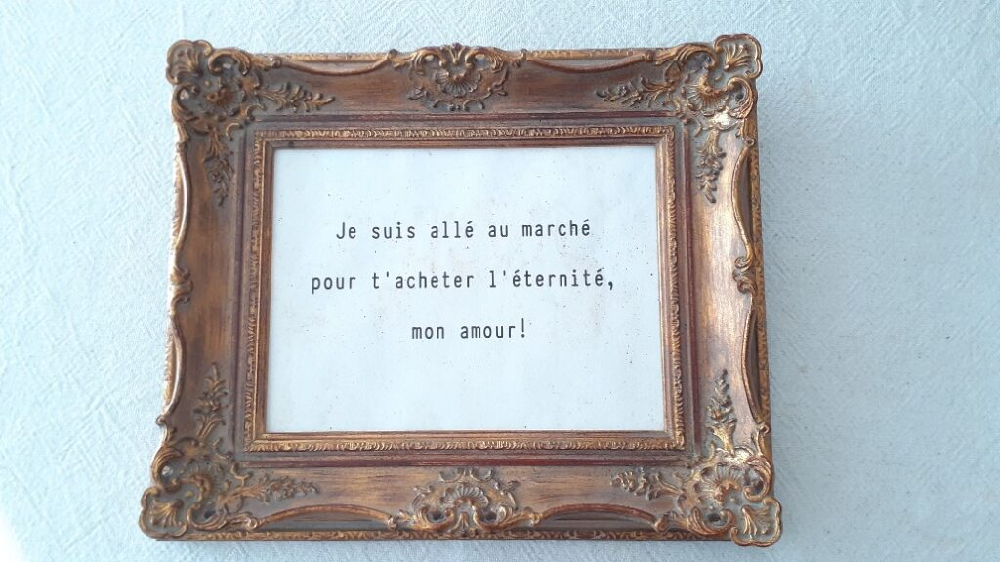
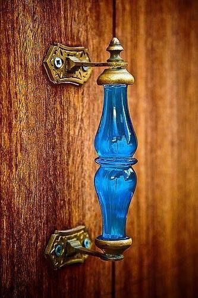

Parcă am pe pleoape greutăți de moară, cum încerc să deschid ochii, cum se închid automat la loc. E o parte a corpului care, azi, face opinie separată, se răzvrătește. Cred că a cooptat-o și pe soră-sa ce locuiește două etaje mai jos, vocea, că nu o găsesc să o ușui pe Spiky. E totuși 4:05!

Domnul meu, mai practic, își pune căștile în urechi și doarme de rupe. Smart guy! Adorm și eu între 2 gânduri, că-s praf de oboseală. La 5:13, simt o gheară în talpa piciorului drept. Dau să trimit o "vorbă bună" înainte să deschid ochii, dar astea tot răzvrătite sunt. O las pe Spiky să facă ce vrea ea, să mă atace, să se joace, orice, mă izolez de corp și adorm. Până la 6 fără un sfert când mi s-a părut că a căzut ceva. Asta mi-a forțat ochii să verifice camera de supraveghere a mamei. Toate bune. O fi nebunica de Spiky, făcând stratageme să mă dea jos din pat. A reușit.

\*\*\*

Fericită că sunt în bucătărie, parcă prinde ea din aerul dimprejurul meu un strop de amenințare că nu îndrăznește să frece cu lăbuța ușa. Doar stă cu fața la ea și mai întoarce capul din când în când către mine, ca și cum: hai, deschizi și tu ușa asta mare? 

O deschid și ne scoatem amândouă pe terasă, unde e tare plăcut. Nici cald, nici frig, fără vânt, cu multă liniște, probabil gureșelele și-au împărțit taskurile pe ziua de azi și au plecat toate-n treaba lor, e o atmosferă lină. Dacă aș avea un pat pe terasă, cred că m-aș scurge instant în el. Așa cum s-a prelins Spiky pe lângă casă și a dispărut.

\*\*\*

Mama doarme dar eu m-apuc de trebușoarele dimineții, că la ea nu există un tipar. Nu apuc bine să termin gândul că o văd pe cameră cum se duce la baie. Bun, hai repede cu smoothieurile să fie gata când se întoarce în cameră. Le-am terminat și stau cu cana ei în mână așteptând s-o văd pe cameră. Surpriză, se întoarce și se culcă la loc! P-asta n-a mai făcut-o până acum. Demența asta e creativă, n-am ce zice. Las cana în bucătărie, îmi iau smoothieul meu și mă așez în living, în așteptări. Pe de o parte să reapară Spiky, pe de alta să se trezească mama. Când eu, cu tot ce sunt, m-aș fi pus la un somn adânc. Asta e, poate altădată.

\*\*\*

Pe la 7 și un pic, mă duc peste mama, că miorlăie Sassy de foame. Mama sigur nu doarme, o văd cum se mișcă în pat, probabil picotește și nu se îndură să se trezească de-a binelea. O, da, mamă, știu prea bine cum e!

Mă izbește mirosul greu de dus că mi se pare că nu nimeresc îndeajuns de repede fereastra, s-o deschid. Afară e o primăvară frumoasă, ce păcat că nu are replică și în camera mamei. Strâng, arunc, spăl și se luminează și camera și se trezește și mama. Nu și mintea, care încă e confuză: "Lămurește-mă și pe mine, cine a venit ieri la noi? Părinții lui Mr. H și bunica lui. Și care era mama?" ?!! 

Bine că m-a învățat demența asta cu uimirea așa că, cel puțin nivelul ăsta de joc, nici nu mă mai dă pe spate, nici nu mă mai strânge în interior. Este ce este. Mi s-a părut mintea mamei plastilină azi. Parcă reușeam să o modelez cum voiam, accepta orice informație, nu o deforma, dar nici nu o imprima. O minte curată de gânduri sau o curățenie totală în minte. Ca de bebeluș. Până și privirea ei neagră are o inocență aparte. Dacă ei îi e bine, mie de ce nu mi-ar fi? Că, la mine, spre deosebire de ea, e o alegere personală pe care sunt capabilă să o fac. Și, dacă mă forțez și disciplinez o țâră, să o și păstrez trecând prin zi.

\*\*\*

În sfârșit, în timpul meu liber din zi. Cu Spiky adunată prin casă. Cu miros de cafea în aer și cu pace în mine. Nițel obosită, decid să intru puțin mai adânc în mine, să mă sondez, să mă scanez, să hotărăsc în mine cum mă arăt mie și lumii azi, să șterg de gânduri aiurea interiorul meu atât de bun și permisiv, să cotrobăi prin Universul ăsta fascinant din mine și să văd ce mai scot azi la lumină. Momentele astea nu au echivalent și nici cuvinte. Nu mereu am disponibilitatea asta și nu mereu îmi iese. Dar și când îmi iese, e atât de bine, atât de refreshing. Parcă m-am revigorat un strop. Parcă-s chiar curioasă ce-mi oferă ziua!

\*\*\*

Întâi micul dejun doar cu domnul meu pentru că mamei încă nu îi e foame. Ok, îmi face bine și mie să nu mai fiu împărțită în discuții și să mă bucur și să-mi canalizez întreaga atenția la și către domnul meu. De azi reîncepe munca dar ne-am bucurat de un mic dejun prelungit.

El se duce în birou, eu înnod micul dejun ce tocmai s-a terminat de un mic dejun ce tocmai începe, cu mama. Își alege singură ce vrea să mănânce iar eu doar o secondez la masă, să nu stea singură. Are chef și de vorbă și, pentru că suntem doar noi două, își dezleagă limba. Mă întreabă iar cine erau cei care au fost la noi în vizită ieri și-mi povestește, ca și cum eu n-aș ști, cum a sunat-o pe sora mea vitregă de Paște. Cu o umbră de tristețe pe chip, mi-a spus că gata, nu o mai sună niciodată, că nu a simțit nici o urmă de bucurie în vocea ei și că-i răspundea monosilabic. Mă doare tristețea ei, îmi pare rău că a luat decizii așa definitive dar nu pot să nu fiu uimită că mama: 1. poate sesiza emoția din vocea unei persoane cu care vorbește și 2. are așteptări. Știu că din afară astea două pot părea lucruri firești, dar dinăuntrul nostru, al celor apropiați care trăim cu demența ei, nu sunt. Știam că reacționează la mine și stările mele dar până acum, nu a dat niciun semn că ar mai prinde vreo nuanță la alții. Iar despre așteptări, eu cred că ființa umană le are scrise-n ADN, că uite cum nu contează dacă ți-e mintea limpede sau nu, tot le ai.

Îmi pare rău și pentru soră-mea. Chiar dacă ea o fi ales o viață fără emoții și trăiri sau nu, modul cum gestionează relația cu mama va face parte, fie că vrea, fie că nu, din karma ei. 

Deși mi-a luat ceva timp, chiar nepermis de mult timp, eu m-am prins că oamenii nu fac lucrurile doar o dată. Noi, ființele umane, funcționăm, în mare parte, pe tipare. Iar dacă te conduce pilotul tău automat și nu prea ești prezent la viața ta, cam totul e bazat pe tipare. Una din diferențele între mine și domnul meu este modul cum ne acordăm încrederea oamenilor din viața noastră. Eu de la început, el, după o perioadă. Mi-am dat seama că modul lui e mult mai eficient, te scutește de multe suferințe, pentru că dacă stai și ai răbdare să observi omul ce ți-a venit în cale, îi vezi și tiparele, automatismele. Eu nu am nici răbdarea asta și nici nu am vrut să văd evidențele. De câte ori am fost rănită de aceeași persoană, culmea, tot eu era cea îi găseam scuze pentru modul cum s-a purtat. Acum știu că trebuia să tai cordonul cu care mă legam, dintr-o disperare de a fi acceptată, de a nu fi singură, de un om pentru care eu, ca persoană, nu însemnam mare lucru, eram doar utilă unui sau unor interese.

\*\*\*

Tot azi și tot la micul dejun, mama a recunoscut candidă că nu-și mai amintește figura celei mai bune prietene a ei, pe care de abia așteaptă să o vadă când vom merge "acasă". Ca să testez, i-am arătat poze cu prietena ei. Niciun semn, nu a recunoscut-o. Am căutat mai multe poze, pe facebook-ul doamnei, și i le-am arătat pe rând. Nicio reacție. Ca să îndulcesc momentul aiurea, îi spun că o va recunoaște când o va auzi iar ea-mi răspunde că au trecut atâția ani de când nu a văzut-o și că e normal să nu o mai știe. Nu vreau să o las așa, în această negură sau minciună sau ce o fi și îi spun că e la mine doar de 4 luni. Cu ochii în farfurie, spune mic: "pentru mine a trecut tare mult". Iar mi se strânge inima, nu știu dacă își dă seama că uită și se simte prost sau vorbește fără nicio conștientizare în spate. Sper doar să nu-și respingă prietenele când le va vedea…

\*\*\*

Pentru că am timp și vreau să profit de el, chiar dacă-mi pică ochii-n gură de somn, vreau să mai fac un pas, mic, pentru finalizarea peretelui cu tablouri. Am găsit o ramă pe instagram la o tipă și mi s-a părut ideală pentru ce aveam în minte. Este o dedicație pe care i-o fac lui Mr. H și, pentru că el este perfecționist și obsedat de fonturi, mă văd obligată să-i acord privilegiul de a-și alege el cum să arate declarația. Mie-mi place cum a ieșit, domnul meu e încântat, așa că e o bucurie pentru amândoi.

Am plecat la piață să-ți cumpăr eternitatea, iubirea mea!

\*\*\*

Sunt frântă. Mi s-a făcut puțin rău de oboseală, aș putea să stau și eu puțin întinsă. Pentru că mi se pare că nu am aer suficient, aleg să ies pe terasă, să stau și la aer și la soare. Sunt o sadică la adresa mea, asta e clar. Păi nu puteam și eu doar să stau afară? Nu, nu puteam. Am plecat să dau o tură prin grădină, să inspectez noi mugurași, să văd ce a mai apărut nou, să mai smulg ceva buruieni. Și din ceva buruieni, aproape că am curățat o juma din grădina de flori. Ora de prânz și o ușoară strângere de piele din cauza soarelui puternic m-au oprit și trimis în casă. Nu mă mai simt rău dar, da, oboseala e încă acolo, la cote de avarie.

\*\*\*

Le pun prânzul oamenilor mei dragi, la mine nu intră nimic și testez puțin terenul: aș putea fenta tablele azi? Nu, n-aș putea, ea de abia le așteaptă, să "ne deconectăm". Asta e, am încercat.

\*\*\*

Mai sunt 2 ore până la table, fac repede un duș și mă refugiez în dormitorul nostru, oaza mea cea mai mișto, de liniște, de odihnă, de izolare. Parcă aici nu mi se poate întâmpla niciodată nimic rău. Nu reușesc să dorm dar chiar și așa, îmi încarc puțin bateriile pentru datoriile de după-amiaza mea. Din toate după-amiezile mele. Poate reușesc, în viața asta, să fac trecerea de la datorie la bucurie dar până acum nu mi-a ieșit. Chiar dacă eu cred că-s destul de specifică când cer Universului ajutor, posibil să greșesc la exprimare pe vreundeva de nu se ivește așa cum îl vreau. Sau ce vreau nu e și ce am nevoie. Am făcut pace, sau cel puțin așa-mi dau impresia, cu experiența asta prin care trebe să trec dar nu cu toate cotloanele ei și poate că nu în totalitate. D-aia mă mai taie cu colțurile. Cam în fiecare după-amiază.

\*\*\*

Gata, nu mai fac nimic pe ziua de azi. Parcă și gândul mi-e încet, nu mai zic de mișcări. Doar mai scot fructele din congelator pentru smoothieuri mâine, îi dau să pape lui Spiky și adorm în drum spre pat. Dar mi-am recapitulat recunoștința pentru:

1. Liniștea dimineții, care mă mângâie și fizic și emoțional, mă susține gentil până-mi pornesc motoarele!
2. Calmitatea domnului meu, prefabricată sau nu, care forțează și în mine răspuns de același calibru!
3. Curtea mea, cu tot ce are ea dar mai ales, cu tot ce face ea pentru mine și sufletul meu!

Clipa mea de frumos:

