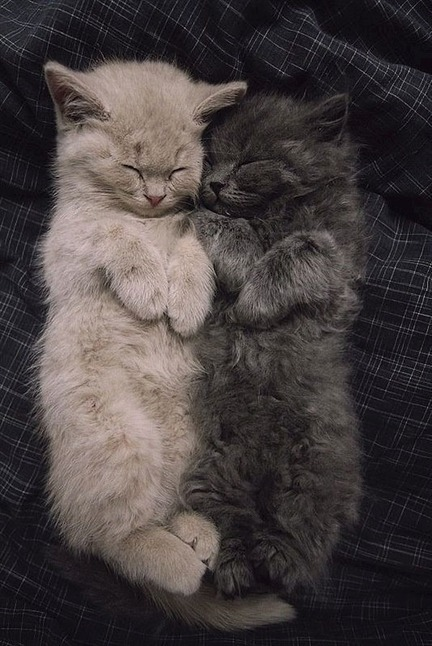

Slavă cerului că omul e atât de adaptabil!

E o regulă nescrisă, cred, care spune așa: prima dată când "te lovește" ceva nasol, reacționezi cu respingere violentă. A doua oară, reacționezi tot impulsiv, dar o nuanță mai slabă. A treia oară, respingerea e maximă dar, din nou, cu o nuanță mai slabă decât a doua oară. Și uite așa, dată după dată, simți la propriu cum ți se topește rezistența și ți se deschid două porți: accepți și ajungi să te bucuri de ce inițial ți-a dat cu cuțitul în inimă sau nu accepți dar te resemnezi. Well, eu cu a noastră pisică demențială și un strop dementă, ciocăn cu îndârjire la poarta nr. 2. Nu cred că voi ajunge să trag chiuituri de bucurie când mă trezește la 4 și ceva dimineața, ever! Deocamdată, între 4 și ceva și 5 și ceva e un fel de lălăială, mai las eu de la mine, se mai oprește ea dar în principiu mă face set după set, ca-n tenis. 

Nici nu m-am uitat la ea, am eu impresia că o doare și pe ea reacția mea de orice fel numai de iubire nu, la orele astea ale dimineții. Yeah, right! D-aia nu mai poate ea! Singurul interes al ei este să-i dau drumul la ușă și să se destrăbăleze ea știe pe unde.

\*\*\*

Azi noapte a fost un cumul de factori care s-au coalizat ei să nu am și eu somnul lin. Primele au fost lupițele vecinului, tare vehemente, că am ieșit jumate pe geam să strig la ele să tacă odată, că arunc cu apă fiartă! Sigur au înțeles, că au tăcut până am ajuns în pat. După care, au luat-o de la început. Mi-am pus perna pe cap și, praf cum eram, am adormit și așa. M-a trezit apoi un sunet prea apropiat să fie Spiky și prea clar ca să fie lupițele. Era sforăitului domnului meu, suav ca un tractor. Din nou perna pe cap, plus o mână care zgâlțâie strategic posesorul trilului. Spre dimineață a început mâța. Cam așa cică m-am odihnit eu, să fiu proaspătă pentru o nouă zi.

\*\*\*

În bucătărie, îmi încălzesc apa în beznă că parcă n-am chef de nicio lumină. Oricum o să ies pe terasă să o beau. E superbă primăvara! Nici tare cald dar nici tare rece, e numa' bine pentru mine. Mă așez pe scaun și-mi dau seama că am gura încleștată. Simt că am o furie în mine și, când o realizez și văd că sursa ei este o pisică, un sforăit și 2 lupițe, mă bușește râsul. Cât de stupid! Hahaha! 

Am strâns, de-a lungul vieții, multă furie în mine și, din varii motive, am suprimat-o acolo, rareori permițându-mi supape sănătoase, fără să am păreri de rău ulterioare izbucnirilor. Acum îmi dau seama că furia asta a fost parțial și sursa puterii mele. S-a strâns ea ca lava în mine și-a ars în drumul spre suprafață tot ce trebuia pârjolit ca să se primenească. Iar când a ieșit, sub forma unui divorț sau unui burnout, a avut o putere extraordinară de a naște viață nouă. Credeam că nu mai adun furie la pachet dar uite cum se ascunde ea, șmechera, sub chestii atât de mici și neînsemnate. Mulțam Universule pentru claritatea asta de la prima oră!

\*\*\*

Mama s-a trezit și ea devreme așa că termin partea aia mai puțin plăcută a dimineților mele repede și mă înfrupt cu voluptate din partea aia cea mai plăcută de după. Vreau design interior, vreau tururi de case mișto, îmi dau seama câtă bogăție de frumusețe este peste tot și în toate. Și, ca de fiecare dată, mă dă pe spate creativitatea oamenilor-artiști, boemi, asocierile neașteptate care mie-mi plac tare mult pentru că sparg tipare. Orice e out of ordinary e fain, în concepția mea. Și nu pentru că e mai aparte ci pentru că apasă butoane și forțează să-mi pun lentile noi de privit iar asta nu poate fi decât benefic vieții mele. Și mie, implicit.

\*\*\*

Mi s-a făcut un dor violent de Maya mea! A țâșnit dintr-un adânc de-al meu atât de puternic că am simțit direct pe obraji lacrimile, nici nu știu când au pornit din ochi. M-a luat trăirea și emoția pe dinainte. Cunosc clișeicul "ochii care nu se văd, se uită (în altă parte)" dar loialitatea a fost mereu o calitate care s-a așezat în haina asta pe care-o port în această viață. Chiar dacă nu verbalizez, cred că rareori trece o zi fără să-mi fie în minte, fie doar și în treacăt. Deși am impregnat materia cu noi amintiri, am schimbat locurile în casă unde aveam tabieturile mele cu ea, ca să nu mai doară lipsa ei, e doar de suprafață, adâncul materiei nu poate fi șters, clipele noastre sunt tot acolo. Iar azi, au venit toate o dată peste mine și m-au răscolit. Mă las să plâng, să mă curăț de dor, să nu-l trag după mine ca balast toată ziua. 

\*\*\*

A coborât iubitul meu și, cu priveliștea lui, am spălat starea ce se agățase ca scama. Mâncăm împreună, ne e bine împreună și, într-un moment de nouă claritate, observ că am stări și trăiri una după alta de azi dimineață, că le recunosc și după aia, dispar fix așa cum au venit. Niciuna nu mă mai locuiește îndeajuns de mult încât să mă întunece. E mișto conștientizarea asta! Îmi simt sufletul ca o cameră în care vine câte-un musafir, îmi spune ce are de spus, eu iau sau nu iau ce-mi oferă și apoi pleacă-n drumul lui. Nu se mai adună unii peste alții ca să nici nu mai pot respira. Mi-e sufletul lejer.

\*\*\*

O aduc și pe mama la micul dejun și decid să îi dau un gust de libertate și lui Sassy. O iau în brațe și o aduc și pe ea la parter, cu noi. De când e aici, a ieșit cel mult pe holul de lângă camera mamei, pentru că mama nu o lasă. Doamne, câte bucurie pe grăsună! A explorat și a mieunat și s-a frecat de tot și de toate, plus de mine ca să-mi arate că-mi mulțumește, e în delir! Iar mie mi-a umplut sufletul! Spiky e oricum p-afară așa că nu o deranjează nimeni în cercetările ei. 

În tot timpul ăsta, am observat-o cu coada ochiului pe mama. Când nu mesteca mâncarea, o striga întruna pe Sassy cu "hai la mami!". Am simțit și am știut că e corect, o gelozie și o dorință ca Sassy să fie doar a ei, să o iubească doar pe ea, să nu intre nimeni altcineva în micul lor univers. Înțeleg pornirea ei, gelozia asta fără noimă, pentru că și eu am avut-o de-a lungul vieții. Ooo, am experimentat gelozii cumplite, cel puțin la fel de cumplite pe cât de nesigură am fost de cine sunt. E un program pe care cred că îl preluăm și îl predăm, de la predecesori către succesori. Poate reușesc să rup lanțul pentru că, de ceva timp, nu mă mai chinuie niciun gând d-ăsta de posesie inutilă. A fi iubitor de viață și tot ce presupune ea înseamnă în primul rând să permiți, așa că mă educ să dau libertate maximă tuturor. 

Cred că mama a înghițit cu noduri că nu i-a priit micul dejun. Nu mai știa cum să termine mai repede și să se ducă sus, cu tot cu Sassy. Aproape că mi-a închis ușa-n nas. Nu-i nimic, înțeleg.

\*\*\*

Am ieșit în curte, să continui saga cu buruienile. Chiar dacă e obositoare pigulirea asta, mie-mi face plăcere. E și coconetul mic cu mine, aleargă peste tot, e când pe gard, când în arțar, când la picioarele mele. Are o plăcere diabolică să se tăvălească unde e praful mai mare că trebe să o scutur aproape ca pe o rufă, să iasă toată mizeria de pe blănița ei. 

La inventarul curții de flori, s-au mai raportat la apel 4 firicele de ranunculus și 5 firicele de anemone. Încet-încet, crește și curticica mea și cresc și eu cu fiecare firicel care mai apare. Au mai apărut și gladiole noi și iriși. Am și ceva mentă sălbatică, pe care trebe să o țin sub control că e tare invazivă. Dar și miroase fain.

Mă acaparează natura asta mai tot timpul complet că efectiv nu simt timpul.

Așa că soneria telefonului aproape că m-a speriat. E domnul meu, îmi spune că a coborât coana mare. Las buruienile în plata lor și intru repede, să văd ce vrea. Nu e în bucătărie, nici în living, nici pe scări. Hmm! Mă uit pe cameră, nu e nici în camera ei. Stau pe loc și ascult. Nu se aude nimic. Mă uit din nou și o văd, fusese la baie. Se așează pe pat și… scoate din buzunar cozonacul pe care îl palmase din bucătărie. Mă duc la ea, o prind în fapt, și o rog, dacă tot mănâncă, să o facă pe șervețel sau pe o farfurie, să nu facă firimituri peste tot.

Plec de la ea și mă opresc la domnul meu, unde-mi vărs oful. Și, în timp ce scot afară ce mă iritase înăuntru, un alt moment de claritate se așează peste cuvintele mele și mă opresc brusc. Cât de mult contează niște amărâte de firimituri în eternitatea asta care există? Cât de mult contează că mama a mâncat dulce și nu va mai mânca mâncare în imensitatea Universului care există? Infim cu tentă mare spre deloc. Doar eu mă agăț și mă agit pentru niște tâmpenii. Ce dacă face firimituri? Se strâng. Ce dacă a mâncat dulce? Și eu mănânc, când am poftă, ea de ce n-ar face-o?! Ptii, dar cât de limpede mi-a fost că mă plâng ca să mă plâng, că nici măcar nu am motive reale sau serioase. Mulțam Universule pentru încă o mostră de claritate, venită la țanc!

\*\*\*

Pentru că am primit verdețuri care se vor strica dacă nu fac ceva rapid cu ele, decid să mai fac un drob vegan cu de toate, să fac un pui de mămăligă pentru sarmalele neveganilor și să fac și sucul pentru diseară. 

Am presimțit că mama nu va mânca și am avut dreptate. Nu știu ce are dar în ultima perioadă doarme foarte mult și în timpul zilei. Singurul ei moment de vivacitate este cel în care jucăm table, în rest, parcă pleacă din ea și rămâne în loc doar un corp vlăguit. 

\*\*\*

Am primit azi o acuză voalată, spusă în glumă, dar cu substrat considerat real. Dacă înainte analizam toate cuvințelele și toate nuanțele și toate sensurile, în ultimul timp nici nu mă mai supără, nici nu mă mai atacă, nici nu mai intru automat în defensivă. Dacă cineva consideră că eu trebe să fac ceva și nu fac și d-aia nu face nici ea, e fix problema ei, nu a mea. Nu mai sunt dispusă pentru nimic care nu e benefic în dublu sens. Am învățat să spun nu, de fapt demența mamei m-a ajutat să fac asta și cel mai mult îmi place că nici nu mai pun botul la tacticile folosite pentru manipularea mea subtilă. Mi-am rafinat nasul să simt imediat când cineva vrea să mă simt vinovată de ceva ce am făcut sau, ca în cazul de față, ceva ce n-am făcut. E o vorbă care spune că oamenii care vor să te înțeleagă, o vor face fără să le vorbești iar cei care nu pot, se vor ascunde în spatele scuzelor și acuzelor că tu ești vinovată, chiar dacă le urli cuvintele pe fundalul celei mai mari liniști.

Așa că cine vrea să fie în viața mea, e liber să fie, nu am ferecat nicio ușă. Cine nu și așteaptă să fie invitat sau sunat sau bibilit, să aștepte. Și eu am așteptat și am decis apoi să merg mai departe.

\*\*\*

Ciclul clasic și repetitiv al după-amiezilor preia automat controlul și nici nu știu când m-am așezat la table. Dar știu cum am simțit iritarea crescândă în mine când mama face orice să câștige, inclusiv să trișeze. Oare de ce mă enervează atât de mult că vrea să câștige? Oare nu asta vrem toți? Deși în mine era un dialog al meu, cea care se irită și al meu, cea care înțelege, n-am dat-o la pace în niciun fel. Era un carusel de emoții: când mă apăsa pe butoane, când mă relaxam și-mi aduceam aminte că, mai deunăzi, nu știam cum să fac să o las să câștige. Ce s-a schimbat între timp?

Pe lângă iritarea asta a mea, am avut mai tot timpul o mare întrebare în creier: oare demența nu afectează și zonele alea capabile să facă raționamente și strategii să câștige la table? Că e nevoie de ceva efort intelectual să joci table. Cum se face că mama uită chestii elementare dar asta nu?

De parcă nu e de ajuns că mă sfredelește întrebarea asta, mama, căreia i-am spus că mergem în weekend acasă la ea, mă întreabă, din nou, când mergem. Și, în loc să-i răspund, o pun pe ea să-și aducă aminte ce i-am zis. A răspuns, aproape instant, că în weekend, probabil și pentru că a sesizat o urmă de iritare-n mine. Mintea mea iar a început să croșeteze planuri și idei: dacă mama se mai și preface? și cum fac să mă prind când o face? dar dacă e doar o impresie a mea, că totuși sunt semne clare și de demență? Hai că iar mi-am bulucit ideile aberante în cap, de abia ce mă simțisem și eu lejeră.

Cum mi-a spus mie odată o doamnă tare dragă inimii mele: dacă cineva ar fi bine, indiferent cum percep eu binele ăsta, ar face stratageme și strategii ca să primească ce are nevoie? Nu, dacă cineva e bine, e liber de toate astea. Cel puțin, așa cred eu.

\*\*\*

S-a-nchis și ziua de azi, și-mi clasez recunoștința pentru:

1. Plânsul ăsta curățător de stări și dătător de suflu nou!
2. Claritatea care m-a însoțit aproape toată ziua și a venit cu mari ușurări, cu luare de greutăți la propriu de pe mine!
3. Faptul că nu mă mai fac preș pentru nimeni, doar ca să-mi dea un semn de viață. Și nu e din ego, nu e picătură de mândrie prostească la mijloc ci este modul meu curat de a mă onora pe mine, ca ființă suverană ce-mi sunt suficientă. Tot ce vine peste, e bonus și mă bucură, dar nu mă mai umple pentru că m-am umplut de mine și mi-e bine!

Iar clipa mea de frumos este:

