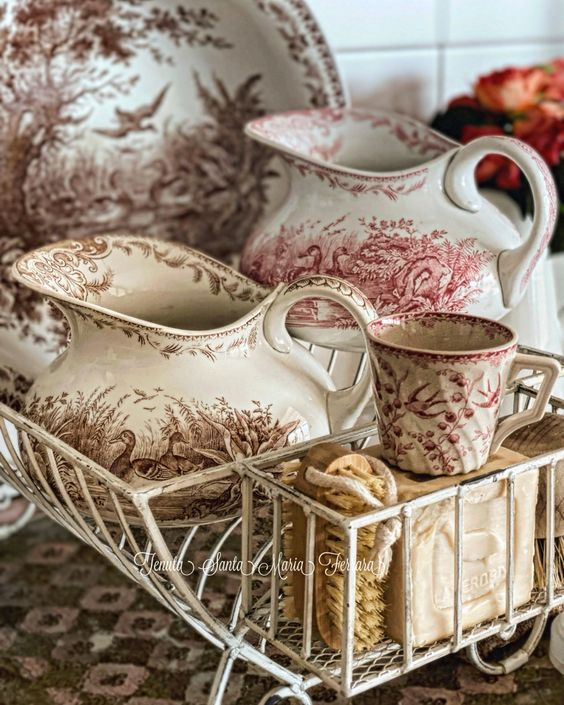

A fost o noapte ok-ish. Ca întotdeauna, după ce guști mierea, așteptarea este să tot mănânci din ea, dar uite că viața nu e doar lapte și miere. Poate mă mai calific, sper eu în curând, la încă o noapte portocalie, să mai umplu și eu rezervorul de odihnă. Bate vântul a aproape gol înăuntrul lui.

***

Afară e o ceață de nu vezi la 2 metri dar Spiky, neînfricată cum este, s-a pierdut la propriu ca pisica-n ceață. Se aud cocoșii cântând în fundal, sunt pe undeva pe-aproape și niște gângureli de guguștiuc și nelipsitele vrăbiuțe întregesc tabloul idilic. E bine să fii în viață, a fost gândul care s-a așezat peste toate și le-a cuprins pe toate cu brațele larg deschise. Deși nu pot să zic că m-am trezit pe de-a-ntregul, uite că e ceva în mine care e incluziv chiar și când corpul încă nu a butat.

Întregul peisaj mi-a adus aminte de primul meu zbor cu avionul. Trebuia să ajung la Viena, trimisă de banca la care lucram și mă duceam singură. Eram super stresată, erau multe de "prima oară" pentru mine, veneam după o perioadă în care mi se spusese constant că nu sunt în stare de aia sau ailaltă, încredere în mine sub nivelul mării, era o trăire epuizantă atât emoțională cât și fizică. Nu am dormit noaptea dinainte de teamă că pierd avionul, am ajuns la aeroport cu o grămadă de timp înainte, îmi tremurau picioarele de frică că nu mă descurc. Am ajuns în avion, m-a cuprins sora fricii, panica că se prăbușește avionul, mi se înfundau urechile la decolare, mi-aduc aminte și acum, în stomac, câte trăiri paroxistice aveam. Ei bine, în toată nebunia aia care mă traversa ca un uragan, când am ajuns la altitudinea necesară și am deschis jaluzeaua de la gemuleț, am crezut că am ajuns în paradis. Avionul trecea prin nori, erau și deasupra și dedesubtul nostru nori, soarele trimitea raze care împrăștiau aur peste pufoșenii, cerul era de un albastru superb, mi se părea că am intrat într-un tărâm fantastic. Nu voi uita niciodată extazul pe care l-am trăit atunci, singură, în avion, după ce trăisem, tot singură, o teroare falsă.

Așa e și acum afară, ceața asta e ca norii ăia pufoși numai că acum nu se vede nici cerul și nici soarele, în schimb se aud sunete super faine. Mulțam cu recunoștință pentru amintire și pentru prezentul ăsta minunat!

***

Ok-ish e și la mama, sunt bine amândouă și sper să rămână așa, eu sporovăiesc cu ea cât timp fac ordine, secondată de Sassy, care mă plânge să-i dau mâncarea. Liniștesc toate apele și plec calmă în timpul meu magic.

***

În căutările mele zilnice pe olx, "defect" cu care am rămas de la construirea casei, am văzut un tablou care mi-a picat cu tronc. Deși rama e super încărcată, chiar și pentru mine, am avut un sentiment de atractie irezistibilă față de el. Am reacționat rapid, cheia succesului în astfel de situații, am avut noroc că e în București, m-am prins că e un particular și nu un anticar și aseară a fost Mr. H să-l aducă acasă pe Magnifique. După atâtea căutări pe olx, mi-am rafinat nasul și simt afacerile imediat. Ceva îmi spunea că și Magnifique e la fel așa că în timpul meu magic am făcut săpături pe net să văd ce aflu, pentru că este semnat de un G.Roy. Este vechi, eu sper să fie și original, se pare că e căutat la vânzare, deci mi-am premiat intuiția care nu m-a înșelat nici de data asta.

***

Pe social media, mi-a apărut o reclamă, zău dacă am reținut la ce, dar o față faină de femeie mi-a rămas pe retină. Imediat după această reacție, mi-a venit și gândul că mie-mi îmi plac chipurile de oameni, chiar dacă nu îmi plac neapărat și oamenii. Și, cum se întâmplă când zbori pe aripi de gânduri, unul aduce altul și altul și altul și te trezești că ai plecat din prezentul tău o grămadă de timp, pe tâmple mi s-a așezat al doilea gând: îmi plac toate chipurile sau doar chipurile frumoase sau interesante? Gata, am două gânduri la ipoteza de lucru, mintea mea analitică deja a început analiza: am dat o căutare pe net după "chipuri urâte". Hahaha! Retractez, mie-mi plac doar chipurile faine de oameni, e greu de privit urâțenia în față, la propriu. Și știu și de ce. Pentru că eu am tendința, ca majoritatea oamenilor de altfel, de a mă compara și, inconștient, mă compar cu oameni pe care, dintr-o perspectivă sau alta, îi plasez pe scară deasupra mea, din considerente estetice, de inteligență, de bogăție, de coolness, whatever. Cei pe care îi plasez pe scară sub mine primesc cel mult o privire milostivă, pentru că ei nu reprezintă niciun pericol, de altfel închipuit oricum, pentru egoul nostru. A fost super interesant de făcut exercițiul ăsta, să văd unde am rezistență la viață și eu dorm în papuci, habar n-am. Chipurile "urâte" fac și ele parte din viață, din carcasa de carne.

***

În mijlocul veseliei de la micul dejun cu domnul meu, auzim niște lovituri în poartă. E bătrânul vecin, prietenul meu, care mă așteaptă cuminte la poartă, cu o plasă în mână. Nu știu cum să-l fac să vină cu mâna goală, că oricum ne umplem sufletele și nu vreau să-l jignesc cu nimic. Ies în grabă, îi spun că suntem la masă iar el mă anunță că va sta prin curte și când am eu timp, să-l strig. Negreșit voi face asta.

***

Mă uit pe cameră înainte să urc să o cobor pe mama la micul ei dejun și, surpriză totală, mama doarme. S-a trezit la 7 fără ceva și acum, la 9 s-a culcat la loc. Hmmm. O mai las nițel, nu vreau să o trezesc dacă ea simte nevoia să doarmă. Cunosc până-n prăsele această nevoie și eu.

E bine, doar că zice ea că nu prea doarme noaptea și d-aia recuperează ziua. Eu știu că doarme toată noaptea dar nu zic nimic și o invit la masă. E molcomă și cuminte, nu mănâncă tare mult, dar se aruncă cu acaparare în dulciurile pe care mi le-a adus vecinul. I le dau ei, Mr. H și-a luat și el ceva dar e interesant de văzut cum simte ea nevoia să ia tot ce vede. Așa a fost toată viața pe care o știu eu și clar nu se va schimba acum, ba din contră, conform studiilor, această trăsătură se va accentua dramatic. Tot ce pot să fac este să o liniștesc spunându-i că sunt ale ei, că dacă vrea ceva, trebe doar să-mi spună și va avea. Și să repet asta ca o placă stricată până va găsi ușa deschisă în mințișoara ei și va intra acolo. Așa sper eu.

***

Pentru că mă copleșește și nu știu cum să mă revanșez, îl aduc pe bătrânul meu prieten la noi pe terasă la un suc de fructe făcut din merele și sfecla roșie primite de la el, plus portocale și morcovi de la mine. Stăm la povești, de fapt îl ascult pe el pentru că nu are aparatul auditiv în ureche și nu aude decât când e atent la cum îmi mișc buzele. Privirea lui e însă la copacii, la cum bate vântul printre crengi, e, ca a mamei, undeva departe. De câteva ori, chiar am avut o senzație stranie, de corp părăsit. Mi se pare fascinant cum Universul mi l-a adus în cale pe bătrân, să observ și la el trăiri sau faze pe care le văd și la mama și să înțeleg, cât pot eu cuprinde cu mintea acum, ce e bătrânețea. Pierd ei treptat, de când sunt încă aici, contactul cu realitatea asta? Se desprind ei ușor dar sigur? De câteva ori, s-a lăsat între noi o tăcere atât de adâncă că m-au trecut fiori pe șira spinării. El nu mai povestea, plecase și el atât de cu totul fie în povestea lui, fie el știe unde, că parcă se suspendase timpul și rămăsesem încremeniți în clipă. Azi am înțeles că prietenia mea cu bătrânul este modul Creației de a mă liniști și a înțelege marile clipe de trecere spre altceva. Așa poate nu voi mai fi atât de descumpănită de modul mamei de a fi. Speechless!

***

Am și o bucurie dar și o tristețe în mine, le-am adunat pe amândouă și le-am scăpat în inimă. Le disec și le eliberez pe amândouă în timp ce mâinile mele au început să dezburuienească din nou. Mai am destule buruieni, pământul e reavăn de la ploile din zilele trecute și mi-e mult mai ușor să le strâng acum. Plus că folosesc timpul ăsta și pentru introspecție dar și sunt și biletul meu de intrare în fabuloasa lume minusculă.

Natura are un mod simplu și curat de a fi. Ne-au invadat de vreo două săptămâni niște țânțari d-ăia gigant, cât juma' de palmă. Eu n-am vrut să dau cu insecticid dar azi, mama natură, mi-a arătat soluția: vrăbiuțele. Cine s-ar fi gândit că mititelele astea mănâncă giganții?!

Zilele trecute, la inspecția zilnică, am observat o grămadă de insecte, asemănătoare cu musca dar mai alungite la corp, care-mi invadaseră piersicii. Din nou, doar am luat notă, am făcut poze la ființe, să văd ce sunt și ce soluții, naturale, am. Nu am apucat dar azi le-am descoperit casele, în pământ. Și tot azi, mama natura mi-a arătat că are ea soluția: niște păienjenei burtoși, bej cu punctișoare negre, care le anihilează, habar n-am cum că e atât de mic totul că nu văd, și apoi le cară la ei pentru prânz sau cină.

Deși nu mi-e frică de moarte, am o extrasenzitivitate când văd asta în afara mea, la animale sau la oameni. Mă doare cumplit moartea unor ființe care nu se pot apăra. Azi am înțeles că e o balanță pe care o măiestrește mama natură, dacă nu intervine omul, stricător. Cât de mișto a fost tot episodul de azi din filmul dezburuienirea! Cât de plin de tâlc e natura dacă-ți dai voie să o vezi. Mulțam infinit!

***

Mama iar a zis pas la prânz, domnul meu e și el pe fugă și mă pune și pe mine pentru că a găsit o variantă să resuscităm mașina mea și trebe mers la meșter acum. Îl rugasem eu de dimineață să pună o întrebare cuiva dar el a dat pe repede înainte și uite că deja trebe să ducem mașina! De regulă, eu sunt agitatoarea, așa-mi spune el, eu mă agit să facem aia sau ailaltă, uite că s-a luat, dar zic mersi și go with the flow!

Mă uit pe cameră că vreau să urc să o anunț pe mama că plecăm amândoi dar venim cât se poate de repede. Mama doarme! Dormea și mai devreme, când eram eu în curte, doarme și acum. Nu am ce face, mă duc să o anunț, chiar dacă o trezesc, mai bine să știe decât să se trezească singură în casă. Da, a înțeles, stă cuminte. Mi-e clar că așa va fi pentru că, mai mult ca sigur, va dormi.

***

Am avut dreptate. Cât timp am stat să rezolvăm cu mașina, mama a dormit. Am trezit-o când m-am întors acasă, cu sucul și cu medicamentele, a mai rezistat o oră după și la 19:30 deja dormea. E bine, e cu mintea aici dar zice că simte nevoia de odihnă. M-a liniștit tonalitatea ei, modul cum mi-a zis "e bătrânețea, măi Bi!"

Toți oamenii care au venit în viața mea și mi-au zis Bi, așa cum îmi zice mama, mi s-au dus direct în inimă, în loc de cinste. Pentru că așa îmi zice mama…

***

Sunt obosită, domnul meu a ieșit la o șuetă cu băieții iar eu, secondată de Spiky, care mă păzește colac lângă picioare, mă uit la un documentar pe NetFlix, de care-mi povestise cu lacrimi în ochi domnul meu: My octopus teacher.

Wow, are documentarul ăsta niște filmări ireal de superbe! Așa cum am descoperit eu universul minuscul, așa a descoperit tipul ăsta pădurea din apă. Nu l-am văzut pe tot pentru că am alunecat atât de subtil în somn dar a fost de ajuns să am niște vise fabuloase. E fascinantă planeta asta și sunt atâtea de văzut și descoperit out there!

Am o singură recunoștință, imensă, care le cuprinde pe toate: că sunt în viața asta bestială!

Iar clipa mea de frumos este:

