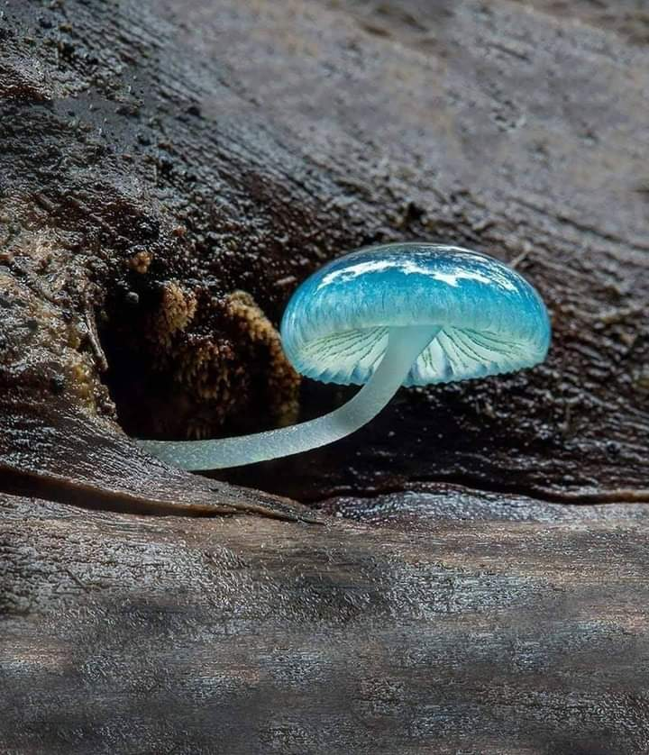

Îmi pare bine că scriu, că așa voi putea să văd care este frecvența și tiparul după care se repetă portocaliul în nopțile mele. N-a fost una cu noroc azi-noapte, domnul meu, obosit de la tunsul greoi de trifoi, m-a concertat pe trei voci, că nu știam pe care s-o opresc prima. Spiky n-a avut nici ea stare iar eu m-am modelat după cei doi protagoniști cum am putut. Chiar și așa, la 5:30 eram deja în bucătărie, cu mâna pe clanța ușii spre terasă.

\*\*\*

Azi e 1 mai muncitoresc și sper ca lumea să-l sărbătorească prin liniște. În ultima perioadă a vieții mele tânjesc din ce în ce mai mult după liniște. Și după odihna corpului, dar aici încerc să strecor yoga. Nu mi-a ieșit până acum, sunt pe drum însă m-am echipat în primul rând cu intenția.

E plăcut afară. Pe fundalul monoton al sunetelor străzii din depărtare, singurul mai vocal este un fazan tare frumos, ce-și strigă el disponibilitatea către făzănițele din jur. Chiar și păsările pădurii parcă-s o țâră mai cumincioare în dimineața asta, destul de rece. 

Mă încălzesc cu apa caldă, se face cald în bucătărie de la ceai și, din nou, sunt recunoscătoare vieții, la ceasul ăsta mic din zi, că am tot ce îmi trebe și ce îmi doresc. Cu excepția libertății de mișcare, am bifat toate căsuțele. E adevărat că am muncit și muncesc mult dar viața mea curge cu plăcere, în linii mari. Că mă încăpățânez și mă pun de-a curmezișul când viața-mi dă cu "cea" și eu vreau cu "hăis", e tot la mine de lucru, în acceptare.

Cu anumite limite setate de propriul meu bun simț, de ceva vreme la mine nu mai există "the right way" ci doar my way. Chiar dacă pentru alții a funcționat ceva anume, nu înseamnă că trebe neapărat să-mi iasă și mie sau că trebe să mă bag și eu fix în aceeași pătrățică a încercării. 

Mi-aduc aminte, la burnout, când am decis că deja e prea mult pentru mine și că banii nu sunt totul în viața asta, ce trăire sublimă de eliberarea am avut. Mi s-au ridicat tone de greutate de pe umeri și de pe suflet și, deși mintea își croise tipare și rețele neuronale aiurea pe care le folosea în continuare, eram ca după un somn adânc. De vreo 40 de ani. Îți trebe curaj sau inconștiență să schimbi macazul atât de brusc după ce o viață întreagă până atunci nu ai știut decât muncă, bani, muncă, bani, cu mici pauze, prea mici ca să fie liant pentru prăpastia care se căsca în mine. La mine a fost inconștiența. Dar una atât de mișto!

\*\*\*

Mi se pare sau nu, mama se izolează din ce în ce mai mult. Pe lângă faptul că dormitează toată ziulica, nu mai reușesc să creez o stare de bine între noi două. O stare în care să ne placă să fim, să povestim, să ne simțim sufletele. Chiar dacă prima reacție a ei când ne vedem este un zâmbet mic, e atât de firav că, dacă stau mai mult cu ea, se pierde tare repede. Nu mi-e clar dacă e de la boală, dacă e o tristețe sau bătrânețea fură la unii oameni orice bucurie de viață. Poate că ea, din aceeași pornire de a strânge cât mai multe, a ciupit din fiecare și le-a făcut buchet cu care-și trăiește fiecare zi.

E cât de cât curat la ele, le dau să pape la amândouă, Sassy mă miaună a ceartă, că nu stau cu ea la jughineală, dar azi voi avea o zi încărcată și vreau să gust puțin și intens din timpul meu liber.

\*\*\*

M-am desfătat cu muzică clasică. Mi-am savurat smoothieul și mi-am delectat ochii cu un documentar cu cele mai frumoase peisaje din lume. Spiky toarce cuminte legată de piciorul meu stâng și-mi dă suflețelul ăsta liniște și pace. Probabil că Universul, care evident că vede și-n episoadele următoare acțiunea, a înlocuit efervescența Mayei cu liniștea lui Spiky, pentru diminețile mele. Ok, apreciez, poate că și înțeleg dar asta nu poate alina dorul și locul ăla rămas atât de gol în mine și în casă, după grăsanca mea certăreață și protectoare și agitată și plină de personalitate. 

\*\*\*

De la 9 și ceva, după ce i-am livrat micul dejun mamei la ea în cameră, ziua mea s-a rostogolit într-o viteză amețitoare. Cumpărături, pregătit prânz, copiii în vizită, strâns, spălat, curățat s-a făcut ora 16:00 și pe mine m-au apucat pandaliile.

Unde naiba se duce viața mea?! Că doar nu vreau să o fușteresc în cumpărături, mâncare și curat! Vreaun și eu o cină pe malul unei mări, la apus. Vreau și eu o tură prin păduri, să mă îmbib de tot ce poate da natura asta mai fain. Vreau și eu doar să stau la un pahar de vorbă cu cineva drag. Vreau Toscana, vreau Franța rurală, vreau să cuprind cu tot ce sunt viața asta extraordinară care se întâmplă!

\*\*\*

Și, peste toate, vine și mama, placidă, se așează la masă ca și cum e zona de surghiun, nu tu o reacție pe față, nu tu un cuvânt, nu tu o exclamație de gust, de ceva! Evident că, peste deja inflamată starea mea de spirit, liniaritatea asta a ei mă scoate din minți. Dar mă reprim în fața ei și izbucnesc în fața lui Mr. H. Habar n-avea, dragul de el, ce l-a lovit! Fix în momentul în care articulam, plină de năduf, că m-am săturat de viața asta de rahat, mi-am dat seama ce mare neadevăr rostesc. Aproape că-mi rămăseseră cuvintele pe limbă dar pentru că se rostogoliseră deja dintr-o iritare intensă, nu am mai putut să le opresc. Am simțit imediat ce prostie am spus. 

Probabil că asta a și fost clickul care s-a făcut în mine și a topit starea aia proastă. Eram în continuare iritată, lava din mine clocotea în continuare dar era un proces natural, de scoatere și eliminare balast, nu mai alimentam și eu cu tot felul de gânduri ca să mențin fierberea. Și, lăsată așa, s-a molcomit de la sine.

\*\*\*

Cert este că corpul meu, aliat cu mintea mea, a zis pas la table. Mi s-a făcut rău, îmi venea să vomit, ochii mi se închideau de oboseală și numai gândul de a sta 3 ore cu mama, sugativă de energie, mă adâncea și mai mult în starea de rău. I-am dus sucul, am anunțat-o că nu pot și m-am așezat în pat. 

Trebe să încep să-mi ascult limitele. Nu mai pot întinde de corpul ăsta ca de un elastic, că va ceda. Nu mai pot să-mi întind înțelegerea să acopere tablele, pentru că nu mai ajunge până acolo. Încep să văd fisuri în convingerea mea că pot să le duc pe toate singură. Din păcate, nu am alte variante acum și tot ce pot face este să rog Creația să-mi dea putere și claritate.

\*\*\*

Cred că a fost cea mai scurtă zi din ultima perioadă. Nici nu am apucat să mă dumiresc că a început, că s-a și terminat. Dar am recunoștință pentru:

1. Tot ce am și tot ce simt și tot ce sunt și ce nu sunt! 
2. Existența și iubirea lui Spiky în viața mea! Cum s-au strecurat ele, așa pe nesimțitelea, să ostoiască răni din mine și să pună pace în locul lor!
3. Modul cum încep să gestionez izbucnirile! Nu-mi propun să nu le mai am dar vreau să fiu conștientă de ele la fel cum sunt de (unele) gânduri, să le las natural să se consume.

Clipa mea de frumos e:

Blue Mycena Mushroom
